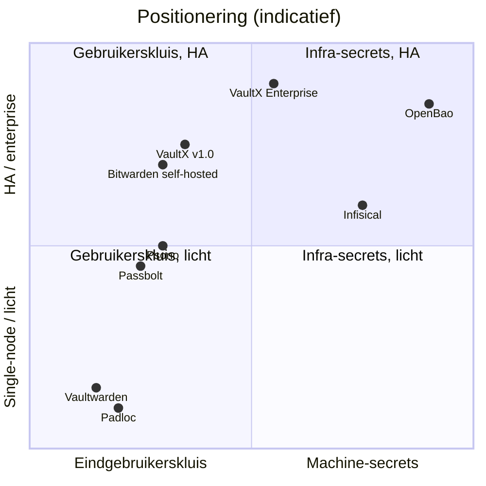
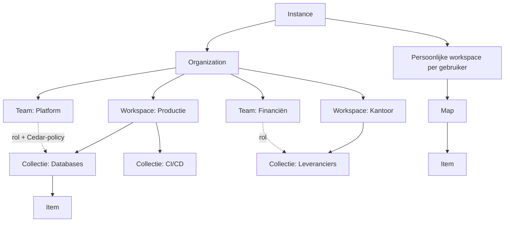
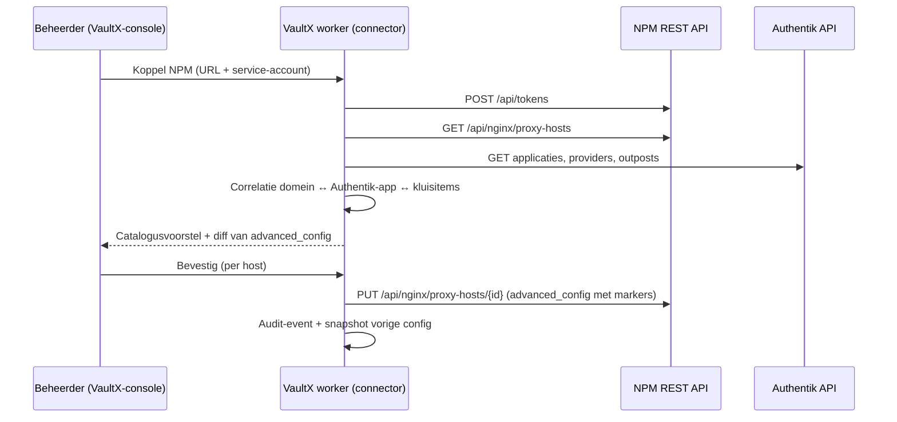
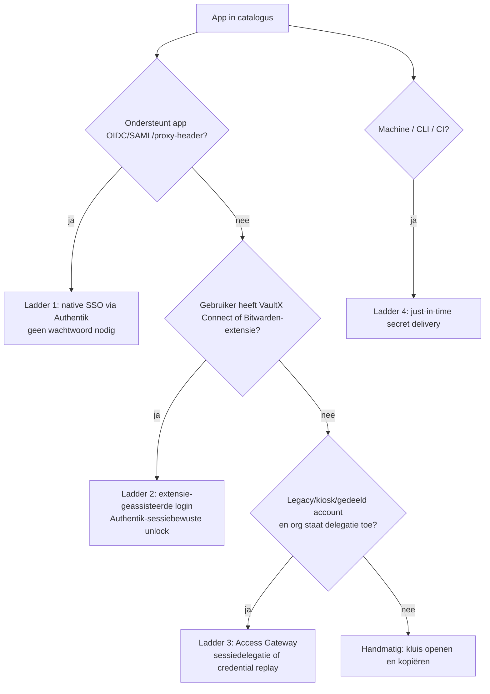
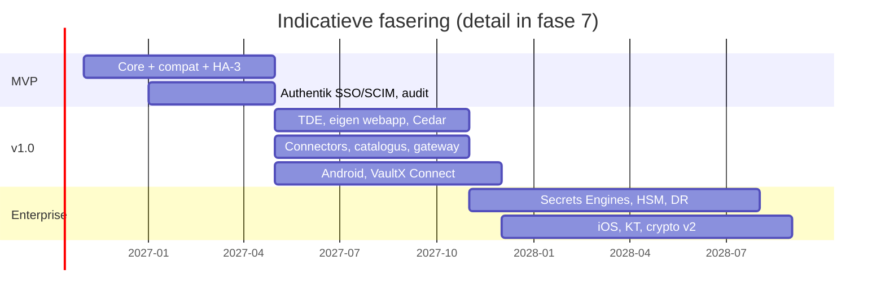

# VaultX — Product Requirements Document (Fase 1)

Status: voorstel ter review door Jonas · Datum: 2026-10-04 · Versie 0.1
Bron van waarheid: [`00-kernbeslissingen.md`](00-kernbeslissingen.md) (KB-xx). Bij strijdigheid geldt dat document; spanningen staan in §20.
Oorspronkelijke opdracht: [`opdracht.md`](opdracht.md).

---

## Inhoud

1. Probleemstelling en visie
2. Doelgroepen en persona's
3. Concurrentieanalyse en positionering
4. Productprincipes
5. Uitgedaagde aannames (samenvatting deel A)
6. Conventies voor requirements
7. Functionele requirements per domein
8. Frictieloze login: methodeladder en de acht methodes
9. Browserintegratie: optie A versus optie B
10. Haalbaarheid van de extra functionaliteiten
11. Non-functionele requirements
12. Bitwarden-clientcompatibiliteitsmatrix
13. Succes-metrics
14. Buiten scope
15. Risico's
16. Aannames en afhankelijkheden
17. Release-definities en acceptatiecriteria
18. Traceerbaarheid opdracht → requirements
19. Open vragen
20. Opmerkingen bij kernbeslissingen

---

## 1. Probleemstelling en visie

### 1.1 Probleem

Organisaties en homelabbers die hun wachtwoorden zelf willen hosten, moeten vandaag kiezen tussen:

- **Vaultwarden**: licht, Bitwarden-compatibel en populair, maar ontworpen voor één node (lokale websocket-hub, SQLite-first). Echte HA, multi-node notificaties, fijnmazige RBAC, tamper-evident audit en infrastructuur-secrets ontbreken.
- **Bitwarden self-hosted**: functioneel compleet, maar zwaar (.NET, meerdere containers, MSSQL in de standaardinstallatie). De interessante enterprise-functies (SSO met Trusted Devices, SCIM, Key Connector, policies) vallen onder een betaalde licentie en een niet-open-source licentie.
- **Secrets-managers** (OpenBao/HashiCorp Vault, Infisical): sterk in machine-secrets en dynamische credentials, maar geen kluis voor eindgebruikers met browser-autofill, passkeys en mobiele apps.

Daarnaast is de dagelijkse frictie in een self-hosted omgeving groot. Een typisch homelab of MKB-netwerk heeft tientallen interne apps achter een reverse proxy (vaak Nginx Proxy Manager) en een IdP (steeds vaker Authentik). Gebruikers loggen in bij Authentik, worden daarna door een app *nogmaals* om een wachtwoord gevraagd, en zoeken dat wachtwoord op in een kluis die *nogmaals* ontgrendeld moet worden. Niemand heeft overzicht welke apps native SSO kunnen en welke nog een gedeeld wachtwoord gebruiken.

### 1.2 Visie

> **VaultX is een open-source, self-hosted kluis die Bitwarden-compatibel begint, vanaf dag één geclusterd draait, en Authentik plus de reverse proxy gebruikt om inloggen bij interne apps zo frictieloos te maken als veilig kan, zonder de zero-knowledge-belofte op te geven.**

Drie kernideeën:

1. **Compatibel eerst, onderscheidend daarna.** De MVP werkt met de bestaande Bitwarden-clients (KB-08, KB-30). Eigen clients komen alleen waar ze echte meerwaarde hebben (Authentik-sessiebewuste ontgrendeling, catalogus-gestuurde login, Android-passkeys).
2. **De sterkste loginmethode per app, niet één trucje voor alles.** VaultX weet welke apps achter de proxy staan, adviseert native SSO waar mogelijk en valt pas terug op wachtwoord-autofill of gedelegeerde login waar het niet anders kan (KB-03).
3. **Eerlijke beveiligingsgrenzen.** Wat E2E-versleuteld is, kan de server niet lezen. Wat een server *wel* moet kunnen lezen (gedelegeerde login, dynamische secrets), staat in een aparte, expliciet gekozen geheimklasse met eigen sleutel en eigen audit (KB-01).

### 1.3 Doelen (uit de opdracht) en hoe dit PRD ze vertaalt

| # | Hoofddoel opdracht | Vertaling | Belangrijkste requirements |
|---|---|---|---|
| 1 | Bitwarden-compatibiliteit | Compat-laag als aparte module, versie-matrix, contracttests | FR-100–FR-140, FR-1100–FR-1120, NFR-COMP-* |
| 2 | Native Authentik-integratie | OIDC, SCIM, API, webhooks, step-up, sessiebewustzijn | FR-600–FR-640, FR-900–FR-935 |
| 3 | NPM-integratie | Proxy Connector-framework, NPM als eerste connector | FR-800–FR-840 |
| 4 | Automatische login-workflows | Methodeladder + app-catalogus | FR-1000–FR-1030, §8 |
| 5 | Enterprise-grade beveiliging | E2E, Argon2id, audit-hashketen, KB-10-mitigaties | FR-500–FR-520, NFR-SEC-* |
| 6 | Hoge beschikbaarheid | Profielen single/ha-3/ha-5 | FR-1200–FR-1225, NFR-AV-* |
| 7 | Kubernetes-ready | Helm, CNPG, Valkey Sentinel, Garage | FR-1215–FR-1225 |
| 8 | Multi-node clustering | Stateless app-nodes, Postgres-leases, pub/sub | FR-1200–FR-1212 |
| 9 | API-first | `/v1`-API primair, OpenAPI, SDK's | FR-1300–FR-1320 |
| 10 | Moderne UI/UX | React-SPA, WCAG 2.2 AA, NL/EN | FR-1400–FR-1425, NFR-A11Y-*, NFR-I18N-* |

---

## 2. Doelgroepen en persona's

VaultX bedient drie inzetcontexten (homelab, MKB, enterprise) en vier gebruikersrollen binnen die contexten (beheerder, eindgebruiker, engineer, auditor). Voor v1.0 ligt de prioriteit bij homelab en MKB (voorstel KB Deel D-2).

### 2.1 Overzicht

| Persona | Context | Primaire profiel | Belangrijkste behoefte | Prioriteit v1.0 |
|---|---|---|---|---|
| P1 Daan, homelab-beheerder | Thuis, 20–60 self-hosted apps | `single` | Eén docker-compose, Authentik + NPM, minder inlogstappen | Hoog |
| P2 Sanne, MKB-IT-admin | 15–250 medewerkers | `ha-3` | Onboarding/offboarding via Authentik, gedeelde accounts, geen downtime | Hoog |
| P3 Ravi, enterprise security officer | 1.000–20.000 medewerkers | `ha-5` | Policies, audit, scheiding van taken, compliance, HSM | Middel (Enterprise) |
| P4 Lotte, eindgebruiker | Medewerker of gezinslid | n.v.t. | Werkt gewoon, op elk apparaat, zonder extra wachtwoord | Hoog |
| P5 Mehmet, DevOps-engineer | Platformteam | `ha-3`/`ha-5` op K8s | Secrets voor CI/CD en K8s zonder ze in Git te zetten | Middel |
| P6 Ingrid, auditor | Intern/extern | read-only | Bewijsbare, onveranderbare logs en rapporten | Middel |

### 2.2 P1 — Daan, homelab-beheerder

- **Achtergrond:** software-engineer, draait Proxmox met Docker-VM's, Authentik, NPM, Grafana, Nextcloud, Jellyfin, Home Assistant, Forgejo. Gebruikt nu Vaultwarden.
- **Doelen:** migreren zonder de Bitwarden-apps van zijn gezin te vervangen; inloggen bij interne apps zonder dubbele prompts; inzicht welke apps al SSO via Authentik doen.
- **Frustraties:** elke app een eigen login; Vaultwarden-back-up is een SQLite-bestand dat hij met cron kopieert; geen overzicht.
- **Succes voor Daan:** `docker compose up` met één `.env`, import vanuit Vaultwarden, NPM-hosts automatisch ontdekt, en een catalogus die zegt "Grafana: zet OIDC aan, hier is de config".
- **Randvoorwaarden:** draait op 2 vCPU / 4 GB naast andere diensten; mag geen Kubernetes vereisen.

### 2.3 P2 — Sanne, MKB-IT-admin

- **Achtergrond:** enige IT-beheerder bij een accountantskantoor met 80 medewerkers. Authentik als IdP (gekoppeld aan Microsoft 365 of LDAP), NPM voor interne apps.
- **Doelen:** nieuwe medewerker krijgt automatisch toegang tot de juiste collecties zodra hij in de Authentik-groep zit; vertrekkende medewerker verliest direct toegang; gedeelde accounts (leverancierportalen) zonder het wachtwoord rond te mailen.
- **Frustraties:** handmatige uitnodigingen; geen zicht op wie welk gedeeld wachtwoord gezien heeft; een update van de kluis betekent een uur downtime.
- **Succes voor Sanne:** SCIM-provisioning werkt, offboarding is < 5 minuten effectief, rolling upgrades zonder onderbreking, auditrapport per collectie.

### 2.4 P3 — Ravi, enterprise security officer

- **Achtergrond:** CISO-office van een zorgorganisatie (NIS2-plichtig). Bestaande HSM, SIEM (Splunk/Elastic/Wazuh), OpenBao voor infra.
- **Doelen:** aantoonbare scheiding van taken (beheerder kan niet stil meelezen), policies als code, onveranderbare audit met export, DR naar tweede site, dataresidentie.
- **Frustraties:** SaaS-kluizen zijn juridisch lastig; Bitwarden-enterprise-features vergen een licentie en audit blijft beperkt.
- **Succes voor Ravi:** threat model dat de kwaadwillende beheerder serieus neemt, Cedar-policies die hij kan reviewen, ondertekende audit-checkpoints, HSM-integratie, pentestrapport.

### 2.5 P4 — Lotte, eindgebruiker

- **Achtergrond:** niet-technisch. Laptop met Edge, Android-telefoon.
- **Doelen:** opent `grafana.bedrijf.local` en is binnen. Wachtwoorden worden ingevuld. Passkeys werken. Telefoon kwijt? Geen data kwijt.
- **Frustraties:** master password vergeten; drie keer per dag de kluis ontgrendelen; onduidelijke foutmeldingen.
- **Succes voor Lotte:** na Authentik-login op een vertrouwd apparaat geen extra wachtwoordprompt (biometrie/passkey volstaat), herstel via admin recovery als ze haar master password vergeet.

### 2.6 P5 — Mehmet, DevOps-engineer

- **Achtergrond:** beheert GitLab CI, ArgoCD en drie K8s-clusters.
- **Doelen:** service accounts met beperkte scope, secrets als env-vars of K8s-Secrets geleverd op het moment van gebruik, kortlevende database-credentials, SSH-certificaten in plaats van statische sleutels.
- **Frustraties:** secrets in CI-variabelen zonder rotatie; OpenBao is krachtig maar complex voor kleine teams.
- **Succes voor Mehmet:** `vaultx run -- ./deploy.sh`, OIDC-federatie vanuit CI (geen statisch token), een K8s-integratie, en OpenBao kan blijven waar het al draait.

### 2.7 P6 — Ingrid, auditor

- **Achtergrond:** externe ISO 27001-auditor of interne compliance-medewerker.
- **Doelen:** zelfstandig, read-only, kunnen aantonen wie wanneer toegang had tot welk geheim en of het log niet is gewijzigd.
- **Frustraties:** logs als CSV-export zonder integriteitsbewijs; beheerders die logs kunnen opschonen.
- **Succes voor Ingrid:** auditor-rol zonder toegang tot secrets, verificatietool voor de hashketen, standaardrapporten (toegangsoverzicht, privileged actions, vervallen credentials).

### 2.8 Rollen in het product (afgeleid)

| Productrol | Persona's | Scope |
|---|---|---|
| Instance-beheerder | P1, P2, P3 | Installatie, nodes, connectors, instance-policies; **geen** toegang tot E2E-inhoud |
| Org-owner / org-admin | P2, P3 | Leden, collecties, policies, admin recovery |
| Team-manager | P2 | Teamleden en teamtoegang tot collecties |
| Gebruiker | P4 | Eigen kluis en toegewezen collecties |
| Service account | P5 | Machine-identiteit met scoped tokens |
| Auditor | P6 | Read-only op auditlog, rapporten, metadata; nooit secret-inhoud |

---

## 3. Concurrentieanalyse en positionering

Feiten naar beste kennis op 2026-10; versies en licentiedetails wijzigen. Onzekere punten zijn gemarkeerd.

### 3.1 Vergelijkingstabel

| Product | Licentie | Stack | Self-host | HA/cluster | E2E | Bitwarden-clients | SSO / SCIM | Machine-secrets / dynamisch | Opmerkelijk |
|---|---|---|---|---|---|---|---|---|---|
| **Vaultwarden** | AGPL-3.0 | Rust (Rocket, Diesel); SQLite/MySQL/PostgreSQL | Ja, zeer licht | Nee (één node; meerdere nodes met gedeelde DB werken niet betrouwbaar voor websockets) | Ja (Bitwarden-model) | Ja, kern van het product | OIDC-SSO toegevoegd in 2025 (verifiëren: versie en volledigheid); geen SCIM | Nee | Grote community; referentiespecificatie voor de Bitwarden-API (KB-08) |
| **Bitwarden self-hosted** | GPL/AGPL voor kern, *Bitwarden License* voor enterprise-code; SDK-licentie was in 2024 controversieel (verifiëren huidige status) | C#/.NET, MSSQL (standaard); *Bitwarden Lite* met PostgreSQL/MySQL/SQLite (verifiëren naam en status) | Ja, zwaar (meerdere containers) | Handmatig mogelijk, niet out-of-the-box | Ja | Native | SSO (OIDC/SAML), Trusted Device Encryption, Key Connector, SCIM, Directory Connector: betaald | Bitwarden Secrets Manager (apart product) | Referentie voor functionaliteit; enterprise-features achter licentie |
| **Passbolt** | CE: AGPL-3.0; Pro/Cloud commercieel | PHP (CakePHP), MySQL/MariaDB, OpenPGP | Ja | Beperkt (DB-HA mogelijk, verifiëren) | Ja (OpenPGP per gebruiker) | Nee | SSO/LDAP-sync in Pro (verifiëren) | Nee | Sterk in team-delen; browserextensie verplicht |
| **Psono** | CE: Apache-2.0 (verifiëren); EE commercieel | Python/Django, PostgreSQL | Ja | Ja (stateless server, verifiëren) | Ja | Nee | LDAP/SAML/OIDC in EE (verifiëren) | Beperkt | Weinig bekend, functioneel breed |
| **Padloc** | AGPL-3.0 | TypeScript | Ja | Nee | Ja | Nee | Beperkt | Nee | Ontwikkeling lijkt sterk vertraagd (verifiëren) |
| **1Password** (ter vergelijking) | Proprietary SaaS | — | Nee (alleen *Connect Server* voor secrets-automatisering) | n.v.t. | Ja (SRP + Secret Key) | Nee | Unlock with SSO, SCIM Bridge | Ja (Secrets Automation, CLI) | UX-maatstaf, geen self-host |
| **Keeper** (ter vergelijking) | Proprietary SaaS | — | Kluis nee; Keeper Connection Manager (Guacamole) wel | n.v.t. | Ja | Nee | SSO Connect, SCIM | Keeper Secrets Manager, PAM | PAM-richting, niet open |
| **OpenBao** | MPL-2.0 (Linux Foundation-fork van Vault) | Go, Integrated Raft | Ja | Ja (Raft) | Nee (server-side encryptie, seal/unseal) | Nee | OIDC/JWT auth-methodes | Uitstekend (dynamic secrets, PKI, SSH, transit) | Geen eindgebruikerskluis |
| **HashiCorp Vault** | BSL 1.1 sinds 2023; HashiCorp onderdeel van IBM | Go | Ja | Ja | Nee | Nee | Ja | Uitstekend | Licentie niet open-source |
| **Infisical** | MIT-kern, `ee`-map commercieel (verifiëren) | TypeScript/Node, PostgreSQL, Redis | Ja | Ja (stateless app) | Gedeeltelijk (oorspronkelijk E2E, later server-side; verifiëren) | Nee | SAML/OIDC/SCIM (deels betaald) | Ja (rotatie, dynamische secrets, K8s-operator) | Developer-gericht |

### 3.2 Positionering

### 3.3 Waar VaultX zich onderscheidt

| Onderscheidend kenmerk | Ten opzichte van | Waarom het telt | Release |
|---|---|---|---|
| Bitwarden-compatibel **én** echt geclusterd (stateless nodes, notificaties via pub/sub) | Vaultwarden | Geen single point of failure, rolling upgrades | MVP |
| Enterprise-functies (SSO, SCIM, TDE, policies) volledig open-source (AGPL) | Bitwarden | Geen licentiedrempel voor MKB/homelab | MVP–v1.0 |
| Authentik als first-class bron: SCIM, webhooks, groepsmapping, step-up via `acr`/`amr`, app-catalogus uit Authentik API | Allen | Eén identiteitsbron, lifecycle automatisch | MVP–v1.0 |
| Reverse-proxy-bewustzijn: NPM/Traefik/Caddy-connectors, detectie van apps, gegenereerde `auth_request`-config | Allen | Niemand anders koppelt kluis, IdP en proxy | v1.0 |
| Login-methodeladder: advies "gebruik SSO" vóór "vul wachtwoord in" | Allen | Verhoogt beveiliging in plaats van wachtwoordgebruik te bestendigen | v1.0 |
| Tamper-evident audit (hashketen + ondertekende checkpoints + WORM-export) | Vaultwarden, Bitwarden, Passbolt | Bewijsbaarheid voor auditors | MVP |
| Gebruikerskluis + infra-secrets in één product, met OpenBao als backend in plaats van vervanging | Infisical, OpenBao | Eén catalogus, bestaande investering blijft | v1.0–Enterprise |
| Mitigaties voor bekende Bitwarden-cryptozwaktes in eigen clients (KDF-minima, key transparency, crypto v2) | Bitwarden-ecosysteem | Beter bestand tegen kwaadwillende server | v1.0–Enterprise |

### 3.4 Waar VaultX bewust níet wint

- **Lichtheid:** `single` met Postgres is zwaarder dan Vaultwarden met SQLite (KB-16 kiest één dialect). Voor wie alleen een persoonlijke kluis wil, blijft Vaultwarden een prima keuze.
- **Volwassenheid van dynamische secrets:** OpenBao blijft de referentie; VaultX levert een beperkte set engines plus een OpenBao-backend (KB-08).
- **Clientkwaliteit in MVP:** VaultX is afhankelijk van Bitwarden-clients en hun releaseritme (KB-09).
- **SaaS-gemak:** geen hosted aanbod gepland.

---

## 4. Productprincipes

| # | Principe | Gevolg voor ontwerpkeuzes |
|---|---|---|
| PP-1 | **Zero-knowledge is de standaard, uitzonderingen zijn expliciet.** | Gedelegeerde secrets en Key Connector zijn opt-in, zichtbaar gemarkeerd in UI en audit (KB-01, KB-02). |
| PP-2 | **De sterkste beschikbare loginmethode wint.** | Catalogus adviseert SSO vóór autofill vóór gateway-login (KB-03). |
| PP-3 | **Compatibel aan de rand, eigen model in de kern.** | Bitwarden-compat is een vertaallaag; het domeinmodel volgt VaultX-behoeften (KB-09, KB-28). |
| PP-4 | **Elke stateful component moet zijn plaats verdienen.** | Geen NATS in MVP/v1, Valkey alleen voor verliesbare data, Postgres voor locks en jobs (KB-06, KB-19). |
| PP-5 | **Beheerders zijn niet automatisch te vertrouwen.** | Instance-beheerder ziet geen E2E-inhoud; audit is append-only en extern verifieerbaar (KB-26). |
| PP-6 | **Dry-run vóór schrijven naar andermans systemen.** | Proxy-connectors en Authentik-provisioning tonen een diff en vereisen bevestiging (KB-04). |
| PP-7 | **Eén binary, voorspelbare operatie.** | `vaultx serve --roles=…`, dezelfde image voor alle profielen (KB-24). |
| PP-8 | **API eerst, UI daarna.** | Elke UI-functie bestaat als gedocumenteerde `/v1`-endpoint (KB-09). |
| PP-9 | **Toegankelijk en tweetalig vanaf de eerste eigen UI.** | WCAG 2.2 AA en NL/EN zijn acceptatiecriteria, geen nawerk. |
| PP-10 | **Eerlijk over beperkingen.** | Documentatie benoemt wat Bitwarden-clients niet krijgen (key transparency, KDF-afdwinging). |

---

## 5. Uitgedaagde aannames (samenvatting)

De volledige analyse staat in deel A van `00-kernbeslissingen.md`. Gevolgen voor dit PRD:

| Aanname uit opdracht | Probleem | Beslissing | Gevolg in dit PRD |
|---|---|---|---|
| Server kan "automatisch inloggen" met kluiswachtwoorden | Botst met E2E (A1) | KB-01: drie geheimklassen, Access Gateway | FR-1020–FR-1028 zijn opt-in en per item |
| Authentik-sessie opent de kluis | SSO levert geen sleutel (A2) | KB-02: TDE + passkey-PRF; Key Connector opt-in | FR-610–FR-622 |
| VaultX moet bij elke app inloggen | Native SSO is beter (A3) | KB-03: methodeladder | §8, FR-1000–FR-1012 |
| NPM-plugin | NPM heeft geen pluginsysteem (A4) | KB-04: Proxy Connector-framework | FR-800–FR-840 |
| MinIO als object storage | Community-editie ingeperkt (A5) | KB-05: S3-API, Garage | FR-1206, NFR-COMP-07 |
| Redis voor distributed locking | Redlock onveilig (A6) | KB-06: Postgres-leases met fencing | FR-1208 |
| Next.js frontend | Extra aanvalsoppervlak (A7) | KB-07: Vite-SPA | FR-1400 |
| Alles zelf bouwen | Onrealistisch (A8) | KB-08: Bitwarden-clients, OpenBao-engine | Release-indeling §17 |
| Bitwarden-API is stabiel | Bewegend doel (A9) | KB-09: compat-module, matrix, contracttests | §12, NFR-COMP-* |
| Bitwarden-crypto is "veilig genoeg" | Bekende zwaktes t.o.v. kwaadwillende server (A10) | KB-10 | FR-510–FR-516 |
| 1/3/5 nodes = alles op elke node | Quorumregels verschillen (A11) | KB-11, KB-20 | FR-1200–FR-1205 |

---

## 6. Conventies voor requirements

- **ID-schema:** `FR-xyy` waarbij de honderdtallen het domein aangeven (FR-1xx kernkluis, FR-2xx delen, …). Nummers zijn stabiel; vervallen requirements krijgen status *vervallen*, nummers worden niet hergebruikt.
- **Prioriteit (MoSCoW) geldt binnen de genoemde release:** *Must* = release gaat niet uit zonder; *Should* = sterk gewenst, kan bij tijdsdruk één minor release schuiven; *Could* = opportunistisch; *Won't* = bewust niet in deze productlijn (zie §14).
- **Release** volgens KB Deel E: **MVP** (v0.x), **v1.0**, **Ent** (Enterprise, v2.x).
- **Compat** = beschikbaar via Bitwarden-clients (✓), alleen via eigen VaultX-clients/API (—), of als alleen-lezen projectie (proj., KB-30).
- Acceptatiecriteria per release staan in §17; gedetailleerde acceptatietests worden per issue in fase 8 uitgewerkt.

---

## 7. Functionele requirements per domein

### 7.1 Kernkluis (FR-1xx)

**User stories**

- US-101 Als eindgebruiker (P4) wil ik mijn bestaande Bitwarden-extensie en -app tegen VaultX laten werken door alleen de server-URL te wijzigen, zodat ik niets nieuws hoef te leren.
- US-102 Als homelab-beheerder (P1) wil ik mijn Vaultwarden- of Bitwarden-export importeren, inclusief bijlagen en organisaties, zodat migratie één avond kost.
- US-103 Als eindgebruiker wil ik passkeys, TOTP-seeds, SSH-sleutels, API-sleutels en certificaten in dezelfde kluis bewaren als mijn wachtwoorden.
- US-104 Als DevOps-engineer (P5) wil ik dat een API-sleutel of certificaat gestructureerde velden heeft (vervaldatum, scope, issuer), zodat VaultX me kan waarschuwen vóór het verloopt.

**Itemtypes**

| Itemtype | Velden (hoofdlijnen) | Bitwarden-type | Compat | Release |
|---|---|---|---|---|
| Login (wachtwoord) | gebruikersnaam, wachtwoord, URI's met match-detectie, TOTP-seed, passkeys (`fido2Credentials`), wachtwoordhistorie | 1 | ✓ | MVP (passkeys v1.0, zie FR-108) |
| Beveiligde notitie | tekst, custom fields | 2 | ✓ | MVP |
| Kaart | houder, nummer, vervaldatum, CVV | 3 | ✓ | MVP |
| Identiteit | naam, adres, documentnummers | 4 | ✓ | MVP |
| SSH-sleutel | private key, public key, fingerprint, sleuteltype (Ed25519/RSA/ECDSA) | 5 | ✓ (clientversies met SSH-ondersteuning) | MVP |
| API-sleutel | key-ID, secret, endpoint, scopes, vervaldatum, eigenaar, rotatie-URL | — | proj. | v1.0 |
| Certificaat | PEM-keten, private key (optioneel), subject, SAN's, issuer, `notBefore`/`notAfter`, fingerprint | — | proj. | v1.0 |
| Database-credential | host, poort, database, gebruiker, wachtwoord, TLS-modus | — | proj. | v1.0 |
| Dynamisch secret (referentie) | engine, rol, TTL, lease-ID (geen statisch secret) | — | — | Ent |

**Functionele requirements**

| ID | Requirement | MoSCoW | Release | Compat |
|---|---|---|---|---|
| FR-100 | Accountregistratie en login met master password, client-side KDF (Argon2id standaard; PBKDF2-SHA256 ≥ 600.000 iteraties voor compat), prelogin-endpoint dat KDF-parameters teruggeeft. | Must | MVP | ✓ |
| FR-101 | Volledige sync (`/api/sync`) en incrementele updates van ciphers, mappen, collecties, policies en Sends. | Must | MVP | ✓ |
| FR-102 | CRUD voor itemtypes login, notitie, kaart, identiteit en SSH-sleutel, inclusief custom fields (tekst, verborgen, boolean, gekoppeld), favorieten, herprompt van master password per item, wachtwoordhistorie. | Must | MVP | ✓ |
| FR-103 | Soft delete (prullenbak) met herstel en automatische definitieve verwijdering na instelbare termijn (standaard 30 dagen). | Must | MVP | ✓ |
| FR-104 | Mappen (persoonlijk, hiërarchisch via `/`-notatie zoals Bitwarden). | Must | MVP | ✓ |
| FR-105 | Bijlagen, client-side versleuteld, opgeslagen via S3-API of lokale FS (KB-05); instelbare limiet per bestand (standaard 500 MB) en per gebruiker/org. | Must | MVP | ✓ |
| FR-106 | TOTP-seeds in login-items; clients genereren codes. Ondersteuning voor `otpauth://`-URI's en Steam-codes zoals de Bitwarden-clients die kennen. | Must | MVP | ✓ |
| FR-107 | Server bewaart onbekende/nieuwe cipher-velden ongewijzigd (forward-compat), zodat nieuwere Bitwarden-clients geen data verliezen. | Must | MVP | ✓ |
| FR-108 | Passkey-opslag: `fido2Credentials` in login-items opslaan, synchroniseren en tonen; aanmaken en gebruiken via extensie en Android Credential Manager. | Must | v1.0 | ✓ |
| FR-109 | Itemtypes API-sleutel, certificaat en database-credential met gestructureerde velden en validatie (bv. PEM-parsing client-side). | Must | v1.0 | proj. |
| FR-110 | Projectie van VaultX-eigen itemtypes naar Bitwarden-clients als secure note met gestructureerde custom fields (alleen-lezen; bewerken via VaultX-clients). | Must | v1.0 | proj. |
| FR-111 | Import: Bitwarden/Vaultwarden JSON (versleuteld en onversleuteld, incl. organisaties), CSV (Bitwarden, 1Password, KeePass, Chrome/Edge/Firefox). Bijlagen via Vaultwarden-migratietool server-naar-server. | Must | MVP (JSON/CSV) · v1.0 (overige formaten) | ✓ |
| FR-112 | Export: versleutelde JSON (account- of wachtwoordbeschermd) en onversleutelde JSON/CSV, onderworpen aan org-policy "export verbieden". | Must | MVP | ✓ |
| FR-113 | Wachtwoord- en passphrase-generator met instelbare policy (lengte, tekenklassen, woordenlijst NL/EN). | Must | MVP | ✓ (client) |
| FR-114 | Favicons/icons-proxy met privacy-modus (uitschakelbaar; geen externe calls in air-gapped modus). | Should | MVP | ✓ |
| FR-115 | Vervaldatum-velden op items (algemeen) met notificaties 30/7/1 dag vooraf (zie FR-720). | Should | v1.0 | — |
| FR-116 | Kluis-gezondheid client-side: zwakke, hergebruikte, oude wachtwoorden; optioneel HIBP-check via k-anonimiteit (uitschakelbaar per org). | Should | v1.0 | — |
| FR-117 | Account-sleutelrotatie door de gebruiker (nieuwe user key, herversleuteling van alle items client-side) en KDF-wijziging. | Must | MVP | ✓ |
| FR-118 | Accountverwijdering met bevestiging; verwijdert alle persoonlijke data inclusief bijlagen (GDPR, NFR-PRIV-03). | Must | MVP | ✓ |

### 7.2 Delen (FR-2xx)

**User stories**

- US-201 Als MKB-admin (P2) wil ik een gedeeld leveranciersaccount in een collectie zetten die alleen het team Financiën ziet.
- US-202 Als eindgebruiker wil ik een wachtwoord eenmalig en tijdelijk naar een externe partij sturen zonder dat die een account nodig heeft.
- US-203 Als eindgebruiker wil ik één item direct met een collega delen zonder eerst een collectie te maken.

| ID | Requirement | MoSCoW | Release | Compat |
|---|---|---|---|---|
| FR-200 | Organisaties met collecties; items in collecties worden versleuteld met de org key; leden krijgen de org key versleuteld met hun publieke sleutel. | Must | MVP | ✓ |
| FR-201 | Collectierechten per lid/groep: *alleen lezen*, *wachtwoorden verbergen*, *bewerken*, *beheren* (Bitwarden-semantiek). | Must | MVP | ✓ |
| FR-202 | Sends (tekst en bestand) met vervaldatum, maximaal aantal opens, optioneel wachtwoord, intrekken, verbergen van e-mailadres; ontvanger heeft geen account nodig. | Must | MVP | ✓ |
| FR-203 | Org-policy om Sends te beperken (uitschakelen, alleen tekst, maximale looptijd). | Should | MVP | ✓ |
| FR-204 | Uitnodigen en bevestigen van leden met verificatie van de publieke sleutel (fingerprint-weergave); in eigen clients gecombineerd met key transparency (FR-514). | Must | MVP (fingerprint) · Ent (KT) | ✓ |
| FR-205 | Direct delen van één item met een individuele gebruiker (via een impliciete gedeelde collectie of een persoonlijke share-sleutel). | Could | v1.0 | — |
| FR-206 | Tijdgebonden toegang tot een collectie (toegang vervalt automatisch op ingestelde datum). | Should | v1.0 | — |
| FR-207 | Toegangsverzoek-workflow ("request access") met goedkeuring door collectiebeheerder en audit. | Could | Ent | — |
| FR-208 | Delen met de Access Gateway ("gedelegeerd secret") als expliciete deelactie, zie FR-1022. | Must | v1.0 | — |
| FR-209 | Bij intrekken van toegang: markering van items die de vertrokken gebruiker kon zien als "rotatie aanbevolen" (sleutels in clients kunnen niet worden teruggehaald). | Should | v1.0 | — |

### 7.3 Noodtoegang (FR-3xx)

**User stories**

- US-301 Als eindgebruiker wil ik mijn partner aanwijzen die na 7 dagen wachttijd toegang krijgt als ik niet reageer.
- US-302 Als org-admin wil ik dat een medewerker die zijn master password vergeet, via admin recovery weer toegang krijgt zonder dat ik zijn kluis kan lezen buiten die procedure.

| ID | Requirement | MoSCoW | Release | Compat |
|---|---|---|---|---|
| FR-300 | Noodcontacten (emergency access) met type *bekijken* of *overnemen*, instelbare wachttijd (1–90 dagen), automatische goedkeuring na verlopen wachttijd, weigeren door eigenaar. | Must | v1.0 | ✓ |
| FR-301 | Herinneringsmails tijdens wachttijd en bij elke statuswijziging; alle stappen in audit. | Must | v1.0 | ✓ |
| FR-302 | Sleuteluitwisseling voor noodtoegang met fingerprint-verificatie; eigen clients gebruiken key transparency (KB-10). | Must | v1.0 (fingerprint) · Ent (KT) | ✓ |
| FR-303 | Admin recovery (account recovery) per org: user key versleuteld met org-publieke sleutel, alleen na policy-opt-in; reset vereist twee beheerders (vier-ogen) als policy dat afdwingt. | Must | v1.0 | ✓ |
| FR-304 | Instance-breakglass: verzegelde recovery van de instance-beheerdersrol via Shamir-shares (k-van-n), zonder toegang tot E2E-inhoud. | Should | v1.0 | — |
| FR-305 | Zolang FR-300 niet geleverd is (MVP), antwoordt de server op emergency-access-endpoints met een nette "functie uitgeschakeld"-respons die de Bitwarden-clients correct tonen. | Must | MVP | ✓ |

### 7.4 Organisatie, toegangsmodel en ordening (FR-4xx)

Hiërarchie volgens KB-28: `Instance → Organization → Workspace → Collection/Folder → Item`.

**User stories**

- US-401 Als enterprise security officer (P3) wil ik policies als code (Cedar) die bv. afdwingen dat toegang tot de collectie "Productie-databases" alleen mag met MFA uit Authentik en vanaf een beheerd apparaat.
- US-402 Als MKB-admin wil ik teams die automatisch gevuld worden uit Authentik-groepen.
- US-403 Als DevOps-engineer wil ik tags (`env:prod`, `owner:platform`) gebruiken om items te filteren en policies te schrijven.

| ID | Requirement | MoSCoW | Release | Compat |
|---|---|---|---|---|
| FR-400 | Meerdere organisaties per instance; gebruiker kan lid zijn van meerdere orgs. | Must | MVP | ✓ |
| FR-401 | Vaste org-rollen: Owner, Admin, Manager, User, Custom (Bitwarden-compatibel). | Must | MVP | ✓ |
| FR-402 | Groepen in org (Bitwarden-"groups") met collectietoegang; vulbaar via SCIM (FR-905). | Must | MVP | ✓ |
| FR-403 | Workspaces als laag tussen org en collecties, met eigen beheerders en policies; in Bitwarden-clients platgeslagen naar collectienamen `Workspace/Collectie`. | Must | v1.0 | proj. |
| FR-404 | Teams (VaultX-concept, superset van groepen) met team-managers die zelf leden en collectietoegang beheren binnen gedelegeerde grenzen. | Must | v1.0 | proj. (als groep) |
| FR-405 | Tags: vrije labels en key:value-labels op items, collecties en secrets; zoeken/filteren; gebruikt in Cedar-policies. Tags worden versleuteld opgeslagen tenzij gemarkeerd als *policy-tag* (dan plaintext metadata, met waarschuwing). | Must | v1.0 | — |
| FR-406 | RBAC met instance-rollen (Instance Admin, Security Admin, Auditor, Connector Operator) gescheiden van org-rollen; scheiding van taken: Auditor kan niets wijzigen, Connector Operator ziet geen secrets. | Must | v1.0 (basisrollen Instance Admin in MVP) | — |
| FR-407 | Cedar-policy engine (KB-22) ingebed; policies op principal (gebruiker, team, service account, device-trust), actie, resource (item, collectie, tag) en context (`acr`, `amr`, IP-bereik, tijd, device-type). | Must | v1.0 | — |
| FR-408 | Policy-simulator: "wat als"-evaluatie en analyse van conflicterende policies vóór activatie. | Should | v1.0 | — |
| FR-409 | Org-policies Bitwarden-compatibel: 2FA verplicht, master password-eisen, wachtwoordgenerator-eisen, enkele org, persoonlijk eigendom verwijderen, Send-opties, export verbieden, account recovery, vault timeout. | Must | MVP (basisset) · v1.0 (volledig) | ✓ |
| FR-410 | Optionele externe PDP (OPA) via gestandaardiseerde aanroep, voor organisaties met bestaande Rego-policies. | Could | Ent | — |
| FR-411 | Hiërarchische mappen voor collecties binnen workspaces (geneste collecties). | Should | v1.0 | ✓ (naamgeving met `/`) |

### 7.5 Audit en cryptografische waarborgen (FR-5xx)

| ID | Requirement | MoSCoW | Release | Compat |
|---|---|---|---|---|
| FR-500 | Auditlog voor alle beveiligingsrelevante gebeurtenissen: logins (geslaagd/mislukt), 2FA-wijzigingen, itemtoegang via org (`view`, `copy password`, `autofill` zoals Bitwarden-clients rapporteren), wijzigingen, delen, policywijzigingen, beheeracties, connector-acties, gateway-ontsleutelingen. | Must | MVP | ✓ (events-endpoint) |
| FR-501 | Hashketen per tenant (`prev_hash`, SHA-256) en ondertekende checkpoints (Ed25519, sleutel buiten DB), conform KB-26. | Must | MVP | — |
| FR-502 | Database-rol van de app heeft geen `UPDATE/DELETE` op de audittabel; retentie via partitie-archivering door aparte rol. | Must | MVP | — |
| FR-503 | Verificatietool (`vaultx audit verify`) die keten en checkpoints offline controleert, bruikbaar door een auditor zonder beheerrechten. | Must | MVP | — |
| FR-504 | Export naar S3 met Object Lock (WORM) en naar SIEM (syslog RFC 5424, OTLP-logs, webhook, Splunk HEC, Elastic). | Must | v1.0 (S3, syslog, webhook) · Ent (overige, NATS) | — |
| FR-505 | Auditrapporten: toegangsoverzicht per collectie, privileged actions, verlopen/bijna verlopen credentials, inactieve accounts, gebruikers zonder 2FA. CSV/PDF. | Should | v1.0 | — |
| FR-506 | Real-time alerts op regels (bv. > 50 wachtwoordreveals in 10 min, login uit nieuw land, gateway-gebruik buiten werktijd). | Should | v1.0 | — |
| FR-510 | Server dwingt instelbare KDF-minima af bij registratie en KDF-wijziging (standaard Argon2id m ≥ 64 MiB, t ≥ 3, p ≥ 4; PBKDF2 ≥ 600.000). | Must | MVP | ✓ |
| FR-511 | Eigen VaultX-clients weigeren KDF-downgrades ongeacht wat de server meldt (KB-10). | Must | v1.0 | — |
| FR-512 | Sessiecontrole: overzicht actieve sessies/apparaten per gebruiker, intrekken per apparaat, beheerder kan alle sessies van een gebruiker intrekken; access tokens 5–15 min, roterende refresh tokens (KB-25). | Must | MVP | ✓ |
| FR-513 | Breach-detectie: detectie van credential stuffing (rate limiting per account/IP, Valkey), impossible travel, nieuw apparaat; meldingen naar gebruiker en beheerder. | Must | MVP (rate limiting, nieuw-apparaatmail) · v1.0 (rest) | ✓ |
| FR-514 | Key transparency light: append-only ondertekende log van publieke sleutels; eigen clients verifiëren en waarschuwen bij wijziging. | Must | Ent | — |
| FR-515 | Crypto v2 (XChaCha20-Poly1305 met AD) voor accounts die uitsluitend eigen clients gebruiken; migratiepad en terugval documenteren. | Should | Ent | — |
| FR-516 | Server-side envelope encryption voor infrastructuur-secrets en gevoelige metadata (KB-27); KEK-rotatie zonder data-herversleuteling. | Must | v1.0 (software-KEK/Shamir) · Ent (HSM/KMS/PKCS#11) | — |

### 7.6 Authenticatie (FR-6xx)

**Ondersteunde methodes en rol**

| Methode | Rol in VaultX | Ontgrendelt kluis? | Release |
|---|---|---|---|
| Lokaal account (e-mail + master password) | Primaire identiteit voor homelab; fallback | Ja (master password) | MVP |
| Authentik (OIDC) | First-class IdP, aanbevolen | Nee, tenzij TDE/Key Connector | MVP (SSO + MP-unlock) · v1.0 (TDE) |
| Generieke OIDC | Andere IdP's (Keycloak, Entra ID, Zitadel) | Idem | v1.0 |
| OAuth2 | Alleen als OIDC (OAuth2 zonder ID-token is geen authenticatieprotocol); plus OAuth2 client credentials voor service accounts | n.v.t. | v1.0 |
| SAML 2.0 | Enterprise-IdP's zonder OIDC | Idem | v1.0 |
| LDAP / AD | Login-bind en directory-sync (gebruikers/groepen) | Nee | v1.0 |
| TOTP | 2e factor | Nee | MVP |
| WebAuthn/FIDO2 (security key, platform) | 2e factor | Nee | MVP |
| Passkey als primaire login | Wachtwoordloze login + kluis-unlock via PRF | Ja (PRF) | v1.0 |
| E-mail-OTP | 2e factor (zwak, uitschakelbaar) | Nee | v1.0 |
| Duo / YubiKey OTP | Compat-2FA | Nee | Could, v1.0 |

**User stories**

- US-601 Als eindgebruiker wil ik met mijn Authentik-account inloggen en op mijn vertrouwde laptop de kluis ontgrendelen met Windows Hello, zonder master password.
- US-602 Als MKB-admin wil ik dat nieuwe apparaten alleen kluistoegang krijgen na goedkeuring vanaf een bestaand apparaat of door mij.
- US-603 Als enterprise security officer wil ik afdwingen dat inloggen alleen via Authentik kan (lokale login uit voor org-leden).

| ID | Requirement | MoSCoW | Release | Compat |
|---|---|---|---|---|
| FR-600 | Lokale accounts met e-mailverificatie, optioneel uitschakelbare zelfregistratie, uitnodigingsflow. | Must | MVP | ✓ |
| FR-601 | Tweede factor TOTP en WebAuthn; recovery code; 2FA verplicht via org-policy. | Must | MVP | ✓ |
| FR-602 | SSO-login via Authentik/OIDC volgens de flow die Bitwarden-clients verwachten (org identifier, PKCE, `/identity/connect/token` met `authorization_code`), daarna kluis-unlock met master password. | Must | MVP | ✓ |
| FR-603 | Policy "SSO verplicht" per org; lokale login geblokkeerd voor leden (uitzondering: owners met breakglass). | Must | MVP | ✓ |
| FR-604 | Generieke OIDC-providers (meerdere per instance), claim-mapping configureerbaar. | Must | v1.0 | ✓ |
| FR-605 | SAML 2.0 SP (SP-initiated en IdP-initiated uitschakelbaar), gesigneerde assertions verplicht. | Should | v1.0 | ✓ |
| FR-606 | LDAP/AD: authenticatie-bind en periodieke sync van gebruikers/groepen (alternatief voor SCIM). | Should | v1.0 | — |
| FR-607 | E-mail-OTP als 2FA, uitschakelbaar per org. | Could | v1.0 | ✓ |
| FR-610 | Trusted Device Encryption: per apparaat een device key (TPM/Secure Enclave/Keystore/WebCrypto non-extractable) die de user key omhult (KB-02). | Must | v1.0 | ✓ (Bitwarden-clients met TDE-ondersteuning, verifiëren per versie) |
| FR-611 | Goedkeuring van nieuw apparaat vanaf bestaand vertrouwd apparaat (push + fingerprint-frase), door org-admin (admin recovery-sleutel) of met master password. | Must | v1.0 | ✓ |
| FR-612 | Unlock met passkey via WebAuthn PRF-extensie (eigen clients en Bitwarden-clients voor zover ondersteund). | Must | v1.0 | deels |
| FR-613 | Unlock met biometrie/PIN op vertrouwd apparaat (client-functie; server levert policy: maximaal toegestane biometrie-duur, PIN toegestaan ja/nee). | Must | MVP (client) · v1.0 (policy) | ✓ |
| FR-614 | Key Connector-modus (opt-in, per org): server-side opslag van user keys achter aparte Key Connector-dienst; UI en audit tonen expliciet "lagere beveiligingsmodus". | Should | v1.0 | ✓ |
| FR-620 | Sessiebewustzijn: bij Authentik-logout, gebruiker uitgeschakeld of wachtwoordreset worden VaultX-refresh tokens ingetrokken en clients via notificatie vergrendeld (KB-29, FR-910). | Must | MVP (introspectie bij refresh) · v1.0 (webhook/back-channel) | ✓ |
| FR-621 | Step-up: Cedar-policies kunnen `acr`/`amr` eisen; bij onvoldoende niveau stuurt VaultX de gebruiker naar Authentik voor een step-up-flow. | Must | v1.0 | — (alleen eigen clients/API) |
| FR-622 | Vault timeout-policy (vergrendelen/uitloggen na inactiviteit), maximum per org. | Must | MVP | ✓ |
| FR-630 | Brute-force-bescherming: progressieve vertraging en tijdelijke lock per account en per IP; CAPTCHA optioneel (self-hosted, geen third-party). | Must | MVP | ✓ |
| FR-640 | Device-beheer: lijst apparaten met type, laatst gezien, trust-status; intrekken; push-registratie. | Must | MVP | ✓ |

### 7.7 Geavanceerde secrets: service accounts, vervallende en dynamische secrets (FR-7xx)

Deze secrets vallen grotendeels in de geheimklasse **infrastructuur-secrets** (KB-01): server-side envelope encryption, omdat machines geen master password hebben en dynamische secrets door de server worden aangemaakt. Statische secrets voor machines kunnen óók E2E blijven: een service account krijgt dan een eigen sleutelpaar en ontsleutelt client-side (model Bitwarden Secrets Manager). Dat is de standaard; server-side leesbaarheid is alleen nodig voor dynamische secrets en rotatie.

**User stories**

- US-701 Als DevOps-engineer wil ik dat mijn CI-pipeline via OIDC-federatie (GitLab/GitHub/Forgejo ID-token) een kortlevend VaultX-token krijgt, zonder statisch token in CI-variabelen.
- US-702 Als DevOps-engineer wil ik een PostgreSQL-credential die 1 uur geldig is en daarna automatisch wordt ingetrokken.
- US-703 Als MKB-admin wil ik een tijdelijk wachtwoord voor een externe consultant dat na 3 dagen vervalt én automatisch wordt geroteerd.
- US-704 Als platformteam wil ik dat VaultX onze bestaande OpenBao-mounts kan aanspreken in plaats van die te vervangen.

| ID | Requirement | MoSCoW | Release | Compat |
|---|---|---|---|---|
| FR-700 | Service accounts per org/workspace, met eigen sleutelpaar, scoped toegang tot collecties/projecten, eigenaar, beschrijving en vervaldatum. | Must | v1.0 | — |
| FR-701 | API-tokens (machine tokens) per service account: scope, IP-allowlist, vervaldatum (max instelbaar, standaard 90 dagen), laatste gebruik zichtbaar, intrekken. Token wordt eenmaal getoond, server bewaart alleen hash. | Must | v1.0 | — |
| FR-702 | Persoonlijke API-tokens voor gebruikers (CLI, scripts), met dezelfde eigenschappen; Bitwarden "personal API key" (`client_credentials`) voor CLI-compat. | Must | MVP (Bitwarden API key) · v1.0 (scoped tokens) | ✓ |
| FR-703 | Workload identity federation: OIDC-tokens van CI-platforms en Kubernetes service account tokens inwisselen voor kortlevende VaultX-tokens, met claim-gebonden trustregels. | Must | v1.0 | — |
| FR-704 | Just-in-time secret delivery: CLI `vaultx run` (env-injectie), `vaultx read`, sjabloonbestanden, SDK's (Rust, Go, Python, TypeScript); secrets nooit naar schijf tenzij expliciet. | Must | v1.0 | — |
| FR-705 | Kubernetes-integratie: operator of External Secrets Operator-provider die VaultX-secrets synchroniseert naar K8s-Secrets, plus CSI-driver-variant. | Should | v1.0 (ESO-provider) · Ent (operator/CSI) | — |
| FR-710 | Vervallende credentials: elk item/secret kan `expires_at` hebben; acties bij verval instelbaar: waarschuwen, vergrendelen (niet meer leveren via API/gateway), rotatie starten, verwijderen. | Must | v1.0 | proj. (veld zichtbaar) |
| FR-711 | Tijdelijke toegang (just-in-time access) tot een collectie/secret: aanvraag, goedkeuring, automatische intrekking na TTL. | Should | Ent | — |
| FR-720 | Notificaties bij naderend verval (e-mail, webhook, in-app) aan eigenaar en team. | Must | v1.0 | — |
| FR-730 | Secrets Engine-pluginmodel (KB-08): contract voor `issue`, `renew`, `revoke`, `rotate`; leases met TTL en max-TTL, intrekking bij verlopen, lease-registratie in Postgres met fencing (KB-06). | Must | Ent | — |
| FR-731 | Ingebouwde engines: SSH-CA (gebruikers- en hostcertificaten, principals uit teams), PostgreSQL (rollen met `VALID UNTIL`), Kubernetes (TokenRequest-API voor service account tokens). | Must | Ent | — |
| FR-732 | OpenBao-backend-engine: VaultX-rol mapt op OpenBao-mount/rol; VaultX authenticeert bij OpenBao via AppRole of JWT; leases worden doorgegeven, audit in beide systemen. HashiCorp Vault-API-compatibel (verifiëren per versie). | Must | Ent | — |
| FR-733 | Wachtwoordrotatie-connectors voor statische credentials (PostgreSQL/MySQL-gebruikers, LDAP/AD-wachtwoorden, Linux via SSH, Authentik-gebruikers via API, generieke webhook); rotatie bijwerkt het item na succes, met rollback bij fout. | Should | Ent | — |
| FR-734 | Secret discovery: scanners voor Git-repo's (gitleaks-compatibele regels), K8s-Secrets, CI-variabelen (GitLab/GitHub/Forgejo API); resultaten als bevindingen met "importeer in VaultX"-actie; scanner draait als losse job met eigen credentials, waarden alleen als hash + fingerprint opgeslagen. | Could | Ent | — |
| FR-735 | SSH-integratie voor gebruikers: SSH-agent in desktop/CLI (sleutels uit kluis), ondertekening via SSH-CA (Ent). | Should | v1.0 (agent via Bitwarden desktop, verifiëren) · Ent (CA) | ✓ (desktop SSH-agent) |

### 7.8 Proxy Connector-framework en NPM (FR-8xx)

NPM heeft geen pluginsysteem (KB-04). VaultX implementeert een **connectorcontract** aan eigen kant. De opdracht vraagt een "NPM-pluginsysteem" met vijf functies; die worden hier als connectorfuncties gerealiseerd.

**User stories**

- US-801 Als homelab-beheerder wil ik dat VaultX al mijn NPM-proxy hosts toont, met per host: beschermd door Authentik ja/nee, SSO-geschikt ja/nee, gekoppelde kluisitems.
- US-802 Als MKB-admin wil ik met één klik de `auth_request`-configuratie voor Authentik laten genereren, met een diff vooraf en terugdraaien achteraf.
- US-803 Als security officer wil ik afdwingen dat elke host onder `*.bedrijf.local` achter Authentik staat, en een alert als iemand een host zonder bescherming toevoegt.

| ID | Requirement | MoSCoW | Release |
|---|---|---|---|
| FR-800 | Connectorcontract (discover, read-config, plan, apply, rollback, health) met versiebeheer; connectors draaien in de worker-rol. | Must | v1.0 |
| FR-801 | NPM-connector: authenticatie via `/api/tokens` met een apart NPM-gebruikersaccount (least privilege, verifiëren welke NPM-permissies volstaan), ontdekken van proxy hosts (domeinen, upstream, SSL, access lists, `advanced_config`). | Must | v1.0 |
| FR-802 | **Detectie van beschermde applicaties:** classificatie per host: (a) beschermd door Authentik-forward-auth, (b) app met native OIDC/SAML (via fingerprinting van bekende apps en Authentik-providers), (c) onbeschermd, (d) beschermd door NPM access list (basic auth/IP). | Must | v1.0 |
| FR-803 | **Domein-naar-secret mapping:** koppeling tussen proxy host (domein + pad) en kluisitems/catalogusapp; automatisch voorgesteld op basis van URI-match van items in org-collecties (match op metadata; item-URI's die E2E-versleuteld zijn, worden client-side gematcht in de adminconsole). | Must | v1.0 |
| FR-804 | **Automatische credential-koppeling:** wanneer een nieuwe host wordt ontdekt, stelt VaultX voor een catalogusapp aan te maken en (indien gewenst) een collectie/item te koppelen; nooit automatisch secrets verplaatsen. | Should | v1.0 |
| FR-805 | **Automatisch genereren van toegangsregels:** gegenereerd `advanced_config`-blok tussen markers `# >>> vaultx-managed v1 … # <<< vaultx-managed`, met `auth_request` naar de Authentik-outpost en/of de Access Gateway; handmatige config buiten markers blijft behouden. | Must | v1.0 |
| FR-806 | **Afdwingen van loginbeleid:** instance-policy "domeinpatroon X moet methode ≥ N op de ladder hebben" (bv. altijd Authentik-forward-auth); drift-detectie met alert en optionele auto-remediëring (standaard uit). | Should | v1.0 |
| FR-807 | Dry-run met unified diff, apply per host, snapshot van vorige config, rollback in één actie; read-only modus voor de hele connector. | Must | v1.0 |
| FR-808 | Contracttests tegen ondersteunde NPM-versies (matrix in docs); connector weigert schrijven bij onbekende major-versie (alleen read-only). | Must | v1.0 |
| FR-810 | Traefik-connector (labels/dynamic file provider, `forwardAuth`-middleware). | Must | v1.0 |
| FR-811 | Caddy-connector (`forward_auth`, admin API of Caddyfile-snippets). | Should | Ent |
| FR-812 | Plain-nginx-connector (gegenereerde include-bestanden + `nginx -t` + reload via hook). | Should | Ent |
| FR-813 | Kubernetes-connector (Ingress-annotaties voor ingress-nginx, Gateway API `HTTPRoute` met extern auth-filter waar ondersteund). | Should | Ent |
| FR-814 | Generator voor Authentik-config: voorstel voor Authentik provider + application (proxy of OIDC) per host, toepasbaar via Authentik API (FR-920). | Should | v1.0 |

### 7.9 Authentik-integratie (FR-9xx)

Trustmodel volgens KB-29: Authentik is identity provider en lifecyclebron, **nooit** sleutelbeheerder (behalve Key Connector-modus). Het volledige trustmodel wordt uitgewerkt in de systeemarchitectuur (fase 2) en het threat model (fase 3).

| Opdrachtpunt | Integratiekanaal | Requirement |
|---|---|---|
| Lifecyclebeheer van gebruikers | SCIM 2.0 (Authentik SCIM-provider → VaultX), webhooks | FR-900–FR-904 |
| Groepssynchronisatie | SCIM-groepen, OIDC `groups`-claim | FR-905 |
| Roltoewijzing | Declaratieve mapping groep → org/team/rol | FR-906 |
| Sessiebewustzijn | Back-channel logout, introspectie, webhooks | FR-910–FR-912 |
| Applicatiedetectie | Authentik API (applications, providers, outposts) | FR-920–FR-922 |
| Vertrouwensrelaties | Gepinde issuer/JWKS, mTLS optioneel, gescheiden tokens per kanaal | FR-930 |
| Gedelegeerde autorisatie | `acr`/`amr`-step-up, Authentik-flows, entitlements | FR-621, FR-931 |

| ID | Requirement | MoSCoW | Release |
|---|---|---|---|
| FR-900 | SCIM 2.0-server (`/scim/v2/Users`, `/Groups`) per org met bearer-token, conform RFC 7643/7644 en getest tegen de Authentik SCIM-provider. | Must | MVP |
| FR-901 | Provisioning maakt een *uitgenodigd* lid aan; de kluis ontstaat pas bij eerste login (sleutels worden client-side gegenereerd). | Must | MVP |
| FR-902 | Deprovisioning (`active=false` of DELETE): onmiddellijk intrekken van tokens, lid *ingetrokken* (niet verwijderd), markering "rotatie aanbevolen" voor gedeelde items (FR-209). | Must | MVP |
| FR-903 | Attribuutwijzigingen (naam, e-mail) worden doorgevoerd; e-mailwijziging vereist geen nieuwe KDF-salt (verifiëren gedrag Bitwarden-clients bij e-mail als salt). | Must | MVP |
| FR-904 | Authentik notification-webhook-ontvanger voor events (`user_write`, wachtwoordwijziging, logout, gebruiker uitgeschakeld) met HMAC-verificatie of gedeeld geheim (verifiëren welke ondertekening Authentik biedt). | Should | v1.0 |
| FR-905 | Groepssynchronisatie via SCIM-groepen; alternatief via `groups`-claim bij login (just-in-time). | Must | MVP |
| FR-906 | Declaratieve mapping (YAML/UI): `authentik-groep → org, team, rol, collecties`; dry-run van de effecten; conflictregel "meest restrictief" of "meest permissief" instelbaar. | Must | MVP (groep→org/rol) · v1.0 (teams, collecties) |
| FR-910 | Sessie-introspectie: bij elke refresh-tokenrotatie controleert VaultX de Authentik-sessie/-gebruiker (token-introspectie of userinfo); interval instelbaar. | Must | MVP |
| FR-911 | OIDC back-channel logout-endpoint; Authentik-logout vergrendelt alle VaultX-clients van die gebruiker binnen 30 s (via notificatiehub). Ondersteuning in Authentik verifiëren per versie. | Should | v1.0 |
| FR-912 | Sessiebewuste unlock in VaultX Connect: extensie detecteert actieve Authentik-sessie (via VaultX-API, niet via cookies van Authentik) en biedt passkey/biometrie-unlock aan zonder master password op vertrouwd apparaat. | Must | v1.0 |
| FR-920 | Authentik-API-koppeling met beperkt service-account-token: lezen van applications, providers, outposts, groepen. | Must | v1.0 |
| FR-921 | Applicatiedetectie: Authentik-applicaties verschijnen in de VaultX-catalogus met launch-URL, provider-type en groepsbinding. | Must | v1.0 |
| FR-922 | Optioneel schrijven: aanmaken van provider/application in Authentik vanuit VaultX (met dry-run), alleen met expliciet schrijftoken. | Could | v1.0 |
| FR-930 | Trust-configuratie: gepinde issuer-URL, JWKS-caching met rotatie, verplicht PKCE, `aud`-controle, aparte credentials per kanaal (OIDC client, SCIM-token, API-token, webhook-secret), alle vier intrekbaar los van elkaar. | Must | MVP |
| FR-931 | Gedelegeerde autorisatie: Authentik-groepen/entitlements als attributen in Cedar-policies; Authentik-flow kan toegang tot "kritieke" collecties conditioneel maken (bv. MFA in laatste 15 min). | Should | v1.0 |
| FR-932 | Authentik-blueprint (YAML) meegeleverd die OIDC-provider, SCIM-provider, groepen en property mappings voor VaultX aanmaakt. | Must | MVP |
| FR-935 | Degradatie: als Authentik onbereikbaar is, blijven reeds ontgrendelde clients werken, refresh faalt na instelbare grace-periode (standaard 15 min) en lokale breakglass-login voor owners blijft mogelijk. | Must | MVP |

### 7.10 Frictieloze login: app-catalogus en methodeladder (FR-10xx)

Achtergrond en vergelijking van de acht methodes staan in §8.

| ID | Requirement | MoSCoW | Release |
|---|---|---|---|
| FR-1000 | App-catalogus: centrale lijst van interne applicaties (bron: proxy-connectors, Authentik API, handmatig) met domein, eigenaar, ondersteunde auth-methodes, huidige methode, gekoppelde secrets. | Must | v1.0 |
| FR-1001 | Ingebouwde kennisbank van bekende apps (Grafana, Forgejo/Gitea, Portainer, Proxmox VE, Nextcloud, ArgoCD, Jellyfin, Home Assistant, Paperless-ngx, Immich, …) met hun SSO-mogelijkheden en config-snippets; community-uitbreidbaar als YAML. | Must | v1.0 |
| FR-1002 | Methodeladder: per app berekent VaultX de sterkste beschikbare methode (1 SSO → 2 extensie → 3 gateway → 4 JIT) en toont een advies met reden en concrete stappen. | Must | v1.0 |
| FR-1003 | Policy-niveau per app ("minimaal methode 1 voor productie-apps"); afwijkingen in rapportage. | Should | v1.0 |
| FR-1010 | Methode 1 (native SSO): generatie van Authentik provider/app-config en app-side config-snippet; VaultX bewaart geen wachtwoord voor die app (lokaal breakglass-account wel, in beperkte collectie). | Must | v1.0 |
| FR-1011 | Methode 2 (extensie-geassisteerd): catalogus levert de extensie per domein de juiste item-koppeling, formulierselectors en eventuele multi-step-login-hints; autofill na gebruikersgebaar of auto-submit als policy het toestaat. | Must | v1.0 |
| FR-1012 | Auto-login-policy: per app instelbaar of de extensie automatisch indient (alleen voor domeinen op allowlist, alleen top-level frame, alleen HTTPS of expliciet vertrouwde interne CA). | Must | v1.0 |
| FR-1020 | Access Gateway als aparte rol/trust zone (KB-24) met eigen X25519-sleutelpaar, bij voorkeur in TPM/HSM; API-nodes kunnen gedelegeerde secrets nooit ontsleutelen. | Must | v1.0 |
| FR-1021 | Gateway wordt aangeroepen via `auth_request` vanuit de proxy (na Authentik-forward-auth) en voert per request beleid uit: identiteit uit Authentik-headers (alleen van vertrouwde outpost, ondertekend/mTLS), Cedar-check, audit. | Must | v1.0 |
| FR-1022 | Gedelegeerd secret: client versleutelt item opnieuw naar gateway-publieke sleutel na expliciete bevestiging; UI toont het item met een duidelijk "gedelegeerd"-label; intrekken verwijdert de gateway-kopie. | Must | v1.0 |
| FR-1023 | Methode 6 (sessiedelegatie): gateway logt server-side in bij de upstream-app en beheert een upstream-sessie per gebruiker (of per gedeeld account), cookies worden niet aan de browser gegeven maar via de gateway geproxyd. | Should | v1.0 |
| FR-1024 | Methode 7 (credential replay): gateway injecteert credentials in upstream-request (HTTP Basic, form-POST-replay op login-endpoint) volgens per-app recept. | Should | v1.0 |
| FR-1025 | Methode 2-variant headers: gateway zet `Authorization`/app-specifieke headers voor apps die header-auth ondersteunen met gedeelde secrets (bv. API-key header); identity-headers (`X-Remote-User`) komen bij voorkeur rechtstreeks uit Authentik. | Should | v1.0 |
| FR-1026 | Gateway-sessies zijn gebonden aan de Authentik-sessie; Authentik-logout beëindigt upstream-sessies (FR-911). | Must | v1.0 |
| FR-1027 | Gateway-audit per ontsleuteling: wie, welke app, welk secret, welke policy-beslissing; rate limiting per gebruiker/app. | Must | v1.0 |
| FR-1028 | Gateway faalt gesloten: bij twijfel (policy-fout, sleutel niet beschikbaar) geen injectie, gebruiker ziet de normale loginpagina. | Must | v1.0 |
| FR-1030 | Methode 3 (OIDC token exchange, RFC 8693): VaultX wisselt een Authentik-token in voor een kortlevend upstream-token waar de upstream-app dat ondersteunt; anders niet aangeboden. | Could | Ent |

### 7.11 Clients: browserintegratie en mobiel (FR-11xx)

Samenvatting van de browserkeuze in §9: **optie A (Bitwarden-extensies) in MVP, optie B als companion-extensie "VaultX Connect" vanaf v1.0**, niet als vervanging.

| ID | Requirement | MoSCoW | Release | Compat |
|---|---|---|---|---|
| FR-1100 | Officiële Bitwarden-browserextensies (Chrome, Edge, Firefox, Safari) werken volledig met VaultX binnen de compatibiliteitsmatrix (§12). | Must | MVP | ✓ |
| FR-1101 | Bitwarden-desktop, -CLI en -mobiele apps werken binnen de matrix, inclusief push-notificaties (zie FR-1105). | Must | MVP | ✓ |
| FR-1102 | Bitwarden-webvault (open-source build, zoals Vaultwarden die levert) als gebruikers-UI in MVP, geserveerd door VaultX met strikte CSP. | Must | MVP | ✓ |
| FR-1103 | `/api/config` levert een beheerde set feature flags die alleen functies aanzetten die VaultX ondersteunt; onbekende flags standaard uit. | Must | MVP | ✓ |
| FR-1104 | Live sync via `/notifications/hub` (SignalR, JSON en MessagePack) over alle nodes heen (Valkey pub/sub, KB-25). | Must | MVP | ✓ |
| FR-1105 | Mobiele push voor Bitwarden-apps: via de Bitwarden-push-relay (vereist installatie-ID/-key van bitwarden.com, verifiëren voorwaarden) of zonder push (periodieke sync); documenteren als privacy-afweging. | Should | MVP | ✓ |
| FR-1110 | VaultX Connect-extensie (Manifest V3) voor Chrome, Edge, Firefox: Authentik-sessiebewuste unlock (FR-912), catalogus-gestuurde autofill (FR-1011), gateway-login-starter, waarschuwingen ("deze app ondersteunt SSO"). | Must | v1.0 | — |
| FR-1111 | VaultX Connect kan naast de Bitwarden-extensie draaien zonder conflicten (geen dubbele inline-menu's; detectie en coördinatie of instelling "Connect beheert autofill op catalogusdomeinen"). | Must | v1.0 | — |
| FR-1112 | VaultX Connect gebruikt `vaultx-crypto` als WASM (KB-13); sleutels alleen in geheugen van de service worker/offscreen document, met re-unlock bij service-worker-herstart via sessie-opslag die versleuteld is met een non-extractable WebCrypto-sleutel. | Must | v1.0 | — |
| FR-1113 | Distributie via Chrome Web Store, Edge Add-ons, Firefox AMO, en enterprise-installatie via policy (ExtensionInstallForcelist, Firefox policies.json) met vooraf ingestelde server-URL. | Must | v1.0 | — |
| FR-1114 | Passkey-provider in VaultX Connect (WebAuthn-onderschepping zoals Bitwarden), alleen als de Bitwarden-extensie die rol niet heeft. | Could | Ent | — |
| FR-1150 | Android-app (Kotlin/Compose, KB-14): login (master password, SSO, TDE), kluisweergave en -bewerking, generator, TOTP-weergave. | Must | v1.0 | — |
| FR-1151 | Biometrische ontgrendeling via BiometricPrompt (Class 3/strong) met sleutel in Android Keystore/StrongBox, invalidatie bij nieuwe biometrische inschrijving. | Must | v1.0 | — |
| FR-1152 | Android Autofill Framework-service, inclusief inline suggesties (IME) en compat-modus voor browsers; app-naar-domein-koppeling via Digital Asset Links. | Must | v1.0 | — |
| FR-1153 | Credential Manager-provider (Android 14+) voor passkeys en wachtwoorden; aanmaken en gebruiken van passkeys. | Must | v1.0 | — |
| FR-1154 | Offline kluiscache: volledig versleutelde lokale kopie (SQLCipher of eigen AEAD-laag op Room), leesbaar offline, wijzigingen in een outbox met conflictdetectie (revisiedatum) bij sync. | Must | v1.0 | — |
| FR-1155 | Veilige synchronisatie: certificate pinning optioneel (eigen CA), push via UnifiedPush of FCM (keuze; FCM vereist Google-diensten), achtergrondsync met WorkManager. | Must | v1.0 | — |
| FR-1156 | Loginautomatisering op Android: catalogus-gestuurde autofill voor interne apps en Custom Tabs-flow voor Authentik; geen accessibility-service-gebaseerde injectie (Play-beleid en beveiliging). | Should | v1.0 | — |
| FR-1157 | Device-approval en admin recovery-meldingen op Android (goedkeuren van nieuw apparaat met fingerprint-frase). | Must | v1.0 | — |
| FR-1158 | Screenshot-blokkering (`FLAG_SECURE`) standaard aan, klembord met automatische wis en `EXTRA_IS_SENSITIVE` (Android 13+). | Must | v1.0 | — |
| FR-1160 | iOS-app (Swift/SwiftUI, KB-15) met AutoFill Credential Provider, passkeys, Face ID/Touch ID, offline cache; tot dan Bitwarden iOS-app. | Must | Ent | — |
| FR-1170 | Eigen VaultX-CLI (`vaultx`) voor gebruikers en machines (FR-704); Bitwarden CLI blijft ondersteund. | Must | v1.0 | — |

### 7.12 Clustering en hoge beschikbaarheid (FR-12xx)

| ID | Requirement | MoSCoW | Release |
|---|---|---|---|
| FR-1200 | Eén binary met rollen `api`, `notifications`, `worker`, `gateway` (KB-24); profielen `single`, `ha-3`, `ha-5` (KB-20). | Must | MVP (single, ha-3) · v1.0 (ha-5, gateway) |
| FR-1201 | App-nodes zijn stateless (KB-25); elke node kan elk request afhandelen; geen sticky sessions vereist (websockets zijn per verbinding wel aan een node gebonden). | Must | MVP |
| FR-1202 | PostgreSQL 17 als enige database (KB-16); HA via Patroni + etcd (VM/Docker) of CloudNativePG (K8s) (KB-17), synchrone replicatie naar ≥ 1 replica in ha-3/ha-5. | Must | MVP (Patroni-referentie) · v1.0 (CNPG) |
| FR-1203 | Read-replica-gebruik voor zware leesqueries (rapporten, audit-zoekopdrachten); sync-paden lezen altijd van de primary of met read-your-writes-garantie. | Should | v1.0 |
| FR-1204 | Valkey 8 met Sentinel voor cache, rate limiting, challenges en pub/sub (KB-18); bij uitval van Valkey degradeert VaultX (lokale rate limits, geen realtime notificaties) zonder dataverlies. | Must | MVP |
| FR-1205 | `single` werkt zonder Valkey (in-memory fallback). | Must | MVP |
| FR-1206 | Object storage via S3-API met referentie Garage (ha) en lokale FS (single) (KB-05); presigned URL's voor up-/download zodat bijlagen niet via app-nodes stromen (configureerbaar). | Must | MVP |
| FR-1207 | Achtergrondjobs via Postgres-queue (`FOR UPDATE SKIP LOCKED`), met retries, backoff, dead-letter en idempotentiesleutels (KB-19). | Must | MVP |
| FR-1208 | Distributed locking via Postgres-leases met fencing tokens en `pg_advisory_xact_lock` (KB-06); alle singleton-taken (checkpoint-ondertekening, KEK-rotatie, connector-apply) gebruiken leases. | Must | MVP |
| FR-1209 | Health-endpoints: `/healthz` (liveness), `/readyz` (readiness incl. DB, Valkey optioneel), `/livez` per rol; graceful shutdown met drain van websockets (clients reconnecten naar andere node). | Must | MVP |
| FR-1210 | Zero-downtime rolling upgrades: database-migraties expand/contract, N en N-1 app-versies tegelijk compatibel. | Must | v1.0 (MVP: korte onderhoudsmodus toegestaan) |
| FR-1211 | Back-up: logische (pg_dump) en fysieke (pgBackRest/Barman of CNPG Barman Cloud-plugin, verifiëren) back-ups met PITR; back-up van object storage; versleutelde back-ups; `vaultx backup verify`. | Must | MVP |
| FR-1212 | Restore-procedure en DR-runbook getest in CI (restore naar lege omgeving + smoke tests). | Must | MVP |
| FR-1215 | Docker Compose-bestanden voor `single` en `ha-3` (laatste ter evaluatie en kleine productie, zonder K8s). | Must | MVP |
| FR-1216 | Helm-chart: basis (MVP), volledig met CNPG, Valkey Sentinel, Garage, NetworkPolicies, PodDisruptionBudgets, HPA (v1.0). | Must | MVP (basis) · v1.0 (volledig) |
| FR-1217 | Gateway-deployment in eigen namespace/netwerksegment met eigen NetworkPolicy en eigen sleutel (KB-24). | Must | v1.0 |
| FR-1218 | Multi-regio DR: asynchrone DR-replica in tweede site, gedocumenteerde promotie, object storage-replicatie; optionele NATS JetStream voor eventstreaming (KB-19). | Should | Ent |
| FR-1220 | Rollback-procedure: app-rollback naar N-1 zonder DB-rollback dankzij expand/contract; DB-rollback alleen via PITR (gedocumenteerd). | Must | v1.0 |
| FR-1225 | Air-gapped installatie: geen verplichte uitgaande verbindingen (icons, HIBP, push uitschakelbaar), offline images en charts. | Should | v1.0 |

### 7.13 API-first (FR-13xx)

| ID | Requirement | MoSCoW | Release |
|---|---|---|---|
| FR-1300 | Primaire, gedocumenteerde VaultX-API onder `/v1/…` (KB-09), beschreven in OpenAPI 3.1, gegenereerd uit code en gevalideerd in CI. | Must | MVP (admin- en org-beheer) · v1.0 (volledig) |
| FR-1301 | Bitwarden-compat-API (`/api`, `/identity`, `/notifications`, `/icons`) als aparte module bovenop het domeinmodel. | Must | MVP |
| FR-1302 | Versiebeleid: `/v1` is stabiel; breaking changes alleen in `/v2` met deprecatieperiode ≥ 12 maanden; `Deprecation`/`Sunset`-headers. | Must | v1.0 |
| FR-1303 | Authenticatie op de API: OAuth2 (authorization code + PKCE voor gebruikers, client credentials en token exchange voor service accounts), DPoP of mTLS-binding voor service-account-tokens (optioneel). | Must | v1.0 |
| FR-1304 | Paginering (cursor), filtering, idempotency-keys op muterende endpoints, consistente foutstructuur (RFC 9457 Problem Details). | Must | MVP |
| FR-1305 | Webhooks (uitgaand) voor events (item gewijzigd [metadata], lid toegevoegd, secret verloopt, connector-drift) met HMAC-ondertekening en retries. | Should | v1.0 |
| FR-1306 | SDK's: Rust (intern), TypeScript, Go, Python; gegenereerd uit OpenAPI plus handgeschreven crypto via `vaultx-crypto`. Licentie Apache-2.0 (KB-21). | Must | v1.0 (TS, Go, Python) |
| FR-1307 | Terraform/OpenTofu-provider voor beheerobjecten (orgs, teams, collecties, policies, connectors, service accounts) — geen E2E-secretwaarden. | Should | v1.0 |
| FR-1308 | Rate limits per token en per endpoint-klasse, zichtbaar via `RateLimit`-headers. | Must | MVP |
| FR-1310 | Admin-API voor instance-beheer (nodes, health, connectors, back-upstatus) gescheiden van gebruikers-API, met eigen scopes. | Must | MVP |
| FR-1320 | API-gebruik volledig auditeerbaar (token-ID, service account, endpoint, beslissing). | Must | MVP |

### 7.14 UI/UX (FR-14xx)

| ID | Requirement | MoSCoW | Release |
|---|---|---|---|
| FR-1400 | Eigen web-UI als statische React 19 + TypeScript + Vite-SPA (KB-07), geserveerd door de Rust-backend met strikte CSP (`script-src 'self'` met hashes, geen inline scripts), SRI, geen third-party scripts. | Must | MVP (adminconsole) · v1.0 (volledige webapp) |
| FR-1401 | Adminconsole (MVP): instance-instellingen, gebruikers, orgs (basis), SSO/SCIM-config, auditweergave, health, back-upstatus. | Must | MVP |
| FR-1402 | Volledige gebruikerswebapp (v1.0) die de Bitwarden-webvault vervangt: kluis, delen, Sends, noodtoegang, device-approval, catalogus, rapporten. | Must | v1.0 |
| FR-1403 | Snelzoeken (command palette, `Ctrl/Cmd+K`) over items, collecties, apps en acties; client-side zoekindex (E2E-data blijft lokaal). | Should | v1.0 |
| FR-1404 | Catalogusweergave per app met ladderstatus ("SSO actief", "extensie", "gateway", "advies: zet OIDC aan") en één-klik-acties met diff. | Must | v1.0 |
| FR-1405 | Duidelijke beveiligingsindicatoren: gedelegeerde items, Key Connector-modus, gewijzigde sleutel-fingerprints, lagere KDF — altijd zichtbaar, nooit alleen in tooltip. | Must | v1.0 |
| FR-1406 | Licht/donker thema volgens systeemvoorkeur, responsive tot 360 px breed. | Must | MVP (admin) · v1.0 |
| FR-1407 | Onboarding-wizard voor beheerders: Authentik koppelen (blueprint), NPM koppelen, eerste org, back-updoel, test-restore. | Should | v1.0 |
| FR-1408 | Lege staten, foutmeldingen en herstelpaden in gewone taal (NL/EN), met link naar documentatie; geen technische stacktraces. | Must | MVP |
| FR-1410 | Toegankelijkheid WCAG 2.2 AA (zie NFR-A11Y-*). | Must | MVP (admin) · v1.0 |
| FR-1420 | i18n met NL en EN als eerste talen; ICU MessageFormat; locale-afhankelijke datums en getallen (zie NFR-I18N-*). | Must | MVP (admin NL/EN) |
| FR-1425 | Beheerders-UI voor Cedar-policies met syntaxiskleuring, validatie, simulator (FR-408) en versiehistorie. | Should | v1.0 |

---

## 8. Frictieloze login: methodeladder en de acht methodes

Het hoofdscenario: Lotte opent `https://grafana.bedrijf.local` (achter NPM, beschermd door Authentik), is al bij Authentik ingelogd, en de Grafana-credentials staan in VaultX. De gedetailleerde architectuur per methode komt in fase 2; het threat model per methode in fase 3. Dit PRD legt vast **wat** het product moet bieden.

### 8.1 Beslisboom (KB-03)

Voor Grafana betekent dit concreet: Grafana ondersteunt OIDC (`auth.generic_oauth`) én proxy-header-auth (`auth.proxy`). VaultX adviseert ladder 1 en genereert de Authentik-provider plus `grafana.ini`-snippet. Het Grafana-adminwachtwoord blijft als breakglass in een beperkte collectie.

### 8.2 De acht methodes uit de opdracht

| # | Methode | Kern | Beveiligingsimpact | Complexiteit | Belangrijkste beperkingen | Oordeel / plaats op ladder | Release |
|---|---|---|---|---|---|---|---|
| 1 | Credential-injectie | Wachtwoord wordt in loginformulier of request gezet (door extensie of proxy) | Via extensie: E2E blijft intact. Via proxy: server ziet plaintext → alleen als gedelegeerd secret | Middel | Formulierdetectie breekt bij SPA's/multi-step; CSRF-tokens bij proxy-injectie | Extensievariant = ladder 2; proxyvariant valt onder 7 | v1.0 |
| 2 | Header-gebaseerde authenticatie | Proxy zet `X-Remote-User`/`Remote-User` na Authentik-check | Sterk mits upstream alleen van proxy accepteert (anders spoofing); geen wachtwoord nodig | Laag | App moet header-auth ondersteunen; vertrouwensgrens netwerk | Is in feite native SSO → ladder 1 (Authentik doet dit al; VaultX genereert config) | v1.0 |
| 3 | OIDC token exchange | RFC 8693: Authentik-token omwisselen voor upstream-token | Sterk, geen wachtwoorden | Hoog | Zeer weinig self-hosted apps accepteren externe tokens; Authentik-ondersteuning voor RFC 8693 beperkt (verifiëren) | Niche; alleen waar upstream het ondersteunt | Ent (Could) |
| 4 | Authentik-integratieflows | Authentik-flows/stages sturen loginbeleid, step-up, app-launch | Sterk, centraal beleid | Middel | Ontgrendelt geen kluis (A2); afhankelijk van Authentik-versie | Fundament onder ladders 1–3 (sessie, step-up) | MVP–v1.0 |
| 5 | Extensie-geassisteerde login | Extensie vult in (en dient eventueel in) op basis van catalogus | E2E intact; risico: gecompromitteerde browser, phishing via lookalike-domeinen (mitigatie: exacte domeinmatch) | Middel | Vereist extensie; mobiel via Autofill | **Standaard voor apps zonder SSO** → ladder 2 | MVP (Bitwarden) · v1.0 (Connect) |
| 6 | Reverse-proxy-sessiedelegatie | Gateway logt in bij upstream en houdt de sessie namens de gebruiker | Gateway ziet plaintext (gedelegeerd secret); upstream-sessie niet in browser | Hoog | Per-app recepten, sessie-afloop, gedeelde accounts geven slechte attributie in upstream-logs | Ladder 3, opt-in | v1.0 (Should) |
| 7 | Geautomatiseerde credential replay | Gateway replayt loginrequest of zet Basic-auth | Idem 6; plus kwetsbaar voor wijzigingen in loginformulier | Middel–hoog | Breekt bij CSRF/captcha/2FA op upstream | Ladder 3, opt-in | v1.0 (Should) |
| 8 | Just-in-time secret delivery | Secret op het moment van gebruik naar proces/CLI/pod, kortlevend | Sterk, met workload-identiteit en korte TTL | Middel | Niet voor browsergebruikers | Ladder 4 (machines) | v1.0 · Ent (dynamisch) |

### 8.3 Beoogde gebruikerservaring per ladder (acceptatie-ijkpunten)

| Ladder | Voorwaarden | Verwachte ervaring Lotte | Meetpunt |
|---|---|---|---|
| 1 | App heeft OIDC; Authentik-sessie actief | Geen prompt; redirect via Authentik, binnen | 0 extra interacties; < 2 s tot app |
| 2 | Vertrouwd apparaat, VaultX Connect, Authentik-sessie | Kluis ontgrendelt met passkey/biometrie (1 gebaar) indien vergrendeld; formulier wordt ingevuld en (indien policy) ingediend | ≤ 1 gebaar; < 3 s |
| 3 | Gedelegeerd secret, gateway actief | Geen prompt; gateway levert ingelogde sessie | 0 interacties; < 3 s |
| 4 | Service account met federatie | Geen mens betrokken | Token-uitgifte p99 < 200 ms |

---

## 9. Browserintegratie: optie A versus optie B

| Criterium | Optie A: bestaande Bitwarden-extensies | Optie B: volledig eigen extensie |
|---|---|---|
| Time-to-market | Direct beschikbaar (MVP) | 6–12 maanden voor pariteit met autofill-kwaliteit van Bitwarden (schatting) |
| Autofill-kwaliteit | Jaren verfijning, inline menu, passkeys | Moet opnieuw opgebouwd worden; grootste risico |
| Authentik-sessiebewustzijn | Niet mogelijk | Ja (FR-912) |
| Catalogus-gestuurde login, gateway-start | Niet mogelijk | Ja |
| Key transparency / KDF-afdwinging (KB-10) | Nee | Ja |
| Afhankelijkheid | Bitwarden-releaseritme en API-wijzigingen (KB-09); licentie van Bitwarden SDK (verifiëren) | Eigen onderhoud voor 3 browsers + store-reviews |
| Store-distributie | Door Bitwarden | Eigen accounts, reviews, enterprise-policy-installatie |
| Onderhoudslast | Laag (compat-tests) | Hoog (MV3-beperkingen, service-worker-levenscyclus, browserverschillen) |
| Gebruikersacceptatie | Bekend, vertrouwd | Nieuw, moet vertrouwen verdienen |

**Besluit (consistent met KB-08 en Deel E):**
- **MVP:** optie A uitsluitend.
- **v1.0:** optie A blijft de standaard voor kluisbeheer en algemene autofill; **VaultX Connect** is een *companion* die alleen doet wat Bitwarden-extensies niet kunnen (sessiebewuste unlock, catalogus-autofill voor interne apps, gateway-start, beveiligingswaarschuwingen). Coördinatie volgens FR-1111.
- **Enterprise:** evaluatie of VaultX Connect een volwaardige vervanger wordt (inclusief passkey-provider, FR-1114), op basis van metrics (§13) en compat-last.

Edge is expliciet genoemd in de opdracht: Edge gebruikt Chromium en dezelfde MV3-build als Chrome; distributie via Edge Add-ons en `ExtensionInstallForcelist`-policy voor beheerde Windows-omgevingen.

---

## 10. Haalbaarheid van de extra functionaliteiten

Oordeelcategorieën: **haalbaar**, **haalbaar met beperkingen**, **afgeraden** (in de gevraagde vorm).

| # | Functionaliteit uit opdracht | Oordeel | Reden | Vorm in VaultX | Release |
|---|---|---|---|---|---|
| X1 | Automatische login via Authentik-sessies | **Haalbaar met beperkingen** | Een Authentik-sessie levert geen ontsleutelsleutel (A2). Volledig automatisch alleen via native SSO (ladder 1) of gateway (ladder 3, plaintext bij gateway). Voor E2E-items blijft één gebaar (passkey/biometrie) nodig op vertrouwd apparaat. "Echte" SSO = kluis open alleen via Key Connector (lagere beveiliging). | Ladder 1–3, TDE + PRF, Key Connector opt-in | v1.0 |
| X2 | Credentials injecteren via browserextensie | **Haalbaar** | Bewezen patroon (Bitwarden autofill). Risico's: gecompromitteerde browser, lookalike-domeinen, iframe-clickjacking; mitigaties via exacte match, top-level-frame-only, gebruikersgebaar. | Bitwarden-extensie (MVP), VaultX Connect (v1.0) | MVP / v1.0 |
| X3 | Automatische detectie van interne apps | **Haalbaar** | NPM-, Traefik- en Authentik-API's geven host- en applicatielijsten; fingerprinting van bekende apps via HTTP (titel, headers, `/.well-known/openid-configuration`). Beperking: apps buiten de proxy worden niet gezien; actief scannen van netwerken is afgeraden (ruis, IDS-alarmen). | FR-802, FR-921, FR-1001 | v1.0 |
| X4 | Centrale secret catalogus | **Haalbaar** | Metadata (app, eigenaar, type, verval, ladderstatus) kan centraal; de *inhoud* blijft E2E. Beperking: zoeken op versleutelde velden kan alleen client-side. | App-catalogus + itemmetadata | v1.0 |
| X5 | Secret discovery in infrastructuur | **Haalbaar met beperkingen** | Scanners voor Git/K8s/CI bestaan (gitleaks-regels); valse positieven en de gevoeligheid van een scanner met brede leesrechten zijn reële risico's. Moet als losstaande job met minimale rechten, waarden niet opslaan. | FR-734 | Ent |
| X6 | Password rotatie voor ondersteunde apps | **Haalbaar met beperkingen** | Goed voor databases, LDAP/AD, Linux, Authentik-gebruikers. Voor web-apps zonder API is rotatie via UI-automatisering fragiel en afgeraden. Rotatie vereist server-side toegang tot het secret (infrastructuur- of gedelegeerde klasse). | FR-733 | Ent |
| X7 | Service-accountbeheer | **Haalbaar** | Standaardpatroon; workload identity federation voorkomt statische tokens. | FR-700–FR-703 | v1.0 |
| X8 | SSH- en Kubernetes-secretmanagement | **Haalbaar** | SSH-sleutels als itemtype (MVP), SSH-agent (Bitwarden desktop), SSH-CA en K8s TokenRequest-engines (Ent), ESO-provider (v1.0). Beperking: OpenBao is volwassener; vandaar de OpenBao-backend. | FR-102, FR-705, FR-731, FR-735 | MVP–Ent |
| X9 | API-tokenbeheer | **Haalbaar** | Itemtype API-sleutel met verval en eigenaar; VaultX-eigen tokens met scopes en hashing. Automatische rotatie van tokens bij derden alleen als die een API hebben. | FR-109, FR-701, FR-710 | v1.0 |
| X10 | Enterprise policy engine | **Haalbaar** | Cedar is Rust-native en analyseerbaar (KB-22). Beperking: policies kunnen alleen gebruiken wat de server ziet (metadata, context), niet de inhoud van E2E-items. | FR-407, FR-408 | v1.0 |
| X11 | AI-assistent voor security-analyse en credential hygiene | **Haalbaar met beperkingen; cloud-LLM met kluisinhoud afgeraden** | Een LLM die plaintext ziet, breekt E2E en vergroot het aanvalsoppervlak (prompt injection via itemvelden). Haalbaar: (a) client-side hygiene-analyse zonder LLM (zwak/hergebruik/oud), (b) LLM op *metadata* (verval, ladderstatus, auditpatronen, policy-uitleg), bij voorkeur lokaal (Ollama/llama.cpp), opt-in, met audit. | Hygiene client-side (v1.0, FR-116), assistent op metadata (Ent) | v1.0 / Ent |

---

## 11. Non-functionele requirements

### 11.1 Beveiliging (NFR-SEC)

| ID | Requirement | Release |
|---|---|---|
| NFR-SEC-01 | Server ziet nooit plaintext van E2E-items, master passwords of user keys (behalve expliciete Key Connector-modus). Verifieerbaar via code-review en een test die DB-dumps scant op bekende testplaintext. | MVP |
| NFR-SEC-02 | Server-side hashing van de master password-hash met Argon2id (bovenop client-side KDF), parameters instelbaar, standaard m=64 MiB, t=3, p=1 (server-capaciteit; verifiëren in loadtest). | MVP |
| NFR-SEC-03 | TLS 1.2+ (1.3 voorkeur) op alle externe en interne verbindingen in ha-profielen; mTLS tussen gateway en proxy/API. | MVP (extern) · v1.0 (intern mTLS) |
| NFR-SEC-04 | Sleutelmateriaal in Rust-code via `zeroize`/`secrecy`; geen secrets of ciphertext in logs, traces of foutmeldingen (KB-23); log-scrubbing-test in CI. | MVP |
| NFR-SEC-05 | Supply chain: reproduceerbare builds waar mogelijk, SBOM (CycloneDX) per release, gesigneerde images (cosign/Sigstore), `cargo-deny`/`cargo-audit` en `npm audit` blokkerend in CI, SLSA-niveau 3-provenance als doel. | MVP (SBOM, signing) · v1.0 (SLSA 3) |
| NFR-SEC-06 | Strikte CSP, `Strict-Transport-Security`, `X-Content-Type-Options`, `Referrer-Policy: no-referrer`, `Permissions-Policy`, `Cross-Origin-Opener-Policy`; securityheaders-score A+. | MVP |
| NFR-SEC-07 | Externe pentest vóór v1.0 en vóór elke Enterprise-major; crypto-review van `vaultx-crypto` door externe partij vóór v1.0. | v1.0 |
| NFR-SEC-08 | Coordinated disclosure-beleid (`SECURITY.md`, security.txt), CVE-proces, patch voor kritieke kwetsbaarheden binnen 7 dagen na bevestiging. | MVP |
| NFR-SEC-09 | Threat model (fase 3) dekt minimaal: gecompromitteerde browser, reverse proxy, Authentik, cluster node, kwaadwillende beheerder; elke mitigatie traceerbaar naar FR/NFR. | v1.0 |
| NFR-SEC-10 | Principle of least privilege voor DB-rollen (app, migratie, audit-archief, readonly-rapportage), connector-tokens en Authentik-tokens. | MVP |
| NFR-SEC-11 | Zero Trust intern: elke service-naar-service-call geauthenticeerd en geautoriseerd; netwerkpositie geeft geen vertrouwen. | v1.0 |
| NFR-SEC-12 | Gateway-sleutel nooit exporteerbaar in productie (TPM/HSM/PKCS#11 of, als minimum, sleutel versleuteld met KEK en alleen in gateway-geheugen). | v1.0 (software) · Ent (HSM) |

### 11.2 Prestaties (NFR-PERF)

Referentiehardware per app-node: 2 vCPU, 4 GB RAM; PostgreSQL op 4 vCPU, 8 GB RAM, NVMe. Alle getallen worden in een herhaalbare loadtest (k6 of eigen Rust-harness) in CI-nightly gemeten; het zijn ontwerpdoelen die na de eerste meting worden bijgesteld.

| ID | Metriek | Doel |
|---|---|---|
| NFR-PERF-01 | `/api/sync` voor kluis met 1.000 items | p50 < 150 ms, p99 < 500 ms (server-tijd, excl. netwerk) |
| NFR-PERF-02 | `/api/sync` voor kluis met 10.000 items | p99 < 2 s; responsgrootte gecomprimeerd < 10 MB |
| NFR-PERF-03 | Cipher create/update | p99 < 150 ms |
| NFR-PERF-04 | Token-endpoint (excl. server-side Argon2id) | p99 < 100 ms; incl. Argon2id p99 < 600 ms |
| NFR-PERF-05 | Sync-latency: wijziging op apparaat A zichtbaar als notificatie op apparaat B (andere node) | p95 < 2 s, p99 < 5 s |
| NFR-PERF-06 | Gateway `auth_request`-beslissing (cached policy) | p99 < 20 ms; met ontsleuteling + injectie p99 < 50 ms |
| NFR-PERF-07 | JIT-token-uitgifte voor service account | p99 < 200 ms |
| NFR-PERF-08 | Doorvoer per app-node (gemengde load: 80 % sync/lees, 20 % schrijf) | ≥ 500 req/s |
| NFR-PERF-09 | Gelijktijdige websocket-verbindingen per app-node | ≥ 10.000 |
| NFR-PERF-10 | Actieve gebruikers per app-node (≈ 3 apparaten elk, gangbaar gebruik) | ≥ 5.000 |
| NFR-PERF-11 | Cold start app-node tot `ready` | < 5 s (excl. migraties) |
| NFR-PERF-12 | Geheugengebruik app-node in idle (`single`, alle rollen) | < 150 MB RSS |
| NFR-PERF-13 | Webapp eerste laad (gecomprimeerd JS) | < 500 KB initiële bundle; LCP < 2,5 s op mid-range laptop |
| NFR-PERF-14 | Auditlog-schrijfpad voegt toe aan request | < 5 ms p99 (async binnen transactie) |

### 11.3 Beschikbaarheid (NFR-AV)

| Profiel | SLO (maandelijks, API) | RPO bij node-uitval | RPO bij site-verlies | RTO node-uitval | RTO volledige restore |
|---|---|---|---|---|---|
| `single` | 99,5 % (≈ 3,6 u/maand) | ≤ 24 u (dagelijkse back-up); ≤ 5 min met WAL-archivering | gelijk aan back-up | handmatig, < 30 min | < 2 u |
| `ha-3` | 99,9 % (≈ 43 min/maand) | 0 (synchrone replica) | ≤ 5 min (WAL-archief naar externe S3) | < 60 s automatische failover | < 4 u |
| `ha-5` | 99,95 % (≈ 22 min/maand) | 0 | ≤ 1 min (async DR-replica) | < 30 s | DR-promotie < 30 min |

| ID | Requirement | Release |
|---|---|---|
| NFR-AV-01 | Uitval van één willekeurige component (app-node, DB-primary, Valkey-primary, Garage-node) in `ha-3` leidt niet tot dataverlies en herstelt automatisch binnen de RTO. Getest met chaos-tests. | MVP |
| NFR-AV-02 | Bitwarden-clients met ontgrendelde kluis blijven tijdens failover offline leesbaar; schrijfacties worden door de client opnieuw geprobeerd. | MVP |
| NFR-AV-03 | Geplande upgrades in `ha-3`/`ha-5` zonder onderbreking van de API (FR-1210). | v1.0 |
| NFR-AV-04 | Elke release bevat een geteste DR-restore (FR-1212); maandelijkse restore-oefening aanbevolen in runbook. | MVP |
| NFR-AV-05 | Gateway-uitval breekt alleen ladder 3; gebruikers vallen terug op de normale loginpagina van de app (fail closed, FR-1028). | v1.0 |

### 11.4 Schaalbaarheid (NFR-SCAL)

| ID | Requirement | Release |
|---|---|---|
| NFR-SCAL-01 | Lineaire horizontale schaling van API-throughput tot minimaal 10 app-nodes (≥ 80 % efficiëntie per toegevoegde node), begrensd door PostgreSQL-primary. | v1.0 |
| NFR-SCAL-02 | Ontwerpdoel per instance: 50.000 gebruikers, 5.000 organisaties, 10 miljoen items, 100 miljoen audit-events/jaar zonder schemawijziging (partitionering audit per maand). | v1.0 (getest tot 20.000 gebruikers) · Ent |
| NFR-SCAL-03 | Organisatie met 5.000 leden en 2.000 collecties: org-sync p99 < 3 s. | v1.0 |
| NFR-SCAL-04 | Bijlagen tot 500 MB per bestand, totaal niet begrensd door app-nodes (S3 presigned). | MVP |
| NFR-SCAL-05 | Ontwerp laat tenant-sharding of read-replica-routing later toe zonder API-wijziging. | Ent |

### 11.5 Compatibiliteit (NFR-COMP)

| ID | Requirement | Release |
|---|---|---|
| NFR-COMP-01 | Ondersteunde Bitwarden-clients volgens matrix §12; contracttests in CI tegen opgenomen verkeer en officiële Bitwarden CLI (KB-09). | MVP |
| NFR-COMP-02 | Maandelijkse compat-watch: nieuwe Bitwarden-clientreleases binnen 14 dagen getest en matrix bijgewerkt. | MVP |
| NFR-COMP-03 | Import van Vaultwarden-databases (SQLite, MySQL, PostgreSQL) via migratietool met behoud van accounts, sleutels, orgs, bijlagen; gebruikers hoeven niets opnieuw in te stellen. | MVP (SQLite, PostgreSQL) · v1.0 (MySQL) |
| NFR-COMP-04 | Authentik: ondersteunde versies laatste 3 minor releases (bv. 2026.2, 2026.5, 2026.8 — verifiëren versieschema); contracttests voor SCIM, OIDC, API. | MVP |
| NFR-COMP-05 | NPM: ondersteunde 2.x-versies in matrix, contracttests per versie (FR-808). | v1.0 |
| NFR-COMP-06 | Browsers: laatste 2 major-versies van Chrome, Edge, Firefox (ESR inbegrepen), Safari voor de webapp. | v1.0 |
| NFR-COMP-07 | Object storage: getest tegen Garage, SeaweedFS, AWS S3, Ceph RGW; MinIO "best effort" (KB-05). | MVP (Garage, FS) · v1.0 |
| NFR-COMP-08 | Platforms: linux/amd64 en linux/arm64 images; Kubernetes laatste 3 minor-versies; Docker Engine 24+ / Podman 4+. | MVP |
| NFR-COMP-09 | Android 10+ (API 29) voor de app; passkeys via Credential Manager vanaf Android 14 (API 34). | v1.0 |
| NFR-COMP-10 | PostgreSQL 17 vereist (KB-16); 18 ondersteund zodra getest. | MVP |

### 11.6 Privacy en GDPR (NFR-PRIV)

| ID | Requirement | Release |
|---|---|---|
| NFR-PRIV-01 | Dataminimalisatie: server bewaart alleen wat nodig is; itemnamen, URI's en notities zijn E2E-versleuteld (ook metadata die Bitwarden versleutelt). | MVP |
| NFR-PRIV-02 | Geen telemetrie naar de maker; optionele, opt-in, anonieme installatiestatistiek met inzichtelijke payload. | MVP |
| NFR-PRIV-03 | Rechten van betrokkenen: inzage-export van persoonsgegevens (account, apparaten, audit-events over de persoon), verwijdering (FR-118), rectificatie (via Authentik/SCIM of profiel). | MVP |
| NFR-PRIV-04 | Audit-events bevatten pseudonieme IDs; IP-adressen instelbaar te truncaten of na N dagen te verwijderen; retentie per eventtype instelbaar. Conflict tussen verwijderrecht en onveranderbare audit: oplossing via crypto-shredding van persoonsvelden (per-gebruiker sleutel), keten blijft verifieerbaar. | v1.0 |
| NFR-PRIV-05 | Verwerkingsregister-sjabloon en DPIA-sjabloon in documentatie (VaultX is software; de beheerder is verwerkingsverantwoordelijke). | v1.0 |
| NFR-PRIV-06 | Externe calls (icons, HIBP, push-relay) zijn uitschakelbaar en standaard gedocumenteerd met wat er gedeeld wordt. | MVP |
| NFR-PRIV-07 | Dataresidentie: alle data blijft in de door de beheerder gekozen infrastructuur; multi-regio is opt-in. | MVP |

### 11.7 Toegankelijkheid (NFR-A11Y)

| ID | Requirement | Release |
|---|---|---|
| NFR-A11Y-01 | Eigen web-UI, adminconsole, extensie-UI en Android-app voldoen aan WCAG 2.2 niveau AA. | MVP (admin) · v1.0 (alles) |
| NFR-A11Y-02 | Volledige toetsenbordbediening, zichtbare focus (SC 2.4.7, 2.4.11 *Focus Not Obscured*), geen toetsenbordvallen. | idem |
| NFR-A11Y-03 | SC 3.3.8 *Accessible Authentication (Minimum)*: geen cognitieve test bij login; plakken in wachtwoordvelden nooit blokkeren; passkeys en wachtwoordmanagers ondersteund. | idem |
| NFR-A11Y-04 | SC 2.5.8 *Target Size (Minimum)* 24×24 CSS-px; SC 3.2.6 *Consistent Help*. | idem |
| NFR-A11Y-05 | Schermlezers getest: NVDA + Firefox/Chrome, VoiceOver (macOS/iOS), TalkBack (Android). | v1.0 |
| NFR-A11Y-06 | Automatische checks (axe-core) in CI blokkerend op nieuwe overtredingen; handmatige audit vóór v1.0; toegankelijkheidsverklaring gepubliceerd. | MVP (axe) · v1.0 (audit) |
| NFR-A11Y-07 | Kleurcontrast ≥ 4,5:1 (tekst), ≥ 3:1 (UI-componenten), in licht en donker thema; geen informatie uitsluitend via kleur (beveiligingsindicatoren FR-1405 met icoon + tekst). | idem |

### 11.8 Internationalisatie (NFR-I18N)

| ID | Requirement | Release |
|---|---|---|
| NFR-I18N-01 | NL en EN volledig vertaald vóór release (UI, e-mails, foutmeldingen, documentatie-kernpagina's). | MVP (admin) · v1.0 |
| NFR-I18N-02 | Alle teksten via ICU MessageFormat met meervoudsvormen; geen samengestelde zinnen in code. | MVP |
| NFR-I18N-03 | Community-vertalingen via Weblate (self-hosted of hosted, verifiëren); een taal wordt pas getoond bij ≥ 95 % dekking. | v1.0 |
| NFR-I18N-04 | Locale-afhankelijke datum/tijd (tijdzone van gebruiker, opslag in UTC), getallen; RTL-ondersteuning in lay-out voorbereid. | v1.0 |
| NFR-I18N-05 | E-mailtemplates per taal, taal volgens gebruikersvoorkeur of Authentik-attribuut `locale`. | v1.0 |

### 11.9 Observability (NFR-OBS)

| ID | Requirement | Release |
|---|---|---|
| NFR-OBS-01 | OpenTelemetry traces (OTLP) met propagatie over API, worker, gateway, connectors (KB-23). | MVP |
| NFR-OBS-02 | Prometheus-metrics: RED-metrics per endpoint, sync-latency, websocket-aantallen per node, jobqueue-diepte, lease-status, DB-pool, Valkey-beschikbaarheid, connector-drift, gateway-beslissingen. | MVP |
| NFR-OBS-03 | Gestructureerde JSON-logs met correlation-ID; nooit secrets/ciphertext (NFR-SEC-04). | MVP |
| NFR-OBS-04 | Meegeleverde Grafana-dashboards en Prometheus-alertregels (SLO-burn-rate, replicatievertraging, back-up-ouderdom, checkpoint-ouderdom, certificaatverloop). | MVP (basis) · v1.0 |
| NFR-OBS-05 | Statuspagina in adminconsole met clusteroverzicht per rol en component. | MVP |

### 11.10 Onderhoudbaarheid (NFR-MAINT)

| ID | Requirement | Release |
|---|---|---|
| NFR-MAINT-01 | Modulaire codebase: compat-laag, domein, opslag, connectors, engines als aparte crates met duidelijke grenzen (detail in fase 6). | MVP |
| NFR-MAINT-02 | Testdekking: ≥ 80 % lijndekking op domein- en crypto-crates; property-based tests voor crypto; contracttests voor alle externe integraties. | MVP |
| NFR-MAINT-03 | Database-migraties uitsluitend vooruit, expand/contract, getest met N-1-app. | MVP |
| NFR-MAINT-04 | Configuratie via één YAML-bestand + env-overrides, met schema-validatie en `vaultx config check`. | MVP |
| NFR-MAINT-05 | ADR's voor elke afwijking van KB-xx; documentatie als code (docs-site). | MVP |
| NFR-MAINT-06 | Releasecadans: minor elke 6–8 weken, patch naar behoefte; LTS-lijn vanaf v1.0 met 12 maanden securitypatches. | v1.0 |
| NFR-MAINT-07 | Upgradepad: elke minor upgradebaar vanaf de vorige minor; sprongen over meerdere minors via gedocumenteerde stappen. | MVP |
| NFR-MAINT-08 | Bus-factor: kritieke componenten (crypto, compat, consensus-gevoelige code) hebben minimaal twee reviewers. | v1.0 |

---

## 12. Bitwarden-clientcompatibiliteitsmatrix

Bitwarden-clients gebruiken versienummers `JJJJ.M.patch` en verschijnen ongeveer maandelijks. VaultX hanteert een **rollend venster** in plaats van vaste versies.

### 12.1 Ondersteuningsbeleid

| Niveau | Definitie | Belofte |
|---|---|---|
| **Ondersteund** | Releases van de laatste 4 maanden per client (op peildatum 2026-10: ruwweg 2026.6–2026.9, verifiëren) | Alle MVP-functies werken; regressies zijn release-blokkerend |
| **Best effort** | 4–12 maanden oud | Kernfuncties (login, sync, CRUD, autofill) werken; geen fixes voor randgevallen |
| **Niet ondersteund** | > 12 maanden oud of onder de minimumversie | Server kan login weigeren met duidelijke foutmelding (`minimumClientVersion` via `/api/config`, verifiëren veld) |
| **Nieuw uitgebracht** | < 14 dagen oud | Getest via compat-watch (NFR-COMP-02); status "te verifiëren" tot getest |

### 12.2 Functies per client (doel MVP / v1.0)

Minimumversies zijn indicatief en worden in de compat-watch vastgesteld (verifiëren).

| Functie | Extensie (Chrome/Edge/Firefox/Safari) | Desktop | Android | iOS | CLI | Webvault-build | Release |
|---|---|---|---|---|---|---|---|
| Login master password, Argon2id | ✓ | ✓ | ✓ | ✓ | ✓ | ✓ | MVP |
| Sync, CRUD login/notitie/kaart/identiteit | ✓ | ✓ | ✓ | ✓ | ✓ | ✓ | MVP |
| SSH-sleutel-item | ✓ (weergave) | ✓ (+ SSH-agent) | ✓ (weergave) | ✓ (weergave) | ✓ | ✓ | MVP (clients ≥ 2025.x, verifiëren) |
| Bijlagen | ✓ | ✓ | ✓ | ✓ | ✓ | ✓ | MVP |
| TOTP-codes | ✓ | ✓ | ✓ | ✓ | ✓ | ✓ | MVP |
| 2FA TOTP / WebAuthn bij login | ✓ | ✓ | ✓ | ✓ | TOTP | ✓ | MVP |
| Organisaties, collecties | ✓ | ✓ | ✓ | ✓ | ✓ | ✓ (beheer) | MVP |
| Sends | ✓ | ✓ | ✓ | ✓ | ✓ | ✓ | MVP |
| Live sync (notificatiehub) | ✓ | ✓ | push (FR-1105) | push (FR-1105) | n.v.t. | ✓ | MVP |
| SSO via Authentik + MP-unlock | ✓ | ✓ | ✓ | ✓ | ✓ (`bw login --sso`) | ✓ | MVP |
| Passkey-opslag en -gebruik | ✓ | beperkt | ✓ (Android 14+) | ✓ | — | weergave | v1.0 (doorvoer al MVP, zie §20) |
| Emergency access | — | — | — | — | — | ✓ | v1.0 |
| Trusted Device Encryption | ✓ | ✓ | ✓ | ✓ | — | ✓ | v1.0 (verifiëren clientgedrag tegen niet-Bitwarden-server) |
| Login met passkey (PRF) | ✓ (verifiëren) | — | — | — | — | ✓ | v1.0 |
| Key Connector | ✓ | ✓ | ✓ | ✓ | ✓ | ✓ | v1.0 |
| VaultX-eigen itemtypes | projectie (secure note) | projectie | projectie | projectie | projectie | projectie | v1.0 |
| Key transparency, KDF-afdwinging | ✗ (gedocumenteerde beperking, KB-10) | ✗ | ✗ | ✗ | ✗ | ✗ | — |

### 12.3 Compatibiliteitsrisico's

- Bitwarden kan functies server-side afhankelijk maken van licentiecontroles of nieuwe endpoints; VaultX moet daarop reageren binnen het compat-watch-venster.
- Nieuwe crypto-types (bv. overgang naar nieuwe sleutelformaten in de Bitwarden SDK) kunnen oudere VaultX-serverversies breken. Mitigatie: FR-107 (onbekende velden bewaren) en snelle patchreleases.
- De iOS- en Android-apps van Bitwarden zijn herschreven (native Swift/Kotlin, 2024); gedrag kan afwijken van de oudere apps (verifiëren).

---

## 13. Succes-metrics

Metrics worden gemeten met opt-in installatiestatistiek (NFR-PRIV-02), GitHub-data, enquêtes en in-product-telemetrie die lokaal blijft (zichtbaar voor de beheerder).

| Doel | Metric | MVP-doel (6 mnd na release) | v1.0-doel (12 mnd) |
|---|---|---|---|
| Adoptie | Actieve installaties (opt-in) | 300 | 2.000 |
| Adoptie | GitHub-sterren / externe contributors | 1.500 / 15 | 5.000 / 50 |
| Migratie | Succesvolle Vaultwarden-migraties zonder handmatige correctie | ≥ 95 % | ≥ 98 % |
| Compatibiliteit | Dagen tussen nieuwe Bitwarden-clientrelease en geverifieerde matrix | ≤ 14 | ≤ 7 |
| Frictie | Mediaan aantal gebruikersinteracties tot ingelogd bij interne app (gemeten in usability-test) | ≤ 3 | ≤ 1 |
| Beveiliging | Aandeel catalogusapps op ladder 1 (native SSO) per installatie (lokaal gemeten) | n.v.t. | ≥ 60 % |
| Beveiliging | Kritieke kwetsbaarheden open > 7 dagen | 0 | 0 |
| Betrouwbaarheid | Gehaalde SLO in referentie-ha-3 (eigen dogfooding) | 99,9 % | 99,9 % |
| Operatie | Tijd van nul tot werkende `single` met Authentik (gebruikerstest) | < 30 min | < 15 min |
| Operatie | Tijd van nul tot werkende `ha-3` op K8s | < 2 u | < 1 u |
| Offboarding | Tijd van Authentik-deactivatie tot ingetrokken toegang | < 5 min | < 1 min |
| Kwaliteit | Getest restore-pad per release | 100 % | 100 % |
| Toegankelijkheid | Openstaande WCAG 2.2 AA-bevindingen bij release | 0 kritiek | 0 |

---

## 14. Buiten scope

| Onderwerp | Status | Reden |
|---|---|---|
| Hosted SaaS-aanbod | Won't | Self-hosted focus; licentie- en aansprakelijkheidsvraagstukken |
| Fork van Vaultwarden of Nginx Proxy Manager | Won't | KB-08, KB-04 |
| NPM-plugin in NPM zelf | Won't | NPM heeft geen pluginsysteem (A4) |
| Volwaardige PAM (sessie-opname RDP/SSH, jump hosts) | Won't (v2.x) | Andere productcategorie; integratie met bv. Teleport/Guacamole via API kan later |
| Vervanging van OpenBao als PKI/transit-dienst | Won't | KB-08: OpenBao als backend |
| SQLite/MySQL als database | Won't | KB-16 |
| MinIO als verplichte component | Won't | KB-05 |
| NATS als kerncomponent in MVP/v1 | Won't | KB-19 |
| Server-side automatische login voor niet-gedelegeerde E2E-items | Won't | A1/KB-01: cryptografisch onmogelijk zonder E2E te breken |
| Cloud-LLM met toegang tot kluisinhoud | Won't | §10 X11 |
| UI-automatisering (Selenium/Playwright) voor wachtwoordrotatie bij web-apps | Won't | Fragiel; X6 |
| Desktop-app (eigen) | Won't in v1/v2 | Bitwarden desktop volstaat; heroverwegen na v2 |
| Safari-extensie (eigen) | Could, na v2 | Lage prioriteit; Bitwarden Safari-extensie werkt |
| Bitwarden Secrets Manager-API-compatibiliteit | Could (Ent, onderzoek) | Interessant voor `bws`-CLI-gebruikers; API-stabiliteit onbekend (verifiëren) |
| Netwerkscanning om apps te vinden | Won't | X3: ruis, IDS-alarmen, juridisch gevoelig |

---

## 15. Risico's

Kans (K) en impact (I): L = laag, M = middel, H = hoog.

| ID | Risico | K | I | Mitigatie | Eigenaar-domein |
|---|---|---|---|---|---|
| R-01 | Bitwarden-clients wijzigen API/crypto en breken compat | H | H | KB-09: compat-module, contracttests, compat-watch, FR-107 | Compat |
| R-02 | Bitwarden-clients weigeren of beperken functies tegen niet-officiële servers (licentiecheck, SDK-licentie) | M | H | Monitoren; eigen clients versnellen; communicatie met community (Vaultwarden heeft hetzelfde risico) | Product |
| R-03 | Scope te groot voor beschikbare capaciteit | H | H | Strikte release-indeling (Deel E), MVP zonder eigen clients, OpenBao in plaats van eigen engines | Product |
| R-04 | Cryptografische fout in eigen code (`vaultx-crypto`, TDE, gateway) | M | H | Hergebruik bewezen primitives (RustCrypto, `ring`/`aws-lc-rs`), externe review, property-tests, test vectors van Bitwarden | Crypto |
| R-05 | Access Gateway wordt aantrekkelijk doelwit (plaintext in geheugen) | M | H | Opt-in, aparte trust zone, HSM/TPM, korte geheugenduur, audit, rate limits, fail closed | Gateway |
| R-06 | NPM-API wijzigt ongedocumenteerd | M | M | Contracttests per versie, read-only bij onbekende versie, dry-run | Connectors |
| R-07 | Gegenereerde proxy-config breekt productie-apps | M | H | Dry-run + diff, snapshot + rollback, per-host apply, `nginx -t`-validatie waar mogelijk (NPM valideert zelf, verifiëren) | Connectors |
| R-08 | Authentik-compromittering geeft toegang tot kluizen | M | H | KB-02: Authentik geeft geen sleutels; nieuw apparaat vereist goedkeuring; Key Connector alleen opt-in met waarschuwing | Auth |
| R-09 | Operationele complexiteit HA (Patroni, Sentinel, Garage) schrikt MKB af | H | M | `single` als volwaardig profiel, CNPG op K8s, kant-en-klare compose, runbooks, health-dashboard | Ops |
| R-10 | Split-brain of dubbele lock-houder bij failover | L | H | KB-06 fencing tokens, synchrone replicatie, Patroni/CNPG-fencing | Cluster |
| R-11 | Juridisch: hergebruik Vaultwarden-code onder AGPL, Bitwarden-webvault (GPL) bundelen, merknaam "Bitwarden" | M | M | Bronvermelding, licentie-inventaris (REUSE), geen Bitwarden-logo's/merk in VaultX-UI | Product |
| R-12 | Mobiele push zonder Bitwarden-relay werkt slecht | M | L | Periodieke sync, eigen Android-app met UnifiedPush | Clients |
| R-13 | Extensie-store-review vertraagt of weigert VaultX Connect | M | M | Vroege indiening, minimale permissies, enterprise-installatie via policy als alternatief | Clients |
| R-14 | Performance-doelen niet gehaald door Argon2id-serverbelasting bij piek | M | M | Instelbare parameters, aparte threadpool, rate limiting | Core |
| R-15 | Gebruikers begrijpen geheimklassen niet (delegeren uit gemak) | M | M | Duidelijke UI (FR-1405), org-policy die delegatie beperkt, audit-rapport | UX |
| R-16 | Afhankelijkheid van kleine open-source projecten (Garage, Cedar-bindings) | L | M | S3-API-abstractie, Cedar is door AWS onderhouden (verifiëren), vervangbaarheid per KB | Arch |

---

## 16. Aannames en afhankelijkheden

| ID | Aanname / afhankelijkheid | Gevolg als onjuist |
|---|---|---|
| AS-01 | De Bitwarden-clients blijven open source en configureerbaar met een eigen server-URL. | MVP-strategie (KB-08) vervalt; eigen clients worden kritiek pad |
| AS-02 | Authentik biedt een SCIM-provider, OIDC met PKCE, een stabiele v3-API en notification-webhooks (verifiëren per versie). | SCIM vervangen door LDAP-sync of polling via API |
| AS-03 | NPM blijft de REST API met `advanced_config` aanbieden. | NPM-connector beperkt tot read-only of include-bestanden |
| AS-04 | Doelgroep accepteert PostgreSQL ook voor `single`. | Vaultwarden-gebruikers die SQLite verwachten haken af; mitigatie: Postgres in compose meegeleverd |
| AS-05 | WebAuthn PRF wordt breed ondersteund door browsers en platform-authenticators (Chrome/Edge/Safari; Firefox verifiëren). | Passkey-unlock alleen op deel van apparaten; TDE + biometrie als alternatief |
| AS-06 | Ontwikkelcapaciteit: kernteam van 3–5 ontwikkelaars, aangevuld met Claude Code (detail in fase 7). | Release-data schuiven; scope-afspraken in Deel E blijven leidend |
| AS-07 | Beheerders hebben een eigen CA of Let's Encrypt voor interne domeinen (HTTPS is vereist voor WebAuthn en extensie-autofill). | Documenteren; geen HTTP-ondersteuning |
| AS-08 | Cedar-crate blijft actief onderhouden onder Apache-2.0. | Terugval op eigen RBAC + OPA (FR-410) |

---

## 17. Release-definities en acceptatiecriteria

Releasescope is bindend vastgelegd in KB Deel E. Deze sectie definieert de **acceptatiecriteria** (Definition of Done op productniveau).

### 17.1 MVP (v0.x) — "Bitwarden-compatibele HA-kluis met Authentik"

**Inhoud (samengevat):** FR-100–FR-107, FR-111–FR-114, FR-117–FR-118, FR-200–FR-204, FR-305, FR-400–FR-402, FR-409 (basis), FR-500–FR-503, FR-510, FR-512–FR-513 (basis), FR-600–FR-603, FR-613, FR-620 (introspectie), FR-622, FR-630, FR-640, FR-900–FR-903, FR-905–FR-906 (basis), FR-910, FR-930, FR-932, FR-935, FR-1100–FR-1105, FR-1200–FR-1209, FR-1211–FR-1212, FR-1215–FR-1216 (basis), FR-1300–FR-1301, FR-1304, FR-1308, FR-1310, FR-1320, FR-1400–FR-1401, FR-1408, FR-1420.

**Acceptatiecriteria**

| # | Criterium | Verificatie |
|---|---|---|
| MVP-AC-01 | Een gebruiker registreert, logt in en synchroniseert met elke ondersteunde Bitwarden-client uit §12 (extensie Chrome/Edge/Firefox, desktop, Android, iOS, CLI, webvault). | Geautomatiseerde contracttests + handmatige testmatrix |
| MVP-AC-02 | Alle vijf MVP-itemtypes, mappen, bijlagen (FS en Garage), TOTP, Sends en organisaties/collecties werken end-to-end, inclusief delen tussen twee gebruikers. | E2E-testsuite |
| MVP-AC-03 | In `ha-3` ontvangt client B op node 2 een wijziging van client A op node 1 binnen 5 s (p99). | Loadtest NFR-PERF-05 |
| MVP-AC-04 | In `ha-3` leidt het stoppen van de DB-primary, een app-node, de Valkey-primary en een Garage-node (elk afzonderlijk) tot automatisch herstel binnen 60 s zonder verlies van bevestigde schrijfacties. | Chaos-test in CI-nightly |
| MVP-AC-05 | SSO via Authentik (meegeleverde blueprint) werkt met Bitwarden-extensie en -mobiele app; SCIM maakt leden aan, kent groepen toe aan org/rol en trekt toegang in binnen 5 minuten na deactivatie. | Integratietest met Authentik-container |
| MVP-AC-06 | Vaultwarden-migratie (SQLite en PostgreSQL) van een testinstance met 3 gebruikers, 1 org, bijlagen en 2FA slaagt; gebruikers loggen in met hun bestaande master password. | Migratietest |
| MVP-AC-07 | Auditlog: `vaultx audit verify` detecteert elke handmatige wijziging of verwijdering in de audittabel en een ontbrekend checkpoint. | Tamper-test |
| MVP-AC-08 | Back-up en restore naar een lege omgeving slagen; restore-test draait per release in CI. | CI-job |
| MVP-AC-09 | Geen secrets of ciphertext in logs/traces (scrubbing-test); DB-dump bevat geen testplaintext (NFR-SEC-01). | CI-tests |
| MVP-AC-10 | `single` start met `docker compose up` op 2 vCPU/4 GB en is binnen 30 minuten (inclusief Authentik-koppeling) bruikbaar volgens de quickstart. | Gebruikerstest met 3 externe testers |
| MVP-AC-11 | Adminconsole is in NL en EN beschikbaar en heeft 0 kritieke axe-core-bevindingen. | CI + handmatige check |
| MVP-AC-12 | SBOM en gesigneerde images per release; `cargo-audit` zonder openstaande kritieke advisories. | Release-pipeline |
| MVP-AC-13 | Emergency-access-functies in Bitwarden-clients geven een nette "niet beschikbaar"-melding, geen fout (FR-305). Passkeys aangemaakt in Bitwarden-clients gaan bij sync niet verloren (FR-107). | Contracttest |

### 17.2 v1.0 — "VaultX-onderscheidend"

**Inhoud (samengevat):** alle MVP-requirements plus FR-108–FR-110, FR-115–FR-116, FR-205–FR-206, FR-208–FR-209, FR-300–FR-304, FR-403–FR-409, FR-411, FR-504–FR-506, FR-511, FR-516 (software-KEK), FR-604–FR-614, FR-620–FR-621, FR-700–FR-705 (ESO), FR-710, FR-720, FR-735, FR-800–FR-810, FR-814, FR-904, FR-906, FR-911–FR-912, FR-920–FR-922, FR-931, FR-1000–FR-1028, FR-1110–FR-1113, FR-1150–FR-1158, FR-1170, FR-1200 (ha-5, gateway), FR-1202 (CNPG), FR-1203, FR-1210, FR-1216–FR-1217, FR-1220, FR-1225, FR-1302–FR-1307, FR-1400–FR-1425.

**Acceptatiecriteria**

| # | Criterium | Verificatie |
|---|---|---|
| V1-AC-01 | Hoofdscenario: gebruiker met actieve Authentik-sessie op vertrouwd apparaat met VaultX Connect opent een interne app op ladder 2 en is ingelogd met ≤ 1 gebaar; een app op ladder 1 met 0 interacties; een app op ladder 3 (gedelegeerd) met 0 interacties. | Usability-test (5 deelnemers) + E2E-test |
| V1-AC-02 | NPM-connector ontdekt alle proxy hosts van een referentie-NPM met 20 hosts, classificeert ze correct (≥ 90 % op referentieset), genereert `auth_request`-config met dry-run-diff, past toe en draait terug zonder handmatige config buiten markers te raken. | Contracttest per NPM-versie |
| V1-AC-03 | Traefik-connector levert dezelfde functionaliteit voor een referentie-Traefik-opstelling. | Contracttest |
| V1-AC-04 | TDE: nieuw apparaat krijgt pas kluistoegang na goedkeuring vanaf bestaand apparaat of door admin; passkey-PRF-unlock werkt in Chrome/Edge met platform-authenticator. Authentik kan in geen enkele configuratie (behalve Key Connector) een user key vrijgeven — aangetoond in threat-model-review. | E2E + review |
| V1-AC-05 | Authentik-logout vergrendelt alle VaultX-clients van die gebruiker binnen 30 s (waar back-channel logout beschikbaar is) of bij de volgende refresh (≤ 15 min). | Integratietest |
| V1-AC-06 | Access Gateway: API-nodes kunnen gedelegeerde secrets aantoonbaar niet ontsleutelen (test met volledige API-node-compromittering in testomgeving); elke ontsleuteling staat in audit; gateway faalt gesloten. | Security-test |
| V1-AC-07 | Cedar-policy die MFA (`amr`) eist voor collectie X blokkeert toegang zonder MFA via API en eigen clients; simulator voorspelt de uitkomst correct. | Testsuite |
| V1-AC-08 | Android-app: autofill in ≥ 20 referentie-apps/browsers, passkey aanmaken en gebruiken via Credential Manager, biometrische unlock, offline lezen en conflictvrije sync na offline bewerking. | Testmatrix op 3 apparaten (Android 10, 13, 15) |
| V1-AC-09 | Service account in GitLab/Forgejo CI haalt via OIDC-federatie een secret op zonder statisch token; `vaultx run` injecteert env-vars. | Integratietest |
| V1-AC-10 | Rolling upgrade van N-1 naar N in `ha-3` en `ha-5` zonder mislukte API-requests (≤ 0,1 % fouten tijdens upgrade, alle retrybaar). Rollback naar N-1 werkt. | Upgrade-test in CI |
| V1-AC-11 | Helm-chart met CNPG, Valkey Sentinel en Garage installeert `ha-5` op een schone cluster; DR-runbook getest (promotie DR-replica). | CI op kind/k3d + handmatige DR-oefening |
| V1-AC-12 | Eigen webapp vervangt Bitwarden-webvault volledig; WCAG 2.2 AA-audit door externe partij zonder openstaande AA-bevindingen; NL/EN 100 % vertaald. | Externe audit |
| V1-AC-13 | Externe pentest en crypto-review afgerond; alle kritieke en hoge bevindingen opgelost. | Rapport |
| V1-AC-14 | Prestatie-doelen NFR-PERF-01 t/m -10 gehaald op referentiehardware. | Loadtest-rapport |
| V1-AC-15 | `/v1`-API volledig gedocumenteerd in OpenAPI 3.1; SDK's (TS, Go, Python) gepubliceerd. | CI-validatie |

### 17.3 Enterprise (v2.x)

**Inhoud (samengevat):** FR-207, FR-410, FR-504 (volledig), FR-514–FR-516 (HSM), FR-711, FR-730–FR-734, FR-811–FR-813, FR-1030, FR-1114, FR-1160, FR-1218, plus AI-assistent op metadata (X11), compliance-rapportage, NATS-eventstreaming, multi-regio DR.

**Acceptatiecriteria**

| # | Criterium | Verificatie |
|---|---|---|
| ENT-AC-01 | Dynamische PostgreSQL-credentials met TTL 1 u worden uitgegeven, verlengd en na verloop aantoonbaar ingetrokken, ook bij failover van de worker (lease-overname met fencing). | Integratie- + chaos-test |
| ENT-AC-02 | SSH-CA geeft gebruikerscertificaten uit met principals uit teams; host accepteert alleen certificaten van de CA. | Integratietest |
| ENT-AC-03 | OpenBao-backend: VaultX-rol levert credentials uit een bestaande OpenBao-mount; audit in beide systemen correleerbaar. | Integratietest |
| ENT-AC-04 | Root-KEK in HSM via PKCS#11 (getest met SoftHSM en ten minste één hardware-HSM of cloud-KMS); KEK-rotatie zonder downtime. | Testsuite |
| ENT-AC-05 | Multi-regio DR: verlies van primaire site → DR-promotie binnen 30 min, RPO ≤ 1 min. | DR-oefening |
| ENT-AC-06 | Key transparency: sleutelwissel van een org-lid veroorzaakt waarschuwing in alle eigen clients; log is extern verifieerbaar. | E2E-test |
| ENT-AC-07 | iOS-app met AutoFill-provider en passkeys gepubliceerd in App Store. | Store-release |
| ENT-AC-08 | AI-assistent werkt volledig zonder toegang tot plaintext van E2E-items; met lokale LLM zonder uitgaande verbindingen. | Review + netwerktest |
| ENT-AC-09 | Compliance-rapporten (ISO 27001 Annex A-mapping, NIS2-relevante controls) genereerbaar uit audit en configuratie. | Review met auditor (P6) |

### 17.4 Releasefasering (overzicht)

De data zijn indicatief en afhankelijk van AS-06; de implementatieroadmap (fase 7) is leidend voor planning.

---

## 18. Traceerbaarheid opdracht → requirements

| Opdrachtonderdeel | Afgedekt in |
|---|---|
| Bitwarden-compatibiliteit, bestaande extensies en apps | §7.1, §7.11, §12, FR-1100–FR-1105 |
| Eigen Android-app en Edge-extensie | FR-1110–FR-1113, FR-1150–FR-1158, §9 |
| Authentik-integratie (lifecycle, groepen, rollen, sessie, apps, trust, gedelegeerde autorisatie) | §7.9 |
| NPM-integratie (koppeling, mapping, detectie, beleid, regels) | §7.8 (FR-802–FR-806) |
| Automatische login achter reverse proxies, 8 methodes | §7.10, §8 |
| HA, clustering, 1/3/5 nodes, Kubernetes | §7.12, NFR-AV, NFR-SCAL |
| API-first | §7.13 |
| Moderne UI/UX | §7.14, NFR-A11Y, NFR-I18N |
| Kernfunctionaliteiten (wachtwoorden t/m noodtoegang) | §7.1–§7.3 |
| Geavanceerd (tags t/m audit) | §7.4, §7.5, §7.7 |
| Authenticatiemethodes | §7.6 |
| Browserintegratie optie A/B | §9 |
| Mobiel (Android, iOS, biometrie, passkeys, offline, sync, Autofill, automatisering) | FR-1150–FR-1160 |
| Beveiliging (Zero Trust, E2E, Argon2id, rotatie, audit, tamper, sessies, breach) | §7.5, NFR-SEC |
| Threat modelling | NFR-SEC-09 (uitwerking fase 3) |
| Extra functionaliteiten | §10 |
| Infrastructuur, DR, back-up, upgrade, rollback | FR-1210–FR-1225 (uitwerking fase 9) |

---

## 19. Open vragen

Naast de open vragen in KB Deel D:

| # | Vraag | Voorstel | Beslist door |
|---|---|---|---|
| OV-01 | Mobiele push voor Bitwarden-apps: Bitwarden-push-relay gebruiken (vereist registratie bij bitwarden.com) of standaard uit? | Standaard uit, opt-in met uitleg (privacy, FR-1105) | Jonas |
| OV-02 | Mag VaultX Connect in v1.0 ook als *vervanger* van de Bitwarden-extensie worden gepositioneerd, of strikt companion? | Strikt companion in v1.0 (§9) | Jonas |
| OV-03 | Moet de gateway ook gedeelde (niet-persoonlijke) accounts ondersteunen, met de bijbehorende attributieproblemen in upstream-logs? | Ja, met verplichte VaultX-audit per gebruiker en waarschuwing | Jonas + security |
| OV-04 | Tags: standaard versleuteld (privacy) of plaintext (bruikbaar in policies)? | Versleuteld standaard, aparte *policy-tags* plaintext (FR-405) | Architectuur (fase 2) |
| OV-05 | Bitwarden Secrets Manager-API-compat (`bws`) onderzoeken? | Onderzoek in Enterprise-fase | Jonas |
| OV-06 | Ondersteuningsvenster voor Bitwarden-clients: 4 maanden ondersteund realistisch voor de beschikbare capaciteit? | Ja, met compat-watch-automatisering | Team |
| OV-07 | Taal van de broncode-documentatie en issues: Engels (bredere community) met NL-gebruikersdocumentatie? | Engels voor code/issues, NL+EN voor gebruikersdocs | Jonas |
| OV-08 | Eigen Android-app in v1.0 vereist significant werk; liever v1.0 zonder Android en Android in v1.1? | Houd aan Deel E, maar markeer Android als eerste kandidaat om te schuiven (R-03) | Jonas |
| OV-09 | Welke Authentik-versie is minimaal (back-channel logout, SCIM-groepen)? | Bepalen in fase 2 na verificatie | Architectuur |
| OV-10 | Doelgroep-prioriteit (KB Deel D-2) bevestigd? Dit PRD gaat uit van homelab/MKB eerst. | Ja | Jonas |

---

## 20. Opmerkingen bij kernbeslissingen

Dit PRD volgt de kernbeslissingen. De volgende spanningen zijn bij het uitwerken zichtbaar geworden; ze worden hier gemeld in plaats van stilzwijgend anders opgelost.

1. **Passkey-opslag in v1.0 (Deel E) versus Bitwarden-clients in MVP.** De Bitwarden-extensie en -mobiele apps maken passkeys aan in login-items (`fido2Credentials`). Als de MVP-server dat veld niet bewaart, verliezen gebruikers passkeys bij sync. Dit PRD maakt daarom FR-107 (onbekende/nieuwe velden ongewijzigd bewaren) *Must* in MVP, waardoor passkey-*doorvoer* via Bitwarden-clients feitelijk al in MVP werkt. Volledige passkey-ondersteuning (eigen clients, Android Credential Manager, tests) blijft v1.0. Voorstel: Deel E verduidelijken met "passkey-doorvoer MVP, volledige passkey-ondersteuning v1.0".
2. **Emergency access in v1.0 terwijl Bitwarden-clients de functie al tonen.** Opgelost met FR-305 (nette "uitgeschakeld"-respons in MVP). Geen wijziging van KB nodig, wel een expliciete acceptatietest (MVP-AC-13).
3. **Workspaces (KB-28) bestaan niet in het Bitwarden-model.** De projectie naar Bitwarden-clients (collectienaam `Workspace/Collectie`, FR-403) is een pragmatische keuze; bij hernoemen van een workspace moeten alle collectienamen in Bitwarden-clients mee veranderen. Uitwerking nodig in fase 2/4.
4. **"Authentik-sessiebewuste unlock" (Deel E, VaultX Connect) kan niet betekenen dat de Authentik-sessie de kluis ontsleutelt** (KB-02). Dit PRD interpreteert het als: actieve Authentik-sessie + vertrouwd apparaat ⇒ unlock met één gebaar (passkey-PRF/biometrie) zonder master password (FR-912). Graag bevestigen dat dit de bedoelde lezing is.
5. **KB-16 sluit SQLite uit, ook voor `single`.** Dat is consistent en eenvoudig, maar verhoogt de drempel voor homelabbers die van Vaultwarden (SQLite) komen (AS-04). Geen voorstel tot wijziging; wel aandacht voor een compose-bestand waarin Postgres onzichtbaar meedraait en voor de migratietool (NFR-COMP-03).
6. **Mobiele push voor Bitwarden-apps** is in KB-30 niet genoemd. Zonder de Bitwarden-push-relay krijgen Bitwarden-mobiele apps geen realtime updates. Dit is een compat- én privacykwestie (OV-01) en verdient een eigen KB-beslissing.
