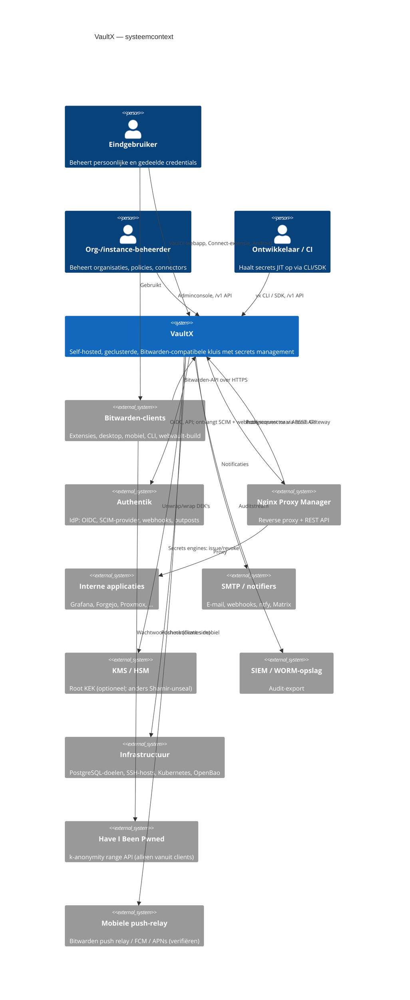
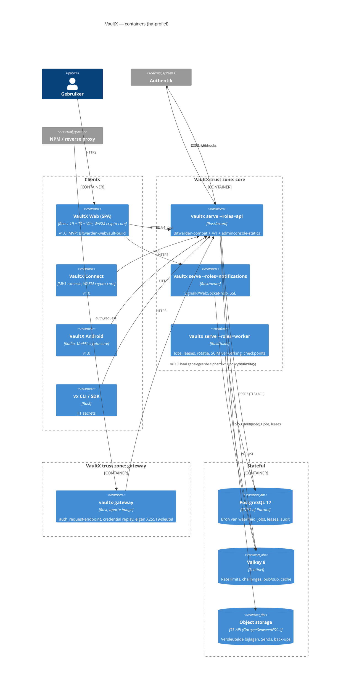
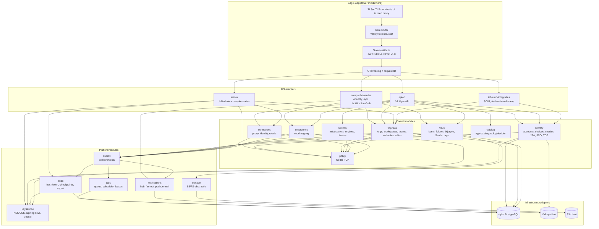
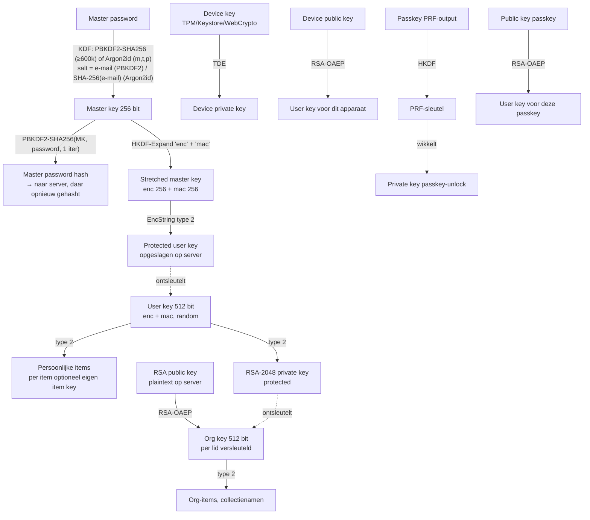
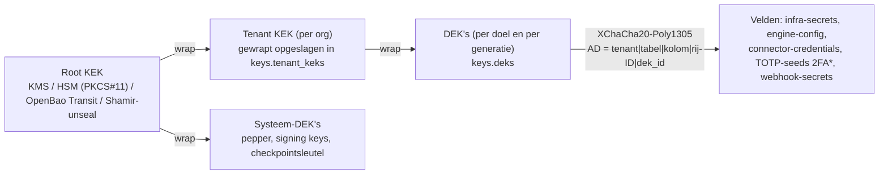
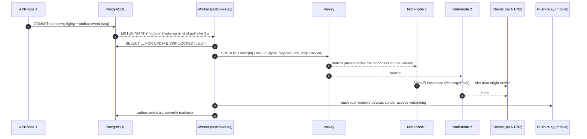
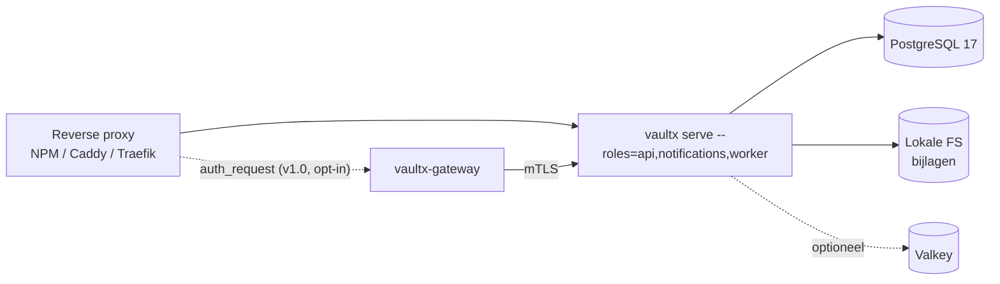
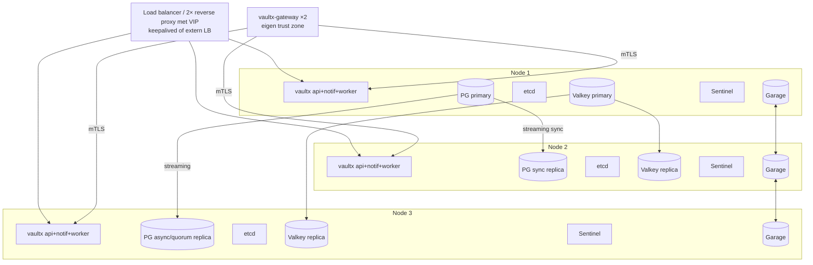
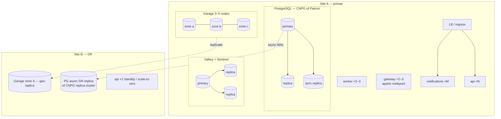

# VaultX — 02 Systeemarchitectuur

Status: ontwerp ter review · Datum: 2026-10-04 · Versie 0.1
Bron van waarheid: `00-kernbeslissingen.md` (KB-xx). Detailontwerp van loginmethodes, browserextensie (optie A/B), mobiele apps, de NPM-connector en het Authentik-trustmodel staat in **`02b-login-en-integraties.md`**; dit document behandelt die onderwerpen alleen voor zover ze de systeemstructuur bepalen.

## Inhoud

1. Scope en leeswijzer
2. Architectuurdrivers en kwaliteitsattributen
3. Vergelijking van architectuuropties en eindkeuze
4. C4-model (context, containers, componenten)
5. Servermodules en verantwoordelijkheden
6. Cryptografisch ontwerp
7. Datastromen (sequentiediagrammen)
8. Clusterarchitectuur
9. Technologie-evaluatie per onderdeel uit de opdracht
10. Zero Trust concreet toegepast
11. Observability
12. Configuratie- en secretbeheer van VaultX zelf
13. Extensiepunten en hun contracten
14. ADR-lijst
15. Opmerkingen bij kernbeslissingen

---

## 1. Scope en leeswijzer

Dit document beschrijft *hoe* VaultX technisch in elkaar zit: welke processen er draaien, welke modules welke verantwoordelijkheid hebben, welke sleutels wat beschermen, hoe data door het systeem stroomt en hoe het cluster zich gedraagt bij uitval. Het is het referentiepunt voor het threat model (03), het databasemodel (04), de API-specificatie (05) en de Docker/Kubernetes-specificaties (09).

Releasefasering volgt KB Deel E. Waar een onderdeel pas in v1.0 of Enterprise komt, staat dat bij het onderdeel vermeld met een label: **[MVP]**, **[v1.0]**, **[Ent]**.

Terminologie:

| Term | Betekenis |
|---|---|
| **App-node** | Een proces van de `vaultx`-binary met één of meer rollen (KB-24) |
| **Rol** | `api`, `notifications`, `worker`, `gateway` (en `admin` als deel van `api`) |
| **E2E-geheim** | Item dat alleen clients kunnen ontsleutelen (geheimklasse 1, KB-01) |
| **Gedelegeerd geheim** | Item dat ook naar de gateway-sleutel is versleuteld (klasse 2) |
| **Infra-geheim** | Server-side versleuteld met envelope encryption (klasse 3, KB-27) |
| **Compat-client** | Officiële Bitwarden-client (extensie, desktop, mobiel, CLI, webvault-build) |
| **Eigen client** | VaultX-webapp, VaultX Connect-extensie, VaultX Android/iOS, `vx` CLI |

---

## 2. Architectuurdrivers en kwaliteitsattributen

### 2.1 Drivers

Architectuurdrivers zijn de eisen die de structuur werkelijk bepalen. Andere eisen zijn belangrijk, maar zouden ook in een andere structuur passen.

| # | Driver | Bron | Architectonisch gevolg |
|---|---|---|---|
| D1 | Zero-knowledge voor persoonlijke en org-kluizen | Opdracht "E2E waar mogelijk", KB-01 | Server slaat alleen ciphertext op; sleutelhiërarchie leeft in clients; server-side ontsleuteling alleen voor klasse 2 (gateway) en 3 (infra) |
| D2 | Bitwarden-compatibiliteit met bestaande clients | Visie, KB-08, KB-09, KB-30 | Aparte compat-module, contracttests, compat-matrix; eigen domeinmodel mag niet lekken naar Bitwarden-vormen |
| D3 | HA en horizontale schaal (1/3/5 nodes) | Clusterarchitectuur, KB-11, KB-20 | Stateless app-nodes, gedeelde state uitsluitend in PostgreSQL/Valkey/S3; cross-node notificaties |
| D4 | Authentik als first-class identity | KB-02, KB-29 | Identity-module met OIDC/SCIM/webhook-adapters; sessiebewustzijn; trusted devices |
| D5 | Login-automatisering achter reverse proxies | KB-03, KB-04 | Aparte gateway-trust zone; connector-framework |
| D6 | Infrastructuur-secrets (dynamisch, rotatie, SSH/K8s) | Geavanceerd, KB-08, KB-27 | Server-side KEK/DEK-hiërarchie; Secrets Engine-pluginmodel; worker-rol voor lease-intrekking |
| D7 | Tamperbestendige audit | KB-26 | Append-only tabel met hashketen + ondertekende checkpoints; aparte DB-rol |
| D8 | Kleine operationele voetafdruk voor homelab/MKB | KB-19, KB-20, Deel D vraag 2 | Eén binary; minimaal aantal stateful componenten; `single`-profiel zonder Valkey/S3 |
| D9 | Bewegend doel (Bitwarden-API, NPM-API) | KB-04, KB-09 | Anti-corruption layers, versie-gedetecteerde adapters, contracttests |
| D10 | Open source, self-hosted, auditeerbaar | KB-21 | Geen verplichte SaaS-afhankelijkheden; reproduceerbare builds |

### 2.2 Kwaliteitsattributen en meetbare scenario's

Kwaliteitsattributen zijn geprioriteerd: bij conflict wint de hogere.

| Prio | Attribuut | Scenario (stimulus → respons → maat) |
|---|---|---|
| 1 | **Vertrouwelijkheid** | Aanvaller krijgt volledige DB-dump + S3-bucket → kan geen enkel E2E-item ontsleutelen zonder master password/device key → 0 plaintext; brute force kost ≥ Argon2id(64 MiB, t=3) per gok |
| 1 | **Integriteit** | DBA wijzigt/verwijdert auditregel → volgende checkpoint-verificatie faalt → detectie binnen ≤ 1 checkpointinterval (standaard 5 min) |
| 2 | **Beschikbaarheid** | Uitval van één willekeurige node in `ha-3` → schrijfverkeer hersteld binnen ≤ 30 s (Postgres-failover), leesverkeer/ontgrendelen in eigen client 0 s (offline cache) → SLO 99,9 %/maand |
| 2 | **Duurzaamheid** | Uitval primary tijdens commit → geen verlies van bevestigde transacties (synchrone replicatie naar ≥1, RPO = 0 binnen site); DR-site RPO ≤ 5 min |
| 3 | **Compatibiliteit** | Nieuwe Bitwarden-clientrelease → compat-watch draait contracttests binnen 72 u → regressie zichtbaar vóór gebruikers updaten |
| 3 | **Prestatie** | `GET /api/sync` voor 2 000 items → p95 ≤ 300 ms server-side; login (token) p95 ≤ 150 ms excl. KDF |
| 4 | **Schaalbaarheid** | Verdubbeling gebruikers → lineaire toevoeging app-nodes zonder herontwerp; DB pas verticaal schalen > ~50k actieve gebruikers |
| 4 | **Operabiliteit** | Upgrade minor-versie in `ha-3` → rolling, zero downtime; rollback binnen ≤ 15 min zolang migratie "expand"-fase is |
| 5 | **Uitbreidbaarheid** | Nieuwe proxy-connector of secrets engine → implementeert gedocumenteerd contract, geen wijziging in kernmodules |
| 5 | **Observeerbaarheid** | Elk request heeft trace-ID end-to-end; geen secret of ciphertext in logs (geautomatiseerd getest) |

### 2.3 Randvoorwaarden

- Taal backend Rust (KB-12), crypto-core gedeeld (KB-13), PostgreSQL 17 enige database (KB-16).
- Draait op Docker Compose en Kubernetes; geen afhankelijkheid van een specifieke cloud.
- Geen enkele functie mag vereisen dat de server E2E-geheimen ziet.
- Licentie AGPL-3.0 (KB-21) — afhankelijkheden moeten daarmee compatibel zijn (Garage AGPL is als *externe dienst* geen probleem; we linken er niet tegen).

---

## 3. Vergelijking van architectuuropties en eindkeuze

### 3.1 Opties

**Optie A — Modulaire monoliet met rollen (KB-24).** Eén Rust-binary, intern opgedeeld in crates met harde afhankelijkheidsregels. Rollen (`api`, `notifications`, `worker`, `gateway`) bepalen welke subsystemen opstarten. In `single` één proces; in HA aparte deployments per rol, horizontaal geschaald. De gateway draait altijd als apart proces met eigen sleutel.

**Optie B — Microservices.** Aparte services voor identity, vault, sync, notifications, audit, policy, gateway, connectors, secrets engines, elk met eigen deploy en (logisch) eigen schema, communicerend via gRPC en een message bus (NATS).

**Optie C — Vaultwarden-fork.** Vaultwarden als basis, uitgebreid met Postgres-HA, clustered notificaties, Authentik-integratie, gateway en extra itemtypes.

**Optie D — Vaultwarden ongewijzigd + VaultX-sidecars.** Vaultwarden blijft de kluis; VaultX bouwt eromheen: SCIM-bridge, NPM-connector, gateway, secrets-dienst (bv. OpenBao). (Ter volledigheid; deze optie wordt vaak voorgesteld als "snelste route".)

### 3.2 Vergelijking

Score 1 (slecht) – 5 (goed); weging naar de kwaliteitsattributen hierboven.

| Criterium (gewicht) | A. Modulaire monoliet | B. Microservices | C. Vaultwarden-fork | D. Vaultwarden + sidecars |
|---|---|---|---|---|
| Vertrouwelijkheid / aanvalsoppervlak (5) | 4 — één binary, weinig interne netwerkoppervlakken; gateway apart | 3 — veel interne API's, mTLS en authz overal nodig | 4 — bewezen basis, maar elke uitbreiding moet passen in bestaand model | 3 — twee identiteitsdomeinen, sidecars hebben brede rechten nodig |
| HA / clustering (4) | 5 — stateless ontworpen vanaf dag 1 | 5 | 2 — single-node aannames (in-process websocket-hub, lokale bestanden, SQLite-first, Rocket) moeten overal worden verwijderd | 2 — Vaultwarden zelf blijft het knelpunt (notificaties via één node) |
| Operationele eenvoud homelab (4) | 5 — 1 container in `single` | 1 — 10+ containers + bus minimum | 5 | 3 |
| Ontwikkelsnelheid tot MVP (3) | 3 — compat-laag zelf schrijven (Vaultwarden als spec) | 2 — veel infra-werk vóór features | 4 — compat direct aanwezig | 5 |
| Ontwikkelsnelheid tot v1.0/Ent (3) | 4 | 3 | 2 — fork-divergentie groeit; upstream-merges worden pijnlijk | 1 — niet uitbreidbaar zonder de kern aan te passen (TDE, key transparency, crypto v2, nieuwe itemtypes) |
| Onafhankelijke schaal per functie (2) | 4 — per rol, niet per module | 5 | 1 | 2 |
| Testbaarheid/consistentie (3) | 5 — transacties over modules in één DB | 2 — sagas/distributed transactions bij sleutelrotatie en delen | 4 | 2 |
| Fit met KB's (bindend) | volledig | strijdig met KB-19 (geen NATS) en KB-24 | strijdig met KB-08 | strijdig met KB-08, KB-26 (audit buiten kern) |
| **Gewogen totaal** (max 120) | **104** | 75 | 75 | 64 |

Toelichting bij de belangrijkste afwegingen:

- **Transactionele consistentie is voor een kluis doorslaggevend.** Een org-sleutelrotatie herversleutelt de org key voor alle leden, alle collectie-items en de admin-recovery-sleutels. In optie A is dat één Postgres-transactie (eventueel in batches onder een lease). In optie B wordt het een saga over vault-, org- en audit-services met compensaties: meer code, meer foutmodi, meer audit-hiaten.
- **Microservices lossen een organisatorisch probleem op dat VaultX niet heeft** (veel onafhankelijke teams). De schaalvoordelen haalt optie A grotendeels via rollen: de dure delen (sync-API, websockets, workers) schalen apart.
- **Vaultwarden-fork:** Vaultwarden is uitstekend als referentie, maar KB-08 legt al vast dat de single-node-aannames te diep zitten. Concreet: notificaties zitten in een in-process hub, bijlagen/icon-cache op lokale schijf, DB-abstractie via Diesel met drie dialecten, en geen notie van gateway, envelope encryption of policies. Een fork zou na ±6 maanden geen upstream-merges meer kunnen absorberen.
- **Optie D** is aantrekkelijk als "proof of value" maar levert geen eigen product op; het is wel een nuttige **migratiebron** (zie 04/09: import vanuit Vaultwarden-DB).

### 3.3 Eindkeuze

**Optie A: modulaire monoliet met rollen** (KB-24), met de volgende harde regels om de nadelen van een monoliet te beperken:

1. **Crate-grenzen = modulegrenzen.** Elke module is een eigen crate in een Cargo-workspace; afhankelijkheden zijn eenrichtingsverkeer en worden in CI gecontroleerd (`cargo deny` + een custom check op de dependency-graph).
2. **Geen gedeelde tabellen tussen modules.** Elke module bezit zijn eigen tabellen (Postgres-schema per module: `identity`, `vault`, `org`, `audit`, ...). Andere modules gebruiken de publieke Rust-API van die module, niet de tabellen. Cross-schema foreign keys zijn toegestaan voor referentiële integriteit, cross-schema `JOIN`s in querycode niet (uitzondering: read-models voor sync, expliciet gedocumenteerd).
3. **Gateway is fysiek gescheiden.** Zelfde codebase, maar een aparte build-feature (`--features gateway`) en een apart image `vaultx-gateway` zonder API-modules, zodat de gateway-binary geen DB-schrijfrechten en geen publieke API heeft.
4. **Uitsplitsbaar.** De modulecontracten (Rust-traits + domeinevents in de outbox) zijn zo gekozen dat een module later als aparte dienst kan worden uitgerold zonder datamodelwijziging. Dat is een optie, geen plan.

---

## 4. C4-model

### 4.1 Niveau 1 — Systeemcontext



Belangrijk aan de context: **HIBP wordt nooit door de server aangeroepen** voor gebruikerswachtwoorden (alleen clients, met k-anonymity — §10.5). De push-relay is een privacy-afweging (§15).

### 4.2 Niveau 2 — Containers



Containerverantwoordelijkheden in één oogopslag:

| Container | Rollen | Stateful? | Publiek bereikbaar | Schaalt op |
|---|---|---|---|---|
| `vaultx` (api) | `api` | nee | ja (via ingress/NPM) | requests/s, sync-grootte |
| `vaultx` (notifications) | `notifications` | nee (verbindingen in geheugen) | ja (WSS) | aantal open verbindingen |
| `vaultx` (worker) | `worker` | nee | nee | joblast |
| `vaultx-gateway` | `gateway` | nee | alleen vanaf reverse proxy | auth_request-volume |
| PostgreSQL | — | ja | nee | verticaal + read-replica's |
| Valkey | — | semi (verlies acceptabel) | nee | zelden nodig |
| Object storage | — | ja | presigned GET/PUT (optioneel) | capaciteit |

In `single` draaien `api,notifications,worker` in één proces; de gateway is ook daar een apart proces/container zodra gedelegeerde secrets actief zijn (KB-24).

### 4.3 Niveau 3 — Componenten van de server



De gateway (apart image) bevat alleen: edge-laag, `gateway`-adapter, een read-only client naar de API (mTLS), `policy` (voor lokale caching van beslissingen), `keys` (alleen de gateway-sleutel) en `audit`-producer. Zie §6.7.

**Afhankelijkheidsregels** (afgedwongen in CI):

- Adapters → domein → platform → infra. Nooit omgekeerd.
- Domeinmodules mogen elkaar aanroepen via publieke traits, maar **niet circulair**; `org` mag `identity` gebruiken, niet andersom (identity kent orgs alleen via ID's).
- `compat-bitwarden` is de *enige* crate die Bitwarden-DTO's kent (anti-corruption layer, KB-09).
- `policy` heeft geen afhankelijkheden op domeinmodules; het krijgt entiteiten aangeleverd.
- Alleen `keyservice` raakt KEK-materiaal aan; andere modules krijgen een `DekHandle` met beperkte operaties.

---

## 5. Servermodules en verantwoordelijkheden

Elke module is een crate `vaultx-<naam>` en bezit een Postgres-schema met dezelfde naam (behalve `compat-bitwarden`, `api-v1`, `gateway`, `admin` die geen eigen tabellen hebben of minimale).

### 5.1 Overzicht

| Module | Verantwoordelijkheid | Eigen data | Draait in rol | Fase |
|---|---|---|---|---|
| `identity` | Accounts, credentials (master-password-hash, KDF-params), devices, sessies/refresh tokens, 2FA (TOTP, WebAuthn, e-mail), SSO (OIDC/SAML/LDAP), trusted devices, auth requests ("login met apparaat"), key transparency-log | `identity.*` | api, worker | MVP (basis), v1.0 (TDE, LDAP, SAML) |
| `vault` | Items (ciphers), folders, bijlagen-metadata, Sends, tags, favorieten, revisiedata, sync-read-model | `vault.*` | api | MVP |
| `compat-bitwarden` | Vertaling Bitwarden-API ↔ domein; `/api/config` feature flags; projectie nieuwe itemtypes als secure note (KB-30); SignalR/MessagePack-framing | geen (alleen compat-matrix-config) | api, notifications | MVP |
| `api-v1` | Primaire VaultX-API `/v1`, OpenAPI-gegenereerd contract | geen | api | MVP (subset) |
| `org` (rbac) | Organisaties, workspaces, collecties, teams, lidmaatschap, vaste rollen, groep-mapping vanuit Authentik/SCIM, admin recovery-enrolment | `org.*` | api, worker | MVP (basis), v1.0 (workspaces, teams) |
| `policy` | Cedar-PDP: laden/valideren/versioneren van policies, autorisatiebeslissingen, policy-analyse (dry-run), org-policies à la Bitwarden (master password-eisen, 2FA verplicht, single org, ...) | `policy.*` | alle | MVP (vaste rollen), v1.0 (Cedar) |
| `emergency` | Noodtoegang: uitnodigingen, wachttijden, goedkeuring/afwijzing, view/takeover | `emergency.*` | api, worker | v1.0 (KB Deel E) |
| `audit` | Append-only events, hashketen per tenant, ondertekende checkpoints, verificatie, export (SIEM, S3 Object Lock) | `audit.*` (aparte DB-rol) | alle (producer), worker (checkpoints) | MVP |
| `notifications` | Verbindingsbeheer (SignalR, WebSocket, SSE), cross-node fan-out, mobiele push, e-mail en notifier-plugins | `notify.*` (templates, voorkeuren, push-registraties) | notifications, worker | MVP |
| `jobs` | Postgres-jobqueue, scheduler (cron), leases met fencing tokens, outbox-relay | `jobs.*` | worker (+ api voor enqueue) | MVP |
| `gateway` | Access Gateway: `auth_request`-endpoint, credential replay/sessiedelegatie, gateway-sleutel, sessiecookies naar upstream | geen DB-schrijfrechten | gateway | v1.0 |
| `connectors` | Proxy-connectors (NPM, Traefik, Caddy, nginx, K8s), identity-connectors (Authentik-API, LDAP), rotatie-connectors; plan/apply/diff | `connectors.*` | worker, api | v1.0 (NPM, Traefik), Ent (rotatie) |
| `catalog` | App-catalogus, detectie (via connectors/Authentik-API), login-methodeladder (KB-03), domein→item-mapping | `catalog.*` | api, worker | v1.0 |
| `secrets` | Infra-secrets (klasse 3), service accounts, API-tokens, JIT delivery, Secrets Engines, leases/TTL/revoke | `secrets.*` | api, worker | v1.0 (service accounts/JIT), Ent (engines) |
| `keyservice` | Root KEK-provider (KMS/PKCS#11/Transit/Shamir), DEK-beheer, JWT-signing keys, audit-checkpointsleutel, unseal-status | `keys.*` | alle (lokaal), worker (rotatie) | MVP (Shamir/file), Ent (HSM/KMS) |
| `storage` | Abstractie S3/FS, presigned URL's, lifecycle (verlopen Sends), integriteitscontrole | geen | api, worker | MVP |
| `admin` | Instance-beheer: adminconsole, health, configuratie-inzage, gebruikersbeheer, back-upstatus | geen eigen schema | api | MVP (minimaal) |
| `outbox` | Transactionele outbox voor domeinevents → audit, notificaties, jobs, webhooks | `outbox.*` | alle | MVP |

### 5.2 Modulebeschrijvingen

**identity.** Kent het verschil tussen *authenticatie* (wie ben je) en *ontgrendeling* (heb je de sleutel). Slaat op: `master_password_hash` (server-side opnieuw gehasht met Argon2id, eigen parameters, met pepper uit `keyservice`), KDF-parameters, `protected_user_key` (EncString), `public_key`, `protected_private_key`, devices (incl. `device_public_key`, `protected_user_key_for_device` voor TDE), refresh-tokenfamilies, 2FA-registraties. Uitgifte van access tokens (JWT EdDSA, 5–15 min, KB-25). SSO-flows via adapters: OIDC (Authentik eerst), later SAML/LDAP. Details van de loginmethodes: 02b.

**vault.** Opslag van ciphertext en minimaal noodzakelijke plaintext-metadata (type, revisiedatum, org-/collectie-ID, `deleted_at`, en *optioneel* een gehashte URI-sleutel voor catalogus-matching — standaard uit, want het lekt welke domeinen een gebruiker heeft). Beheert `revision_date` per gebruiker en org voor incrementele sync. Biedt een **sync-read-model**: één query-pad dat items, folders, collecties, policies en Sends van een gebruiker in één transactie leest (zie §8.6 voor prestaties).

**compat-bitwarden.** Pure vertaling, geen businesslogica. Bevat: route-tabel van ondersteunde Bitwarden-endpoints, DTO's met `serde`-aliassen voor veldvarianten tussen clientversies, `/api/config` (server-versie, feature flags die we bewust aan/uit zetten), SignalR-handshake en MessagePack-framing, foutvertaling naar het Bitwarden-foutformaat. Contracttests draaien tegen opgenomen verkeer van de compat-matrix (KB-09).

**org/rbac.** Lidmaatschapsstatussen (uitgenodigd → geaccepteerd → bevestigd: pas na bevestiging versleutelt een admin de org key naar de publieke sleutel van het lid), vaste rollen (owner, admin, manager, user, custom), collectie-toegang (read, hide-passwords, manage). Ontvangt groeps- en gebruikerswijzigingen van SCIM/Authentik en vertaalt ze via een declaratieve mapping naar lidmaatschappen. Let op: SCIM kan een lid *toevoegen* maar niet *bevestigen* — bevestiging vereist een client met de org key (of auto-confirm door een vertrouwde admin-client of, in Key Connector-modus, de server). Zie 02b.

**policy.** Twee lagen: (1) **org-policies** die clients moeten afdwingen (master password-complexiteit, 2FA verplicht, vault timeout, verbod op export, single org) — deze worden via sync naar clients gestuurd; (2) **autorisatie** via Cedar: elke domeinoperatie vraagt `is_authorized(principal, action, resource, context)`. Context bevat `acr`/`amr` uit Authentik (step-up, KB-29), device-trust, netwerkzone, tijd. Vaste rollen zijn in MVP hardgecodeerde Cedar-policies; vanaf v1.0 kunnen org-admins eigen policies toevoegen (alleen *forbid*-regels en *permit*-regels binnen hun org-scope; validatie tegen het schema).

**audit.** Producer-API is "fire and persist": audit-events gaan via de outbox in dezelfde transactie als de domeinwijziging, zodat er geen wijziging zonder auditregel bestaat. De worker hangt ze aan de hashketen (seriële verwerking per tenant onder een lease), maakt periodiek een checkpoint (Ed25519) en exporteert. Zie KB-26 en 04 voor het schema.

**notifications.** Houdt open verbindingen per node bij; abonneert zich per node op Valkey-kanalen; vertaalt domeinevents (`SyncCipherUpdate`, `SyncFolderDelete`, `LogOut`, `AuthRequest`, ...) naar SignalR-berichten voor compat-clients en naar JSON-events voor eigen clients. Zie §7.6.

**jobs.** Zie §8.5 (queue) en §8.4 (leases).

**gateway.** Zie §6.7 en 02b.

**connectors, catalog.** Framework en contracten in §13; functioneel ontwerp NPM-connector in 02b.

**secrets.** Beheert klasse-3-geheimen: velden versleuteld met tenant-DEK; service accounts met machine-identiteit (client credentials, of workload identity via K8s ServiceAccount-token/OIDC-federatie); JIT-levering met korte leases; Secrets Engines (§13.3). **Belangrijk onderscheid:** de Bitwarden "Secrets Manager" (machine accounts, projects) is E2E — de server kan secrets niet lezen. VaultX' `secrets`-module biedt *beide* modi: E2E-secrets voor machines (machine account bezit een sleutel; compatibel met Bitwarden SM-concept, verifiëren of compat haalbaar is) en server-side infra-secrets die nodig zijn voor dynamische secrets en rotatie. De UI toont altijd welke klasse een secret heeft.

**keyservice.** Zie §6.8–6.9 en §12.

### 5.3 Communicatie tussen modules

- **Synchroon:** in-process functieaanroepen via traits; geen intern HTTP.
- **Asynchroon:** domeinevents in `outbox.events` (zelfde transactie); de outbox-relay in de worker verdeelt naar audit, notificaties (Valkey PUBLISH), jobs en externe webhooks. Hierdoor is elke bijwerking *at-least-once* en idempotent te maken.
- **Over procesgrenzen:** gateway ↔ api via mTLS gRPC (intern contract, niet publiek); out-of-process plugins via gRPC over Unix-socket/mTLS (§13).

---

## 6. Cryptografisch ontwerp

### 6.1 Uitgangspunten

1. **Drie geheimklassen** (KB-01), met elk een eigen sleutelketen die elkaar niet overlappen. Een compromis van de server-side KEK geeft géén toegang tot klasse 1.
2. **Eén implementatie** in `vaultx-crypto` (KB-13), gebruikt door server (alleen verificatie, klasse 3, gateway), WASM-clients en mobiel.
3. **Compat eerst, v2 opt-in.** Accounts die Bitwarden-clients gebruiken blijven op Bitwarden-formaten (EncString type 2, RSA-OAEP). Crypto v2 (KB-10) alleen voor accounts die uitsluitend eigen clients gebruiken.
4. **Sleutelmateriaal wordt gezeroized** (`zeroize`, `secrecy`), nooit gelogd, nooit in panics/Debug-output. In WASM is zeroize best effort (JS-garbage collector, kopieën in JS-heap); dat is een gedocumenteerde beperking (threat model 03).
5. **Geen eigen primitieven.** RustCrypto-crates (`aes`, `cbc`, `hmac`, `sha2`, `hkdf`, `argon2`, `pbkdf2`, `rsa`, `chacha20poly1305`, `x25519-dalek`, `ed25519-dalek`) of `aws-lc-rs`/`ring` waar FIPS-validatie gewenst is. Keuze vastleggen in ADR-016.

### 6.2 Client-side sleutelhiërarchie (klasse 1, Bitwarden-compatibel)



Stappen in detail (compat-account):

| Stap | Operatie | Parameters | Waar |
|---|---|---|---|
| 1 | `MK = KDF(password, salt)` | PBKDF2-SHA256 met iteraties uit prelogin (Bitwarden-default 600 000), of Argon2id (Bitwarden-default m=64 MiB, t=3, p=4). Salt: lowercase e-mail; voor Argon2id gebruikt Bitwarden SHA-256(e-mail) als salt (verifiëren tegen huidige SDK) | Client |
| 2 | `MPH = PBKDF2-SHA256(MK, password, 1)` | 1 iteratie, base64 | Client → server bij login |
| 3 | Server: `stored = Argon2id(MPH, salt_server, pepper)` | Server-parameters onafhankelijk van client-KDF, m=19–64 MiB (tuning per profiel) | Server (`identity`) |
| 4 | `SMK = HKDF-Expand(MK, "enc", 32) ‖ HKDF-Expand(MK, "mac", 32)` | SHA-256 | Client |
| 5 | `UK = random(64)` bij registratie; `PUK = EncString2(SMK, UK)` | | Client |
| 6 | RSA-2048-sleutelpaar; `protected_private_key = EncString2(UK, PKCS8)` | | Client |
| 7 | Item: velden versleuteld met UK, of met per-item **cipher key** (random 64 B, zelf versleuteld met UK/org key) | Bitwarden-clients gebruiken item keys sinds 2024 (verifiëren welke versie het standaard aanzet) | Client |

**KDF-downgradebescherming (KB-10).** De server levert KDF-parameters via prelogin; een kwaadwillende server kan zwakke parameters opgeven en de resulterende hash offline brute-forcen. Maatregelen:
- Eigen clients onthouden per account de laatst geziene parameters en weigeren lagere waarden dan de minima (Argon2id m≥64 MiB, t≥3, p≥4; PBKDF2 ≥600 000) én lager dan eerder gezien.
- De server weigert zelf KDF-wijzigingen onder de minima (beschermt tegen een gecompromitteerde *client*).
- Crypto v2 bindt KDF-parameters cryptografisch aan de protected user key (associated data), zodat wijzigen zonder het wachtwoord detecteerbaar is.
- Bitwarden-clients bieden deze bescherming niet volledig — gedocumenteerde beperking.

### 6.3 Bitwarden EncString-compatibiliteit

Formaat: `<type>.<b64 iv>|<b64 ciphertext>|<b64 mac>` voor symmetrisch, `<type>.<b64 data>` voor asymmetrisch.

| Type | Naam | VaultX-gedrag |
|---|---|---|
| 0 | AesCbc256_B64 (zonder MAC) | Alleen **lezen** bij import van oude data; nooit schrijven; waarschuwing + migratie naar type 2 |
| 1 | AesCbc128_HmacSha256_B64 | Lezen-alleen (legacy), nooit schrijven |
| 2 | AesCbc256_HmacSha256_B64 | **Standaard voor compat-accounts.** Encrypt-then-MAC; MAC = HMAC-SHA256(macKey, iv ‖ ct); verificatie in constante tijd vóór decryptie |
| 3 | Rsa2048_OaepSha256_B64 | Lezen + schrijven |
| 4 | Rsa2048_OaepSha1_B64 | Standaard van Bitwarden-clients voor org key-sharing; lezen + schrijven (compat) |
| 5, 6 | Rsa2048_Oaep*_HmacSha256_B64 | Lezen (legacy) |
| 7 | COSE Encrypt0 (XChaCha20-Poly1305) | Bitwarden SDK introduceert dit voor "user crypto v2" (verifiëren status en exact formaat); VaultX ondersteunt het **als het formaat stabiel is** — zie §6.10 en §15 |

De **server valideert EncStrings syntactisch** (type bekend, base64 geldig, lengtes plausibel) maar kan ze niet cryptografisch verifiëren (geen sleutel). Dit beschermt tegen corrupte data door buggy clients, niet tegen een kwaadwillende client.

Bekende zwakte type 2: geen binding aan context (een ciphertext van veld A kan naar veld B of naar een ander item worden verplaatst door een kwaadwillende server). Mitigatie in compat-modus beperkt: item keys verkleinen het effect (ciphertext van een ander item ontsleutelt niet met deze item key). Volledige mitigatie pas in crypto v2.

### 6.4 Asymmetrische sleutels, organisaties en delen

- **Gebruikerssleutelpaar**: RSA-2048 (compat). Publieke sleutel staat plaintext op de server.
- **Org key**: 64 B random, gegenereerd door de client van de oprichter. Per lid: `EncString4(member_public_key, org_key)`. Bij bevestigen van een nieuw lid haalt de admin-client de publieke sleutel van het lid op, **toont de fingerprint** (eigen clients; Bitwarden-clients doen dit optioneel), en versleutelt de org key.
- **Admin recovery** (account recovery / "reset password" in Bitwarden-terminologie): org heeft eigen RSA-sleutelpaar; bij enrolment versleutelt de client van het lid zijn user key naar de org-publieke sleutel. Org-admins met de juiste rol kunnen zo het master password resetten. Dit is ook het mechanisme voor TDE-apparaatgoedkeuring door admins (KB-02).
- **Collecties** delen de org key; er zijn geen per-collectie-sleutels in het Bitwarden-model. Toegang tot collecties is dus **autorisatie, geen cryptografie**: een lid met de org key kan cryptografisch alle org-items ontsleutelen als de server ze zou leveren. VaultX documenteert dit expliciet (threat model: kwaadwillende server/beheerder). Voor eigen clients wordt in Enterprise **per-workspace-sleutels** overwogen (crypto v2), wat echte cryptografische scheiding geeft (ADR-021).
- **Sleutelinjectie (KB-10):** een kwaadwillende server kan bij bevestiging een eigen publieke sleutel aanbieden. Mitigatie: key transparency light (§6.11).

### 6.5 Device keys en Trusted Device Encryption (TDE) [v1.0]

Doel: met een SSO-sessie (Authentik) én een vertrouwd apparaat ontgrendelen zonder master password (KB-02). Mechanisme (afgestemd op Bitwarden TDE, zodat compat-clients het ook ondersteunen voor zover die TDE aanbieden — verifiëren per client):

1. Apparaat genereert **device key** (symmetrisch, 64 B) — in eigen clients bij voorkeur non-extractable in TPM/Secure Enclave/Android Keystore (StrongBox); in de webapp als non-extractable WebCrypto-key in IndexedDB.
2. Apparaat genereert RSA-sleutelpaar; `device_protected_private_key = Enc(device_key, priv)`.
3. Server ontvangt en bewaart (zelfde velden als Bitwarden-TDE, verifiëren tegen huidige API): `encrypted_private_key = Enc(device_key, device_priv)`, `encrypted_user_key = RSA-OAEP(device_pub, UK)` en `encrypted_public_key = Enc(UK, device_pub)` (dat laatste maakt herwrappen bij UK-rotatie mogelijk). De device key zelf verlaat het apparaat nooit; zonder device key zijn de serverwaarden waardeloos.
4. Unlock: SSO-login → server levert `user_key_encrypted_for_device` → apparaat ontsleutelt met device private key → UK.
5. Nieuw apparaat zonder master password: **auth request** (goedkeuring vanaf vertrouwd apparaat via `notifications` + anonieme hub) of **admin approval** (admin-client ontsleutelt het enrolment-pakket van admin recovery en versleutelt UK naar de publieke sleutel van het nieuwe apparaat).

Wat dit niet beschermt: een aanvaller met Authentik-sessie **én** fysieke toegang tot een ontgrendeld vertrouwd apparaat. Daarom: vault-timeout + lokale biometrie/PIN boven op TDE.

### 6.6 PRF-unlock met passkeys [v1.0]

WebAuthn **PRF-extensie** levert een deterministische 32-byte output per credential en per salt. Gebruik:
- `prf_key = HKDF(prf_output, info="vaultx-prf-unlock")`.
- Bij enrolment: nieuw RSA-sleutelpaar; private key versleuteld met `prf_key`; `UK` versleuteld naar public key; beide opgeslagen bij de credential op de server (zelfde patroon als Bitwarden "login with passkey", verifiëren voor compat).
- Unlock = WebAuthn-assertie met PRF → private key → UK. Authenticatie *en* ontgrendeling in één gebaar.
- Beperkingen: PRF-ondersteuning verschilt per authenticator/browser/OS (platformpasskeys via iCloud-sleutelhanger en Google Password Manager ondersteunen PRF inmiddels breed, maar niet alle hardware keys/browsers — verifiëren in compat-matrix). Fallback: master password of TDE.
- Passkey als **tweede factor** (WebAuthn 2FA) en als **unlock-methode** zijn verschillende registraties met verschillende rechten.

### 6.7 Gateway-sleutels (klasse 2) [v1.0]

- De gateway heeft een **X25519-sleutelpaar** (KB-01). Private key in HSM/TPM, of versleuteld in een eigen sealed bestand dat alleen het gateway-proces kan unsealen; nooit in de app-database.
- Delegeren: client ontsleutelt het item en versleutelt de benodigde velden (gebruikersnaam, wachtwoord, TOTP-seed, doel-URL) opnieuw met **HPKE** (RFC 9180, X25519-HKDF-SHA256 + ChaCha20-Poly1305) naar de gateway-publieke sleutel, met associated data `(item_id, gateway_key_id, scope)`. De resulterende blob staat naast het E2E-item.
- De publieke gateway-sleutel wordt door clients geverifieerd via key transparency (§6.11) of een vastgepinde fingerprint in de org-policy — anders kan een kwaadwillende server een eigen "gatewaysleutel" aanbieden.
- Rotatie: nieuwe gateway-sleutel → items blijven met oude sleutel leesbaar tot herdelegatie; clients herversleutelen bij volgende sync (de gateway kan het niet zelf, want de nieuwe blob moet door een gemachtigde client worden gemaakt — tenzij de gateway oude→nieuwe herversleuteling in geheugen doet, wat toegestaan is omdat de gateway beide sleutels mag hebben; ADR-019).
- Details van wat de gateway met het geheim doet (injectie, replay, sessiedelegatie): 02b.

### 6.8 Server-side envelope encryption (klasse 3, KB-27)



\* 2FA-TOTP-seeds van *de VaultX-login zelf* moeten server-side verifieerbaar zijn en vallen daarom in klasse 3. TOTP-seeds *in kluisitems* zijn klasse 1.

Ontwerpbeslissingen:
- **Drie niveaus** in plaats van twee: een tenant-KEK maakt *crypto-shredding* per organisatie mogelijk (org verwijderd → tenant-KEK vernietigd → alle klasse-3-data onleesbaar, ook in back-ups).
- **Associated data** bindt elke ciphertext aan zijn plaats; verplaatsen van ciphertext tussen rijen/tenants faalt.
- **Root KEK-providers** (trait in §13.5): `kms-aws`, `kms-gcp`, `kms-azure`, `pkcs11`, `openbao-transit`, `shamir`, `file` (alleen `single`/dev, expliciet als zwakker gemarkeerd).
- **Unseal** bij opstart: zonder root KEK start de node in *sealed* toestand: identity/vault (klasse 1) werken wél (geen server-side sleutels nodig, behalve pepper en JWT-signing — zie hieronder), klasse-3-functies niet. Dit is een bewuste keuze: een gesealde node mag de kluis niet onbruikbaar maken.
  - Pepper en JWT-signing keys zijn systeem-DEK's; zonder unseal kan een node dus **geen** logins afhandelen. Oplossing: de unseal is in HA automatisch (KMS of auto-unseal via een andere unsealed node over mTLS, **niet** via de DB). Bij Shamir moeten na een volledige clusterherstart key holders unsealen; daarna unsealen nieuwe nodes via peer-unseal. Afweging vastgelegd in ADR-012.
- **Caching**: ontwrapte DEK's leven in geheugen (gezeroized bij evictie), TTL 1 uur, maximaal N stuks; nooit in Valkey.

### 6.9 Sleutelrotatie

| Sleutel | Trigger | Procedure | Impact | Fase |
|---|---|---|---|---|
| **User key** | Vermoed compromis, gebruikersactie, policy | Client genereert nieuwe UK; herversleutelt alle persoonlijke items/item keys, private key, Sends, folders, emergency-access-grants, admin-recovery-enrolment, TDE-device-wraps, PRF-wraps; uploadt in één **atomische** `POST /accounts/key`-achtige operatie. Server accepteert alleen als het aantal en de revisies van items exact overeenkomen (anders conflict → client probeert opnieuw) | Alle andere sessies uitgelogd; andere apparaten moeten opnieuw ontgrendelen; bijlagen met eigen bijlagesleutel hoeven niet opnieuw geüpload (alleen hun sleutel wordt herwrapt) | MVP (compat), v1.0 (UI) |
| **Master password / KDF** | Wachtwoordwijziging, KDF-upgrade | Alleen PUK herwrappen met nieuwe SMK; UK blijft gelijk | Goedkoop | MVP |
| **Org key** | Lid verwijderd met vermoeden van misbruik, periodiek | Admin-client: nieuwe org key; herversleutelt alle org-items en collectienamen; versleutelt nieuwe key naar alle bevestigde leden en admin-recovery; server voert uit onder een **lease met fencing token** (§8.4) en in batches met een `key_generation`-kolom zodat clients tijdens de rotatie beide generaties kunnen lezen | Groot voor grote orgs; daarom batching + hervatbaarheid | v1.0 (Bitwarden ondersteunt org key-rotatie beperkt — verifiëren) |
| **Tenant-KEK / root KEK** | Periodiek (jaarlijks), compromis | Nieuwe KEK; alle DEK's herwrappen (KB-27): O(#DEK's), niet O(#velden). Oude KEK blijft "decrypt-only" tot herwrap klaar is | Online, geen downtime | MVP (root), Ent (HSM) |
| **DEK** | Volume-limiet (bv. 2^32 encryptions), compromis, periodiek | Nieuwe DEK-generatie voor nieuwe writes; achtergrondjob herversleutelt velden (lazy of actief) | Online | v1.0 |
| **JWT-signing key** | Elke 30 dagen, compromis | Nieuwe EdDSA-key in `keys.signing_keys` met status `next` → `active` → `retired`; JWKS publiceert active + next + retired tot max token-TTL verstreken is (≥15 min). Compromis: onmiddellijk `revoked`, alle access tokens ongeldig, clients verversen via refresh token | Geen impact bij reguliere rotatie | MVP |
| **Audit-checkpointsleutel** | Jaarlijks | Nieuwe sleutel; overgangscheckpoint ondertekend door oude én nieuwe sleutel; publieke sleutels in key transparency-log | Geen | MVP |
| **Gateway-sleutel** | Periodiek, compromis | §6.7 | Gedelegeerde items moeten opnieuw gedelegeerd worden | v1.0 |
| **mTLS-certificaten** | 24–72 u (cert-manager/interne CA) | Automatisch, hot reload | Geen | MVP |
| **Device key** | Apparaat ingetrokken | Server verwijdert wraps; bij vermoeden van compromis: UK-rotatie aanbevelen | | v1.0 |

### 6.10 Crypto v2 [Ent, eerder als Bitwarden-formaat stabiel is]

Voor accounts die uitsluitend eigen clients gebruiken (KB-10):

| Aspect | Compat (v1) | VaultX crypto v2 |
|---|---|---|
| Symmetrisch | AES-256-CBC + HMAC-SHA256 | XChaCha20-Poly1305 (AEAD) |
| Context-binding | Geen | AD = `{version, account_id, item_id, field_path, key_id}` |
| Asymmetrisch | RSA-2048 OAEP-SHA1 | X25519 (HPKE); optioneel hybride X25519+ML-KEM-768 voor post-kwantum (Ent, als crates geaudit zijn) |
| Ondertekening | Geen | Ed25519 identiteitssleutel per gebruiker en org; ondertekent publieke encryptiesleutels |
| KDF-binding | Niet geauthenticeerd | KDF-parameters in AD van protected user key |
| Item-integriteit | Per veld | Per item een ondertekend manifest (velden + hashes) tegen veldverwisseling/weglating |

Migratie: een account wordt v2 door *upgrade* (client herversleutelt alles); terug naar compat kan alleen via een nieuwe user key. Zolang een gebruiker lid is van een org met compat-leden, blijven org-items in v1-formaat. **Afstemming met Bitwarden:** Bitwarden werkt zelf aan "user crypto v2" met COSE en XChaCha20-Poly1305 (verifiëren). Als hun formaat publiek en stabiel wordt, neemt VaultX het over in plaats van een eigen formaat — dan profiteren ook compat-clients. Zie §15.

### 6.11 Key transparency light [Ent; fundament in v1.0]

- Append-only tabel `identity.key_log` met entries `{seq, subject (user/org/gateway/device), key_type, public_key, fingerprint, prev_hash, created_at}` en dezelfde hashketen + ondertekende checkpoints als de auditlog (hergebruik van `audit`-infrastructuur).
- Eigen clients bewaren de laatst geziene checkpoint en vragen bij elke sleutel een **inclusiebewijs** (eenvoudig: hashketen vanaf vorige checkpoint; later: Merkle-boom à la RFC 6962 voor logaritmische bewijzen).
- Detecteert *gesplitste views* alleen als clients checkpoints onderling vergelijken (gossip): eigen clients sturen hun checkpoint-hash mee in requests; de server kan niet weten welke clients met elkaar praten. Volledige garantie vereist externe witnesses — buiten scope tot Enterprise.
- Bitwarden-clients profiteren niet (gedocumenteerde beperking, KB-10).

---

## 7. Datastromen

Notatie: `C` = client, `API` = api-rol, `N` = notifications-rol, `W` = worker, `PG` = PostgreSQL, `VK` = Valkey. Alle verbindingen TLS; intern mTLS (§10).

### 7.1 Registratie (master password, compat)

```mermaid
sequenceDiagram
  autonumber
  actor U as Gebruiker
  participant C as Client
  participant API as API (identity)
  participant PG as PostgreSQL
  participant W as Worker
  U->>C: e-mail + master password
  C->>API: POST /identity/accounts/register/send-verification-email (verifiëren endpointnaam per clientversie)
  API->>PG: tijdelijke registratietoken (hash) + outbox(e-mail)
  W-->>U: verificatiemail
  U->>C: klikt link (token)
  C->>C: KDF(password, salt) → MK; MPH; SMK; UK=random; RSA-keypair
  C->>C: PUK = Enc2(SMK, UK); priv' = Enc2(UK, priv)
  C->>API: POST /identity/accounts/register/finish {email, MPH, kdf, PUK, pub, priv', token}
  API->>API: policy-check (registratie open? domein toegestaan? KDF ≥ minima)
  API->>PG: BEGIN; INSERT user (Argon2id(MPH, pepper)); INSERT keys; key_log-entry; outbox(audit: user.registered); COMMIT
  API-->>C: 200
  Note over C,API: Bij SSO-only-orgs (Authentik) is self-registratie uit; JIT-provisioning via SCIM/OIDC — zie 02b
```

### 7.2 Login + sync (master password, compat-client)

```mermaid
sequenceDiagram
  autonumber
  participant C as Bitwarden-client
  participant API as API
  participant VK as Valkey
  participant PG as PostgreSQL
  participant N as Notifications
  C->>API: POST /identity/accounts/prelogin {email}
  API->>PG: KDF-params (onbekende e-mail → deterministische nep-params, geen user-enumeratie)
  API-->>C: {kdf, kdfIterations, kdfMemory, kdfParallelism}
  C->>C: MK = KDF(...); MPH
  C->>API: POST /identity/connect/token grant_type=password, username, password=MPH, deviceIdentifier, deviceType, client_id
  API->>VK: rate limit (IP, account) + login-anomalie-signalen
  API->>PG: verifieer Argon2id(MPH); 2FA vereist?
  alt 2FA vereist en niet meegegeven
    API-->>C: 400 {TwoFactorProviders...}
    C->>API: token-request + twoFactorToken/twoFactorProvider
  end
  API->>PG: upsert device; nieuwe refresh-tokenfamilie; audit user.login
  API-->>C: {access_token (JWT 5–15 min), refresh_token, Key=PUK, PrivateKey, Kdf*...}
  C->>C: UK = Dec(SMK, PUK); priv = Dec(UK, priv')
  C->>API: GET /api/sync (Bearer)
  API->>PG: REPEATABLE READ: profiel, orgs, folders, collecties, ciphers, policies, sends, domains
  API-->>C: sync-payload (ciphertext)
  C->>N: WSS /notifications/hub?access_token=… (SignalR, MessagePack)
  N->>VK: SUBSCRIBE user:{id} (en org-kanalen)
```

Aandachtspunten:
- `expires_in` in de tokenrespons bepaalt wanneer Bitwarden-clients verversen; korte TTL (KB-25) betekent meer refresh-verkeer maar snellere intrekking. Refresh-tokenrotatie met **hergebruikdetectie**: wordt een al gebruikte refresh token opnieuw aangeboden, dan wordt de hele familie ingetrokken (diefstalsignaal).
- Sync is het zwaarste endpoint; zie §8.6 voor schaling (ETag/`revision_date`-shortcut: als `account_revision_date` ongewijzigd is, kan een client sync overslaan — Bitwarden-clients vragen eerst `/api/accounts/revision-date`).

### 7.3 SSO-login met trusted device (Authentik, TDE) [v1.0]

Kort; volledige flow incl. Authentik-configuratie in 02b.

```mermaid
sequenceDiagram
  autonumber
  participant C as Client (vertrouwd apparaat)
  participant API as API (identity)
  participant AK as Authentik
  participant PG as PostgreSQL
  C->>API: GET /identity/connect/authorize (sso, org-identifier, PKCE)
  API-->>C: redirect naar Authentik (OIDC, PKCE, nonce)
  C->>AK: authorize (bestaande Authentik-sessie → geen prompt; step-up indien policy)
  AK-->>C: code
  C->>API: callback → VaultX-code
  API->>AK: token exchange (code, PKCE) → id_token {sub, groups, acr, amr}
  API->>PG: koppel externe identiteit; JIT/SCIM-check; policy (acr ≥ vereist?)
  C->>API: POST /identity/connect/token grant_type=authorization_code + deviceIdentifier
  API->>PG: device trusted? → user_key_encrypted_for_device
  API-->>C: tokens + {UserDecryptionOptions: TrustedDeviceOption{EncryptedPrivateKey?, EncryptedUserKey}}
  C->>C: device key (TPM/Keystore) → device priv → UK
  Note over C: Niet-vertrouwd apparaat: auth request naar vertrouwd apparaat of admin approval, of master password
```

### 7.4 Item delen in een organisatie

Twee varianten: (a) een bestaand persoonlijk item naar een org-collectie verplaatsen, (b) een nieuw lid bevestigen zodat het gedeelde items kan lezen.

```mermaid
sequenceDiagram
  autonumber
  participant A as Client lid A
  participant API as API
  participant POL as Policy (Cedar)
  participant PG as PostgreSQL
  participant VK as Valkey
  participant B as Clients leden B..n
  A->>API: GET /api/sync (heeft org key, gewrapt met A's RSA-sleutel)
  A->>A: OK = RSA-dec(privA, wrapped_OK); item opnieuw versleutelen: item key onder OK
  A->>API: PUT /api/ciphers/{id}/share {cipher (OK-ciphertext), collectionIds}
  API->>POL: is_authorized(A, "item.share", collection, ctx{acr, device_trust})
  POL-->>API: Allow
  API->>PG: BEGIN; update cipher (org_id, collecties, revisie); bump org revision; outbox(SyncCipherUpdate, audit item.shared); COMMIT
  PG-->>API: ok
  Note over API,VK: outbox-relay (worker) publiceert
  API->>VK: PUBLISH org:{orgId} SyncCipherUpdate
  VK-->>B: via notifications-nodes → SignalR naar alle verbonden clients met toegang
  B->>API: GET /api/ciphers/{id} of /api/sync
```

Bevestigen van een nieuw lid: admin-client haalt `GET /api/organizations/{org}/users/{id}/public-key` (verifiëren pad), toont fingerprint (eigen client, met key-log-bewijs), versleutelt OK naar die sleutel en `POST .../confirm`. Pas daarna ziet het lid org-items.

### 7.5 Bijlage-upload naar S3

**Belangrijk compat-feit:** Bitwarden-clients kennen bij `POST /api/ciphers/{id}/attachment/v2` twee uploadtypes: `Direct` (upload naar de server) en `Azure` (Azure Blob SAS-URL) (verifiëren). Generieke S3 presigned PUT is **niet** ondersteund door compat-clients. Daarom twee paden:

```mermaid
sequenceDiagram
  autonumber
  participant C as Client
  participant API as API (vault, storage)
  participant PG as PostgreSQL
  participant S3 as Object storage
  C->>C: bijlagesleutel AK=random(64); bestand → Enc2(AK, data); AK → Enc(item key)
  C->>API: POST /api/ciphers/{id}/attachment/v2 {fileName(enc), key(enc), fileSize}
  API->>PG: quota-check; reserveer attachment-rij (status=pending, verwachte grootte)
  alt Eigen client (VaultX)
    API->>S3: presign PUT (key=tenant/attachment-id, TTL 10 min, Content-Length vast, checksum-header)
    API-->>C: {attachmentId, url: presigned PUT, fileUploadType: S3 (VaultX-uitbreiding)}
    C->>S3: PUT ciphertext
    C->>API: POST /v1/attachments/{id}/complete
    API->>S3: HEAD → grootte/checksum controleren
  else Bitwarden-client (Direct)
    API-->>C: {attachmentId, url: /api/ciphers/{id}/attachment/{aid}, fileUploadType: 0 Direct}
    C->>API: POST multipart (ciphertext)
    API->>S3: streaming multipart upload (geen buffering op schijf, max-grootte afgedwongen)
  end
  API->>PG: status=ready; revisie bumpen; outbox(SyncCipherUpdate, audit)
  Note over API,S3: Download: API geeft korte presigned GET-URL (beide clienttypes volgen een URL); bij FS-backend een getekende URL naar de API
  Note over API,S3: Opruimjob (worker) verwijdert pending-rijen + objecten na 1 u
```

Ontwerpkeuzes: object-keys bevatten **geen** bestandsnamen of gebruikers-ID's in leesbare vorm (alleen random ID's); bucket is privé; presigned URL's zijn kort en single-purpose. Object storage hoeft niet vertrouwd te worden voor vertrouwelijkheid (client-side versleuteld, KB-05), wel voor beschikbaarheid en integriteit (MAC detecteert manipulatie; verwijderen detecteren we via periodieke inventarisatiejob).

### 7.6 Notificatie fan-out over meerdere nodes



Eigenschappen en keuzes:
- **At-most-once via Valkey** (pub/sub bewaart niets). Dat is acceptabel omdat notificaties alleen *hints* zijn: clients doen bij reconnect altijd een revisiecontrole/sync. Uitval van Valkey degradeert naar "clients zien wijzigingen bij volgende sync/poll" (§8.3).
- **Sharded pub/sub** (`SPUBLISH`/`SSUBSCRIBE`, beschikbaar sinds Redis 7 en dus in Valkey) als Valkey in cluster mode draait; met Sentinel gewone `PUBLISH`.
- Kanaalontwerp: één kanaal per gebruiker en per org; elke notif-node abonneert zich alleen op kanalen van zijn verbonden gebruikers (dynamisch). Bij > ~100k kanalen per node: bucket-kanalen (`user-bucket:{hash mod 1024}`) en lokaal filteren.
- **`single` zonder Valkey:** in-process broadcast; Postgres `LISTEN/NOTIFY` is het alternatief als iemand `single` met meerdere processen draait (payload ≤ 8000 bytes, geen persistentie — prima voor hints).
- Mobiele push voor Bitwarden-apps loopt via de Bitwarden push relay (installatie-ID/-sleutel vereist; verifiëren huidige voorwaarden); eigen Android-app gebruikt FCM of (privacyvriendelijker) UnifiedPush. Push-payloads bevatten nooit itemdata.

### 7.7 Noodtoegang (emergency access) [v1.0]

```mermaid
sequenceDiagram
  autonumber
  participant G as Grantor-client
  participant API as API (emergency)
  participant W as Worker
  participant T as Grantee-client
  G->>API: POST /api/emergency-access/invite {email, type: view|takeover, waitDays}
  API-->>T: e-mail-uitnodiging
  T->>API: POST /{id}/accept (ingelogd als grantee)
  G->>API: GET grantee public key (fingerprint tonen/verifiëren via key log)
  G->>G: keyEncrypted = RSA-OAEP(grantee_pub, UK)
  G->>API: POST /{id}/confirm {keyEncrypted}
  Note over T,API: …later…
  T->>API: POST /{id}/initiate
  API->>W: job: wachttijd-timer (recovery_initiated_at + waitDays)
  API-->>G: notificatie + e-mail "noodtoegang aangevraagd"
  alt Grantor weigert binnen wachttijd
    G->>API: POST /{id}/reject
  else Wachttijd verstreken (worker, idempotent, onder lease)
    W->>API: status → RecoveryApproved; notificatie beide partijen
    T->>API: POST /{id}/view → ciphers + keyEncrypted
    T->>T: UK = RSA-dec(privT, keyEncrypted) → items lezen
    opt type takeover
      T->>API: POST /{id}/password {nieuwe MPH, nieuwe PUK (zelfde UK)}
      API->>API: alle sessies grantor intrekken; 2FA uit (Bitwarden-gedrag, verifiëren)
    end
  end
  Note over API: elke stap auditlog; policies kunnen takeover verbieden of minimale wachttijd afdwingen
```

Risico: de grantee-publieke sleutel komt van de server (sleutelinjectie, KB-10). Bij `confirm` toont de eigen client de fingerprint en vraagt optioneel out-of-band verificatie.

---

## 8. Clusterarchitectuur

### 8.1 Evaluatie van clustercomponenten

Beoordeling tegen de drivers D1, D3, D8 en de licentie-eis (KB-21). "Rol in VaultX" geeft het eindadvies.

| Component | Licentie | Voordelen | Nadelen / risico's | Eindadvies |
|---|---|---|---|---|
| **PostgreSQL 17** | PostgreSQL (permissief) | ACID, `SERIALIZABLE`/`REPEATABLE READ`, RLS, advisory locks, `SKIP LOCKED`, `LISTEN/NOTIFY`, logische replicatie, volwassen back-uptooling (pgBackRest, Barman), JSONB voor flexibele metadata | Eén schrijfnode (verticale schaal voor writes); HA vereist extra tooling; `LISTEN/NOTIFY` schaalt beperkt (globale lock bij commit met NOTIFY onder hoge concurrency) | **Kern, enige bron van waarheid** (KB-16). NOTIFY alleen als wake-up-hint, niet als bus |
| **Patroni** | MIT | De standaard voor Postgres-HA buiten Kubernetes; automatische failover, synchrone modus (`synchronous_mode`, `synchronous_node_count`), REST-API voor health checks, werkt met etcd/Consul/ZooKeeper/K8s als DCS | Extra quorum-component (etcd, 3 leden) nodig; configuratie foutgevoelig (fencing, watchdog); clients hebben een routing-laag nodig (HAProxy/pgBouncer met Patroni-REST-checks of libpq multi-host met `target_session_attrs=read-write`) | **HA op VM/Docker Compose** (KB-17). Met etcd 3-node, `synchronous_mode: true`, `synchronous_mode_strict: false`, watchdog aan |
| **CloudNativePG** | Apache-2.0 | K8s-native operator, geen externe DCS (gebruikt K8s API/leases), synchrone replicatie (quorum-based), declaratieve back-ups naar S3 (Barman Cloud, via plugin-architectuur in recente versies — verifiëren), PITR, rolling minor upgrades, `-rw`/`-ro`/`-r`-services, PodMonitor, CNCF-project | Alleen Kubernetes; major-upgrades vereisen (inmiddels declaratieve, verifiëren) procedure; operator is zelf een kritieke component | **HA op Kubernetes** (KB-17) |
| **Redis** | Redis 7.4+: RSALv2/SSPLv1; Redis 8: tri-licentie incl. AGPLv3 | Referentie-implementatie, Redis Stack-features | Licentiegeschiedenis creëert onzekerheid; AGPL-optie bestaat weer maar governance ligt bij één bedrijf | **Niet standaard**; protocolcompatibel bruikbaar als klant het al heeft (KB-18) |
| **Valkey 8** | BSD-3 | Fork van Redis 7.2.4 onder Linux Foundation; brede steun (AWS, Google, Oracle, ...); prestatieverbeteringen (multi-threaded I/O); Sentinel en cluster mode; sharded pub/sub | Sentinel-failover verliest recente writes (asynchrone replicatie) en pub/sub-berichten; geen sterke consistentie | **Cache, rate limiting, kortlevende challenges, pub/sub** (KB-18). Nooit bron van waarheid, nooit locking (KB-06) |
| **MinIO** | AGPLv3 | Zeer volwassen S3-implementatie, erasure coding, object lock | Community-editie in 2025 sterk ingeperkt: webconsole uit community-editie gehaald, geen officiële community-binaries/images meer, repo in onderhoudsmodus (verifiëren actuele status, KB-05) | **Niet als component leveren.** Bestaande MinIO-installaties werken als S3-backend |
| **Garage** | AGPLv3 | Rust, lichtgewicht (draait op kleine nodes), ontworpen voor geo-distributie over sites, eenvoudige operatie, replicatie via CRDT's zonder Raft-leider; presigned URL's | Alleen replicatie (geen erasure coding → 3× opslag bij RF=3); S3-subset (o.a. geen object lock/versioning — verifiëren), kleinere community; layout-wijzigingen vereisen handmatige stappen | **Referentie voor `ha-3`/`ha-5`** (KB-05). WORM-export dan naar een andere S3 met object lock |
| **SeaweedFS** | Apache-2.0 | Schaalt naar miljarden kleine bestanden, erasure coding voor warme data, S3-gateway, filer met diverse metadata-backends | Meer bewegende delen (master, volume, filer, S3-gateway); filer-metadata-store is zelf een HA-vraagstuk; documentatie wisselend | **Alternatief** voor grote installaties (veel bijlagen) |
| **Ceph RGW** | LGPL | Enterprise-grade, object lock, erasure coding | Zwaar; alleen zinvol als Ceph er al is | Ondersteund als externe S3 |
| **NATS (JetStream)** | Apache-2.0 | Lichtgewicht, persistente streams, Raft-replicatie, key-value en object store, multi-regio (leaf nodes, superclusters) | Extra stateful quorum-component; overlapt met Postgres-queue + Valkey pub/sub; governance-discussie in 2025 tussen Synadia en CNCF (verifiëren uitkomst) | **Niet in MVP/v1.0** (KB-19). Optionele Enterprise-component voor event-streaming naar SIEM/multi-regio, achter de `EventSink`-abstractie |
| **etcd** | Apache-2.0 | DCS voor Patroni; sterk consistent | Gevoelig voor schijf-latency; aparte back-up | **Alleen als Patroni-DCS** in Compose/VM-HA; niet voor VaultX-applicatielocks (die zitten in Postgres, KB-06) |
| **PgBouncer** | ISC | Connection pooling; essentieel bij veel app-nodes × connecties | Transaction-mode breekt sessie-features (session advisory locks, `LISTEN`, prepared statements vóór 1.21) | **Aanbevolen vanaf `ha-3`**, transaction mode. VaultX gebruikt alleen `pg_advisory_xact_lock` (werkt in transaction mode) en een **directe** (niet-gepoolde) verbinding voor `LISTEN` |

**Definitieve aanbeveling cluster-stack:** PostgreSQL 17 (CNPG op K8s / Patroni+etcd elders) + PgBouncer + Valkey 8 met Sentinel + S3 (Garage als referentie) + géén NATS. Vier stateful soorten in HA (Postgres, etcd of K8s, Valkey, Garage) is het minimum dat de kwaliteitsattributen haalt.

### 8.2 Clusterprofielen (KB-20)

#### Profiel `single`



- Eén host, Docker Compose. Valkey optioneel: zonder Valkey gebruikt de node in-memory rate limiting en in-process pub/sub.
- Back-ups: `pg_dump`/pgBackRest + FS-snapshot of restic naar externe S3.
- Beschikbaarheid: geen HA; herstel = herstart of restore. Doel-RTO ≤ 1 u, RPO = back-upinterval (aanbevolen WAL-archivering → minuten).

#### Profiel `ha-3`



- Elke node draait alle rollen (eenvoud); in K8s worden rollen als aparte Deployments met anti-affinity uitgerold.
- PostgreSQL: synchrone replicatie met **quorum `ANY 1 (replica2, replica3)`** zodat uitval van één replica writes niet blokkeert. Failover ≤ 30 s (Patroni TTL 30 s / CNPG standaard). Verbinding via PgBouncer of libpq multi-host met `target_session_attrs=read-write`.
- Valkey: 1 primary + 2 replica's + 3 Sentinels (quorum 2).
- Garage: 3 nodes, replicatiefactor 3, consistentie standaard (quorum-reads/-writes 2 van 3).
- Gateway: 2 instanties, eigen netwerksegment (§10).
- Verdraagt uitval van **één** node volledig.

#### Profiel `ha-5`



- App-rollen schalen onafhankelijk (5+ nodes, HPA in K8s). Stateful componenten blijven op vaste maat (KB-11): méér Postgres-replica's levert pas iets op als read-replica's gebruikt worden (§8.6).
- DR: async replica of CNPG *replica cluster* in site B, plus WAL-archief en base back-ups in S3 (bij voorkeur in een *andere* S3 dan de bijlagenopslag). RPO ≤ 5 min, RTO ≤ 1 u (handmatige promotie — automatische cross-site failover is bewust **niet** standaard vanwege split-brain-risico).
- Garage kan zones over sites verdelen; let op latency bij synchrone quorum-writes over sites (verifiëren Garage-gedrag bij hoge inter-site latency).

### 8.3 Failure-mode-analyse

| Component faalt | Directe impact | Detectie | Automatisch herstel | Degradatie voor gebruiker | Datarisico |
|---|---|---|---|---|---|
| **Postgres primary** | Alle writes falen; reads op replica's mogelijk (als ingeschakeld) | Patroni/CNPG health, VaultX `readyz` faalt op write-probe | Failover naar sync replica ≤ 30 s; app-nodes reconnecten (pool met retry + jitter); lopende transacties falen → client krijgt 503, Bitwarden-clients proberen opnieuw | ≤ 30 s geen opslaan/login (login vereist write voor refresh token). Ontgrendelen van al-gesyncte clients werkt (offline cache) | Geen verlies bij synchrone commit; leases blijven geldig (zelfde DB-tijd, fencing tokens monotoon via sequence) |
| **Postgres sync replica** | Geen (quorum `ANY 1` valt terug op andere replica) | Replicatie-lag-alert | Operator/Patroni herbouwt | Geen | Bij uitval *beide* replica's: met `synchronous_mode_strict: false` gaat primary async verder (beschikbaarheid boven duurzaamheid; RPO > 0). Alternatief strict = writes blokkeren. Keuze per installatie, default niet-strict met alert |
| **etcd (Patroni)** | Bij verlies quorum: Patroni demoot primary (geen leider zonder DCS) → read-only cluster | etcd health | Herstel quorum | Writes onmogelijk tot quorum terug | Geen |
| **PgBouncer** | Verbindingen falen | Health check | ≥2 instanties achter service/VIP | Kort | Geen |
| **Valkey primary** | Rate limits/cache/pub-sub tijdelijk weg | Sentinel; app-health "degraded" | Sentinel-failover 5–30 s | Notificaties tijdelijk niet realtime; rate limiting valt terug op **lokale per-node limiter** (strenger: limiet/N per node) zodat brute force niet ongeremd wordt; kortlevende challenges (2FA-e-mailcodes, WebAuthn-challenges) kunnen verloren gaan → gebruiker vraagt nieuwe | Geen duurzame data (KB-06). Login-challenges die verloren gaan: opnieuw proberen |
| **Valkey volledig weg** | Idem, langer | Idem | — | Alle functies werken behalve realtime notificaties (clients syncen bij focus/interval) | Geen |
| **Object storage** | Bijlagen up/download en Sends-met-bestand falen; DB-back-ups naar S3 falen | S3 health-probe, worker-alert | Garage: tot 1 node uitval transparant bij RF=3 | Items en login volledig functioneel; bijlagen tonen "tijdelijk niet beschikbaar"; pending uploads verlopen | Bij permanent verlies zonder replicatie: bijlagen weg (back-up S3 → S3 met restic/rclone is aanbevolen) |
| **Eén app-node** | Verbindingen naar die node vallen weg | LB health checks (`/readyz`) | LB stuurt verkeer om; K8s herstart pod | WebSocket-clients reconnecten (SignalR auto-reconnect); in-flight request faalt → retry | Geen: jobs van die node worden na lease-verloop door andere worker opgepakt (§8.5) |
| **Worker-rol volledig** | Geen jobs: e-mails, wachttijden noodtoegang, outbox-relay (→ geen notificaties), audit-checkpoints, opruiming | Job-lag-metric | Herstart | Notificaties stoppen; audit-checkpoint vertraagt (alert) | Outbox groeit; niets gaat verloren |
| **Notifications-rol** | Geen realtime updates | Health | Herstart/schalen | Clients syncen bij focus | Geen |
| **Gateway** | `auth_request` faalt | NPM/LB health | 2+ instanties | **Fail-closed** voor gateway-beschermde apps (403/redirect naar login-pagina met uitleg); apps met native SSO onaangetast | Geen |
| **Reverse proxy / NPM** | VaultX onbereikbaar via die route | Externe monitor | Buiten VaultX; HA via 2 proxies + VIP | Eigen clients met offline cache kunnen lezen; geen sync | Geen |
| **Authentik** | Geen nieuwe SSO-logins; SCIM/webhooks pauzeren | OIDC discovery-probe | — | Lokale accounts en bestaande sessies werken tot token/refresh-verloop; TDE-unlock op al ingelogde apparaten werkt; **break-glass** lokale admin blijft altijd beschikbaar | Gemiste webhooks → periodieke reconciliatie via Authentik-API/SCIM (02b) |
| **Root KEK-provider (KMS)** | Nieuwe nodes kunnen niet unsealen | Seal-status-metric | Al unsealed nodes werken door (gecachte, gewrapte sleutels in geheugen) | Klasse 1 blijft werken op unsealed nodes; schaal-uit nieuwe nodes geblokkeerd | Geen |
| **Klokverschuiving node** | JWT `nbf/exp`-fouten, TOTP-fouten | NTP-offset-metric | — | Tolerantie ±60 s; leases gebruiken **database-tijd**, niet node-tijd | Geen (fencing) |
| **Netwerkpartitie (node geïsoleerd)** | Geïsoleerde node kan niet bij DB | Health faalt | LB haalt node uit rotatie | — | Lease-houder op geïsoleerde node verliest lease na TTL; fencing token voorkomt dat zijn latere writes doorkomen |

Ontwerpprincipe: **alles wat niet Postgres is, mag weg zonder dataverlies**; Postgres zelf is HA met RPO 0 binnen een site.

### 8.4 Distributed locking met fencing tokens (KB-06)

Toepassingen: org key-rotatie, audit-hashketen per tenant, KEK-herwrap, migraties, scheduler-leiderschap, connector-apply per proxy-instantie, secrets-engine-rotatie per doel.

**Twee mechanismen:**

1. **`pg_advisory_xact_lock(key)`** voor korte kritieke secties die in één transactie passen (bv. "volgende hashketen-entry voor tenant X"). Automatisch vrijgegeven bij commit/rollback; geen fencing nodig omdat de lock en de write in dezelfde transactie zitten. Werkt met PgBouncer transaction mode.
2. **Lease-tabel met fencing tokens** voor langlopend werk dat meerdere transacties beslaat.

```sql
CREATE SEQUENCE jobs.fencing_token_seq;

CREATE TABLE jobs.leases (
  name           text PRIMARY KEY,            -- bv. 'org-key-rotation:<org_id>'
  holder         text NOT NULL,               -- node-id + proces-id + random
  fencing_token  bigint NOT NULL,             -- strikt monotoon (sequence)
  acquired_at    timestamptz NOT NULL DEFAULT now(),
  expires_at     timestamptz NOT NULL
);

-- Verwerven (atomisch): slaagt alleen als vrij of verlopen; levert nieuw token.
INSERT INTO jobs.leases (name, holder, fencing_token, expires_at)
VALUES ($1, $2, nextval('jobs.fencing_token_seq'), now() + $3::interval)
ON CONFLICT (name) DO UPDATE
  SET holder = EXCLUDED.holder,
      fencing_token = EXCLUDED.fencing_token,
      acquired_at = now(),
      expires_at = EXCLUDED.expires_at
  WHERE jobs.leases.expires_at < now()
RETURNING fencing_token;

-- Verlengen: alleen door huidige houder met huidig token.
UPDATE jobs.leases SET expires_at = now() + $3::interval
 WHERE name = $1 AND holder = $2 AND fencing_token = $4
RETURNING expires_at;
```

**Fencing bij elke beschermde write.** Beschermde resources dragen de laatst geaccepteerde token mee:

```sql
-- Voorbeeld: batch van een org key-rotatie
UPDATE org.organizations
   SET key_rotation_progress = $progress,
       last_fencing_token = $token
 WHERE id = $org_id
   AND last_fencing_token <= $token;   -- 0 rijen → we zijn ingehaald: afbreken
```

Of generiek, in dezelfde transactie als de write: `SELECT 1 FROM jobs.leases WHERE name=$1 AND fencing_token=$token AND expires_at > now() FOR SHARE` — faalt deze controle, dan rollback. Omdat lease-tabel en data in **dezelfde database** staan, is dit een echte fencing-garantie (anders dan Redlock): een node die na een GC-pauze of partitie terugkomt, kan met zijn oude token geen effect meer hebben.

Regels:
- Alleen DB-tijd (`now()`), nooit node-tijd.
- TTL ruim (30–120 s) en verlengen op 1/3 van de TTL; werk in idempotente, hervatbare batches met voortgang in de DB.
- Externe side-effects (bv. een NPM-API-call, een `DROP ROLE` op een doel-DB) kunnen niet gefenced worden door Postgres. Daarom: **idempotente operaties + reconciliatie** (connector `plan/apply` vergelijkt gewenste met feitelijke toestand) en waar het doel het ondersteunt een eigen conditionele write (bv. ETag/`If-Match`).

### 8.5 Jobqueue

Postgres-queue (KB-19), geïnspireerd op bekende patronen (graphile-worker, River, pgmq) maar in-process in Rust.

```sql
CREATE TABLE jobs.jobs (
  id              bigserial PRIMARY KEY,
  queue           text NOT NULL,                 -- 'email','outbox','audit','connectors','secrets',...
  kind            text NOT NULL,                 -- 'send_email','emergency_wait_elapsed',...
  payload         jsonb NOT NULL,                -- nooit secrets/plaintext; alleen ID's
  priority        smallint NOT NULL DEFAULT 0,
  run_at          timestamptz NOT NULL DEFAULT now(),
  attempts        int NOT NULL DEFAULT 0,
  max_attempts    int NOT NULL DEFAULT 20,
  state           text NOT NULL DEFAULT 'available', -- available|running|done|failed|cancelled
  locked_by       text,
  locked_until    timestamptz,                   -- visibility timeout
  dedupe_key      text,                          -- idempotentie
  last_error      text,
  tenant_id       uuid,
  created_at      timestamptz NOT NULL DEFAULT now()
);
CREATE UNIQUE INDEX jobs_dedupe ON jobs.jobs (queue, dedupe_key)
  WHERE dedupe_key IS NOT NULL AND state IN ('available','running');
CREATE INDEX jobs_fetch ON jobs.jobs (queue, priority DESC, run_at)
  WHERE state = 'available';

-- Ophalen (per worker, batch):
UPDATE jobs.jobs SET state='running', locked_by=$worker, locked_until=now()+$vt, attempts=attempts+1
 WHERE id IN (
   SELECT id FROM jobs.jobs
    WHERE queue = ANY($queues) AND state='available' AND run_at <= now()
    ORDER BY priority DESC, run_at
    LIMIT $n
    FOR UPDATE SKIP LOCKED)
RETURNING *;
```

- **Retries** met exponentiële backoff + jitter (`run_at = now() + least(2^attempts, 3600) s`); na `max_attempts` → `failed` + alert (dead-letter is dezelfde tabel met state `failed`).
- **Reaper** zet `running`-jobs met verlopen `locked_until` terug naar `available` (crash van worker).
- **At-least-once**: elke job-handler is idempotent; waar nodig controleert hij een `dedupe_key` of de domeintoestand.
- **Scheduler** (cron-achtig: checkpoints, opruiming, compat-watch, reconciliatie) draait onder één lease `scheduler-leader` en enqueue't jobs met `dedupe_key = kind+tijdslot`.
- **Outbox-relay** is een speciale continue consumer met per-tenant volgorde waar nodig (audit), anders parallel.
- **Bloat-beheer**: `done`-jobs worden na 7 dagen verwijderd door een partitie- of batch-delete; tabel heeft agressieve autovacuum-instellingen. Bij > ~5k jobs/s is een gepartitioneerde tabel of NATS nodig (dat is ver boven de verwachte last; §8.6).
- **Wake-up:** `NOTIFY jobs_<queue>` na insert; workers pollen daarnaast elke 1–5 s (NOTIFY is geen garantie).

### 8.6 Horizontale schaalbaarheid en capaciteitsschatting

**Wat schaalt horizontaal:** api, notifications, worker, gateway (stateless). **Wat niet:** Postgres-writes (één primary), Valkey-primary (zelden knelpunt), Garage (capaciteit schaalt door nodes toe te voegen).

**Aannames** (enterprise-referentie, ruim gekozen):

| Grootheid | Waarde |
|---|---|
| Gebruikers | 10 000 (5 000 dagelijks actief) |
| Items per gebruiker (incl. org-items zichtbaar) | gem. 500, p99 5 000 |
| Gem. versleuteld item | 2 KiB (incl. EncString-overhead ~33 % base64 + IV/MAC) |
| Apparaten per gebruiker | 3 (2 met open WebSocket in kantooruren) |
| Bijlagen | 10 % van gebruikers, gem. 50 MiB |

**Afgeleide last:**

| Grootheid | Berekening | Resultaat |
|---|---|---|
| Unieke items in DB | 10 000 × ~300 eigen/gedeeld (deduplicatie org-items) | ~3 M rijen ≈ 6 GiB + indexen ≈ 10–12 GiB |
| Volledige sync-payload gem. | 500 × 2 KiB | ~1 MiB (gzip ~0,6 MiB); p99 ~10 MiB |
| Syncs per dag | 5 000 × 3 apparaten × ~10 | 150 000/dag ≈ 2/s gemiddeld, piek (09:00) ~20/s |
| Sync-bandbreedte piek | 20/s × 0,6 MiB | ~12 MiB/s — **dominante kostenpost**; vandaar revision-date-shortcut en (eigen clients) delta-sync |
| Token-refreshes | 10 000 apparaten actief / 10 min TTL | ~17/s |
| API-requests totaal piek | sync + refresh + item-writes + icons + config | ~150–300 req/s |
| Open WebSockets | 5 000 × 2 | 10 000 (één notif-node met tokio kan > 50 000 aan; 2 voor HA) |
| Auditevents | ~30/gebruiker/dag | 300 000/dag ≈ 3,5/s; 100 M rijen in ~1 jaar → **partitioneren per maand** |
| Jobs | e-mail, outbox, opruiming | < 50/s |
| Object storage | 1 000 × 50 MiB | 50 GiB × RF 3 = 150 GiB ruw |

**Dimensionering (indicatief, te valideren met load tests in fase 7):**

| Profiel | Gebruikers | App | PostgreSQL | Valkey | Object storage |
|---|---|---|---|---|---|
| `single` | ≤ 200 | 2 vCPU / 1 GiB (alle rollen) | zelfde host, 2 GiB shared_buffers-budget | — | lokale schijf |
| `ha-3` | ≤ 5 000 | 3 × (2 vCPU / 2 GiB) | 4 vCPU / 16 GiB, NVMe | 3 × 512 MiB | 3 × ≥ 100 GiB |
| `ha-5` | ≤ 50 000 | api 4–8 × (2 vCPU / 2 GiB), notif 2–3, worker 2–3 | 8–16 vCPU / 64 GiB; read-replica's voor sync | 3 × 1–2 GiB | 3–5 × naar bijlagenvolume |

**CPU-hotspots server-side:** (1) Argon2id-hash van de MPH bij elke password-login (bewust duur: m=19–64 MiB → ~20–50 ms CPU en tot 64 MiB RAM per gelijktijdige login; begrens gelijktijdigheid met een semafoor per node om geheugenpieken bij credential stuffing te voorkomen); (2) JSON-serialisatie van grote syncs; (3) TLS.

**Leesschaling:** sync-reads kunnen naar replica's (CNPG `-ro`-service) mits de client *read-your-writes* krijgt: na een write geeft de API een `revision`-cookie/header; reads met een revisie nieuwer dan de replica-replay gaan naar primary (`pg_last_wal_replay_lsn()`-vergelijking). Pas activeren als de primary > 60 % CPU zit — eerst verticaal schalen (eenvoudiger, minder foutmodi).

**Grenzen van dit ontwerp:** bij > ~100 000 actieve gebruikers per instantie wordt de enkele Postgres-primary (vooral audit- en refresh-token-writes) het knelpunt. Opties dan: audit naar aparte database/cluster, refresh tokens deels naar Valkey met acceptabel verlies (gebruiker moet opnieuw inloggen), of tenant-sharding over meerdere Postgres-clusters (alleen voor SaaS-achtige deployments; buiten scope).

---

## 9. Technologie-evaluatie per onderdeel uit de opdracht

De opdracht vraagt per onderdeel voordelen, nadelen en eindadvies. De keuzes zijn al bindend vastgelegd (KB Deel B); hieronder de onderbouwing en de risico's die bij de keuze horen.

### 9.1 Backend: Rust vs Go

| | Rust (tokio, axum, sqlx, tower) | Go (net/http/chi, pgx) |
|---|---|---|
| Geheugenveiligheid | Ja, compile-time, zonder GC | Ja, met GC |
| Sleutelmateriaal wissen | `zeroize`/`secrecy` werkt betrouwbaar (geen verplaatsende GC; let wel op kopieën bij moves/realloc → `Box`/`Pin` en `secrecy::SecretBox`) | Niet betrouwbaar: GC kan kopieën laten staan; `memguard` helpt deels |
| Gedeelde crypto met clients | Zelfde crate naar WASM en UniFFI (KB-13) | Tweede taal nodig (Go → WASM is groot en traag; gomobile beperkt) |
| Prior art | Vaultwarden (Rust), Bitwarden SDK (Rust), Garage | HashiCorp Vault/OpenBao, Infisical-agent, veel K8s-tooling |
| Ontwikkelsnelheid | Lager (borrow checker, compileertijden); async-ecosysteem volwassen | Hoger; eenvoudiger onboarding van contributors |
| K8s-ecosysteem | `kube-rs` is goed maar kleiner | client-go, controller-runtime: de standaard |
| Prestaties/voetafdruk | Uitstekend, kleine images (distroless/static) | Zeer goed |
| Contributors-pool | Kleiner, wel groeiend in security-hoek | Groter |

**Eindadvies: Rust** (KB-12). Doorslaggevend: één crypto-implementatie en betrouwbaar wissen van sleutels. **Risico's:** tragere ontwikkeling (mitigatie: duidelijke crate-grenzen, sjablonen, Vaultwarden als API-referentie) en, als VaultX ooit een K8s-operator krijgt, is Go daarvoor geschikter — een operator is een losstaand component en mag in Go (ADR-024).

### 9.2 Frontend: React vs Next.js

| | React + Vite (statische SPA) | Next.js |
|---|---|---|
| Aanvalsoppervlak | Alleen statische bestanden; geen server-runtime | Node-server (SSR, server actions, middleware) in het pad; meerdere ernstige CVE's in 2025 (o.a. middleware-autorisatie-bypass, verifiëren details) |
| Waarde van SSR | Nihil: data is E2E-versleuteld, server kan niets renderen | Alleen voor publieke marketing/docs |
| CSP/SRI | Volledig strikt mogelijk (`script-src 'self'` + hashes, `wasm-unsafe-eval` voor WASM) | Moeilijker (inline scripts, nonces per request) |
| Bundling WASM | Vite ondersteunt WASM goed | Kan, extra configuratie |
| Ecosysteem/kennis | Groot | Groot |
| Static export | n.v.t. | `output: 'export'` mogelijk, verliest dan meeste Next-features |

**Eindadvies: React 19 + TypeScript + Vite** (KB-07), geserveerd door de Rust-backend met vaste, gehashte assetnamen. Documentatiesite: Astro/Docusaurus (statisch). **Risico:** Bitwarden-webvault-build als MVP-UI (KB-08) betekent dat de eigen webapp pas in v1.0 komt; tot dan hangt de UI-ervaring af van upstream.

### 9.3 Android: Kotlin

| | Kotlin + Jetpack Compose | Flutter | React Native |
|---|---|---|---|
| Autofill Framework / inline suggesties | Volledig | Via platform channels, beperkt | Via native modules |
| Credential Manager / passkey-provider (Android 14+) | Volledig | Native code nodig | Native code nodig |
| Keystore/StrongBox, BiometricPrompt `CryptoObject` | Direct | Via plugins | Via modules |
| Rust-core | UniFFI (Kotlin-bindings) | FFI via dart:ffi | JSI/native modules |
| Hergebruik voor iOS | Nee (Kotlin Multiplatform kan logica delen, UI niet) | Ja | Ja |

**Eindadvies: Kotlin** (KB-14); iOS in Swift (KB-15) met dezelfde Rust-core via UniFFI, zodat het gedeelde deel (crypto, sync-logica, datamodel) toch maar één keer bestaat. Detail: 02b.

### 9.4 Database: PostgreSQL

Zie §8.1. **Eindadvies: PostgreSQL 17**, één dialect (KB-16). **Afgewezen:** MySQL/MariaDB (geen `SKIP LOCKED` voor MariaDB < 10.6, zwakkere transactionele DDL, minder geschikt voor RLS), SQLite (geen HA), CockroachDB/YugabyteDB (gedistribueerd SQL, maar licenties (CockroachDB niet meer open source) en hogere latency per write; voor deze schaal niet nodig). **Risico:** Postgres-HA is operationeel de lastigste component voor homelabbers → `single` moet zonder HA perfect werken, `ha-3`-compose wordt geleverd met geteste Patroni-config.

### 9.5 Cache: Redis vs Valkey

Zie §8.1. **Eindadvies: Valkey 8** (KB-18); VaultX gebruikt alleen commando's uit de gemeenschappelijke Redis 7.2-subset (geen Valkey- of Redis 8-specifieke features), zodat beide werken. CI test tegen Valkey én Redis.

### 9.6 Object storage: MinIO

Zie §8.1 en KB-05. **Eindadvies: S3-API als contract; Garage referentie; MinIO niet meeleveren.** CI test de S3-adapter tegen Garage, SeaweedFS en (zolang beschikbaar) MinIO, plus een S3-mock voor unit tests. Vereiste S3-features: `PutObject`, `GetObject`, `HeadObject`, `DeleteObject`, multipart upload, presigned GET/PUT (SigV4). Optioneel: object lock (voor WORM-auditexport), lifecycle-regels.

---

## 10. Zero Trust concreet toegepast

Uitgangspunt: **geen impliciet vertrouwen op basis van netwerklocatie**. Elke verbinding is geauthenticeerd en geautoriseerd; elke beslissing is zo kort mogelijk geldig.

### 10.1 Identiteit van componenten en mTLS

| Verbinding | Authenticatie | Autorisatie |
|---|---|---|
| Client → API | TLS (server-cert); gebruiker via JWT; v1.0: **DPoP** (RFC 9449) voor eigen clients zodat gestolen tokens niet herbruikbaar zijn | Cedar per operatie |
| Reverse proxy → API | mTLS (proxy-cert) of vertrouwde-proxy-lijst voor `X-Forwarded-For`; zonder mTLS worden forwarded headers alleen geaccepteerd van geconfigureerde CIDR's | — |
| App → PostgreSQL | TLS + **client-certificaat** (`clientcert=verify-full` in `pg_hba`) of SCRAM over TLS; aparte DB-rollen per functie: `vaultx_app`, `vaultx_audit_writer` (alleen `INSERT` op audit), `vaultx_migrator` (DDL, alleen tijdens migraties), `vaultx_readonly` (back-up/rapportage) | Least privilege per rol |
| App → Valkey | TLS + **ACL-gebruiker** per rol (`api`: rate limit/cache keys, `notifications`: alleen SUBSCRIBE op patronen, `worker`: PUBLISH); `FLUSHALL`, `CONFIG`, `KEYS` uitgeschakeld | Valkey ACL |
| App → S3 | Eigen access key per functie (bijlagen r/w; back-up write-only + aparte restore-key) | Bucket policy |
| Gateway → API | **mTLS met SPIFFE-achtige identiteit** (`spiffe://vaultx/<instance>/gateway`); intern gRPC; gateway mag alleen `GetDelegatedSecret`, `Authorize`, `EmitAudit` | Allowlist van RPC's |
| Node ↔ node (peer-unseal) | mTLS, alleen tussen nodes met dezelfde instance-CA | Alleen unseal-RPC |
| Out-of-process plugin ↔ server | Unix-socket met peer-credentials, of mTLS | Per plugin gedeclareerde capabilities |

Certificaten: interne CA via **cert-manager** (K8s) of een door VaultX zelf bij installatie gegenereerde instance-CA (Compose), korte geldigheid (24–72 u), automatische rotatie en hot reload (rustls). Een service mesh (Linkerd/Istio) is toegestaan maar niet vereist; VaultX doet mTLS zelf zodat `single`/Compose dezelfde garanties heeft.

### 10.2 Netwerksegmentatie

Drie zones: **edge** (reverse proxy), **core** (api/notifications/worker), **data** (Postgres, Valkey, S3) plus de **gateway-zone**. Voorbeeld Kubernetes NetworkPolicy voor de gateway (default-deny geldt namespace-breed):

```yaml
apiVersion: networking.k8s.io/v1
kind: NetworkPolicy
metadata: { name: vaultx-gateway, namespace: vaultx }
spec:
  podSelector: { matchLabels: { app.kubernetes.io/component: gateway } }
  policyTypes: [Ingress, Egress]
  ingress:
    - from:
        - namespaceSelector: { matchLabels: { vaultx.io/zone: edge } }
      ports: [{ port: 8443, protocol: TCP }]
  egress:
    - to:
        - podSelector: { matchLabels: { app.kubernetes.io/component: api } }
      ports: [{ port: 9443, protocol: TCP }]      # intern mTLS-gRPC
    - to:   # upstream-apps waarvoor credential replay is toegestaan (expliciete lijst)
        - ipBlock: { cidr: 10.20.0.0/16 }
      ports: [{ port: 443, protocol: TCP }]
    - to: [{ namespaceSelector: {}, podSelector: { matchLabels: { k8s-app: kube-dns } } }]
      ports: [{ port: 53, protocol: UDP }]
```

Regels: de gateway heeft **geen** route naar Postgres, Valkey of S3; worker heeft egress naar SMTP, Authentik, proxy-API's en secrets-engine-doelen; api heeft geen egress naar het internet behalve Authentik en (optioneel) de icon-dienst. Icon-ophalen (favicons) is een bekend SSRF-risico: aparte, egress-beperkte functie met blokkade van private IP-ranges, of uitgeschakeld (configureerbaar).

Docker Compose: aparte netwerken `edge`, `core`, `data`, `gateway` met `internal: true` voor `data`.

### 10.3 Kortlevende tokens

| Token | Levensduur | Opslag | Intrekking |
|---|---|---|---|
| Access token (JWT EdDSA) | 5–15 min (KB-25) | Client-geheugen | Verloopt; noodintrekking via signing-key-revocatie of `jti`-denylist in Valkey (best effort) + `security_stamp`-controle bij gevoelige operaties |
| Refresh token | Roterend, sliding 30 dagen, absoluut 90 dagen (policy) | Server: hash in `identity.refresh_tokens` | Per device, per familie; hergebruik = familie ingetrokken |
| SignalR-verbinding | Bij connect gevalideerd; server sluit verbinding bij `LogOut`/token-intrekking | — | Push `LogOut` |
| Gateway-sessie naar upstream | Max. duur van de Authentik-sessie, standaard ≤ 8 u | Gateway-geheugen/versleutelde cookie | Bij Authentik-logout-webhook |
| Service-account-token / JIT-lease | Minuten tot uren, per policy | Hash | Lease-revoke door worker |
| Presigned S3-URL | ≤ 10 min | — | Verloopt |
| Admin-elevatie (step-up) | 10 min | Claim in token | Verloopt |

`security_stamp`: bij wachtwoordwijziging, sleutelrotatie, 2FA-wijziging of "alle sessies uitloggen" verandert de stamp; tokens bevatten de stamp en worden bij refresh en bij gevoelige operaties gecontroleerd (Bitwarden-gedrag).

### 10.4 Sessiecontrole

- Gebruiker en admin zien alle apparaten/sessies (type, laatst gezien, IP-regio, trust-status) en kunnen per apparaat intrekken.
- Org-policies: maximale sessieduur, verplichte herauthenticatie, vault-timeout-minimum (client-afgedwongen), verbod op onvertrouwde apparaten, IP-/netwerkzone-voorwaarden (Cedar-context).
- **Authentik-sessiekoppeling** (KB-29): Authentik-logout/gebruiker-uitgeschakeld (webhook of back-channel logout) → VaultX trekt refresh tokens van SSO-sessies in en pusht `LogOut`. Detail en fallback (introspectie bij refresh): 02b.
- Continue evaluatie: bij elke refresh opnieuw policy-evaluatie (rol gewijzigd, lid verwijderd, device ingetrokken, risico-score).

### 10.5 Breach-detectie

**HIBP k-anonymity (client-side).** Clients berekenen SHA-1 van het wachtwoord, sturen alleen de eerste 5 hex-tekens naar `api.pwnedpasswords.com/range/{prefix}` met `Add-Padding: true` en vergelijken de suffixen lokaal. De VaultX-server is **niet** betrokken (de server ziet geen wachtwoorden en mag niet leren welke prefixes een gebruiker opvraagt). Voor air-gapped omgevingen: optionele lokale mirror van de range-dataset (de HIBP-downloader levert de volledige set; ~40 GiB, verifiëren) die de server statisch serveert op dezelfde URL-vorm — de client vraagt dan bij de eigen server, die nog steeds alleen prefixes ziet. Ook gebruikt bij registratie/wijziging van het master password (client-side check vóór verzenden). Rapportage "gelekte wachtwoorden" (Bitwarden-rapporten) is volledig client-side.

**Anomaliedetectie op logins (server-side, op metadata).**

| Signaal | Bron | Reactie (configureerbaar per org-policy) |
|---|---|---|
| Veel mislukte logins per account / per IP / over accounts (credential stuffing) | Rate limiter-tellers | Progressieve vertraging, captcha-achtige proof-of-work voor eigen clients, tijdelijke lock, alert |
| Nieuw apparaat | `identity.devices` | E-mail "nieuw apparaat", optioneel admin-goedkeuring |
| Onmogelijke reis | Lokale GeoIP-database (optioneel, bv. MaxMind GeoLite2 of DB-IP Lite, zelf te leveren i.v.m. licentie) | Step-up (2FA/Authentik `acr`), notificatie |
| ASN/land buiten org-allowlist | GeoIP | Weigeren of step-up |
| Refresh-token-hergebruik | Tokenfamilie | Familie intrekken, alert (sterk diefstalsignaal) |
| Afwijkend tijdstip / volume (bulk-export, veel item-reads via API) | Audit-aggregaten | Alert, optioneel rate limit |
| Gebruiker uitgeschakeld in Authentik maar nog actief | SCIM/webhook-reconciliatie | Onmiddellijk intrekken |

Implementatie: eenvoudige, uitlegbare regels (geen black-box ML) met een **risicoscore** in de Cedar-context (`context.risk`), zodat policies zeggen wat er bij welk risico gebeurt. Signalen worden als auditevents vastgelegd. Privacy: IP-adressen in audit worden na configureerbare termijn gepseudonimiseerd (AVG).

---

## 11. Observability (KB-23)

| Pijler | Implementatie | Regels |
|---|---|---|
| **Traces** | OpenTelemetry (`tracing` + `tracing-opentelemetry`), OTLP-export naar Tempo/Jaeger/OTel Collector; W3C `traceparent` doorgegeven naar gateway en connectors | Spans bevatten nooit request-bodies; attributen via allowlist |
| **Metrics** | Prometheus `/metrics` op aparte poort (alleen intern), OTel metrics optioneel | Geen gebruikers-ID's of e-mails als labels (cardinaliteit en privacy); tenant-ID alleen als expliciet aangezet |
| **Logs** | Gestructureerde JSON naar stdout; niveaus per module | **Redactie-laag**: velden van types `Secret<T>`, `EncString`, tokens, wachtwoordhashes worden op type-niveau geredigeerd (`Debug` geïmplementeerd als `[REDACTED]`); CI-test injecteert canary-secrets en faalt als ze in logs/traces verschijnen |
| **Audit** | Gescheiden van operationele logs (KB-26); eigen opslag, eigen retentie, eigen export | Audit is een *functie*, geen log |
| **Health** | `/livez` (proces leeft), `/readyz` (DB-write-pad, Valkey optioneel → `degraded`, seal-status), `/startupz` (migraties klaar) | Readiness faalt niet op Valkey-uitval (degradatie i.p.v. uitval) |

Kernmetrics en SLO's:

| Metric | Type | SLO/alert |
|---|---|---|
| `vaultx_http_request_duration_seconds{route,status}` | histogram | p95 sync < 300 ms, token < 150 ms |
| `vaultx_http_requests_total{route,status}` | counter | 5xx-ratio < 0,1 % |
| `vaultx_login_attempts_total{result,method}` | counter | Pieken mislukt → alert |
| `vaultx_notifications_connections{node}` | gauge | — |
| `vaultx_pubsub_publish_failures_total` | counter | > 0 gedurende 5 min → degraded |
| `vaultx_jobs_queue_depth{queue}`, `vaultx_jobs_oldest_available_age_seconds{queue}` | gauge | outbox-age > 60 s → alert |
| `vaultx_jobs_failed_total{kind}` | counter | > 0 → ticket |
| `vaultx_lease_held{name}`, `vaultx_lease_lost_total` | gauge/counter | Lease lost → onderzoek |
| `vaultx_audit_checkpoint_age_seconds` | gauge | > 2× interval → alert (integriteit) |
| `vaultx_audit_chain_verification_failures_total` | counter | > 0 → **security-incident** |
| `vaultx_seal_status` | gauge | sealed → alert |
| `vaultx_db_pool_wait_seconds` | histogram | p95 > 50 ms → schalen |
| `vaultx_compat_unknown_route_total{route}` | counter | Nieuwe clientversie gebruikt onbekend endpoint → compat-watch |

Dashboards en alertregels worden als code meegeleverd (Grafana-JSON, PrometheusRule) in 09.

---

## 12. Configuratie- en secretbeheer van VaultX zelf

### 12.1 Configuratielagen

Prioriteit (hoog → laag): CLI-flags → omgevingsvariabelen `VAULTX_*` (geneste sleutels met `__`) → configuratiebestand (`/etc/vaultx/vaultx.toml`) → defaults. Dynamische instellingen (org-policies, connector-configuratie, catalogus) staan in de **database** en worden via de adminconsole/API beheerd; statische instellingen (poorten, DB-URL, rollen, KEK-provider) in bestand/env.

```toml
[server]
roles = ["api", "notifications", "worker"]
public_url = "https://vault.bedrijf.local"
trusted_proxies = ["10.0.0.0/24"]

[database]
url_file = "/run/secrets/vaultx_db_url"        # *_file: geheim uit bestand
max_connections = 20
tls = { mode = "verify-full", ca = "/etc/vaultx/tls/ca.pem",
        cert = "/etc/vaultx/tls/client.pem", key_file = "/etc/vaultx/tls/client.key" }

[cache]
backend = "valkey"                               # valkey | memory
sentinels = ["valkey-0:26379", "valkey-1:26379", "valkey-2:26379"]
master_name = "vaultx"
password_file = "/run/secrets/valkey_password"

[storage]
backend = "s3"                                   # s3 | fs
endpoint = "https://garage.internal:3900"
bucket = "vaultx-attachments"
access_key_file = "/run/secrets/s3_access_key"
secret_key_file = "/run/secrets/s3_secret_key"

[keys]
root_kek_provider = "shamir"                     # kms-aws|kms-gcp|kms-azure|pkcs11|openbao-transit|shamir|file
peer_unseal = true

[observability]
otlp_endpoint = "http://otel-collector:4317"
log_format = "json"
```

Validatie bij opstart met duidelijke foutmeldingen; `vaultx config check` toont de effectieve configuratie **met geredigeerde secrets**.

### 12.2 Geheimen van VaultX zelf

| Geheim | Waar | Bescherming |
|---|---|---|
| DB-, Valkey-, S3-credentials | Bestand (`*_file`) via Docker secrets / K8s Secret (bij voorkeur via External Secrets Operator of CSI-driver vanuit een externe kluis) | Nooit in env bij K8s (zichtbaar in pod-spec/`/proc`) — env alleen als fallback |
| mTLS-sleutels | cert-manager-Secrets / gegenereerde instance-CA | Korte geldigheid |
| Root KEK | KMS/HSM, of Shamir-shares bij key holders (offline), of `file` (single/dev) | Nooit in DB of back-up |
| Systeem-DEK's (pepper, JWT-signing, checkpointsleutel, SMTP-wachtwoord, Authentik-API-token, NPM-credentials, OIDC client secret) | `keys.*`-tabellen, gewrapt met root KEK | Envelope encryption (§6.8) |
| Gateway-sleutel | Gateway-eigen sealed store / HSM | Gescheiden van core |

**Bootstrap-probleem:** VaultX kan zijn eigen DB-wachtwoord niet in zichzelf opslaan. Daarom komen infrastructuurcredentials (DB/Valkey/S3/KEK-toegang) van het platform (K8s Secrets/Compose secrets/KMS-identiteit via workload identity), en alle *applicatie*-integratiegeheimen (Authentik, NPM, SMTP) staan versleuteld in de eigen DB. Zo blijft het aantal platformgeheimen klein (3–5).

**Back-ups bevatten** de DB (met gewrapte sleutels) maar **niet** de root KEK; restore vereist dus de KEK (KMS-toegang of Shamir-shares). Dit is gewenst (gestolen back-up is nutteloos voor klasse 3) maar moet in het DR-runbook staan (09): een verloren root KEK = verlies van alle klasse-3-data en de pepper (dus alle password-logins!). Pepper-verlies maakt elke master-password-verificatie onmogelijk (E2E-data zelf blijft wel ontsleutelbaar door clients, maar niemand kan nog inloggen). Daarom staat **de pepper óók in een offline Shamir-escrow**, los van de root KEK; ADR-012 legt dit vast.

### 12.3 Feature flags en compat-flags

- Instance-flags (bv. `gateway.enabled`, `registration.mode`, `icons.enabled`) in config/DB.
- `/api/config` voor Bitwarden-clients: server-gestuurde feature flags; VaultX zet alleen flags aan voor functies die het daadwerkelijk ondersteunt (anders crashen of hangen clients op ontbrekende endpoints). Beheerd in `compat-bitwarden` per compat-matrixversie.

---

## 13. Extensiepunten en hun contracten

### 13.1 Pluginmodel

| Model | Gebruik | Isolatie | Taal |
|---|---|---|---|
| **In-tree (Rust-trait, compile-time)** | Alle ingebouwde connectors, engines, notifiers, KEK-providers | Zelfde proces | Rust |
| **Out-of-process (gRPC)** | Externe/derde-partij-connectors en engines | Eigen proces/container; Unix-socket of mTLS; per-plugin capabilities; crash raakt server niet | Elke taal (SDK in Go en Rust, Apache-2.0, KB-21) |
| **WASM-component (wasmtime)** | Overwogen voor notifier-templates en mapping-transformaties [Ent] | Sandbox, geen netwerk tenzij toegestaan | Elke taal → WASM |

Keuze: in-tree + out-of-process gRPC (zelfde aanpak als HashiCorp Vault/OpenBao-plugins). Dynamisch laden van native libraries (`.so`) is **afgewezen** (geen ABI-stabiliteit in Rust, geen isolatie). Plugins worden geregistreerd met naam, versie, SHA-256 van de binary/image (pinning) en gedeclareerde capabilities.

Gemeenschappelijke regels voor alle extensies:
- Krijgen **nooit** E2E-sleutels of klasse-1-plaintext.
- Krijgen alleen de klasse-3-geheimen van hun eigen configuratie, ontsleuteld per aanroep.
- Elke aanroep heeft een `operation_id` (idempotentie), `deadline` en trace-context.
- Elke mutatie produceert een auditevent (door de host, niet door de plugin — de plugin kan niet om audit heen).

### 13.2 Proxy-connector (v1.0; functioneel ontwerp NPM in 02b)

| Operatie | Invoer | Uitvoer | Eisen |
|---|---|---|---|
| `describe()` | — | naam, versie, ondersteunde doelversies, capabilities (`discover`, `apply`, `forward_auth`, `dry_run`) | |
| `validate_config(cfg)` | connector-config | ok / fouten | Geen netwerk |
| `health(cfg)` | | bereikbaar, doelversie, rechten | Read-only |
| `discover(cfg)` | | lijst `ProxyRoute{id, hosts[], upstream, tls, access_lists, extra}` | Read-only, deterministisch geordend |
| `plan(cfg, desired[])` | gewenste toestand per route (bv. forward-auth naar Authentik/gateway) | `Plan{changes[{route_id, before, after, diff}]}` | Geen side-effects; gebruikt voor dry-run en review |
| `apply(cfg, plan, fencing_token)` | goedgekeurd plan | resultaat per wijziging | Idempotent; alleen VaultX-gemarkeerde blokken wijzigen; conditionele write waar het doel het toestaat |
| `rollback(cfg, apply_id)` | | | Herstelt laatst bekende "before" |
| `verify(cfg, route_id)` | | effectieve config komt overeen met plan | Voor reconciliatie |

Implementaties: NPM, Traefik, Caddy, nginx-bestanden, K8s Ingress/Gateway API (KB-04).

### 13.3 Secrets Engine [Ent; service accounts/JIT v1.0]

| Operatie | Beschrijving |
|---|---|
| `describe()` | naam, versie, ondersteunde credential-types, of root-rotatie en revoke ondersteund worden |
| `configure(cfg)` / `validate(cfg)` | Verbinding met doel (bv. PG-admin-DSN, SSH-CA-sleutel, K8s-API, OpenBao-adres) — config is klasse 3 |
| `issue(role, ttl, ctx) → Lease{id, credential, ttl, renewable}` | Genereert dynamisch credential; `credential` gaat versleuteld naar de aanvrager (bij voorkeur naar diens publieke sleutel, zodat het niet als plaintext in VaultX blijft) |
| `renew(lease, increment)` | Verlengen binnen max TTL |
| `revoke(lease)` | Idempotent intrekken (worker bij verloop) |
| `rotate_root(cfg)` | Root-credential roteren (onder lease + fencing) |
| `list_leases()` / `reconcile()` | Detecteert weesleases aan doelzijde |

Ingebouwd: SSH-CA (ondertekent korte SSH-certificaten), PostgreSQL (tijdelijke rollen), Kubernetes (`TokenRequest` voor ServiceAccounts), OpenBao/Vault-backend (delegeert naar bestaande OpenBao, KB-08).

### 13.4 Notifier-plugin

| Operatie | Beschrijving |
|---|---|
| `describe()` | kanaaltype (email, webhook, ntfy, Matrix, Slack, Teams, Gotify), ondersteunde berichttypes |
| `validate(cfg)` | |
| `send(message, recipient, cfg) → DeliveryResult{status, provider_id, retry_after?}` | `message` bevat alleen metadata en een sjabloon-ID; **nooit** secrets of itemnamen tenzij org-policy itemnamen toestaat (itemnamen zijn E2E en dus sowieso niet beschikbaar op de server) |

Retry via jobqueue; webhooks worden ondertekend (HMAC-SHA256, header met tijdstempel tegen replay).

### 13.5 Overige contracten

| Extensiepunt | Contract (kern) | Fase |
|---|---|---|
| `RootKekProvider` | `wrap(dek) → blob`, `unwrap(blob) → dek`, `key_id()`, `rotate()` | MVP (shamir, file), Ent (kms, pkcs11, transit) |
| `IdentitySource` | `sync_users()`, `sync_groups()`, `authenticate(credentials)` (LDAP), `events()` | MVP (SCIM inbound, OIDC), v1.0 (LDAP, SAML) |
| `RotationConnector` | `rotate(target, current_secret) → new_secret` voor apps met API (Ent); nieuw secret wordt client-side of door gateway (klasse 2) teruggeschreven, nooit als plaintext in klasse 1 opgeslagen door de server | Ent |
| `DiscoverySource` | `scan(scope) → findings[]` (Git, K8s, CI-variabelen) zonder secrets te bewaren (alleen fingerprint + locatie) | Ent |
| `EventSink` | `publish(batch)` voor audit/domeinevents naar SIEM, Kafka, NATS | v1.0 (syslog/HTTP), Ent (NATS) |
| `AuditExporter` | `export(range) → object` naar S3 Object Lock/WORM | v1.0 |

Out-of-process plugincontract (illustratief IDL, definitief in 05):

```protobuf
service VaultxPlugin {
  rpc Describe(Empty) returns (PluginInfo);
  rpc Validate(ConfigRequest) returns (ValidationResult);
  rpc Invoke(InvokeRequest) returns (InvokeResponse);   // operation, operation_id, deadline, fencing_token, payload
  rpc Health(Empty) returns (HealthStatus);
}
```

Versionering: semver per contract; de host weigert plugins met een incompatibele major-versie; deprecations minimaal één minor release van tevoren.

---

## 14. ADR-lijst

Deze lijst wordt in fase 10 als `docs/adr/NNNN-<slug>.md` (MADR-formaat) in de repository vastgelegd. Status bij aanmaak: *Accepted* tenzij anders vermeld.

| ADR | Titel | Beslissing | KB |
|---|---|---|---|
| 0001 | Architectuurbeslissingen vastleggen in ADR's | MADR-formaat, één beslissing per ADR, superseding in plaats van wijzigen | — |
| 0002 | Modulaire monoliet met rollen | Eén binary, rollen `api,notifications,worker,gateway`; crate per module; eigen schema per module | KB-24 |
| 0003 | Backendtaal Rust | Rust + tokio/axum/sqlx/tower | KB-12 |
| 0004 | Gedeelde crypto-core | `vaultx-crypto`, WASM + UniFFI | KB-13 |
| 0005 | Drie geheimklassen | E2E / gedelegeerd (gateway) / infra (envelope) strikt gescheiden | KB-01 |
| 0006 | Nieuwe codebase, Vaultwarden als referentie | Geen fork; AGPL-hergebruik met bronvermelding toegestaan | KB-08 |
| 0007 | Bitwarden-compat als anti-corruption layer | Aparte crate, compat-matrix, contracttests, compat-watch | KB-09, KB-30 |
| 0008 | PostgreSQL 17 als enige database | Eén dialect; geen SQLite/MySQL | KB-16 |
| 0009 | Postgres-HA: CNPG op K8s, Patroni+etcd elders | Quorum-synchrone replicatie `ANY 1` | KB-17, KB-20 |
| 0010 | Valkey voor verliesbare state | Cache, rate limit, challenges, pub/sub; nooit bron van waarheid | KB-18, KB-06 |
| 0011 | Distributed locking in Postgres | Advisory xact locks + lease-tabel met fencing tokens; geen Redlock | KB-06 |
| 0012 | Root KEK-providers en unseal | KMS/PKCS#11/Transit/Shamir/file; peer-unseal; pepper in Shamir-escrow | KB-27 |
| 0013 | Postgres-jobqueue en transactionele outbox | `SKIP LOCKED`, at-least-once, idempotente handlers | KB-19 |
| 0014 | Geen NATS in MVP/v1.0 | `EventSink`-abstractie; NATS optioneel in Enterprise | KB-19 |
| 0015 | Object storage via S3-API | Garage referentie, lokale FS voor `single`, MinIO niet meeleveren | KB-05 |
| 0016 | Cryptobibliotheken | RustCrypto (+ `aws-lc-rs` optioneel voor FIPS-builds); geen eigen primitieven | KB-13 |
| 0017 | EncString-compatibiliteit | Type 2 schrijven, 0/1/5/6 alleen lezen, 3/4 RSA; type 7 volgen | KB-10, KB-30 |
| 0018 | Trusted Device Encryption en PRF-unlock | Device keys + auth requests + admin approval; PRF via WebAuthn | KB-02 |
| 0019 | Access Gateway als aparte trust zone | Eigen image, X25519/HPKE, geen DB-toegang, fail-closed | KB-01, KB-24 |
| 0020 | Auditlog met hashketen en checkpoints | Per-tenant keten, Ed25519-checkpoints, aparte DB-rol, maandpartities | KB-26 |
| 0021 | Collectietoegang is autorisatie, geen cryptografie (compat) | Gedocumenteerd; per-workspace-sleutels voor crypto v2 onderzocht | KB-10, KB-28 |
| 0022 | Policy engine Cedar ingebed | Vaste rollen als Cedar-policies; org-policies; OPA optioneel extern | KB-22 |
| 0023 | Tokens: EdDSA-JWT kort + roterende refresh tokens | Hergebruikdetectie, `security_stamp`, DPoP voor eigen clients (v1.0) | KB-25 |
| 0024 | Kubernetes-operator (indien ooit) los van kern | Mag in Go; niet in roadmap tot v2 | KB-12 |
| 0025 | Web-UI als statische React-SPA | Vite, strikte CSP, geen Next.js-runtime | KB-07 |
| 0026 | Multi-tenancymodel | Instance → Org → Workspace → Collection/Folder → Item | KB-28 |
| 0027 | Pluginmodel | In-tree traits + out-of-process gRPC; geen dynamische `.so` | KB-04, KB-08 |
| 0028 | Proxy-connectorcontract | discover/plan/apply/verify met markers en dry-run | KB-04 |
| 0029 | Zero Trust-transport | mTLS overal intern, eigen instance-CA of cert-manager, DB-rollen per functie | — |
| 0030 | Breach-detectie client-side | HIBP k-anonymity alleen vanuit clients; optionele lokale mirror | — |
| 0031 | Login-anomaliedetectie met uitlegbare regels | Risicoscore in Cedar-context; geen ML in kern | KB-22 |
| 0032 | Observability en redactie | OTel + Prometheus + JSON-logs; type-gebaseerde redactie; canary-tests | KB-23 |
| 0033 | Bijlagen: presigned voor eigen clients, proxied voor compat | Bitwarden-clients kennen geen S3 presigned upload | KB-05, KB-30 |
| 0034 | Notificatie-fan-out | Valkey (sharded) pub/sub, at-most-once hints; LISTEN/NOTIFY-fallback | KB-25 |
| 0035 | Key transparency light | Append-only key log met checkpoints; inclusiebewijzen in eigen clients | KB-10 |
| 0036 | Crypto v2 | XChaCha20-Poly1305 met AD, Ed25519-identiteit; aansluiten bij Bitwarden-formaat als dat stabiel is | KB-10 |
| 0037 | Clusterprofielen | `single`, `ha-3`, `ha-5` met vaste stateful topologie | KB-11, KB-20 |
| 0038 | Configuratie en eigen geheimen | Lagen file/env/flags, `*_file`, platformgeheimen minimaal, rest envelope-versleuteld | KB-27 |
| 0039 | Licentie | AGPL-3.0 server/clients, Apache-2.0 SDK's/connectors (status: Proposed — open vraag Jonas) | KB-21 |
| 0040 | Authentik-trustmodel | IdP + lifecycle, nooit sleutelbeheerder behalve Key Connector-modus (Proposed — open vraag Jonas) | KB-29, KB-02 |

---

## 15. Opmerkingen bij kernbeslissingen

Geen van onderstaande punten wijzigt een kernbeslissing; ze moeten bij de review van 00 worden meegenomen.

1. **KB-20 noemt etcd niet.** Patroni op VM/Docker (KB-17) vereist een DCS; voor `ha-3`/`ha-5` buiten Kubernetes betekent dat een **3-node etcd** als extra stateful component (in K8s niet nodig: CNPG gebruikt de K8s API). Voorstel: kolom "DCS" toevoegen aan de KB-20-tabel. Alternatief om een component te besparen: Patroni met Consul als dat er al is.
2. **KB-20 `ha-3` "synchrone replicatie naar ≥1"**: met twee replica's moet dit quorum-gebaseerd zijn (`ANY 1`), anders blokkeert uitval van de ene sync-replica alle writes. Ook moet de keuze `synchronous_mode_strict` (duurzaamheid vs beschikbaarheid bij uitval van beide replica's) expliciet per installatie zijn (§8.3).
3. **KB-05 en Bitwarden-bijlagen.** Bitwarden-clients ondersteunen voor uploads alleen `Direct` (via server) en `Azure` (SAS) (verifiëren). Presigned S3-uploads werken dus alleen voor eigen clients; compat-uploads lopen via de API-nodes (streaming). Gevolg voor capaciteit: API-nodes moeten bijlagenverkeer kunnen dragen; max-uploadgrootte en timeouts in de reverse proxy (NPM `client_max_body_size`) moeten erop afgestemd zijn.
4. **KB-06 + PgBouncer.** Alleen *transactie*-advisory locks (`pg_advisory_xact_lock`) werken betrouwbaar achter PgBouncer in transaction mode; sessie-advisory locks niet. `LISTEN` vereist een directe, niet-gepoolde verbinding. KB-06 noemt al de xact-variant; dit expliciet vastleggen voorkomt implementatiefouten.
5. **KB-10 crypto v2 vs Bitwarden's eigen v2.** Bitwarden werkt (verifiëren) zelf aan een v2-cryptomodel met COSE-gecodeerde sleutels en XChaCha20-Poly1305 (EncString type 7). Een eigen, incompatibel VaultX-v2 zou accounts opsplitsen in "compat" en "v2". Advies: KB-10 aanpassen naar "VaultX crypto v2 volgt het Bitwarden-v2-formaat waar mogelijk, met VaultX-uitbreidingen (key transparency, ondertekende manifests) als optionele lagen".
6. **KB-27 + pepper/JWT-sleutels.** Als pepper en JWT-signing keys onder de root KEK vallen, kan een gesealde node geen logins verwerken; bij Shamir na een volledige clusterherstart is de kluis dan onbruikbaar tot key holders unsealen. Dat is een reële operationele valkuil voor homelab/MKB. Voorstel: in `single`/`ha-3` standaard auto-unseal (KMS, of TPM-gebonden sleutel per node, of `file` met duidelijke waarschuwing), Shamir als expliciete keuze; pepper verplicht in offline escrow (ADR-012).
7. **KB-25 + mobiele push.** Bitwarden-mobiele apps ontvangen push via de Bitwarden push relay (registratie bij Bitwarden vereist, verifiëren voorwaarden). Dat is een externe afhankelijkheid en een metadata-lek (welke installatie wanneer een push krijgt) voor een "volledig self-hosted" product. Zonder relay werken notificaties op compat-mobiel alleen bij open app. Moet als bewuste keuze in PRD/threat model staan.
8. **KB-16-formulering** "SQLite (alleen voor dev/tests niet ondersteund: …)" is dubbelzinnig. Bedoeld wordt vermoedelijk: "SQLite wordt niet ondersteund, ook niet voor dev/tests". Dit document gaat daarvan uit (tests gebruiken Postgres via testcontainers).
9. **KB-30 + org key-rotatie.** Bitwarden-clients ondersteunen org key-rotatie beperkt of niet (verifiëren). Een door VaultX-clients uitgevoerde rotatie moet compat-clients van leden niet breken: na rotatie moeten zij bij volgende sync de nieuwe gewrapte org key krijgen en oude generaties niet meer nodig hebben. Dit vereist dat de rotatie atomair per org wordt "omgeschakeld" (alle items herversleuteld vóór de nieuwe key actief wordt), wat bij grote orgs een lange lease vereist (§8.4).
10. **KB-01 + catalogus-matching.** De app-catalogus (KB-03) wil domein→item-mapping, maar item-URI's zijn E2E-versleuteld. Server-side matching vereist ofwel client-side matching (aanbevolen, in de extensie), ofwel opt-in gehashte URI's (lekt domeinlidmaatschap). Details in 02b; hier vastgelegd dat de server standaard **geen** URI-hashes bewaart (§5.2).
