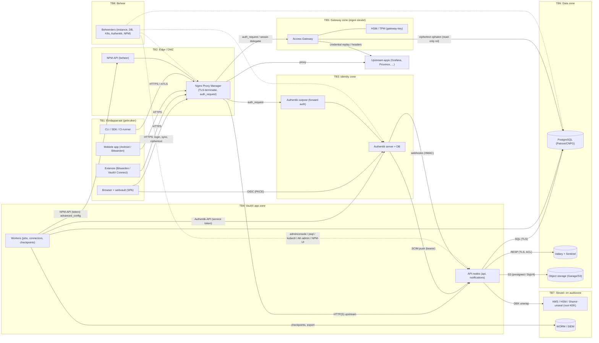

# VaultX — Fase 3: Threat model

Status: concept ter review · Datum: 2026-10-04 · Versie 0.1 · Bron van waarheid: `00-kernbeslissingen.md` (KB-xx)

Dit document beschrijft tegen wie VaultX zich verdedigt, wat er op het spel staat, welke garanties VaultX per geheimklasse kan geven, en welke beveiligingscontroles (SC-xxx) in welke release terechtkomen. Het is bewust kritisch: waar VaultX iets *niet* kan beschermen, staat dat er expliciet. Een threat model dat alleen mitigaties opsomt, is marketing.

---

## 1. Scope en methodologie

### 1.1 Scope

Binnen scope:

- De VaultX-server (Rust-binary, rollen `api`, `notifications`, `worker`, `gateway`; KB-24) in de profielen `single`, `ha-3` en `ha-5` (KB-20).
- Stateful componenten: PostgreSQL 17 met Patroni/etcd of CloudNativePG (KB-16/17), Valkey 8 met Sentinel (KB-18), S3-compatibele object storage (Garage/SeaweedFS/lokale FS, KB-05).
- Clients: Bitwarden-clients (MVP, KB-08), eigen React-webapp (v1.0, KB-07), VaultX Connect-extensie (v1.0), Android-app (v1.0, KB-14), CLI/SDK voor JIT-delivery (v1.0).
- Integraties: Authentik (OIDC, SCIM, API, webhooks; KB-29), Nginx Proxy Manager via het Proxy Connector-framework (KB-04), Access Gateway (KB-01/KB-03), Key Connector-modus (KB-02).
- Operationele processen: back-up/restore, upgrades, sleutelbeheer (KB-27), auditlog (KB-26), release- en buildketen.

Buiten scope (wel benoemd waar relevant):

- Beveiliging van de achterliggende applicaties zelf (Grafana, Proxmox, ...), behalve waar VaultX hun credentials of toegangsregels beheert.
- Fysieke beveiliging van het datacenter/homelab, behalve als input voor de aanname "wie fysieke toegang heeft tot een node, heeft die node".
- Volledig gecompromitteerde eindapparaten met kernel-/firmwaretoegang: daartegen bestaat geen softwarematige verdediging; we beschrijven alleen de schadebeperking.
- Juridische compliance (AVG/NIS2) als zodanig; die komt terug in de PRD en enterprise-compliancerapportage.

### 1.2 Methodologie

1. **Assets en geheimklassen** inventariseren (§2), gekoppeld aan KB-01.
2. **Actoren en aanvallers** met capaciteiten en motieven (§3).
3. **Dataflowdiagram met trust boundaries** (§4). Elke grensovergang is een plek waar authenticatie, autorisatie, integriteit en vertrouwelijkheid expliciet moeten worden geregeld.
4. **STRIDE per component** (§6): Spoofing, Tampering, Repudiation, Information disclosure, Denial of service, Elevation of privilege.
5. **Aanvalsbomen** voor de vijf verplichte scenario's (§7). Notatie: `OR` = één kind volstaat, `AND` = alle kinderen nodig. Bladeren krijgen een likelihood-inschatting.
6. **Risicoscore** = Likelihood (L, 1–5) × Impact (I, 1–5), vóór en na mitigatie (§1.3).
7. **Controles** (SC-xxx) geprioriteerd en gekoppeld aan release (MVP / v1.0 / Enterprise, deel E) (§17).

Waarom STRIDE + aanvalsbomen en niet bijvoorbeeld PASTA of LINDDUN: STRIDE is goed toepasbaar per component en goed overdraagbaar naar GitHub-issues; aanvalsbomen maken de *combinaties* zichtbaar die STRIDE per component mist (bijvoorbeeld "Authentik gecompromitteerd AND SCIM auto-confirm aan"). LINDDUN (privacy) is relevant voor de metadata-analyse en wordt in §8 en §12 informeel toegepast; een volledige LINDDUN-analyse is een vervolgstap.

### 1.3 Risicoscore

| Score | Likelihood (L) | Impact (I) |
|---|---|---|
| 1 | Zeer onwaarschijnlijk: vereist natiestaat-middelen of meerdere onafhankelijke 0-days | Verwaarloosbaar: geen geheimen, geen beschikbaarheidsverlies van betekenis |
| 2 | Onwaarschijnlijk: gerichte aanval met specifieke kennis van de omgeving | Beperkt: metadata of één niet-kritiek geheim |
| 3 | Mogelijk: bekende aanvalsklasse, bruikbaar voor een gemotiveerde aanvaller | Aanzienlijk: geheimen van één gebruiker of één collectie; dienst uren onbeschikbaar |
| 4 | Waarschijnlijk: komt in de praktijk regelmatig voor (phishing, malware, misconfiguratie) | Ernstig: geheimen van een organisatie, alle gedelegeerde secrets, of infra-secrets |
| 5 | Bijna zeker over de levensduur van een installatie | Catastrofaal: alle E2E-kluizen van alle gebruikers, of onherstelbaar dataverlies |

Risico = L × I. Banden: **1–5 laag**, **6–11 midden**, **12–19 hoog**, **20–25 kritiek**. Een score is een hulpmiddel voor prioritering, geen meting; de onderbouwing per scenario is belangrijker dan het getal.

Residueel risico wordt gescoord *met* de controles van de genoemde release. Waar een score afhangt van de release (bijvoorbeeld MVP zonder eigen clients versus v1.0 met eigen clients), staan beide.

### 1.4 Uitgangspunten en aannames

- **U1.** Cryptografische primitieven (AES-256-CBC + HMAC-SHA256, RSA-2048-OAEP, X25519, Ed25519, XChaCha20-Poly1305, Argon2id, PBKDF2-SHA256) zijn niet gebroken. RSA-2048 is wel een langetermijnrisico (post-quantum, "harvest now, decrypt later"), zie §8.5.
- **U2.** Het besturingssysteem van een *niet*-gecompromitteerd clientapparaat isoleert processen correct.
- **U3.** Een aanvaller die root heeft op een node, heeft alles wat die node in geheugen en op schijf heeft, inclusief wat een HSM op dat moment voor die node wil doen (de HSM wordt een orakel, niet een kluis).
- **U4.** Bitwarden-clients (MVP) zijn buiten onze controle: we kunnen hun gedrag tegenover een kwaadwillende server niet verbeteren (KB-08, KB-10).
- **U5.** Authentik is de identiteitsbron; wie Authentik beheerst, kan *identiteit* vervalsen. Of dat *sleutels* oplevert, is precies wat KB-02 bepaalt.
- **U6.** "Zero-knowledge" betekent bij VaultX: de server kan de *inhoud* van E2E-items niet lezen zolang hij geen kwaadaardige clientcode kan uitleveren en de master password-KDF sterk genoeg is. Metadata is niet zero-knowledge (§5.3).

---

## 2. Assets

| ID | Asset | Geheimklasse (KB-01) | Waar opgeslagen / aanwezig | Beschermd door | Primair belang |
|---|---|---|---|---|---|
| AS-01 | **Master password** | — (bron van E2E) | Alleen in hoofd gebruiker en kortstondig in clientgeheugen | Niets server-side; client-KDF | C |
| AS-02 | **Master key / stretched master key** | E2E | Clientgeheugen; afgeleid via KDF (PBKDF2 of Argon2id) | KDF-kosten | C |
| AS-03 | **Master password hash** (auth-hash, client → server) en server-side hash daarvan | E2E-afgeleid | In transit (TLS); in Postgres als server-side hash | TLS; server-side Argon2id + pepper (SC-012) | C (offline brute force) |
| AS-04 | **User key** (symmetrische sleutel, 512 bit) | E2E | Versleuteld met master key ("protected key") in Postgres; versleuteld met device key op vertrouwde apparaten; in clientgeheugen na unlock | Master key / device key; optioneel extra server-side wrap (SC-013) | C, I |
| AS-05 | **User private key** (RSA-2048) | E2E | Versleuteld met user key in Postgres | User key | C |
| AS-06 | **User public key** | Publiek, integriteit kritiek | Postgres; key transparency-log (Enterprise) | KT-log (KB-10) | **I** |
| AS-07 | **Organisatiesleutel** (org symmetric key) | E2E | Per lid versleuteld met diens RSA public key | Lid-private keys | C, I |
| AS-08 | **Org public/private key** (admin recovery, TDE-goedkeuring) | E2E | Private key versleuteld met org key | Org key | C, I |
| AS-09 | **Device keys** (TDE, KB-02) | E2E | TPM / Secure Enclave / Android Keystore / WebCrypto non-extractable | Hardware/OS | C |
| AS-10 | **Ciphertext-kluis** (items, mappen, collectienamen, bijlagen, Sends) | E2E | Postgres, object storage, back-ups, clientcaches | Clientsleutels | C, I, A |
| AS-11 | **Kluismetadata** (aantal items, revisiedatums, lidmaatschappen, collectiestructuur, bijlagegroottes, URI-iconen-verzoeken, IP's, device-namen) | Niet E2E | Postgres, logs, Valkey | Toegangscontrole server | C (privacy) |
| AS-12 | **Gedelegeerde secrets** | Gedelegeerd | Ciphertext naar gateway-public key in Postgres; plaintext alleen in gateway-geheugen per request | Gateway X25519-private key | C, I |
| AS-13 | **Gateway-private key** (X25519) | Gedelegeerd | HSM/TPM (ideaal) of versleuteld bestand op gateway-node | HSM/TPM, KEK | C |
| AS-14 | **Infra-secrets** (service accounts, dynamische secret-backends, SSH-CA-key, DB-root-credentials voor engines, OpenBao-tokens) | Infra | Postgres, envelope-versleuteld (KB-27) | Tenant-DEK ← root KEK | C, I |
| AS-15 | **Root KEK** | Infra | KMS/HSM/PKCS#11 of Shamir-unseal in geheugen (KB-27) | Unseal-procedure, HSM | C |
| AS-16 | **Tenant-DEK's** | Infra | Postgres, gewrapt door KEK; in geheugen app-/worker-node | KEK | C |
| AS-17 | **JWT-signing keys** (EdDSA, KB-25) | Server-auth | App-nodes (geheugen), opslag gewrapt door KEK | KEK, rotatie | I (token-vervalsing) |
| AS-18 | **Refresh tokens** | Server-auth | Postgres (gehasht), clients | Hashing, rotatie, binding aan device | C, I |
| AS-19 | **Auditlog** + checkpoint-signing key (Ed25519) | Integriteit | Postgres (append-only), WORM/SIEM; sleutel buiten DB (KB-26) | Hashketen, signatures, DB-rechten | **I**, A |
| AS-20 | **Authentik-tokens**: OIDC client secret van VaultX, Authentik API service-account-token, webhook-HMAC-secret, ID/access tokens van gebruikers | Infra | VaultX: envelope-versleuteld; Authentik: in Authentik-DB | KEK; Authentik-beveiliging | C, I |
| AS-21 | **SCIM-bearer-token** (Authentik → VaultX) | Infra | In Authentik (SCIM-provider), hash in VaultX | Authentik; hashing | I (vervalste lifecycle) |
| AS-22 | **NPM-API-token / NPM-serviceaccount-credentials** | Infra | VaultX, envelope-versleuteld | KEK | C, I — feitelijk config-root op de proxy (§7.2) |
| AS-23 | **TLS-private keys** (publieke en interne endpoints, mTLS tussen componenten) | Infra | NPM (`/etc/letsencrypt`, `/data`), K8s secrets, cert-manager | Bestandsrechten, K8s RBAC | C |
| AS-24 | **Release-signing-identiteit** (cosign/Sigstore, app-store-keys, extensie-store-accounts, Android-signing key) | Supply chain | CI (OIDC keyless), HSM/hardware-token voor Android/extensie | Branch protection, 2FA, hardware keys | I |
| AS-25 | **Back-ups** (DB-dumps, WAL-archieven, object storage-snapshots, KEK-recovery-shares) | Alle | Back-up-target (S3, offsite) | Versleuteling back-ups, gescheiden credentials | C, I, A |
| AS-26 | **Beschikbaarheid** van de kluis (inclusief offline toegang) | — | Cluster + clientcaches | HA, offline cache | A |

**Kernobservatie:** de assets met integriteit als primair belang (AS-06 public keys, AS-17 JWT-keys, AS-19 auditlog, AS-21 SCIM-token, AS-24 releasesleutels) zijn de hefbomen waarmee een aanvaller de *vertrouwelijkheid* van E2E-data alsnog aanvalt. In een E2E-systeem verschuift de aanval van "lees de database" naar "manipuleer wat de client vertrouwt".

---

## 3. Actoren en aanvallers

### 3.1 Legitieme actoren

| Actor | Rechten (indicatief) | Opmerking |
|---|---|---|
| Eindgebruiker | Eigen kluis, gedeelde collecties | Kan items delegeren naar gateway (opt-in) |
| Org-owner / org-admin | Leden, collecties, policies, admin recovery (indien ingeschakeld) | Heeft org key; kan bij admin recovery user keys ontsleutelen |
| Collection manager | Collecties binnen org | |
| VaultX-instance-admin | Instancebeheer via adminconsole: instellingen, connectors, gebruikers in-/uitschakelen | Heeft standaard *geen* toegang tot E2E-data |
| Security officer / auditor | Leesrechten auditlog, rapportage | Rol uit RBAC (v1.0) |
| DB-admin | PostgreSQL-superuser | Ziet ciphertext, metadata, gewrapte DEK's |
| K8s-/platformadmin | Cluster-admin, `kubectl exec`, secrets | Kan elke pod inspecteren |
| Authentik-admin | Volledig beheer IdP: flows, policies, groepen, impersonation | |
| NPM-admin | Proxy hosts, certificaten, advanced config | |
| Service account / CI-pipeline | JIT secrets (methode 8) | Machine-identiteit |
| VaultX-ontwikkelaars/maintainers | Commit-, merge- en releaserechten | Supply-chain-actor |

### 3.2 Aanvallersprofielen

| ID | Aanvaller | Capaciteiten | Typische doelen |
|---|---|---|---|
| AT-01 | Externe opportunist | Credential stuffing, scanning, publieke exploits | Accountovername, DoS |
| AT-02 | Gerichte externe aanvaller | Phishing, maatwerk-malware, exploitketens tegen proxy/IdP | Organisatiegeheimen, infra-toegang |
| AT-03 | Malware op eindapparaat | Code in gebruikerscontext, soms root/admin; browser-extensies | Master password, ontgrendelde kluis, autofill-data |
| AT-04 | Kwaadwillende/overgenomen browserextensie | DOM-toegang op alle sites (afhankelijk van permissies) | Webvault-DOM, autofill-velden |
| AT-05 | Netwerkaanvaller binnen LAN | ARP/DNS-spoofing, toegang tot interne VLAN's | Ongecodeerd intern verkeer, header-spoofing naar upstreams |
| AT-06 | Gecompromitteerde infrastructuurcomponent | Controle over NPM, Authentik, een node, Valkey, object storage | Zie scenario's 2–4 |
| AT-07 | Kwaadwillende beheerder (insider) | Legitieme rechten op een of meer lagen | Zie scenario 5 |
| AT-08 | Kwaadwillende/gecompromitteerde server-operator | Volledige controle over VaultX-server en -DB | Aanvallen op het cryptomodel (§8) |
| AT-09 | Supply-chain-aanvaller | Gecompromitteerde dependency, CI, maintaineraccount, registry | Backdoor in server, webassets of clients |
| AT-10 | Diefstal van apparaat/back-up | Offline toegang tot schijf of back-up | Offline brute force master password, ciphertext |

Een realistische homelab/MKB-installatie (de v1.0-doelgroep, deel D vraag 2) heeft vaak één persoon die instance-admin, DB-admin, K8s-admin, Authentik-admin én NPM-admin is. Scheiding van rollen (§7.5) is daar organisatorisch onhaalbaar; de technische garanties van E2E (§5) zijn dan de enige echte bescherming tegen die ene beheerder of tegen wie diens account overneemt.

---

## 4. Trust boundaries en dataflow

### 4.1 Dataflowdiagram



### 4.2 Trust boundaries

| TB | Grens | Wat over de grens gaat | Vereiste controle |
|---|---|---|---|
| TB1 ↔ TB2 | Apparaat ↔ edge | Auth-hash, tokens, ciphertext, webassets, autofill-context | TLS 1.3, HSTS; E2E zodat TLS-terminatie geen plaintext oplevert; integriteit webassets (§7.1) |
| TB2 ↔ TB4 | Proxy ↔ VaultX | Alles wat de client stuurt, in plaintext-HTTP of opnieuw TLS | Upstream-TLS of mTLS (SC-030); VaultX vertrouwt *geen* identiteitsheaders van de proxy voor kluistoegang (SC-031) |
| TB2 ↔ TB3 | Proxy ↔ Authentik outpost | Sessiecookies, `X-authentik-*`-headers | Outpost alleen intern bereikbaar; headers strippen van inkomende requests |
| TB2 ↔ TB5 | Proxy ↔ gateway | auth_request-subrequests, gedelegeerde sessies | mTLS, gateway accepteert alleen requests met geldige Authentik-sessie *én* VaultX-policy |
| TB3 ↔ TB4 | Authentik ↔ VaultX | ID-tokens, SCIM, webhooks, API-calls | OIDC met PKCE en `nonce`, SCIM-bearer met IP-allowlist, HMAC op webhooks, least-privilege API-token |
| TB4 ↔ TB2 (beheer) | VaultX-worker → NPM-API | Proxy-host-configuratie | Dry-run, diff, markers, allowlist van toegestane directives (SC-040) |
| TB4 ↔ TB6 | App ↔ data | SQL, cache, objecten | TLS, aparte DB-rollen per rol (api/worker/gateway/audit), Valkey-ACL's, S3-keys per bucket |
| TB5 ↔ TB6 | Gateway ↔ data | Alleen ciphertext gedelegeerde items | Eigen read-only DB-rol met RLS op gedelegeerde items |
| TB4 ↔ TB7 | App ↔ KEK | DEK-wrap/unwrap | KEK nooit exporteerbaar; rate-limit en audit op unwrap |
| TB8 ↔ alles | Beheerders | Bevoegdheden | MFA, four-eyes voor gevoelige acties, break-glass, audit (§7.5) |

### 4.3 Belangrijkste dataflows

| Flow | Beschrijving | Gevoelige elementen |
|---|---|---|
| DF-1 Login (master password) | Client: prelogin → KDF-params; KDF lokaal; auth-hash naar `/identity/connect/token`; ontvangt protected user key | KDF-params (integriteit!), auth-hash |
| DF-2 SSO-login | Client → Authentik (OIDC, PKCE) → VaultX valideert ID-token → TDE/master password/Key Connector levert sleutel | ID-token, device approval |
| DF-3 Sync | Volledige of incrementele ciphertext-sync | Ciphertext, metadata |
| DF-4 Delen / org-confirm | Admin-client versleutelt org key met public key van nieuw lid | **Public key-integriteit** |
| DF-5 Delegatie | Client versleutelt item opnieuw naar gateway-public key | Gateway-public key-integriteit |
| DF-6 Gateway-login | Request op `app.bedrijf.local` → NPM auth_request → gateway → policycheck → ontsleuteling → replay/header naar upstream | Plaintext credential in gateway en op upstream-pad |
| DF-7 SCIM-provisioning | Authentik pusht users/groups → VaultX past lidmaatschappen/rollen aan | Groep→rol-mapping |
| DF-8 Proxy Connector | Worker leest proxy hosts, schrijft `advanced_config` | NPM-API-token |
| DF-9 JIT-delivery | Service account haalt secret op (infra-klasse of E2E via machine-sleutel) | Service account-credentials |
| DF-10 Back-up | WAL/base backups, object storage-replicatie | Alles in versleutelde vorm |

---

## 5. Beveiligingsgaranties per geheimklasse

Deze sectie is de kern van het document. Ze beantwoordt per compromittering: blijft de *inhoud* van elke geheimklasse vertrouwelijk? "Ja" betekent: zonder een tweede, onafhankelijke compromittering. "Toekomst" betekent: wat de aanvaller *na* de compromittering kan zien zodra gebruikers verder werken.

### 5.1 Matrix

Legenda: **V** = vertrouwelijk blijft gewaarborgd · **D** = direct gecompromitteerd · **T** = niet direct, maar wel *toekomstige* plaintext (actieve aanval op gebruikers die na het incident inloggen/werken) · **B** = offline brute force mogelijk tegen zwakke master passwords · **M** = alleen metadata.

| Compromittering | E2E-kluis (master password-gebruiker) | E2E-kluis (TDE-gebruiker, v1.0) | E2E-kluis (Key Connector-org) | Gedelegeerde secrets | Infra-secrets | Integriteit audit |
|---|---|---|---|---|---|---|
| Lezen DB-dump/back-up zonder KEK | B (MVP) / V (met SC-013) · M | V · M | V (KC-store apart) · M | V | V | V (detecteerbaar) |
| Lezen DB-dump **met** KEK | B · M | V · M | D als KC-store in dezelfde DB | V | **D** | V (detecteerbaar) |
| Root op API-node (passief) | B · M | V · M | D | V | **D** (DEK's in geheugen) | aanvalbaar (nieuwe entries vervalsen) |
| Root op API-node (actief, webvault serveren) | **T** (webvault-gebruikers) | **T** (webvault-gebruikers) | D | **T** (nieuwe delegaties naar eigen key, alleen via webvault of key-injectie) | D | aanvalbaar |
| Root op gateway-node | V | V | V | **D** (alle) | V (tenzij gateway infra-DEK's heeft; mag niet) | V |
| Root op DB-node | B · M | V · M | D als KC-store daar | V | V (KEK staat niet op de DB-node; zie §7.4) | **aanvalbaar**: herschrijven + checkpoint-mismatch → detecteerbaar mits checkpoints extern |
| Valkey gecompromitteerd | V | V | V | V | V | V |
| Object storage gecompromitteerd | V (bijlagen) · M | V · M | V | V | V | n.v.t. |
| NPM gecompromitteerd | **T** (webvault via proxy, zie §7.2) | **T** (webvault) | **T/D** (SSO-tokens onderscheppen) | **T/D** (plaintext op pad naar upstream) | V | V |
| Authentik gecompromitteerd | V | V (zonder auto-approve, §7.3) | **D** | **D** voor policies die alleen op Authentik-sessie leunen | V | V |
| Kwaadwillende instance-admin (alleen adminconsole) | V | V | D als admin KC kan sturen | gedeeltelijk (policies wijzigen) | gedeeltelijk | V |
| Kwaadwillende org-admin | V voor persoonlijke kluis; **D** voor org-collecties; **D** voor leden met admin recovery | idem | idem | org-delegaties | — | V |
| Volledig kwaadwillende server-operator (§8) | **T** (via KDF-downgrade, key-injectie, webassets) | **T** | D | D | D | n.v.t. |
| Gecompromitteerd eindapparaat (malware, ontgrendeld) | **D** voor die gebruiker | **D** voor die gebruiker | **D** | V (gateway geeft geen plaintext aan clients) | V | V |
| Supply chain (backdoored client/release) | **D** (alle gebruikers van die client) | **D** | **D** | **D** | **D** | aanvalbaar |

### 5.2 Wat VaultX eerlijk belooft

1. **E2E-kluis:** inhoud blijft vertrouwelijk bij *passieve* compromittering van elke serverside component, zolang het master password sterk is (of TDE/passkey-PRF zonder master password wordt gebruikt). Bij *actieve* compromittering van de server of de proxy is de belofte zwakker: wie de webvault-code levert, kan het master password onderscheppen. Native clients en extensies (code uit een appstore, ondertekend) zijn daartegen beter beschermd dan de webvault.
2. **Gedelegeerde secrets:** vertrouwelijk tegenover API-nodes, DB, Valkey, object storage en de proxy *in rust*; **niet** tegenover de gateway zelf en **niet** tegenover wie het netwerkpad tussen gateway en upstream-app of de upstream-app zelf beheerst. Delegeren is een bewuste verlaging van het beschermingsniveau voor dat item.
3. **Infra-secrets:** beschermd in rust (back-ups, DB-dumps) door de KEK; **niet** tegenover een gecompromitteerde draaiende app- of worker-node, want die moet ze kunnen gebruiken.
4. **Integriteit van identiteit:** VaultX kan identiteit niet sterker maken dan Authentik. Tegen een gecompromitteerde Authentik beschermt alleen het feit dat identiteit geen sleutels oplevert (KB-02); in Key Connector-modus vervalt die bescherming volledig.
5. **Audit:** VaultX belooft *detectie* van manipulatie (KB-26), niet *preventie* door een DB-superuser. Detectie werkt alleen als checkpoints of WORM-export buiten het bereik van dezelfde beheerder liggen.

### 5.3 Wat niet beschermd is (metadata)

Ook in de E2E-klasse ziet de server: e-mailadres en naam, aantal items en hun type, revisiedatums (gebruikspatronen), mapstructuur (aantal, niet namen), lidmaatschap van organisaties en collecties, groottes van bijlagen, IP-adressen en device-types, tijdstippen van unlock/sync, en, indien de iconenservice aan staat, **de domeinen van opgeslagen logins** (de client vraagt `/icons/<domein>/icon.png`). De iconenservice is daarmee de grootste stille metadata-lek van het Bitwarden-model; zie SC-052.

---

## 6. STRIDE per component

Per component de belangrijkste dreigingen; verwijzingen naar controles (SC-xxx, §17). Niet elke cel is gevuld: een leeg aspect betekent "geen specifieke dreiging boven de algemene basis".

### 6.1 Clients (browser/webvault, extensie, mobiel, CLI)

| STRIDE | Dreiging | Controles |
|---|---|---|
| S | Phishingpagina imiteert webvault of SSO-flow; nep-extensie in store | SC-060 (passkeys), SC-061 (store-monitoring), SC-062 (URI-matching) |
| T | Gemanipuleerde webassets (server/proxy/CDN); gemanipuleerde KDF-params | SC-020..SC-024, SC-070 |
| R | Gebruiker ontkent export of delen | Audit van export/delen met device-ID (SC-080) |
| I | Malware leest geheugen/klembord; autofill in verkeerd frame; screenshots op mobiel | SC-063 (iframe-beleid), SC-064 (`FLAG_SECURE`), klembord-timeout |
| D | Corrupte sync breekt offline cache | Atomaire cache-updates, revisiecontrole |
| E | Kwaadwillende extensie verkrijgt DOM-toegang tot webvault | Webvault-isolatie (SC-022), advies: kluis via extensie/desktop |

### 6.2 Nginx Proxy Manager (edge)

| STRIDE | Dreiging | Controles |
|---|---|---|
| S | Proxy injecteert `X-authentik-*`/`Remote-User`-headers naar upstreams; VaultX vertrouwt headers | SC-031 (VaultX vertrouwt geen proxyheaders voor kluistoegang), header-stripping in gegenereerde config |
| T | Webassets herschrijven; `advanced_config` wijzigen buiten markers; auth_request uitschakelen | SC-021, SC-040..SC-043 (drift-detectie) |
| R | NPM heeft beperkte audit van config-wijzigingen (verifiëren: NPM houdt een audit-log bij in zijn eigen DB, maar die is door NPM-admin wijzigbaar) | Drift-detectie en snapshots door VaultX-worker (SC-042) |
| I | TLS-terminatie: alle verkeer in plaintext (auth-hashes, tokens, ciphertext, gateway-credentials op weg naar upstream) | E2E; upstream-TLS; SC-030 |
| D | Proxy-uitval = VaultX onbereikbaar voor clients die via proxy lopen | Offline cache clients; HA-proxy of tweede ingress |
| E | NPM-API-token van VaultX = willekeurige nginx-config = (vrijwel) code-executie op proxy | SC-041 (least privilege, kortlevend token), SC-040 (directive-allowlist) |

### 6.3 Authentik (server, outpost)

| STRIDE | Dreiging | Controles |
|---|---|---|
| S | Vervalst ID-token (gestolen signing key), impersonation-functie, gemanipuleerde flows | OIDC-validatie, `acr`/`amr`-checks, SC-050 (geen sleutels uit identiteit) |
| T | Vervalste SCIM-pushes (groepslidmaatschap, admin-rol) | SC-051 (SCIM kan geen sleutels distribueren; admin-rollen vereisen bevestiging) |
| R | Authentik-admin wist events | VaultX logt alle SCIM-wijzigingen zelf (KB-26) |
| I | Authentik-DB bevat VaultX OIDC-client-secret, SCIM-token, gebruikerssessies | Least privilege, rotatie (§18) |
| D | Authentik down → geen SSO-login | Lokale unlock op vertrouwde apparaten blijft werken (TDE), break-glass-accounts |
| E | Groepsescalatie naar VaultX-admin; valse device approval | SC-051, SC-053 |

### 6.4 VaultX API-nodes (api, notifications)

| STRIDE | Dreiging | Controles |
|---|---|---|
| S | JWT-vervalsing na diefstal signing key; refresh-token-diefstal | SC-014 (signing key gewrapt, rotatie), SC-015 (refresh rotation + reuse detection), device-binding |
| T | Ciphertext-substitutie (items verwisselen tussen gebruikers/velden), KDF-params wijzigen | Crypto v2 met AD (Enterprise), SC-070 |
| R | Acties zonder audit | Audit in dezelfde transactie als de mutatie (SC-080) |
| I | Logging van tokens/ciphertext; foutmeldingen met internals; user-enumeratie via prelogin | KB-23, SC-090 (log-scrubbing), SC-091 (uniforme prelogin) |
| D | Login-floods (server-side hashing is duur), grote sync-responses, websocket-uitputting | SC-100..SC-104 |
| E | IDOR in org/collectie-API's, Cedar-policyfouten, SSRF via iconenservice | SC-081 (RLS), SC-082 (policytests), SC-052 |

### 6.5 Access Gateway

| STRIDE | Dreiging | Controles |
|---|---|---|
| S | Aanvaller doet zich voor als NPM (directe requests naar gateway) | mTLS proxy→gateway, netwerkpolicy (SC-110) |
| T | Gemanipuleerde policy of item-mapping laat credential naar verkeerde upstream sturen | Upstream-binding in het versleutelde item zelf (domein in plaintext-payload, door client vastgelegd) (SC-111) |
| R | Gebruik zonder spoor | Elke ontsleuteling een auditentry met request-ID (SC-112) |
| I | Gateway-geheugen bevat plaintext; core dumps; swap | `zeroize`, `mlock`, geen core dumps, korte levensduur plaintext (SC-113) |
| D | Gateway-uitval blokkeert legacy-logins | Graceful fallback naar extensie-login (methode 5) |
| E | Gateway gebruikt als orakel ("ontsleutel dit voor mij") | Gateway levert nooit plaintext terug aan clients, alleen aan upstream; per-request policy; rate limits (SC-114) |

### 6.6 Workers

| STRIDE | Dreiging | Controles |
|---|---|---|
| S | Vervalste jobs in Postgres-queue | Jobs alleen door app-rol in te voegen; payload ondertekend waar jobs privilege uitoefenen (SC-120) |
| T | Connector schrijft kwaadaardige proxy-config | SC-040 |
| I | Worker heeft NPM-, Authentik- en engine-credentials | Credential-scheiding per worker-pool (SC-121) |
| E | Worker-compromittering = toegang tot alle connector-tokens | Aparte worker-deployment voor connectors (Enterprise: per-connector isolatie) |

### 6.7 PostgreSQL, Valkey, object storage

| Component | Belangrijkste dreigingen | Controles |
|---|---|---|
| PostgreSQL | Dump = ciphertext + metadata + offline brute force; superuser kan audit herschrijven; replicatieverkeer onversleuteld | SC-013, SC-081, SC-083 (aparte DB-rollen), TLS replicatie, externe checkpoints (SC-084) |
| Valkey | Rate limits omzeilen; pub/sub-injectie (valse "sync"-push); challenge-manipulatie | ACL's + TLS (SC-130), security-kritische challenges niet uitsluitend in Valkey (SC-131), pub/sub-payloads zonder geheimen en als hint behandeld |
| Object storage | Bijlagen verwijderen/vervangen; publieke bucket-misconfiguratie | Client-side versleuteling (inhoud V), integriteitscontrole via HMAC/AEAD, presigned URL's kortlevend, bucket-policy-check bij start (SC-132) |

---

## 7. Verplichte scenario's

Elk scenario: aanvalsboom, aanvalspaden, impact per geheimklasse, detectie, mitigaties (preventief / detectief / herstel), restrisico met score.

### 7.1 Scenario 1 — Gecompromitteerde browser

**Varianten:** (a) malware op het apparaat; (b) kwaadwillende of overgenomen browserextensie; (c) XSS in de webvault; (d) gecompromitteerde VaultX-webassets geserveerd door de server (of door iets op het pad, zoals de proxy).

#### Aanvalsboom

```text
DOEL: plaintext van kluis van gebruiker U
OR
├── 1. Malware op apparaat (AT-03)
│   OR
│   ├── 1.1 Keylogger vangt master password/PIN                         L4
│   ├── 1.2 Geheugen browser/extensie lezen na unlock                   L3 (vereist zelfde gebruiker of admin)
│   ├── 1.3 Infostealer kopieert browserprofiel incl. extensie-opslag   L4
│   │   AND
│   │   ├── versleutelde cache (protected key) meenemen
│   │   └── offline brute force master password (B) of PIN-unlock-key  L2-3
│   └── 1.4 Klembord uitlezen (gekopieerde wachtwoorden/TOTP)           L4
├── 2. Kwaadwillende extensie (AT-04)
│   OR
│   ├── 2.1 Content script op webvault-origin leest DOM (ontsleutelde items) L3
│   ├── 2.2 Content script op willekeurige site leest autofill-velden   L4
│   ├── 2.3 Overlay/clickjacking op UI van wachtwoordmanager-extensie   L3
│   └── 2.4 Legitieme extensie wordt overgenomen (update via gekaapt dev-account) L3
├── 3. XSS in webvault
│   AND
│   ├── XSS-kwetsbaarheid (bijv. ongesanitiseerde itemnaam, markdown, SVG-bijlage) L2
│   └── CSP-bypass of CSP ontbreekt                                     L2 (met strikte CSP)
└── 4. Gecompromitteerde webassets (server of pad)
    OR
    ├── 4.1 API-node/statische bestanden vervangen (AT-06/AT-08)        L2
    ├── 4.2 Proxy herschrijft responses (scenario 2)                    L2
    └── 4.3 Supply chain: kwaadaardige npm-dependency in build (§9)     L2
```

#### Aanvalspaden toegelicht

- **1 (malware).** Tegen malware met dezelfde rechten als de gebruiker bestaat geen sterke verdediging; een wachtwoordmanager kan hooguit het venster verkleinen. Hardware-gebonden unlock (TDE device key in TPM, passkey-PRF) helpt tegen *offline* diefstal van het profiel (1.3), niet tegen malware die wacht tot de gebruiker ontgrendelt (1.2).
- **2 (extensie).** Een extensie met `<all_urls>`-host-permissie kan de DOM van de webvault lezen; daar staan ontsleutelde items. De webvault is dus zo sterk als de zwakste extensie van de gebruiker. De Bitwarden- of VaultX Connect-extensie zelf is beter geïsoleerd: haar popup en service worker draaien op een `chrome-extension://`-origin waar andere extensies geen content scripts kunnen injecteren. Clickjacking van extension-UI's die in de pagina worden geïnjecteerd (inline autofill-menu's) is in 2025 publiek gedemonstreerd tegen meerdere wachtwoordmanagers (verifiëren: onderzoek "DOM-based extension clickjacking", DEF CON 33).
- **3 (XSS).** De webvault rendert ontsleutelde, door andere gebruikers (gedeelde collecties) of door de server (metadata, foutmeldingen) aangeleverde strings. Een gedeeld item met kwaadaardige naam is een realistische vector bij gedeelde collecties: een kwaadwillend org-lid kan zo andere leden aanvallen.
- **4 (webassets).** Dit is de fundamentele zwakte van elke webgebaseerde E2E-kluis: **de server levert de code die de sleutels beheert**. SRI helpt niet tegen een server die ook de HTML levert. Een aangepaste `index.html` of JS-bundel die het master password na invoer naar de aanvaller stuurt, is triviaal en voor de gebruiker onzichtbaar. KB-07 (SPA geserveerd door de Rust-backend) betekent dat compromittering van één API-node volstaat.

#### Impact per geheimklasse

| Klasse | Impact | Toelichting |
|---|---|---|
| E2E (eigen kluis van U) | **D** | Alles wat U kan ontsleutelen, inclusief org-collecties waar U lid van is |
| E2E (anderen) | V, behalve wat met U gedeeld is | Bij variant 4: **T voor alle webvault-gebruikers** |
| Org key | **D** als U lid is | In het Bitwarden-model heeft elk lid de volledige org key; toegang per collectie wordt alleen server-side afgedwongen. Org key van U + ciphertext uit een DB-lek = **alle** collecties van die org, ook die U niet mocht zien. Dit is een structurele beperking van het model. |
| Gedelegeerd | V | De browser krijgt nooit gedelegeerde plaintext van de gateway; wel kan U nieuwe delegaties doen (of de aanvaller namens U) |
| Infra | V, tenzij U een service account-token in de kluis heeft staan | |
| Auditlog | V | Acties van de aanvaller verschijnen als acties van U |

#### Detectie

- Nieuwe device-registratie, unlock vanaf ongebruikelijke IP/ASN/tijd, massale export of volledige sync na lange inactiviteit (SC-085, anomaliedetectie v1.0).
- Webvault-integriteit: VaultX Connect controleert de hash van de geserveerde webassets tegen een ondertekend release-manifest (SC-022) en waarschuwt bij afwijking.
- CSP-violation-reports naar een VaultX-endpoint (`report-to`), opgenomen in de audit/metrics (SC-021).
- Server-side detectie van malware op het apparaat is in essentie onmogelijk; dit is een expliciete restbeperking.

#### Mitigaties

| Type | Maatregel | SC | Release |
|---|---|---|---|
| Preventief | Strikte CSP (`default-src 'self'; script-src 'self' 'wasm-unsafe-eval'; object-src 'none'; frame-ancestors 'none'; base-uri 'none'`), Trusted Types, geen inline scripts, geen third-party | SC-020 | MVP (voor adminconsole en geserveerde webvault) |
| Preventief | Sanitizing/escaping van alle ontsleutelde strings; geen `dangerouslySetInnerHTML`; bijlagen nooit inline renderen (`Content-Disposition: attachment`, `X-Content-Type-Options: nosniff`, aparte origin voor previews) | SC-023 | MVP/v1.0 |
| Preventief | Webassets alleen uit ondertekende releases; server weigert te starten als de checksum van de meegeleverde assets niet overeenkomt met het ondertekende manifest (beschermt tegen *bestands*manipulatie, niet tegen een volledig gecompromitteerd proces) | SC-021 | MVP |
| Preventief | Asset-verificatie door VaultX Connect (vergelijkbaar met Meta Code Verify-aanpak) en aanbeveling om de kluis primair via extensie/desktop/mobiel te gebruiken | SC-022 | v1.0 |
| Preventief | Auto-lock (standaard 15 min inactiviteit, bij systeemvergrendeling), klembord wissen na 30 s, geen ontsleutelde data in `localStorage` | SC-024 | v1.0 (eigen clients); MVP via Bitwarden-instellingen/policies |
| Preventief | Hardware-gebonden unlock (TDE, passkey-PRF): profiel-diefstal levert geen bruikbare sleutel zonder TPM | SC-025 | v1.0 |
| Preventief | Org-policy "vault timeout maximaal X" en "verbied webvault-unlock voor rol Y" | SC-026 | v1.0 |
| Detectief | Device- en sessie-anomalieën, CSP-reports, asset-hash-mismatch | SC-085, SC-021, SC-022 | MVP (basis) / v1.0 |
| Herstel | Sessies en devices intrekken; master password wijzigen **en user key roteren** (alleen wijzigen van het master password roteert de user key niet; ciphertext blijft met de oude user key leesbaar voor wie die heeft); org key roteren als U lid was van gevoelige orgs; gedeelde credentials roteren | SC-140, SC-141 | MVP (sessies) / v1.0 (key rotation tooling) |

#### Restrisico

| Variant | Vóór | Na (MVP) | Na (v1.0) |
|---|---|---|---|
| 1 Malware | L4 × I3 = 12 | 12 | 9 (L3 door hardware-unlock, alleen tegen offline diefstal) |
| 2 Extensie | L3 × I3 = 9 | 9 | 6 (kluis buiten DOM bij extensie-gebruik) |
| 3 XSS | L3 × I4 = 12 | 6 | 4 |
| 4 Webassets | L2 × I5 = 10 | 10 | 5 (asset-verificatie; webvault optioneel uitschakelbaar per org) |

**Restbeperking:** een gebruiker op een gecompromitteerd apparaat verliest zijn kluis. Dat geldt voor elke wachtwoordmanager en moet in de gebruikersdocumentatie eerlijk staan.

### 7.2 Scenario 2 — Gecompromitteerde reverse proxy (NPM)

NPM termineert TLS en ziet daardoor al het verkeer in plaintext-HTTP. Daarnaast heeft VaultX (vanaf v1.0) een NPM-API-token waarmee het `advanced_config` schrijft (KB-04).

#### Aanvalsboom

```text
DOEL: geheimen van VaultX-gebruikers of achterliggende apps
OR
├── A. Passief meelezen (proxy ziet verkeer)
│   OR
│   ├── A1 Auth-hash van master password onderscheppen                   L4 (bij compromise)
│   │      → login als gebruiker (zonder 2FA) + offline brute force van master password (B)
│   ├── A2 Access/refresh tokens onderscheppen → sessie-overname → ciphertext   L4
│   ├── A3 Ciphertext + protected keys → offline brute force (B)        L4
│   ├── A4 Gedelegeerde plaintext op weg van gateway naar upstream (methode 6/7) L5 als upstream achter dezelfde proxy
│   └── A5 Authentik-sessiecookies en OIDC-codes onderscheppen           L4
├── B. Actief manipuleren
│   OR
│   ├── B1 Webvault-JS vervangen → master password / user key exfiltreren  L4  (= scenario 1.4)
│   ├── B2 Prelogin-response wijzigen: zwakke KDF opdringen (§8.1)       L3
│   ├── B3 Public keys in responses vervangen (sleutelinjectie, §8.2)    L2
│   ├── B4 auth_request uitschakelen of headers vervalsen naar upstreams L4
│   └── B5 Phishing-proxy-host op lookalike-domein met geldig cert       L3
└── C. Misbruik VaultX → NPM-relatie
    OR
    ├── C1 NPM-gecompromitteerd: VaultX-config overschrijven/negeren    L4
    └── C2 VaultX-worker gecompromitteerd: NPM-API-token misbruiken      L3
           → willekeurige nginx-config op alle proxy hosts
           → TLS-keys lezen/serveren, verkeer omleiden, (verifiëren) Lua-code via OpenResty
```

#### Wat betekent dit voor E2E?

- **Passief:** E2E houdt stand voor de *inhoud*: de proxy ziet alleen ciphertext. Maar de proxy ziet wel de **auth-hash** (afgeleid van het master password). Daarmee kan hij (1) inloggen als de gebruiker, tenzij 2FA of device-verificatie dat blokkeert, en (2) een offline brute-force-aanval op het master password doen met dezelfde kosten als tegen een DB-dump. Hij ziet ook de protected user key en alle ciphertext in de sync. Conclusie: **een passieve proxy is equivalent aan een DB-lek voor alle gebruikers die via die proxy inloggen, plus sessie-overname.**
- **Actief:** de proxy kan de webvault vervangen; dan is E2E voor webvault-gebruikers gebroken (T). Native clients en extensies laden hun code niet via de proxy en zijn alleen kwetsbaar voor de protocolaanvallen uit §8 (KDF-downgrade, sleutelinjectie), die eigen VaultX-clients (v1.0) grotendeels afvangen en Bitwarden-clients niet.
- **Aanbeveling:** VaultX zelf *niet* achter de NPM-instantie plaatsen die ook als SSO-gatekeeper voor alle interne apps dient, of in elk geval TLS-passthrough (L4/stream) naar VaultX gebruiken zodat VaultX zijn eigen TLS termineert (SC-032). NPM ondersteunt "Streams" (TCP-forwarding) waarmee passthrough mogelijk is (verifiëren: SNI-gebaseerde routering op één poort is in NPM niet standaard; mogelijk is een aparte poort of IP nodig).

#### Wat betekent dit voor gegenereerde configs?

- VaultX genereert `auth_request`-blokken; een gecompromitteerde NPM kan die negeren. VaultX kan dat niet voorkomen, alleen **detecteren**: de worker leest periodiek `advanced_config` en vergelijkt het gegenereerde blok (tussen markers) met de verwachte hash (SC-042). Een slimme aanvaller laat de config intact en manipuleert nginx buiten NPM's database om; daarom aanvullend **externe probes**: synthetische requests zonder sessie naar elke beschermde host moeten een redirect naar Authentik opleveren (SC-043).
- Gegenereerde configs moeten **headers strippen** die upstreams vertrouwen (`proxy_set_header X-authentik-username "";` vóór het zetten vanuit `auth_request_set`), zodat een client die headers niet kan injecteren bij een *niet*-gecompromitteerde proxy. Tegen een gecompromitteerde proxy helpt dit niet: header-auth naar upstreams is per definitie zo sterk als de proxy (KB-03 ladder: native OIDC > header-auth).

#### Wat betekent dit voor auth_request?

- `auth_request` is een *policy enforcement point in de proxy*. Bij compromittering van de proxy vervalt alle bescherming van upstreams die uitsluitend op forward auth leunen. Upstreams met native OIDC (ladder-trede 1) blijven beschermd, omdat ze het token zelf valideren.
- Voor de **Access Gateway** (methode 6/7) is dit ernstiger: de gateway stuurt plaintext credentials of sessiecookies naar de upstream, meestal via dezelfde proxy of in elk geval binnen het netwerk. Een gecompromitteerde proxy op dat pad ziet alle gedelegeerde credentials die in die periode gebruikt worden (A4). **Gateway-naar-upstream-verkeer mag niet via NPM lopen** (SC-115): de gateway verbindt direct met de upstream (bij voorkeur TLS met pinning naar het upstream-cert).

#### Wat betekent dit voor de NPM-API-token van VaultX?

- NPM kent rollen (admin/user) met per-onderdeel rechten (hidden/view/manage) en zichtbaarheid "all items"/"own items" (verifiëren voor de actuele NPM-versie). Een niet-admin-gebruiker met `proxy_hosts: manage` kan `advanced_config` schrijven. **`advanced_config` accepteert willekeurige nginx-directives** binnen het `server`-blok: `location`-blokken met `alias` naar het bestandssysteem van de NPM-container (TLS-keys, NPM-database, `/data/keys.json` met NPM's eigen JWT-sleutels; verifiëren), `proxy_pass` naar interne diensten, en, omdat NPM op OpenResty draait, mogelijk Lua (verifiëren). **De NPM-API-token is daarom feitelijk root op de proxy.**
- Gevolg: compromittering van de VaultX-worker (of van de plek waar die token staat) = compromittering van de proxy = scenario 2 voor *alle* apps achter die NPM. Dit maakt VaultX een nieuw aanvalspad naar de edge.
- Maatregelen: aparte NPM-gebruiker met alleen `proxy_hosts: manage` en zichtbaarheid beperkt tot door VaultX beheerde hosts waar NPM dat toestaat (SC-041); token kortlevend (NPM-tokens hebben een expiry; VaultX vraagt per run een nieuw token aan met het serviceaccount-wachtwoord, dat envelope-versleuteld is); **default read-only modus** (detectie, geen schrijven) en schrijven alleen na expliciete goedkeuring per wijziging met diff (four-eyes optioneel) (SC-040); **directive-allowlist** voor wat VaultX zelf genereert, zodat een gecompromitteerde VaultX-template-store niet ongemerkt `alias` of `*_by_lua` kan uitrollen; connector-worker in een aparte deployment met eigen credentials (SC-121).

#### Impact per geheimklasse

| Klasse | Impact |
|---|---|
| E2E master password-gebruikers | B (auth-hash + protected key) + sessie-overname; **T** via webvault |
| E2E TDE/passkey-gebruikers | Sessie-overname (ciphertext), geen auth-hash; **T** via webvault |
| Key Connector-orgs | **D**: de Key Connector-respons (sleutelmateriaal) gaat over het pad dat de proxy ziet, tenzij Key Connector via een aparte route/mTLS loopt (SC-054) |
| Gedelegeerd | **D** voor elk gedelegeerd credential dat via de proxy naar een upstream gaat; V in rust |
| Infra | V voor opgeslagen secrets; **D** voor JIT-secrets die clients via de proxy ophalen (de response bevat plaintext voor de client) |
| Upstream-apps | Volledige toegang tot apps die alleen forward-auth gebruiken |

#### Detectie

Drift-detectie op gegenereerde config (SC-042); synthetische probes (SC-043); certificaat-transparantie-monitoring voor publieke domeinen; vergelijking van client-gerapporteerde asset-hashes (VaultX Connect) met manifest (SC-022); onverwachte NPM-API-aanroepen in VaultX-audit (alleen eigen aanroepen zijn zichtbaar); unlock vanaf IP's die alleen de proxy kan hebben (bij sessie-replay vanaf de proxy zelf).

#### Mitigaties

| Type | Maatregel | SC | Release |
|---|---|---|---|
| Preventief | TLS-passthrough of aparte ingress voor VaultX; upstream-TLS/mTLS proxy→VaultX | SC-030, SC-032 | MVP (documentatie + Compose-voorbeeld) |
| Preventief | VaultX vertrouwt geen identiteitsheaders van de proxy voor kluistoegang | SC-031 | MVP |
| Preventief | 2FA/new-device-verificatie zodat een onderschepte auth-hash alleen niet volstaat | SC-016 | MVP |
| Preventief | Gateway → upstream niet via NPM; TLS met pinning | SC-115 | v1.0 |
| Preventief | NPM-connector least privilege, read-only default, directive-allowlist, diff + goedkeuring | SC-040, SC-041 | v1.0 |
| Preventief | Eigen clients met KDF-minima en public-key-pinning | SC-070, SC-071 | v1.0 / Enterprise |
| Detectief | Config-drift, probes, asset-verificatie | SC-042, SC-043, SC-022 | v1.0 |
| Herstel | Runbook R-2 (§18.4) | | |

#### Restrisico

Vóór: L3 × I5 = 15 (hoog). Na MVP (passthrough gedocumenteerd, 2FA): L2 × I4 = 8. Na v1.0: L2 × I3 = 6, *mits* de beheerder passthrough gebruikt. Bij TLS-terminatie op een gedeelde NPM blijft het risico 12 (L3 × I4), omdat de webvault en de auth-hash zichtbaar blijven.

### 7.3 Scenario 3 — Gecompromitteerde Authentik-instantie

Authentik beslist *wie* iemand is (KB-29). Een aanvaller met controle over Authentik (admin-account, RCE, gestolen OIDC-signing key, DB-toegang) kan voor elke gebruiker een geldig ID-token uitgeven, flows en expression policies (Python) wijzigen, de impersonation-functie gebruiken, groepen wijzigen en via de SCIM-provider pushes naar VaultX laten uitgaan. De vraag is wat dat in VaultX oplevert.

#### Aanvalsboom

```text
DOEL: geheimen in VaultX via controle over Authentik
OR
├── 1. Inloggen als slachtoffer via SSO (vervalst ID-token / impersonation)   L5 bij compromise
│   OR
│   ├── 1a Org in Key Connector-modus → sleutel wordt automatisch vrijgegeven      → D
│   ├── 1b Master password-unlock (MVP)
│   │   AND
│   │   ├── sessie levert ciphertext + protected user key
│   │   └── offline brute force master password                                     → B
│   ├── 1c TDE (v1.0), nieuw device
│   │   OR
│   │   ├── slachtoffer keurt nep-device goed op vertrouwd apparaat (social eng.)   L3
│   │   ├── org-admin keurt goed (admin approval; social engineering)              L2-3
│   │   ├── auto-approval op basis van Authentik-claims (indien aanwezig)          → D (daarom verboden, SC-053)
│   │   └── master password-fallback → zie 1b
│   └── 1d Toegang via Access Gateway: policy vereist alleen Authentik-sessie
│          → gateway logt namens aanvaller in op legacy-apps                         → D (toegang)
├── 2. Vervalste SCIM-pushes
│   OR
│   ├── 2a Aanvallersaccount toevoegen aan groep die op org-admin/owner mapt        L4
│   │      AND org key nodig → vereist bevestiging door bestaand lid met org key (SC-051)
│   ├── 2b Aanvallersaccount toevoegen aan collectie-groepen                        L4
│   │      AND org key nodig → idem
│   ├── 2c Massale deprovisioning (DoS / data-verlies)                             L3
│   └── 2d E-mail van slachtoffer wijzigen → account-recovery-flows kapen           L3
├── 3. Groepsescalatie naar VaultX-instance-admin (via OIDC-claim of SCIM-groep)   L4
│      → instellingen wijzigen: KC aanzetten, 2FA-policy uit, connectors, iconen-SSRF
├── 4. Valse step-up: `acr`/`amr`-claims vervalsen → MFA-policies omzeilen          L5 bij compromise
└── 5. Webhooks vervalsen (logout/disable) → DoS; of webhooks onderdrukken → intrekking blijft uit  L3
```

#### Met en zonder Key Connector-modus

| Aspect | Zonder Key Connector (master password of TDE) | Met Key Connector (KB-02, opt-in v1.0) |
|---|---|---|
| Wat levert een vervalste SSO-login op? | Sessie + ciphertext + (MP-gebruikers) protected key → offline brute force; (TDE) niets bruikbaars zonder device approval | **Volledige user key** van elk lid van de KC-org → alle persoonlijke en org-items: **D** |
| Schaal | Per gebruiker, brute force kost tijd per account | Alle gebruikers in de KC-org, direct en onopgemerkt |
| Detectie | Nieuwe device-registraties, approval-verzoeken | Alleen login-anomalieën; de aanval lijkt een normale login |
| Herstel | Sessies intrekken, eventueel master passwords wijzigen | **Alle user keys en de org key roteren; alle opgeslagen credentials in de echte wereld roteren** |
| Eerlijke conclusie | Authentik-compromittering is ernstig maar niet fataal voor E2E | Authentik-compromittering is **fataal** voor de KC-org. In KC-modus is de beveiliging van de kluis gelijk aan de beveiliging van Authentik *plus* die van de Key Connector-opslag |

De adminconsole moet deze conclusie letterlijk tonen bij het inschakelen van KC, met four-eyes-bevestiging (SC-055).

#### Vervalste SCIM-pushes en groepsescalatie

De Bitwarden-sleutelarchitectuur biedt hier een natuurlijke verdediging die VaultX moet *behouden*: lidmaatschap in de database geeft nog geen org key. De org key wordt pas gedeeld als een bestaand lid met de org key het nieuwe lid **bevestigt** (org key versleuteld met diens public key). Daarom:

- SCIM mag lidmaatschappen aanmaken in status *accepted* (wachtend op bevestiging), nooit zelf sleutels distribueren (SC-051).
- **Automatische bevestiging** (een client van een admin die SCIM-leden automatisch bevestigt) is een gemak dat de verdediging opheft. Als VaultX dit aanbiedt (v1.0), dan alleen voor niet-geprivilegieerde rollen, met vertraging (bijvoorbeeld 1 uur) en melding aan owners, en nooit voor owner/admin/"manage recovery"-rollen.
- Geprivilegieerde mappings (Authentik-groep → owner, admin, instance-admin, recovery-manager) vereisen een tweede goedkeuring in VaultX (four-eyes, SC-056). SCIM-wijzigingen die geprivilegieerde rollen raken, worden in quarantaine gezet tot goedkeuring.
- **Instance-admin nooit via OIDC-claim/SCIM-groep** zonder lokale tweede factor in VaultX (WebAuthn bij VaultX zelf) (SC-057).
- SCIM DELETE/deactivate: **revoke**, nooit hard delete; data blijft 30 dagen herstelbaar. Massawijzigingen boven een drempel (bijvoorbeeld >10 % van de leden binnen 10 minuten) pauzeren de SCIM-verwerking en alarmeren (SC-058).
- E-mailwijzigingen via SCIM wijzigen niet het login-identifier waarop de KDF-salt is gebaseerd (in Bitwarden is de salt het e-mailadres; wijziging vereist een herversleuteling van de master key door de client). VaultX koppelt SSO-identiteit op `sub` + issuer, niet op e-mail (SC-059).

#### Valse device approval

TDE-goedkeuring van een nieuw apparaat gebeurt door (a) een vertrouwd apparaat van dezelfde gebruiker, (b) een admin met de org private key, of (c) master password. Authentik kan geen van drieën leveren. Risico's:

- **Approval fatigue / social engineering:** de aanvaller logt in als slachtoffer, triggert een goedkeuringsverzoek, en belt het slachtoffer ("IT hier, keur even goed"). Maatregel: verzoek toont device-naam, IP, locatie, en een **verificatiecode/fingerprint-phrase** die op beide apparaten moet overeenkomen (zoals Bitwarden's "login with device" fingerprint phrase); verzoeken verlopen na 15 minuten; maximaal N openstaande verzoeken (SC-053).
- **Admin approval:** een admin die goedkeurt, ziet hetzelfde. Admin approval vereist de admin-client (met org key) en wordt gelogd; optioneel four-eyes voor approvals buiten kantooruren of van nieuwe ASN's.
- **Geen auto-approval** op basis van Authentik-claims (bijvoorbeeld "device is managed", "user in groep X"). Device-trust uit Authentik is alleen een *voorwaarde* voor approval, nooit een vervanging.

#### Impact per geheimklasse

| Klasse | Zonder KC | Met KC |
|---|---|---|
| E2E master password | B (per gebruiker) | n.v.t. |
| E2E TDE | V (mits geen auto-approval, gebruiker trapt niet in social engineering) | n.v.t. |
| E2E KC-org | n.v.t. | **D** |
| Gedelegeerd | **Toegang** tot elke legacy-app waarvoor gateway-policy alleen op Authentik-sessie leunt; plaintext blijft in principe binnen gateway | idem |
| Infra | V, tenzij service accounts via Authentik-OIDC (machine-to-machine) worden uitgegeven: dan **D** voor die scopes | idem |
| Upstream-apps met native SSO | **D** (buiten VaultX' controle) | **D** |
| Beschikbaarheid | Massale deprovisioning (mitigeerbaar met SC-058) | idem |

#### Detectie

- VaultX logt elke SSO-login met `amr`, `acr`, `auth_time`, client-IP, device; anomalie: login zonder MFA-`amr` voor gebruikers die normaal MFA doen (SC-086).
- Elke SCIM-operatie in de auditlog, met dagelijkse reconciliatie: VaultX vraagt via de Authentik-API (read-only) het auditlog/event-log op en vergelijkt groepswijzigingen met wat via SCIM binnenkwam (SC-087). Een aanvaller die ook de Authentik-events wist, wordt hier niet gedetecteerd; wel als events naar een externe SIEM gaan.
- Alarm op: wijzigingen aan geprivilegieerde mappings, massale SCIM-wijzigingen, nieuwe instance-admins, inschakelen van KC, wijzigingen aan de OIDC-configuratie (issuer, JWKS).
- JWKS-pinning: VaultX registreert de huidige signing-key-fingerprint van Authentik; een nieuwe key leidt tot een alarm en (configureerbaar) tot het weigeren van tokens tot een admin bevestigt (SC-088).

#### Mitigaties

| Type | Maatregel | SC | Release |
|---|---|---|---|
| Preventief | Authentik levert nooit sleutels (KB-02); KC alleen opt-in met four-eyes en waarschuwing | SC-050, SC-055 | MVP (geen KC) / v1.0 |
| Preventief | SCIM zonder sleuteldistributie; quarantaine voor geprivilegieerde rollen; revoke i.p.v. delete; massawijzigingsrem | SC-051, SC-056, SC-058 | MVP (SC-051, SC-058) / v1.0 (SC-056) |
| Preventief | Instance-admin vereist lokale WebAuthn in VaultX | SC-057 | MVP |
| Preventief | Device-approval met fingerprint phrase, vervaltijd, geen auto-approval | SC-053 | v1.0 |
| Preventief | Gateway-policies vereisen naast Authentik-sessie ook een VaultX-device-gebonden factor voor gevoelige apps (bijvoorbeeld VaultX Connect bevestigt) | SC-116 | v1.0 |
| Preventief | Break-glass: lokale VaultX-owner met master password + hardware key, onafhankelijk van Authentik | SC-150 | MVP |
| Detectief | SSO-anomalieën, SCIM-reconciliatie, JWKS-pinning | SC-086..SC-088 | v1.0 (MVP: logging, geen reconciliatie) |
| Herstel | Runbook R-3 (§18.4) | | |

#### Restrisico

| Configuratie | Vóór | Na |
|---|---|---|
| MVP, SSO + master password | L3 × I4 = 12 | L3 × I3 = 9 (brute force alleen bij zwakke wachtwoorden; KDF-minimum) |
| v1.0, TDE | L3 × I4 = 12 | L2 × I3 = 6 |
| v1.0, Key Connector | L3 × I5 = 15 | **15 (blijft hoog; inherent aan de modus)** |

### 7.4 Scenario 4 — Gecompromitteerde cluster node

Uitgangspunt U3: root op een node = alles wat die node in geheugen en op schijf heeft, en alles wat die node met zijn credentials mag.

#### Per nodetype

| Node | Wat de aanvaller krijgt | E2E | Gedelegeerd | Infra | Overig |
|---|---|---|---|---|---|
| **App-node (api/notifications)** | Geheugen met DEK's (KB-27), JWT-signing key (KB-25), DB-credentials (app-rol), Valkey-credentials, S3-credentials, gewrapte KEK-toegang (als KEK via Shamir in geheugen staat: **de KEK zelf**) | Passief: B + M. Actief: **T** (webvault serveren, KDF-downgrade, key-injectie richting Bitwarden-clients) | V (API-node heeft gateway-key niet); actief: nieuwe delegaties kunnen naar een vervalste gateway-public key gaan (key-injectie) → T | **D** | Tokens vervalsen voor elke gebruiker tot signing key geroteerd is; auditentries vervalsen (maar niet ondertekende checkpoints herschrijven als die sleutel elders staat) |
| **Worker-node** | Als app-node + connector-credentials (NPM-API, Authentik-API, engine-credentials), checkpoint-signing key (als die daar staat) | B + M | V | **D** | Proxy-compromittering via NPM-token (scenario 2); auditcheckpoints vervalsen als signing key lokaal is |
| **Gateway-node** | Gateway-private key (of HSM-orakel), read-only DB-rol voor gedelegeerde items, netwerkpad naar upstreams | V | **D**: alle gedelegeerde secrets (ophalen + ontsleutelen). Met HSM: zolang de aanvaller aanwezig is, *ook* alles (HSM ontsleutelt op verzoek); na verwijdering stopt het | V | Upstream-sessies kapen |
| **DB-node (primary of replica)** | Volledige data: ciphertext, metadata, gewrapte DEK's, auditlog, refresh-token-hashes; superuser | B + M; **actief (primary)**: KDF-params en public keys wijzigen → T (§8) | V | V (geen KEK) | Audit herschrijven (detecteerbaar via externe checkpoints); refresh-tokens zijn gehasht |
| **etcd/Patroni-DCS-node** | Controle over leader-election | — | — | — | Failover forceren, split-brain proberen (Patroni beschermt met leader-lock en `synchronous_mode`); beschikbaarheid |
| **Valkey** | Rate-limit-tellers, kortlevende challenges, pub/sub, cache | V | V | V | Rate limits omzeilen (credential stuffing, §10); valse push-notificaties (alleen "sync nu"-hints); challenge-manipulatie als challenges alleen in Valkey staan (SC-131); cache-poisoning als de cache autorisatiebeslissingen bevat (verboden, SC-133) |
| **Object storage** | Versleutelde bijlagen en Send-bestanden, mogelijk back-ups (als in zelfde storage!) | V (inhoud), M (groottes, aantallen) | V | V | Bijlagen verwijderen/vervangen (detecteerbaar via AEAD/HMAC); als back-ups hier staan: zie §14 |
| **K8s worker-node** | Alle pods op die node: hun geheugen, gemounte secrets, service-account-tokens; kubelet-credentials (met NodeRestriction alleen secrets van pods op die node) | Afhankelijk van welke pods er draaien | **D** als gateway-pod op die node draait | **D** als app/worker op die node draait | Lateral movement via service-account-tokens, CNI |
| **K8s control-plane / etcd** | Alle K8s-secrets (tenzij KMS-encryption-at-rest), alle pods | = alle bovenstaande | **D** | **D** | Equivalent aan kwaadwillende K8s-admin (§7.5) |

#### Aanvalsboom (samengevat)

```text
DOEL: grootschalige plaintext
OR
├── App-node root → KEK/DEK's → infra-secrets                            D (infra)
├── App-node root → kwaadaardige webvault serveren → master passwords   T (E2E)
├── App-node root → JWT-signing key → sessie als elk account
│   AND → prelogin-KDF verlagen + protected key → brute force             B/T
├── Gateway-node root → gateway-key/HSM-orakel → alle gedelegeerde secrets  D (gedelegeerd)
├── DB-primary root → KDF-params/public keys manipuleren (§8)            T (Bitwarden-clients)
└── K8s-node root AND gateway en app op dezelfde node                      D (gedelegeerd + infra)
```

#### Mitigaties

| Type | Maatregel | SC | Release |
|---|---|---|---|
| Preventief | **Gateway op dedicated nodes** (taints/tolerations, eigen node pool of aparte VM), eigen namespace, NetworkPolicy deny-all behalve proxy→gateway en gateway→upstream/DB, eigen DB-rol met alleen `SELECT` op gedelegeerde ciphertext | SC-110 | v1.0 |
| Preventief | Gateway-key in TPM/HSM (non-extractable); bij HSM een rate limit en per-request-attestatie | SC-117 | v1.0 (TPM optioneel) / Enterprise (HSM) |
| Preventief | **KEK niet op elke app-node**: DEK-unwrap via KMS/HSM-API (Enterprise) of een aparte `keyservice`-rol met minimale oppervlakte (zie §19 opmerking 2); in `single`-profiel onvermijdelijk lokaal | SC-160 | v1.0 (keyservice-rol) / Enterprise (KMS) |
| Preventief | JWT-signing key: korte access-token-TTL (5 min), key-rotatie elke 24 uur met overlap, `kid` in header; signing via KMS in Enterprise zodat de key niet extraheerbaar is | SC-014 | MVP (rotatie) / Enterprise (KMS) |
| Preventief | Aparte DB-rollen per serverrol (api, worker, gateway, audit-writer, migrator); app-rol zonder `UPDATE/DELETE` op audit (KB-26), zonder DDL | SC-083 | MVP |
| Preventief | Protected user key extra server-side gewrapt met tenant-DEK (beschermt tegen DB-only-lek, niet tegen app-node-compromittering) | SC-013 | MVP |
| Preventief | TLS tussen alle componenten (Postgres, replicatie, Valkey, S3, etcd), mTLS waar mogelijk; Valkey-ACL's per rol | SC-030, SC-130 | MVP (TLS) / v1.0 (mTLS) |
| Preventief | Geen core dumps, `mlock` voor sleutelmateriaal, `zeroize`, swap uit of versleuteld, `PR_SET_DUMPABLE=0` | SC-113 | MVP |
| Preventief | K8s: Pod Security Standards `restricted`, read-only rootfs, geen privileged pods, etcd-encryption met KMS-provider, `automountServiceAccountToken: false` | SC-161 | v1.0 |
| Preventief | Images: distroless, non-root, ondertekend; admission control verifieert signatures | SC-170, SC-173 | v1.0 |
| Detectief | Runtime-detectie (Falco/Tetragon, optioneel), integriteitscontrole van binaries en webassets bij start (SC-021), uitgaande-verkeer-monitoring vanaf gateway, anomalie in DEK-unwrap-frequentie | SC-162 | v1.0 / Enterprise |
| Detectief | Auditcheckpoints extern (WORM/SIEM/witness) zodat een DB-node het verleden niet ongemerkt herschrijft | SC-084 | MVP (checkpoint) / v1.0 (WORM-export) |
| Herstel | Runbook R-4 (§18.4): node isoleren en herbouwen (nooit "opschonen"), sleutels roteren afhankelijk van nodetype | | |

#### Restrisico

| Node | Vóór | Na v1.0 | Opmerking |
|---|---|---|---|
| App-node | L3 × I5 = 15 | L2 × I4 = 8 | Blijft hoog voor infra-secrets en webvault-gebruikers |
| Gateway-node | L2 × I4 = 8 | L2 × I4 = 8 | Inherent; mitigatie is beperken *wat* gedelegeerd wordt |
| DB-node | L2 × I4 = 8 | L2 × I3 = 6 | Met SC-013 en eigen clients (KDF-minimum) |
| Valkey | L2 × I2 = 4 | L2 × I2 = 4 | |
| Object storage | L2 × I2 = 4 | L2 × I1 = 2 | Mits back-ups elders |
| K8s-node | L3 × I5 = 15 | L2 × I4 = 8 | Met node-isolatie gateway |

### 7.5 Scenario 5 — Kwaadwillende beheerder

#### Per beheerrol

| Rol | Kan (zonder extra controles) | Kan niet (door E2E) | Controles |
|---|---|---|---|
| **VaultX-instance-admin** | Gebruikers uitschakelen, policies wijzigen (2FA uit, KDF-minimum verlagen voor nieuwe accounts), KC inschakelen, iconenservice aanzetten (metadata), connectors configureren, SSO-mapping wijzigen | E2E-items lezen; org keys verkrijgen | Four-eyes op kritieke instellingen (SC-056), wijzigingen meldbaar aan alle owners, audit |
| **Org-owner/admin** | Leden toevoegen/verwijderen, **leden bevestigen (org key delen)**, collectietoegang wijzigen, **admin recovery: master password van leden resetten** (als lid ingeschreven is) → persoonlijke kluis van dat lid overnemen; org-export | Persoonlijke kluis van leden **zonder** recovery-inschrijving | Recovery vereist four-eyes + melding aan gebruiker vooraf met vertraging (SC-145); export vereist four-eyes (SC-146); key transparency voor bevestigde leden (SC-071) |
| **DB-admin** | Ciphertext/metadata lezen, offline brute force (B), KDF-params wijzigen (KDF-downgrade bij volgende login), public keys vervangen (sleutelinjectie), auditlog herschrijven, refresh tokens ongeldig maken | Plaintext direct lezen; KEK verkrijgen (staat niet in DB) | SC-013 (extra wrap), eigen clients met KDF-minima en key transparency (SC-070, SC-071), externe auditcheckpoints (SC-084), pgAudit naar externe log (SC-089) |
| **K8s-/platformadmin** | Alles server-side: `exec` in pods, KEK uit geheugen, gateway-key, kwaadaardig image uitrollen (webvault, protocolaanvallen) | E2E-plaintext van gebruikers die alleen native clients gebruiken met KDF-minima en key transparency, *zolang die clients niet bijgewerkt worden met kwaadaardige code* (clients komen uit stores, niet uit het cluster) | Admission control (kan door admin uitgeschakeld worden: alleen afschrikking), externe audit van K8s-API (audit logs naar SIEM buiten het cluster), scheiding K8s-admin ↔ KMS-admin (Enterprise) |
| **Authentik-admin** | = scenario 3: identiteit vervalsen, SCIM, groepsescalatie, impersonation | Sleutels (behalve KC-modus) | Zie §7.3 |
| **NPM-admin** | = scenario 2 | E2E-inhoud (passief) | Zie §7.2 |

#### Four-eyes

Acties die twee personen met verschillende accounts vereisen (aanvrager + goedkeurder, goedkeurder ≠ aanvrager, beide met WebAuthn-step-up), configureerbaar per org/instance, met een harde minimumlijst (SC-056):

1. Key Connector-modus aan/uit.
2. Wijziging KDF-minima of 2FA-verplichting naar zwakker.
3. Admin recovery (master password-reset van een lid).
4. Org-export (volledig).
5. Toekennen van owner/admin/instance-admin/recovery-manager-rollen, ook via SCIM-mapping.
6. Wijzigen van gateway-sleutel, gateway-policies voor "alle leden", of org-brede delegatie.
7. Wijzigen van OIDC-issuer/JWKS-pinning, SCIM-token-rotatie.
8. Uitschakelen of wijzigen van auditexport/WORM-doel.
9. Root-KEK-rotatie, unseal-share-wissel.
10. Proxy Connector: overgang van read-only naar write-modus, en (optioneel) elke config-push.

**Beperking:** four-eyes in software beschermt alleen tegen beheerders die *via VaultX* werken. Een DB- of K8s-admin omzeilt het door de database rechtstreeks te wijzigen. Daarom moeten four-eyes-beslissingen zelf in de hashketen staan, en moet elke kritieke instelling bij gebruik worden gecontroleerd tegen een *ondertekend* goedkeuringsrecord (twee handtekeningen van WebAuthn-/device-keys van de goedkeurders). Een direct in de DB gezette instelling zonder geldige handtekeningen wordt dan genegeerd en alarmeert (SC-147, Enterprise). In een single-admin-homelab is four-eyes niet realiseerbaar; VaultX moet dan duidelijk tonen dat de functie uit staat.

#### Break-glass

- Minimaal één lokale owner-account per instance die niet van Authentik afhankelijk is (SC-150), master password + hardware security key, credentials verzegeld (bijvoorbeeld in een kluis of verdeeld over twee personen).
- Gebruik van break-glass triggert: directe melding aan alle owners en security-contacten, een auditentry met hoge prioriteit, verkorte sessieduur (1 uur), en verplichte nabeschouwing.
- Shamir-unseal-shares (KB-27 in self-hosted modus): drempel ≥ 2 van 3 (ha-3) of 3 van 5 (enterprise), shares bij verschillende personen, nooit allemaal bij de K8s-admin.

#### Key transparency (KB-10, Enterprise)

Tegen een kwaadwillende org-admin, DB-admin of server-operator die een eigen public key injecteert (bijvoorbeeld bij bevestigen van een nieuw lid, bij admin-recovery-inschrijving, bij emergency access of bij delegatie naar de gateway):

- Alle publieke sleutels (gebruiker, org, gateway, device keys voor TDE) gaan in een append-only Merkle-log met ondertekende tree heads.
- Eigen clients verifiëren *inclusion proofs* en *consistency proofs* en pinnen eerder geziene sleutels (TOFU + transparantie). Bij een sleutelwissel: waarschuwing en blokkade van delen tot bevestiging via fingerprint.
- **Zonder externe witness** kan de server een gesplitste weergave (split view) tonen aan verschillende clients. Daarom: tree heads optioneel publiceren naar een externe witness (bijvoorbeeld een tweede VaultX-instance, een publieke transparantielog, of de auditor) (SC-072).
- Bitwarden-clients doen hier niets mee. Tot de eigen clients er zijn, is de enige bescherming het handmatig vergelijken van de **fingerprint phrase** bij bevestigen van leden (Bitwarden toont die).

#### Onveranderbare audit (KB-26)

- Hashketen per tenant + ondertekende checkpoints (Ed25519) met de sleutel *buiten* de database, plus export naar WORM (S3 Object Lock in compliance-modus) of SIEM.
- **Belangrijk:** wie zowel de DB als de checkpoint-signing key beheert, kan de keten volledig herschrijven en opnieuw ondertekenen. Echte onveranderbaarheid ontstaat pas als ten minste één kopie (WORM-bucket of SIEM) onder een *ander* beheerdomein valt. Garage ondersteunt naar beste kennis geen S3 Object Lock (verifiëren); voor WORM is dan een andere backend nodig (Ceph RGW, AWS S3, Wasabi, of SeaweedFS indien ondersteund (verifiëren)).
- Detectie van manipulatie: dagelijkse verificatie van de keten tegen de externe checkpoints door een onafhankelijke verifier (CLI `vaultx audit verify`, draaibaar door de auditor zonder serverrechten) (SC-084).

#### Impact en restrisico

| Rol | Vóór | Na (v1.0) | Na (Enterprise) |
|---|---|---|---|
| Instance-admin | L2 × I4 = 8 | L2 × I3 = 6 | 4 |
| Org-admin (met recovery) | L2 × I4 = 8 | L2 × I3 = 6 | 6 |
| DB-admin | L2 × I4 = 8 | 6 | 4 (key transparency, KDF-minima) |
| K8s-admin | L2 × I5 = 10 | 10 | 8 (KMS-scheiding, KT); **blijft hoog voor webvault-gebruikers en infra-secrets** |
| Authentik-admin | zie §7.3 | | |

**Eerlijke conclusie:** tegen een K8s-admin in een omgeving zonder rolscheiding beschermt VaultX alleen E2E-items van gebruikers die uitsluitend native clients/extensies gebruiken met sterke master passwords of hardware-gebonden unlock. Alle server-side klassen (gedelegeerd, infra) zijn voor die beheerder bereikbaar. Dat is inherent en hoort in de documentatie.

---

## 8. Kwaadwillende server tegen het Bitwarden-cryptomodel (KB-10)

Dit is het scenario "de server zelf is de aanvaller" (AT-08): een gecompromitteerde server, een kwaadwillende operator, of een DB-/K8s-admin die de serverrespons manipuleert. Publiek onderzoek (onder andere de analyse van ETH Zürich van meerdere cloud-wachtwoordmanagers tegen een kwaadwillende server, 2024/2025 — verifiëren: exacte titel en datum) heeft laten zien dat het Bitwarden-model hier zwakke plekken heeft. VaultX erft die zwaktes voor Bitwarden-clients (MVP) en kan ze alleen in eigen clients (v1.0+) dichten.

### 8.1 KDF-downgrade

- **Aanval:** de prelogin-respons (`/identity/accounts/prelogin`) bevat `kdf`, `kdfIterations`, `kdfMemory`, `kdfParallelism`. Die zijn niet geauthenticeerd. De server stuurt bijvoorbeeld PBKDF2 met een laag aantal iteraties. De client leidt een master key af met zwakke parameters en stuurt de auth-hash (die nu goedkoop te bruteforcen is). Bovendien kan de server de client laten "migreren" naar de zwakke parameters, zodat de protected user key opnieuw versleuteld wordt onder een zwakke master key.
- **Bitwarden-clients:** recente versies hanteren minima voor PBKDF2 en Argon2id en weigeren of waarschuwen bij lagere waarden (verifiëren: actuele minima per clientversie; vermoedelijk PBKDF2 ≥ 5.000 als harde ondergrens en 600.000 als standaard, Argon2id m ≥ 16 MiB). Die minima zijn lager dan wat VaultX als veilig beschouwt.
- **Eigen clients (v1.0):** harde minima Argon2id m ≥ 64 MiB, t ≥ 3, p ≥ 4 (KB-10), PBKDF2 ≥ 600.000; de client onthoudt de hoogst geziene parameters per account (pinning) en weigert verlaging zonder expliciete, lokaal bevestigde actie (SC-070).
- **Server-side (MVP):** VaultX staat niet toe dat KDF-parameters onder het minimum worden gezet via de API; elke wijziging wordt geaudit en is een four-eyes-instelling op instance-niveau. Dit beschermt tegen *fouten en zwakke admins*, niet tegen een gecompromitteerde server.

### 8.2 Sleutelinjectie (ongeverifieerde public keys)

- **Aanval:** wanneer een client iets versleutelt naar een public key die hij van de server krijgt — org key naar een nieuw lid bij *confirm*, user key naar de org public key bij *admin recovery*-inschrijving, grantor-sleutel naar grantee bij *emergency access*, items naar de gateway-public key bij *delegatie* (KB-01) — kan de server een eigen public key teruggeven. De client versleutelt dan naar de aanvaller.
- **Impact:** org key (alle org-items), user key (hele persoonlijke kluis) of gedelegeerde items lekken; de aanval is stil.
- **Bitwarden-clients:** tonen een fingerprint phrase bij bevestigen van leden (optioneel te controleren); geen bescherming bij admin-recovery-inschrijving en emergency access (verifiëren voor actuele versies).
- **Eigen clients:** key transparency (Enterprise, KB-10) + lokaal pinnen van sleutels (TOFU) al in v1.0 (SC-071). De gateway-public key wordt in v1.0 gepind via een fingerprint die de org-owner bij installatie van de gateway out-of-band bevestigt, en via een signatuur van de org-sleutel over de gateway-sleutel (SC-118).

### 8.3 Ongeauthenticeerde metadata en ciphertext-substitutie

- **Type-2 EncStrings** (AES-256-CBC + HMAC-SHA256) zijn per veld geauthenticeerd, maar *niet gebonden* aan item-ID, veldnaam of eigenaar. Een kwaadwillende server kan versleutelde velden tussen items of tussen velden van hetzelfde item verwisselen (bijvoorbeeld het wachtwoord van item A in het URI-veld van item B), of oude versies terugzetten (rollback). Dat lekt geen plaintext direct, maar kan de client misleiden, bijvoorbeeld een URI verwisselen zodat autofill het wachtwoord van de bank op een aanvallersdomein invult (combinatie met §11).
- **Ongeversleutelde velden** (type, revisiedatum, collectie-ID's, `reprompt`-vlag, favoriet, organisatie-ID) kan de server wijzigen. Voorbeeld: de `reprompt`-vlag (master password opnieuw vragen) uitzetten.
- **Type-0 (AES-CBC zonder MAC)** is legacy; clients die type 0 nog accepteren zijn kwetsbaar voor padding-oracle-achtige aanvallen (verifiëren: Bitwarden-clients weigeren type 0 voor nieuwe data). VaultX accepteert type 0 niet bij schrijven en markeert accounts met type-0-data voor migratie (SC-075).
- **Eigen clients, crypto v2 (Enterprise, KB-10):** XChaCha20-Poly1305 met associated data (item-ID, veldnaam, versie, eigenaar-ID) maakt substitutie detecteerbaar. Rollback-bescherming vereist daarnaast een monotone versie per item, gebonden in de AD, en een client-side "hoogst geziene revisie".

### 8.4 Andere server-gestuurde aanvallen

| Aanval | Werking | Eigen clients kunnen tegenhouden? |
|---|---|---|
| Kwaadaardige webvault | Server levert JS die sleutels exfiltreert | Gedeeltelijk: VaultX Connect verifieert asset-hashes (SC-022); echte oplossing is de kluis in de extensie/desktop |
| `/api/config` feature-flags | Server zet flags die client-gedrag wijzigen (bijvoorbeeld bepaalde unlock-methodes) | Ja: eigen clients negeren security-verlagende flags |
| Policy-manipulatie | Server meldt "org-policy: admin recovery verplicht" om gebruikers te laten inschrijven (zet 8.2 in gang) | Gedeeltelijk: inschrijving pas na expliciete bevestiging + KT |
| Emergency access-vertragingen omzeilen | Server versnelt de wachttijd | Nee in Bitwarden-model (wachttijd is server-side); eigen clients kunnen dat niet afdwingen zonder tijdstempel-witness |
| Send-wachtwoorden | Server ziet Send-toegangspogingen | Inherent; Send-sleutel staat in URL-fragment en bereikt de server niet |
| Push relay (mobiel) | Bitwarden-mobiele apps gebruiken voor push bij self-hosted servers de relay van Bitwarden (verifiëren); volgens deel E is die relay opt-in en niet in het MVP. Wie hem aanzet, lekt metadata (device-tokens, tijdstippen van wijzigingen) naar een derde | Eigen Android-app (v1.0): eigen push (UnifiedPush/FCM met eigen sender) of polling |

### 8.5 Langetermijnrisico: RSA-2048 en post-quantum

Org keys worden naar leden gedeeld met RSA-2048-OAEP (SHA-1 in de OAEP, verifiëren per type). Ciphertext die nu wordt opgeslagen of onderschept (scenario 2: passieve proxy) kan in de toekomst met een cryptografisch relevante quantumcomputer worden ontsleuteld ("harvest now, decrypt later"). Dit is voor een wachtwoordkluis minder ernstig dan voor berichten (wachtwoorden worden geroteerd), maar organisatie-sleutels leven lang. VaultX-eigen crypto v2 moet een hybride KEM (X25519 + ML-KEM-768) voorzien (Enterprise, SC-076).

---

## 9. Supply chain

| Dreiging | Voorbeeld | Controle | SC | Release |
|---|---|---|---|---|
| Kwaadaardige Rust-crate | Typosquatting, overgenomen maintainer | `cargo-deny` (licenties, advisories, bronnen), `cargo-vet` met audits voor crypto- en netwerk-crates, `Cargo.lock` gepind, minimale dependency-set in `vaultx-crypto` | SC-175 | MVP |
| Kwaadaardige npm-package (webapp, extensie) | Post-install scripts, gekaapte packages (zoals de npm-incidenten van 2025, verifiëren) | `npm ci --ignore-scripts`, lockfile, allowlist, Socket/OSV-scanning, minimaliseren van dependencies, geen CDN's | SC-176 | MVP (adminconsole) / v1.0 |
| CI-compromittering | Gekaapte GitHub Action, gelekte secrets | Actions gepind op commit-SHA, `permissions:` minimaal, OIDC i.p.v. langlevende secrets, aparte release-workflow met environment-protection | SC-177 | MVP |
| Ondertekening | Releases zonder verifieerbare herkomst | **cosign** (Sigstore keyless, OIDC-identiteit van de release-workflow, Rekor-transparantielog) voor containers, binaries en webasset-manifest | SC-170 | MVP |
| Herkomst | Niet aantoonbaar welke bron tot welke binary leidde | **SLSA Build L3**-provenance (bijvoorbeeld via `slsa-github-generator`), gepubliceerd als attestation | SC-174 | v1.0 (L2 in MVP) |
| SBOM | Onbekende componenten bij een CVE | **SBOM** (CycloneDX en/of SPDX) per release, gesigned en gekoppeld aan image (`cosign attest`) | SC-171 | MVP |
| Reproduceerbaarheid | Build-server-compromittering niet detecteerbaar | **Reproducible builds** voor de server-binary en webassets: gepinde toolchain (`rust-toolchain.toml`), `SOURCE_DATE_EPOCH`, `--remap-path-prefix`, deterministische Vite-build; onafhankelijke rebuild door tweede partij die hashes publiceert. Containers: bit-voor-bit reproduceerbare images zijn haalbaar met apko/Nix maar niet met naïeve Dockerfiles | SC-172 | v1.0 (binary + webassets) / Enterprise (images) |
| Image-verificatie bij deploy | Gemanipuleerd image in registry | Helm/Compose-documentatie met `cosign verify`; K8s-admission (Sigstore policy-controller of Kyverno) | SC-173 | v1.0 |
| Clientdistributie | Gekaapt store-account (Chrome Web Store, Edge Add-ons, AMO, Play Store) | Hardware-2FA op alle store-accounts, minimaal twee beheerders, Android-signing key in HSM/Play App Signing, F-Droid-reproducible build als tweede kanaal, monitoring op ongeautoriseerde releases | SC-178 | v1.0 |
| Bitwarden-clients (MVP) | Upstream-compromittering van Bitwarden-clients | Buiten onze controle; versies pinnen in compatibiliteitsmatrix (KB-09) | — | — |
| Bitwarden-webvault-build | VaultX levert een webvault-build (KB-08) uit eigen pipeline | Zelfde controles als eigen assets: reproducible build uit getagde bron, gesigned manifest | SC-021 | MVP |

---

## 10. Account takeover en credential stuffing

- **Wat wordt geraden:** bij Bitwarden-login stuurt de client een auth-hash, maar die is deterministisch afgeleid van e-mail + master password; credential stuffing werkt dus gewoon (de aanvaller draait de KDF zelf). De KDF maakt elke poging duur voor de aanvaller (Argon2id 64 MiB), wat stuffing op schaal remt maar niet voorkomt.
- **Server-side kosten:** VaultX hasht de ontvangen auth-hash opnieuw (Argon2id + pepper uit de KEK, SC-012). Dat maakt de server zelf DoS-gevoelig (§13); parameters bewust bescheiden (bijvoorbeeld m = 19 MiB, t = 2), want de echte kosten zitten client-side.
- **User-enumeratie:** prelogin moet voor onbekende e-mailadressen deterministische, niet te onderscheiden KDF-parameters teruggeven (afgeleid van HMAC(pepper, e-mail)) en vergelijkbare responstijden hebben (SC-091). Registratie- en wachtwoord-hint-endpoints idem; wachtwoordhints standaard uit.

| Controle | SC | Release |
|---|---|---|
| Rate limiting per IP, per /24 (IPv4) of /56 (IPv6), per account, met exponentiële backoff; tellers in Valkey met Postgres-fallback voor accountlockouts | SC-100 | MVP |
| 2FA (TOTP, WebAuthn) en **new-device verification** (e-mail-OTP of goedkeuring van bestaand apparaat bij eerste login vanaf onbekend device, ook met correct wachtwoord) | SC-016 | MVP |
| Policy: 2FA verplicht per org; WebAuthn verplicht voor admins | SC-016 | MVP |
| Passkey-login (WebAuthn, PRF voor unlock) als phishing-resistente primaire factor | SC-060 | v1.0 |
| Breached-password-check: alleen client-side via k-anonymity (HIBP-range-API of lokaal geïmporteerde lijst, voor air-gapped installaties) bij instellen master password | SC-192 | v1.0 (eigen clients) |
| Geen CAPTCHA van derden (privacy, self-hosted); optioneel proof-of-work-challenge bij verhoogd risico | SC-101 | v1.0 |
| Sessie-overname: refresh-token-rotatie met reuse-detectie (hergebruik van oud token → hele token-familie intrekken), binding aan device-ID, max. sessieduur | SC-015 | MVP |
| Melding aan gebruiker bij nieuwe device-login en bij 2FA-wijzigingen | SC-085 | MVP |
| 2FA-recovery-codes: eenmalig, gehasht opgeslagen, gebruik = melding | SC-193 | MVP |

Restrisico (MVP, met 2FA verplicht): L3 × I3 = 9; zonder verplichte 2FA: L4 × I3 = 12.

---

## 11. Phishing tegen autofill

Autofill is een geautomatiseerde beslissing "dit is de juiste site". Elke fout in die beslissing is een credential-lek.

| Aanvalsvector | Beschrijving | Controle | SC |
|---|---|---|---|
| Lookalike-domein | `grafana-bedrijf.local`, homoglyphs, IDN | Exacte URI-match; IDN in punycode tonen; geen fuzzy matching | SC-062 |
| Base-domain-matching | Standaard-match "base domain" laat `evil.bedrijf.local` inloggegevens van `grafana.bedrijf.local` krijgen. Bij `*.bedrijf.local` met veel interne apps (en mogelijk door gebruikers aan te maken subdomeinen) is dit gevaarlijk | Org-policy: standaard match "host" (inclusief poort) voor interne domeinen; catalogus (KB-03) legt per app de exacte origin vast | SC-062 |
| Subdomain takeover | Verweesde DNS-records/NPM-hosts | NPM-connector detecteert hosts zonder upstream (v1.0) | SC-044 |
| Cross-origin iframes | Kwaadaardig iframe op vertrouwde pagina, of vertrouwd iframe op kwaadaardige pagina, krijgt autofill | Alleen autofill in top-level frame of same-origin frames; expliciete toestemming voor cross-origin | SC-063 |
| Onzichtbare velden / autofill-on-pageload | Pagina vraagt stilletjes velden in; XSS op legitieme site leest ingevulde velden | Autofill-on-pageload standaard uit; vereist gebruikersgebaar; invullen alleen in zichtbare velden | SC-065 |
| Clickjacking van extension-UI | Pagina legt transparante elementen over inline-autofillmenu | Inline-menu's in shadow DOM met popover-API/top-layer, zichtbaarheidscontroles (IntersectionObserver v2, verifiëren), of autofill alleen via toolbar-popup | SC-066 |
| Android AutoSpill-achtige lekken | WebView in app: autofill-data belandt in de hostapp i.p.v. de webpagina (publiek 2023, verifiëren) | Eigen Android-app: package-signature-verificatie via Digital Asset Links, WebView-detectie, geen autofill in onbekende WebViews | SC-067 |
| Server-gemanipuleerde URI (§8.3) | Server verwisselt URI-velden | Crypto v2 met AD; tot dan: wijziging van URI's door anderen dan de gebruiker gemarkeerd tonen | SC-073 |
| Gateway als phishing-doel | Aanvaller laat gateway credentials naar zijn upstream sturen | Upstream-binding in de versleutelde payload (SC-111) | SC-111 |

De sterkste mitigatie is ladder-trede 1 (KB-03): apps met native SSO of passkeys hebben geen wachtwoord dat gephisht kan worden.

---

## 12. Side channels

| Kanaal | Lek | Controle | SC |
|---|---|---|---|
| Iconenservice | Server (en eventueel internet) leert domeinen van alle logins; SSRF als server icons ophaalt van interne adressen | Standaard **uit** voor nieuwe installaties of alleen uit statische, meegeleverde set; bij aan: geen interne/privé-IP's ophalen (SSRF-filter na DNS-resolutie), cache, geen cookies | SC-052 |
| Responstijd login/prelogin | User-enumeratie | Constante-tijd-paden, fake KDF-params | SC-091 |
| Groottes | Lengte ciphertext ≈ lengte wachtwoord/notitie; bijlagegroottes | Padding van velden in crypto v2 (bijvoorbeeld naar 32 bytes); bijlagen in chunks | SC-077 (Enterprise) |
| TLS-compressie / BREACH | Geheimen in gecomprimeerde responses met door aanvaller beïnvloedbare input | Geen HTTP-compressie op responses met tokens/secrets; ciphertext comprimeert toch niet | SC-093 |
| Timing in crypto | MAC-vergelijking niet constant-time | `subtle`/`constant_time_eq` in Rust, audit van `vaultx-crypto` | SC-094 |
| Geheugen/swap/core dumps | Sleutels op schijf | SC-113; client: Rust-core met `zeroize`; in JS/WASM is wissen beperkt betrouwbaar (strings zijn immutable, GC) — gedocumenteerde beperking | SC-113 |
| Spectre/microarchitecturaal in browser | Cross-origin lezen van geheugen | Site isolation; COOP/COEP-headers op webapp (`Cross-Origin-Opener-Policy: same-origin`) | SC-020 |
| Logs en traces | Tokens, e-mails, IP's in OTel-traces naar externe backend | Scrubbing, allowlist van attributen, geen request-bodies (KB-23) | SC-090 |
| Notificaties | Pub/sub-berichten met item-ID's in Valkey | Alleen opaque IDs; Valkey-TLS | SC-130 |
| Klembord | Andere apps lezen klembord | Timeout wissen; Android 13+ "sensitive" clip-flag | SC-024 |

---

## 13. DoS en rate limiting

| Doel | Vector | Controle | SC |
|---|---|---|---|
| Login-endpoint | Server-side hashing per poging (CPU/geheugen) | Rate limit vóór hashing; concurrency-limiet op hash-pool (semaphore); aparte thread-pool zodat sync niet lijdt | SC-100, SC-102 |
| Sync | Grote kluizen, herhaalde full sync | Paginering/incrementele sync (eigen API), per-account-limiet, ETag | SC-102 |
| Websockets/SignalR | Verbindingsuitputting | Max. verbindingen per account/IP, idle-timeouts | SC-103 |
| Bijlagen/Sends | Opslag vullen | Quota per gebruiker/org, max. bestandsgrootte, presigned uploads met grootte-conditie | SC-102 |
| SCIM | Massale wijzigingen | SC-058 | SC-058 |
| Valkey-uitval | Rate limiting valt weg | **Fail-closed voor auth-endpoints** (lokale in-memory limiter per node als fallback, strengere drempels), fail-open voor niet-kritieke cache | SC-104 |
| Postgres-jobqueue | Job-flood (bijvoorbeeld export) | Per-tenant-quota, prioriteitsklassen | SC-102 |
| Gateway | Ontsleutelverzoeken als DoS op HSM/TPM | Rate limit per gebruiker/app; HSM-latency-budget | SC-114 |
| Account-lockout als DoS | Aanvaller lockt accounts van anderen | Geen harde lockout; vertraging per (account, IP)-paar; WebAuthn-login blijft mogelijk | SC-100 |

Volumetrische DDoS valt buiten de scope van de applicatie (edge/ISP). Clients met offline cache blijven ontgrendelbaar bij serveruitval; dat is de belangrijkste beschikbaarheidsgarantie voor gebruikers.

---

## 14. Back-ups als aanvalsvector

Back-ups zijn een volledige kopie van de DB (ciphertext, protected keys, gewrapte DEK's, metadata, audit) en worden vaak slechter beveiligd dan productie.

| Dreiging | Impact | Controle | SC |
|---|---|---|---|
| Diefstal back-up | B (offline brute force), M; met KEK of unseal-shares in dezelfde back-up: **D voor infra** | Back-ups versleuteld met een aparte back-up-sleutel (age/KMS), **KEK en unseal-shares nooit in dezelfde back-up**; SC-013 voorkomt brute force zonder KEK | SC-180, SC-013 |
| Back-ups op dezelfde object storage als bijlagen | Eén credential-lek = alles | Aparte bucket, aparte credentials, bij voorkeur aparte storage/locatie | SC-181 |
| Restore als aanval (rollback) | Oude toestand terugzetten: ingetrokken leden terug, oude (gecompromitteerde) sleutels terug, audit verdwijnt | Restore is four-eyes-actie; na restore: alle sessies ongeldig, JWT-keys roteren, auditketen controleren tegen externe checkpoints (gat zichtbaar), melding aan owners | SC-182 |
| Ransomware/verwijdering | Back-ups gewist | Immutable back-ups (Object Lock) of pull-based back-up naar ander beheerdomein; 3-2-1 | SC-183 |
| Back-up-integriteit | Gemanipuleerde back-up (bijvoorbeeld met geïnjecteerde public keys) | Gesigneerde back-up-manifesten; periodieke restore-test met verificatie van auditketen | SC-184 |
| Retentie en verwijderrecht | Verwijderde gebruikersdata blijft in back-ups | Gedocumenteerde retentie; crypto-shredding per tenant-DEK voor infra-klasse | SC-185 |

---

## 15. Insider bij de ontwikkelaars

Een kwaadwillende of gecompromitteerde maintainer kan een backdoor in server, webassets, extensie of `vaultx-crypto` stoppen. Dit raakt **alle** installaties en is de enige aanval die zowel E2E als server-side klassen tegelijk breekt.

- **Twee-persoonsregel** voor merges naar `main` en voor releases: branch protection, verplichte review door een tweede maintainer, CODEOWNERS met strengere eisen voor `crates/vaultx-crypto`, `compat-bitwarden` (auth-paden), CI-workflows en release-scripts (SC-179).
- **Gesigneerde commits** (SSH/GPG of Sigstore gitsign) en verplicht 2FA met hardware keys voor alle maintainers.
- **Release-ceremonie:** release-workflow alleen te starten na goedkeuring van twee maintainers (GitHub environment-protection); geen lokale builds als release-artefact (SC-177).
- **Reproduceerbare builds + onafhankelijke rebuilder** (SC-172): een backdoor die alleen in de build zit (niet in de bron), wordt dan zichtbaar.
- **Externe audit** van `vaultx-crypto` en de auth-/sleutelpaden vóór v1.0, en na elke grote crypto-wijziging (SC-195).
- **Kleine trusted computing base:** de crypto-core minimaal houden, zonder netwerk- of I/O-afhankelijkheden, zodat review haalbaar is.
- Restrisico: in een klein open-sourceproject met weinig maintainers is de twee-persoonsregel kwetsbaar (sokpoppen, vermoeidheid; vergelijk het xz-utils-incident van 2024). Score L2 × I5 = 10, blijft midden.

---

## 16. Risicoregister (overzicht)

| ID | Risico | Vóór | Na MVP | Na v1.0 | Na Enterprise | Belangrijkste controles |
|---|---|---|---|---|---|---|
| R-01 | Malware op eindapparaat | 12 | 12 | 9 | 9 | SC-024, SC-025 |
| R-02 | Kwaadwillende browserextensie | 9 | 9 | 6 | 6 | SC-022, SC-066 |
| R-03 | XSS in webvault | 12 | 6 | 4 | 4 | SC-020, SC-023 |
| R-04 | Gemanipuleerde webassets | 10 | 10 | 5 | 5 | SC-021, SC-022 |
| R-05 | Gecompromitteerde NPM (TLS-terminatie) | 15 | 8 | 6 | 6 | SC-030..SC-032, SC-040..SC-043 |
| R-06 | NPM-API-token misbruikt | 12 | n.v.t. (connector v1.0) | 6 | 6 | SC-040, SC-041, SC-121 |
| R-07 | Authentik gecompromitteerd (zonder KC) | 12 | 9 | 6 | 6 | SC-050..SC-058 |
| R-08 | Authentik gecompromitteerd (met KC) | 15 | n.v.t. | 15 | 15 | SC-055 (alleen bewustwording) |
| R-09 | App-node gecompromitteerd | 15 | 12 | 8 | 6 | SC-013, SC-014, SC-160 |
| R-10 | Gateway-node gecompromitteerd | 8 | n.v.t. | 8 | 6 | SC-110, SC-117 |
| R-11 | DB-node/DB-admin | 8 | 8 | 6 | 4 | SC-013, SC-070, SC-071, SC-084 |
| R-12 | K8s-admin/control-plane | 10 | 10 | 10 | 8 | SC-161, SC-173, SC-160 |
| R-13 | Kwaadwillende org-admin (recovery) | 8 | 8 | 6 | 6 | SC-145, SC-146 |
| R-14 | KDF-downgrade door server | 12 | 12 | 6 (eigen clients) | 4 | SC-070 |
| R-15 | Sleutelinjectie door server | 12 | 12 | 8 | 4 | SC-071, SC-072, SC-118 |
| R-16 | Supply chain (dependency/CI) | 10 | 8 | 6 | 4 | SC-170..SC-177 |
| R-17 | Credential stuffing/ATO | 12 | 9 | 6 | 6 | SC-015, SC-016, SC-060, SC-100 |
| R-18 | Autofill-phishing | 12 | 9 | 6 | 4 | SC-062..SC-067 |
| R-19 | Metadata-lek iconenservice | 9 | 3 | 3 | 3 | SC-052 |
| R-20 | Back-up-diefstal | 12 | 6 | 6 | 4 | SC-013, SC-180..SC-184 |
| R-21 | Insider ontwikkelaar | 10 | 10 | 10 | 8 | SC-172, SC-179, SC-195 |
| R-22 | DoS login/hashing | 9 | 6 | 4 | 4 | SC-100..SC-104 |

---

## 17. Geprioriteerde beveiligingscontroles (SC-xxx)

Prioriteit: **P1** = blokkerend voor de release (zonder deze controle niet uitbrengen), **P2** = moet in de release, mag naar een patchrelease schuiven met gedocumenteerd risico, **P3** = gewenst. Release volgens deel E van `00-kernbeslissingen.md`. Een controle voor een functie die pas in een latere release bestaat (bijvoorbeeld de NPM-connector in v1.0), staat bij die release.

### 17.1 MVP

| SC | Controle | Prio | Mitigeert |
|---|---|---|---|
| SC-012 | Server-side Argon2id + pepper (pepper gewrapt door KEK) over de ontvangen auth-hash | P1 | R-11, R-20 |
| SC-013 | Protected user key en private keys extra server-side gewrapt met tenant-DEK; DB-lek zonder KEK geeft geen brute-force-materiaal | P1 | R-11, R-20 |
| SC-014 | JWT (EdDSA) met TTL ≤ 5–15 min, `kid`, signing-key-rotatie elke 24 u, opslag gewrapt door KEK | P1 | R-09 |
| SC-015 | Refresh-token-rotatie met reuse-detectie, gehasht opgeslagen, gebonden aan device | P1 | R-17 |
| SC-016 | 2FA (TOTP, WebAuthn), new-device verification, org-policy "2FA verplicht", WebAuthn verplicht voor admins | P1 | R-05, R-17 |
| SC-020 | Strikte CSP, Trusted Types, COOP/COEP, `frame-ancestors 'none'`, HSTS, geen third-party scripts (adminconsole + webvault) | P1 | R-03 |
| SC-021 | Webassets en binary uitsluitend uit gesigneerd release-manifest; checksumcontrole bij start; CSP-reports | P1 | R-04 |
| SC-023 | Output-encoding van alle ontsleutelde strings; bijlagen nooit inline, `nosniff` | P1 | R-03 |
| SC-030 | TLS overal (client↔edge, edge↔VaultX, VaultX↔Postgres/Valkey/S3, replicatie) | P1 | R-05, R-09 |
| SC-031 | VaultX vertrouwt geen identiteitsheaders van de proxy voor kluistoegang | P1 | R-05 |
| SC-032 | Gedocumenteerde referentie-deployment met TLS-passthrough/aparte ingress voor VaultX | P2 | R-05 |
| SC-050 | Authentik levert nooit sleutels; SSO-login ontgrendelt nooit zonder clientfactor (KC pas v1.0, opt-in) | P1 | R-07 |
| SC-051 | SCIM kan lidmaatschap aanmaken maar geen sleutels distribueren; bevestiging door lid met org key | P1 | R-07 |
| SC-052 | Iconenservice standaard uit; bij aan: SSRF-filter, geen privé-IP's, geen cookies | P1 | R-19 |
| SC-057 | Instance-admin vereist lokale WebAuthn in VaultX, los van Authentik | P1 | R-07 |
| SC-058 | SCIM: revoke i.p.v. delete, massawijzigingsrem met alarm | P2 | R-07, R-22 |
| SC-059 | SSO-koppeling op `iss` + `sub`, nooit op e-mail | P1 | R-07 |
| SC-062 | Org-policy URI-match "host" als standaard voor interne domeinen (via Bitwarden-policy waar mogelijk) | P2 | R-18 |
| SC-075 | Geen type-0-EncStrings accepteren bij schrijven; migratiemarkering | P2 | R-14 |
| SC-080 | Auditentry in dezelfde DB-transactie als de mutatie; export, delen, device-approval, admin-acties | P1 | R-13 |
| SC-081 | Row-level security als tweede verdedigingslinie tegen IDOR | P2 | R-11 |
| SC-082 | Autorisatietests (property-based) voor alle org/collectie-endpoints | P1 | R-13 |
| SC-083 | Aparte DB-rollen per serverrol; app-rol zonder `UPDATE/DELETE` op audit en zonder DDL | P1 | R-11 |
| SC-084 | Hashketen + Ed25519-checkpoints met sleutel buiten DB; `vaultx audit verify` | P1 | R-11, R-12 |
| SC-085 | Meldingen bij nieuw device, 2FA-wijziging, export; basis-anomalieën (nieuw land/ASN) | P2 | R-01, R-17 |
| SC-090 | Log/trace-scrubbing: nooit tokens, ciphertext, wachtwoorden, auth-hashes | P1 | §12 |
| SC-091 | Uniforme prelogin (fake KDF-params via HMAC), constante-tijd-paden | P2 | R-17 |
| SC-093 | Geen HTTP-compressie op responses met tokens | P2 | §12 |
| SC-094 | Constant-time vergelijkingen in crypto en tokenvalidatie | P1 | §12 |
| SC-100 | Rate limiting per IP/prefix/account, backoff zonder harde lockout | P1 | R-17, R-22 |
| SC-102 | Quota en concurrency-limieten (hashing-pool, sync, bijlagen, jobs) | P2 | R-22 |
| SC-103 | Websocket-limieten | P2 | R-22 |
| SC-104 | Fail-closed rate limiting bij Valkey-uitval (lokale fallback) | P2 | R-17 |
| SC-113 | `zeroize`, `mlock`, geen core dumps, `PR_SET_DUMPABLE=0` | P1 | R-09 |
| SC-130 | Valkey-ACL's per rol, TLS, opaque payloads in pub/sub | P2 | R-09 |
| SC-131 | Security-kritische challenges (WebAuthn, e-mail-OTP, device approval) in Postgres of HMAC-gebonden, niet alleen in Valkey | P1 | §7.4 |
| SC-132 | Bucket-policycheck bij start (geen publieke buckets), kortlevende presigned URL's | P2 | §7.4 |
| SC-133 | Geen autorisatiebeslissingen uit cache zonder DB-validatie | P1 | §7.4 |
| SC-140 | Sessie- en device-intrekking (per gebruiker, per org, instance-breed) | P1 | alle runbooks |
| SC-150 | Break-glass lokale owner, onafhankelijk van Authentik, met meldingen | P1 | R-07 |
| SC-170 | cosign-signing van images, binaries, manifest | P1 | R-16 |
| SC-171 | SBOM per release (CycloneDX/SPDX), gesigned | P2 | R-16 |
| SC-174 | SLSA-provenance (L2 in MVP) | P2 | R-16 |
| SC-175 | `cargo-deny` + `cargo-vet`, gepinde lockfiles | P1 | R-16 |
| SC-176 | npm-hardening: `--ignore-scripts`, lockfile, scanning | P1 | R-16 |
| SC-177 | CI-hardening: Actions op SHA, minimale permissions, OIDC, release-environment met goedkeuring | P1 | R-16, R-21 |
| SC-179 | Twee-persoonsreview, CODEOWNERS, gesigneerde commits, hardware-2FA | P1 | R-21 |
| SC-180 | Back-ups versleuteld met aparte sleutel; KEK/unseal-shares nooit in dezelfde back-up | P1 | R-20 |
| SC-181 | Back-ups in aparte bucket/storage met eigen credentials | P2 | R-20 |
| SC-182 | Restore-procedure: sessies ongeldig, JWT-keys roteren, auditgat zichtbaar | P2 | R-20 |
| SC-193 | 2FA-recovery-codes gehasht, eenmalig, melding bij gebruik | P2 | R-17 |

### 17.2 v1.0

| SC | Controle | Prio | Mitigeert |
|---|---|---|---|
| SC-022 | VaultX Connect verifieert webasset-hashes tegen gesigneerd manifest; webvault per org uitschakelbaar | P1 | R-04, R-05 |
| SC-024 | Eigen clients: auto-lock, klembord wissen, geen plaintext in persistente opslag | P1 | R-01 |
| SC-025 | Hardware-gebonden unlock (TDE, passkey-PRF) | P1 | R-01, R-07 |
| SC-026 | Policies voor vault-timeout en verbod op webvault-unlock per rol | P2 | R-01 |
| SC-040 | NPM-connector: read-only default, dry-run + diff, goedkeuring per push, directive-allowlist, markers | P1 | R-06 |
| SC-041 | NPM-serviceaccount least privilege; kortlevende tokens; credentials envelope-versleuteld | P1 | R-06 |
| SC-042 | Drift-detectie op gegenereerde proxy-config | P2 | R-05 |
| SC-043 | Synthetische probes: beschermde hosts zonder sessie moeten naar Authentik redirecten | P2 | R-05 |
| SC-044 | Detectie verweesde proxy-hosts/DNS (subdomain takeover) | P3 | R-18 |
| SC-053 | Device approval met fingerprint phrase, vervaltijd, limiet; geen auto-approval op Authentik-claims | P1 | R-07 |
| SC-054 | Key Connector op aparte route/mTLS, niet via gedeelde TLS-terminerende proxy; KC-opslag gescheiden van hoofd-DB | P1 | R-08 |
| SC-055 | KC alleen opt-in, four-eyes, expliciete risicoverklaring in UI | P1 | R-08 |
| SC-056 | Four-eyes voor de minimumlijst uit §7.5; quarantaine voor geprivilegieerde SCIM-mappings | P1 | R-07, R-13 |
| SC-060 | Passkey-login en PRF-unlock | P2 | R-17, R-18 |
| SC-061 | Monitoring van extensiestores op imitaties | P3 | R-18 |
| SC-063 | Autofill alleen top-level/same-origin frames, tenzij expliciet toegestaan | P1 | R-18 |
| SC-064 | Android: `FLAG_SECURE`, geen kluisinhoud in recents | P2 | R-01 |
| SC-065 | Autofill alleen na gebruikersgebaar, alleen zichtbare velden | P1 | R-18 |
| SC-066 | Clickjacking-bestendige inline-UI (top-layer, zichtbaarheidscontrole) of popup-only | P1 | R-02, R-18 |
| SC-067 | Android: Digital Asset Links-verificatie, WebView-beleid | P1 | R-18 |
| SC-070 | Eigen clients: KDF-minima, KDF-pinning, weigeren downgrade | P1 | R-14 |
| SC-071 | Eigen clients: TOFU-pinning van public keys, waarschuwing bij wijziging | P1 | R-15 |
| SC-086 | SSO-anomaliedetectie (`amr`/`acr`, ASN, tijd) | P2 | R-07 |
| SC-087 | Dagelijkse SCIM-reconciliatie tegen Authentik-events | P2 | R-07 |
| SC-088 | JWKS-pinning van Authentik met alarm/blokkade bij sleutelwissel | P2 | R-07 |
| SC-089 | pgAudit voor superuser-sessies naar externe log | P2 | R-11 |
| SC-101 | Optionele proof-of-work bij verhoogd risico | P3 | R-17 |
| SC-110 | Gateway: eigen trust zone (dedicated nodes, NetworkPolicy, eigen DB-rol, mTLS van proxy) | P1 | R-10 |
| SC-111 | Upstream-binding (origin) in de versleutelde delegatie-payload, gecontroleerd door gateway | P1 | R-10, R-18 |
| SC-112 | Auditentry per gateway-ontsleuteling | P1 | R-10 |
| SC-114 | Gateway levert nooit plaintext aan clients; rate limits; geen orakel-API | P1 | R-10 |
| SC-115 | Gateway → upstream direct (niet via NPM), TLS met pinning | P1 | R-05, R-10 |
| SC-116 | Gevoelige gateway-apps: extra device-gebonden factor naast Authentik-sessie | P2 | R-07 |
| SC-117 | Gateway-key in TPM (optioneel); HSM in Enterprise | P2 | R-10 |
| SC-118 | Gateway-public key gesigneerd door org-sleutel en gepind door clients | P1 | R-15 |
| SC-120 | Gesigneerde job-payloads voor geprivilegieerde jobs | P2 | §6.6 |
| SC-121 | Connector-workers in aparte deployment met eigen credentials | P1 | R-06 |
| SC-141 | Tooling voor user-key-, org-key- en gateway-key-rotatie | P1 | runbooks |
| SC-145 | Admin recovery: four-eyes, vooraankondiging aan gebruiker met vertraging | P1 | R-13 |
| SC-146 | Org-export four-eyes | P2 | R-13 |
| SC-160 | `keyservice` als apart proces/rol in HA-profielen: KEK/DEK-unwrap niet in elk API-proces; peer-unseal alleen tussen keyservice-instanties | P2 | R-09 |
| SC-161 | K8s-hardening: PSS restricted, etcd-encryption, geen automount SA-tokens | P1 | R-12 |
| SC-162 | Runtime-detectie (optionele integratie), uitgaand-verkeermonitoring gateway | P3 | R-09, R-10 |
| SC-172 | Reproducible builds (binary + webassets), onafhankelijke rebuilder | P2 | R-16, R-21 |
| SC-173 | Admission control met signature-verificatie (policy-voorbeelden in Helm) | P2 | R-12, R-16 |
| SC-174 | SLSA Build L3-provenance | P2 | R-16 |
| SC-178 | Store-accounts met hardware-2FA, Play App Signing, tweede distributiekanaal | P1 | R-16 |
| SC-183 | Immutable/pull-based back-ups (documentatie + Helm-voorbeeld) | P2 | R-20 |
| SC-184 | Gesigneerde back-up-manifesten, periodieke restore-test met auditverificatie | P2 | R-20 |
| SC-192 | Client-side breached-password-check (k-anonymity of offline lijst) | P3 | R-17 |
| SC-195 | Externe audit van `vaultx-crypto` en auth-/sleutelpaden | P1 | R-21 |

### 17.3 Enterprise

| SC | Controle | Prio | Mitigeert |
|---|---|---|---|
| SC-072 | Key transparency (KB-10): Merkle-log, inclusion/consistency proofs, externe witness | P1 | R-15 |
| SC-073 | Crypto v2: XChaCha20-Poly1305 met AD (item-ID, veld, versie, eigenaar), rollback-bescherming | P1 | R-14, R-18 |
| SC-076 | Hybride post-quantum KEM (X25519 + ML-KEM-768) voor sleuteldeling | P2 | §8.5 |
| SC-077 | Padding van ciphertext-lengtes | P3 | §12 |
| SC-117b | Gateway-key in HSM/PKCS#11 met per-request-attestatie | P2 | R-10 |
| SC-147 | Kritieke instellingen alleen geldig met ondertekend four-eyes-record (bestand tegen directe DB-wijziging) | P2 | R-11, R-12 |
| SC-160b | KEK in KMS/HSM; JWT-signing via KMS | P1 | R-09, R-12 |
| SC-185 | Crypto-shredding per tenant, retentiebeleid back-ups | P3 | R-20 |
| SC-172b | Bit-voor-bit reproduceerbare container-images | P3 | R-16 |

---

## 18. Sleutelrotatie, breach-detectie en incident response

### 18.1 Sleutelrotatie

| Sleutel | Routine | Na incident | Mechanisme | Kosten/impact |
|---|---|---|---|---|
| JWT-signing key (AS-17) | 24 u, overlap = max. token-TTL | Direct; alle access tokens ongeldig | Nieuwe `kid`, oude key verwijderen uit JWKS | Laag: clients verversen via refresh token |
| Refresh tokens (AS-18) | Bij elk gebruik | Alle intrekken (per gebruiker/org/instance) | DB-update | Gebruikers moeten opnieuw inloggen (unlock blijft lokaal) |
| Root KEK (AS-15) | Jaarlijks | Direct | Alleen DEK's herwrappen (KB-27) | Laag |
| Tenant-DEK's (AS-16) | Bij KEK-rotatie optioneel; bij verdenking verplicht | Direct | Herversleuteling infra-velden (achtergrondjob met Postgres-lease, KB-06) | Middel |
| Pepper (SC-012) | Niet routinematig | Bij KEK/pepper-lek | Dubbel hashen bij volgende login (oud → nieuw) | Middel |
| User key (AS-04) | Op verzoek gebruiker | Na apparaat- of accountcompromittering | Client herversleutelt alle items, org-recovery-inschrijving, emergency access, Sends (Bitwarden-clients ondersteunen user-key-rotatie bij wijzigen master password via een optie; verifiëren huidige UX) | Hoog voor gebruiker; *alle echte wachtwoorden blijven gelekt* |
| Org key (AS-07) | Niet routinematig | Na compromittering van een lid of admin | Client van owner herversleutelt alle org-items en deelt nieuwe key met alle leden (vereist alle public keys; KT) | Hoog; in Bitwarden-model beperkt ondersteund (verifiëren), VaultX-eigen tooling v1.0 (SC-141) |
| Gateway-key (AS-13) | Jaarlijks | Direct bij gateway-incident | Nieuwe sleutel, org-ondertekend (SC-118); clients van delegerende gebruikers herversleutelen gedelegeerde items | Middel; tot herversleuteling zijn gedelegeerde items onbruikbaar |
| Device keys (AS-09) | Nooit (hardware) | Device intrekken | Server verwijdert device-wrapped user key | Laag |
| Audit-checkpoint-key | Jaarlijks | Direct | Nieuwe key; oude publieke sleutel blijft voor verificatie | Laag |
| Authentik OIDC client secret / SCIM-token / API-token / webhook-secret | 90 dagen | Direct | Gecoördineerd in Authentik en VaultX (four-eyes) | Laag |
| NPM-serviceaccount | 90 dagen | Direct | Wachtwoord wijzigen in NPM, tokens verlopen | Laag |
| TLS-keys | Volgens ACME/cert-manager | Direct + revocatie | | Laag |

**Kernpunt voor communicatie:** sleutelrotatie in een E2E-kluis beschermt *toekomstige* ciphertext. Wat een aanvaller al in plaintext had, is gelekt; de enige echte remedie is het roteren van de **onderliggende credentials** in de doelapplicaties. VaultX moet daarom na elk incident een lijst "te roteren credentials" kunnen genereren (client-side, op basis van wat het gecompromitteerde account of de gecompromitteerde gateway kon zien) en, in Enterprise, rotatie-connectors aanroepen.

### 18.2 Breach-detectie

| Signaal | Bron | Scenario | Release |
|---|---|---|---|
| Nieuwe devices/sessies buiten patroon | Audit + anomalie-regels | 1, 2, 3 | MVP (basis) |
| Refresh-token-reuse | Tokenservice | 1, 2 | MVP |
| Auditketen-breuk of checkpoint-mismatch | `vaultx audit verify` | 4, 5 | MVP |
| Asset-hash-mismatch gemeld door clients | VaultX Connect | 1, 2, 4 | v1.0 |
| CSP-violation-reports | Webapp | 1 | MVP |
| Config-drift en probe-falen proxy | Connector-worker | 2 | v1.0 |
| SCIM-anomalieën, reconciliatieverschillen, JWKS-wissel | SCIM/Authentik-integratie | 3 | v1.0 |
| Ongebruikelijk DEK-unwrap- of gateway-ontsleutelvolume | Keyservice/gateway-metrics | 4 | v1.0 |
| KT-inconsistentie (split view) | Eigen clients/witness | 5, §8 | Enterprise |
| Canary-items: per org een niet-bestaand credential (honeytoken) gedelegeerd aan de gateway en gemonitord in de doelapp/honeypot | Gateway + externe monitor | 4, 5 | v1.0 (P3) |
| Superuser-sessies op DB, `kubectl exec` in VaultX-pods | pgAudit, K8s-auditlog (extern) | 4, 5 | v1.0 |

Alle signalen gaan naar de auditlog én (optioneel) naar SIEM; kritieke signalen naar een meldkanaal dat niet door dezelfde beheerder te onderdrukken is (bijvoorbeeld e-mail naar een security-mailbox buiten de omgeving).

### 18.3 Incident response: algemeen kader

1. **Detectie en triage** (≤ 1 u): scenario vaststellen, tijdstip T0 bepalen (eerste verdachte activiteit), bewijs veiligstellen (audit-export, logs, snapshots van gecompromitteerde nodes *vóór* herbouw).
2. **Inperking**: getroffen component isoleren; sessies/tokens intrekken.
3. **Uitroeiing**: herbouw uit gesigneerde artefacten, nooit "opschonen".
4. **Herstel**: sleutels roteren volgens §18.1, credentials in doelapplicaties roteren.
5. **Nabeschouwing**: tijdlijn, impact per geheimklasse, communicatie naar gebruikers (wat is wel/niet gelekt, conform §5), eventuele meldplicht (AVG/NIS2).

### 18.4 Runbooks per scenario

**R-1 Gecompromitteerde browser/apparaat (één gebruiker)**
1. Gebruiker of admin trekt alle sessies en het device in (SC-140); bij TDE: device-wrapped user key verwijderen.
2. Vanaf een schoon apparaat: master password wijzigen **met user-key-rotatie**; 2FA-secrets opnieuw instellen.
3. Inventaris (client-side) van alle items die het account kon ontsleutelen, inclusief org-collecties → credentials roteren, prioriteit op admin- en infra-credentials.
4. Was de gebruiker lid van orgs: org-owners informeren; bij gevoelige orgs org key roteren (SC-141) en lidmaatschap heroverwegen.
5. Bij variant XSS/webassets (meer gebruikers geraakt): ga naar R-4 (app-node) en informeer alle webvault-gebruikers in het tijdvenster; webvault tijdelijk uitschakelen, gebruikers naar extensie/desktop verwijzen.

**R-2 Gecompromitteerde reverse proxy (NPM)**
1. VaultX-verkeer omleiden naar een schone ingress of TLS-passthrough; NPM isoleren.
2. NPM-serviceaccount van VaultX uitschakelen; connector op read-only (SC-040). Alle VaultX-sessies en refresh tokens intrekken; JWT-signing key roteren.
3. Tijdvenster T0–nu bepalen. Voor alle gebruikers die in dat venster met master password inlogden: **verplicht master password wijzigen met user-key-rotatie** (auth-hash en protected key waren zichtbaar). Voor TDE-gebruikers: sessies intrekken volstaat, tenzij ze de webvault gebruikten.
4. Alle gedelegeerde credentials die in het venster via het proxypad gingen (gateway-audit, SC-112) roteren in de doelapps. Key Connector-orgs: behandelen als R-3 met KC.
5. NPM herbouwen uit schoon image; TLS-private keys vervangen en oude certificaten intrekken; NPM-admin-credentials roteren; gegenereerde configs opnieuw uitrollen via dry-run/diff.
6. Upstreams die op forward-auth-headers vertrouwden: hun sessies en eventuele lokale accounts controleren.

**R-3 Gecompromitteerde Authentik**
1. SSO-vertrouwen in VaultX pauzeren (instellings-switch "SSO suspended"): nieuwe SSO-logins geweigerd; bestaande unlock op vertrouwde apparaten blijft werken; admins via break-glass (SC-150).
2. SCIM-verwerking pauzeren; alle SCIM-wijzigingen sinds T0 reviewen en terugdraaien (revokes zijn herstelbaar dankzij SC-058). Nieuwe lidmaatschappen die nog niet bevestigd zijn: verwijderen. Bevestigde lidmaatschappen sinds T0: behandelen als gelekte org key → org key roteren.
3. Device approvals sinds T0 controleren; verdachte devices intrekken.
4. OIDC client secret, SCIM-token, API-token en webhook-secret roteren; JWKS-pin opnieuw vastleggen na herstel van Authentik.
5. **Met Key Connector:** behandelen als volledige compromittering van de KC-org: alle user keys en de org key roteren (vereist dat elk lid opnieuw ontgrendelt en herversleutelt), en **alle credentials in die org roteren**. Overweeg overstap naar TDE.
6. Gateway-audit sinds T0: welke legacy-apps zijn namens welke identiteit benaderd → sessies in die apps intrekken, credentials roteren.
7. Pas na Authentik-herstel (schone installatie, nieuwe signing keys) SSO hervatten.

**R-4 Gecompromitteerde cluster node**
1. Node isoleren (cordon/drain is onvoldoende: netwerk afsluiten), snapshot voor forensisch onderzoek, daarna vernietigen en herbouwen.
2. Afhankelijk van type:
   - *App/worker-node:* JWT-signing key roteren; alle sessies intrekken; KEK roteren en alle DEK's opnieuw genereren en infra-velden herversleutelen; pepper roteren; alle infra-secrets (service accounts, engine-credentials, NPM-, Authentik-tokens, checkpoint-key indien op die node) roteren; webassets-integriteit controleren; webvault-gebruikers in het venster behandelen als R-1 variant 4.
   - *Gateway-node:* gateway-key roteren (SC-118); alle gedelegeerde credentials roteren in de doelapps; canary-items controleren.
   - *DB-node:* auditketen verifiëren; KDF-parameters en public keys vergelijken met laatste back-up/KT-log (gemanipuleerde rijen herstellen); refresh tokens intrekken; replicatiecredentials roteren.
   - *Valkey:* Valkey-credentials roteren, cache leegmaken, rate-limit-logs controleren op stuffing in het venster.
   - *Object storage:* S3-keys roteren; integriteit van bijlagen is client-side controleerbaar; back-ups (als daar opgeslagen) als gelekt beschouwen.
   - *K8s-node/control-plane:* alle secrets van pods op die node (control-plane: alle secrets) als gelekt beschouwen → combinatie van bovenstaande.
3. Auditketen en checkpoints verifiëren tegen WORM/SIEM-kopie.

**R-5 Kwaadwillende beheerder**
1. Rechten direct intrekken in alle lagen (VaultX, Authentik, DB, K8s, NPM, back-up, KMS); break-glass-accounts controleren en indien gebruikt opnieuw verzegelen.
2. Auditlog verifiëren tegen externe checkpoints; acties van de beheerder vanaf diens aanstelling reconstrueren (niet alleen vanaf het vermoede T0).
3. Per rol: *org-admin* → alle admin-recovery-acties en exports controleren; getroffen gebruikers user key laten roteren; org key roteren. *DB-admin* → KDF-parameters en public keys controleren (§8), SC-013-wrap betekent dat brute force zonder KEK niet mogelijk was; was de KEK ook bereikbaar, dan alle master-password-gebruikers laten wijzigen. *K8s-admin* → behandelen als volledige servercompromittering: R-4 voor alle nodes, plus alle webvault-gebruikers in het venster als R-1.
4. Unseal-shares opnieuw verdelen; KEK roteren.
5. Juridische en HR-stappen; bewijs bewaren met hashes in WORM.

---

## 19. Opmerkingen bij kernbeslissingen

1. **KB-07 (SPA geserveerd door de Rust-backend):** dit maakt compromittering van één API-node voldoende om alle webvault-gebruikers aan te vallen (§7.1 variant 4). Voorstel: de webapp aanvullend als statisch, gesigneerd artefact aanbieden dat VaultX Connect lokaal kan hosten of verifiëren (SC-022), en documenteren dat de extensie/desktop de aanbevolen kluis-UI is voor gevoelige rollen. Dit is geen afwijking van KB-07, wel een aanvulling.
2. **KB-27 (Shamir-unseal in self-hosted modus) en de `keyservice`-module uit 02-systeemarchitectuur:** zolang `keyservice` als module in elk proces draait en nodes elkaar via peer-unseal ontgrendelen, houdt elke unsealed app-node de root KEK (of een equivalent) in geheugen, en kan elke node met een geldig instance-CA-certificaat via peer-unseal de KEK opvragen. Elke app-node-compromittering levert dan de KEK op. Voorstel: in `ha-3`/`ha-5` `keyservice` als apart proces/rol (KB-24 kent al meerdere rollen) dat als enige de KEK houdt en DEK's unwrapt via een lokaal mTLS-endpoint met rate limit en audit; peer-unseal alleen tussen keyservice-instanties (SC-160). In `single` blijft het één proces.
3. **KB-26 (checkpoint-sleutel "buiten de database"):** niet gespecificeerd *waar*. Als de worker die de checkpoints maakt de sleutel lokaal heeft, kan een worker-compromittering of K8s-admin de keten herschrijven. Echte tamperdetectie vereist een kopie onder een ander beheerdomein (WORM/SIEM/witness). Bovendien ondersteunt Garage (referentie-S3 in KB-05) naar beste kennis geen Object Lock (verifiëren); WORM-export vergt dan een andere backend.
4. **KB-06 (kortlevende challenges in Valkey):** voor rate-limit-tellers prima; voor WebAuthn-challenges, e-mail-OTP's en device-approval-verzoeken betekent "verlies acceptabel" ook "manipulatie mogelijk". Voorstel: deze challenges in Postgres of HMAC-gebonden opslaan (SC-131).
5. **Deel E — key transparency pas in Enterprise:** tot dan zijn sleutelinjectie-aanvallen door een kwaadwillende server/DB-admin niet detecteerbaar, ook niet in eigen v1.0-clients. Voorstel: TOFU-pinning (SC-071) en gesigneerde gateway-key (SC-118) al in v1.0, als goedkope eerste stap; volledige KT blijft Enterprise.
6. **Deel E — four-eyes staat niet expliciet in de releasescope.** Dit document plaatst het in v1.0 (samen met RBAC/Cedar). Zonder four-eyes is Key Connector-modus (v1.0) een instelling die één gecompromitteerd admin-account kan aanzetten; daarom zou KC niet zonder four-eyes moeten uitkomen.
7. **KB-01/KB-03 gateway-gedelegeerde login:** de gateway moet credentials naar upstreams sturen; dat pad mag niet via de (TLS-terminerende) NPM lopen (SC-115). Dit beperkt de implementatievrijheid van methode 6 (proxy-sessiedelegatie) en moet in de systeemarchitectuur (fase 2) expliciet worden.
8. **Deel E MVP — Bitwarden-webvault:** in het MVP is er geen enkele client-side verdediging tegen de protocolaanvallen van §8. Dat is een bewuste afweging (KB-08), maar de MVP-documentatie moet expliciet zeggen dat de server- en DB-beheerder in het MVP *actief* E2E kan aanvallen.

---

## 20. Te verifiëren feiten

| Feit | Waarom relevant |
|---|---|
| Actuele KDF-minima die Bitwarden-clients afdwingen (PBKDF2, Argon2id) | §8.1, R-14 |
| Bitwarden-gedrag bij admin-recovery-inschrijving en emergency access (key-verificatie) | §8.2 |
| Of Bitwarden-clients type-0-EncStrings nog accepteren | §8.3 |
| Exacte titel/datum van het ETH Zürich-onderzoek naar kwaadwillende servers bij wachtwoordmanagers | §8 |
| NPM: rechtenmodel (item-zichtbaarheid), token-expiry, locatie van `keys.json`, beschikbaarheid van Lua in `advanced_config`, SNI-passthrough via Streams | §7.2 |
| Authentik: impersonation-instellingen, OIDC back-channel logout, event-API voor reconciliatie | §7.3 |
| Garage/SeaweedFS: ondersteuning S3 Object Lock | §7.5, §14 |
| Bitwarden-mobiel: gebruik van Bitwarden push relay bij self-hosted servers | §8.4 |
| Publiek onderzoek "DOM-based extension clickjacking" (2025) en "AutoSpill" (2023): reikwijdte en status fixes | §7.1, §11 |
| Bitwarden-ondersteuning voor user-key- en org-key-rotatie in de huidige clients | §18.1 |
