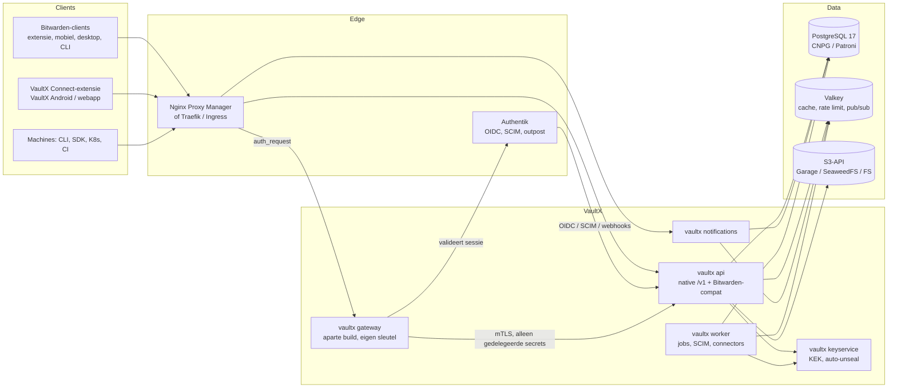

# VaultX — 10 Eindadvies en stappenplan voor Claude Code

Status: voorstel ter review door Jonas · Datum: 2026-10-04 · Versie 0.1
Bindend: `00-kernbeslissingen.md` (deel A–F). Dit document vat het dossier samen en eindigt met de punten die de opdracht vraagt.

| # | Document | Inhoud |
|---|---|---|
| 00 | `00-kernbeslissingen.md` | Uitgedaagde aannames, technologiekeuzes, KB-01…KB-35, releasescope, aanscherpingen |
| 01 | `01-prd.md` | PRD: persona's, concurrentie, 206 FR's, 78 NFR's, haalbaarheid extra features |
| 02 | `02-systeemarchitectuur.md` | C4, modules, crypto-ontwerp, cluster- en technologie-evaluatie, 40 ADR's |
| 02b | `02b-login-en-integraties.md` | De 8 loginmethodes, app-catalogus, proxy-connectors, Authentik-trustmodel, extensie A/B, mobiel, JIT |
| 03 | `03-threat-model.md` | STRIDE, 5 verplichte scenario's, controles SC-xxx, incident-runbooks |
| 04 | `04-databasemodel.md` | Volledige PostgreSQL-DDL (getest op PG16), ER-diagrammen, Vaultwarden-import |
| 05 | `05-api-specificatie.md` + `05-openapi.yaml` | API-principes, Bitwarden-compat-endpoints, SCIM, gateway, token exchange; OpenAPI 3.1 (188 operaties) |
| 06 | `06-repositorystructuur.md` | Monorepo, 24 crates, tooling, CLAUDE.md-inhoud |
| 07 | `07-implementatieroadmap.md` | M0–M12 + Enterprise, schattingen, kritiek pad |
| 08 | `08-github-milestones-issues.md` + `08-issues.json` + `08-milestones.json` | Labels, Projects-board, 14 milestones, 148 issues + 15 epics |
| 09 | `09-docker-kubernetes.md` | Images, Compose (single, ha-3), Helm, CNPG, HA, DR, back-up, upgrade, rollback |

---

## 1. Aanbevolen architectuur

**Een modulaire monoliet in Rust met rollen, Bitwarden-compatibel aan de buitenkant, met een strikt gescheiden Access Gateway voor alles wat server-side plaintext nodig heeft.**



Kernpunten:
1. **Drie geheimklassen** (KB-01): E2E-kluis (zero-knowledge, Bitwarden-compatibel), gedelegeerde secrets (alleen de gateway kan ze lezen), infra-secrets (envelope encryption, auto-unseal).
2. **Authentik authenticeert, het apparaat ontsleutelt** (KB-02): SSO + trusted device + passkey-PRF/biometrie geeft een vrijwel frictieloze unlock zonder dat Authentik sleutels kan vrijgeven.
3. **Login-methodeladder** (KB-03): native SSO via Authentik waar de app dat kan (Grafana: `generic_oauth`), anders extensie-autofill, anders gateway-login, en JIT-delivery voor machines.
4. **Proxy Connector-framework** in plaats van een NPM-plugin (KB-04): NPM via zijn REST API en `advanced_config`, met Traefik, Caddy en Ingress als volgende connectors.
5. **Weinig stateful componenten**: PostgreSQL doet data, locks (fencing tokens) en jobqueue; Valkey alleen verliesbare data; S3-API voor bijlagen. Geen NATS en geen verplichte MinIO.
6. **Eén binary, rollen apart schaalbaar** (KB-24), met profielen `single`, `ha-3` en `ha-5` (KB-20).

**Definitieve technologie-aanbeveling:** Rust (axum, sqlx, tokio) · React + Vite (geen Next.js) · Kotlin + Compose · PostgreSQL 17 met CloudNativePG op K8s en Patroni + etcd daarbuiten · Valkey 8 (Sentinel optioneel in ha-3) · Garage of SeaweedFS via de S3-API (MinIO alleen als het er al staat) · geen NATS tot Enterprise · Cedar als policy engine · AGPL-3.0 voor server en apps, Apache-2.0 voor crypto-core en SDK's.

---

## 2. Technische risico's (top 10)

| # | Risico | Kans | Impact | Mitigatie |
|---|---|---|---|---|
| 1 | Bitwarden-clients wijzigen de API maandelijks | hoog | hoog | Aparte compat-module, contracttests met `bw` en opgenomen verkeer, compat-watch, ondersteunde-versiematrix (KB-09) |
| 2 | Fout in eigen cryptoprotocollen (TDE, admin recovery, gateway, Key Connector) | middel | zeer hoog | Geen eigen primitieven, testvectoren, twee reviewers, externe audit vóór v1.0 (KB-35) |
| 3 | Bitwarden-cryptomodel kwetsbaar voor kwaadwillende server | zeker | hoog | Eigen clients met KDF-minima en key-pinning (KB-10a); beperking eerlijk documenteren |
| 4 | Scope te breed voor een klein team | hoog | hoog | Deel E bindend, voorstellen in F2 (methode 6 naar Enterprise, eventueel Android naar v1.1) |
| 5 | HA-correctheid (failover, split brain, dubbele jobs) | middel | hoog | Postgres-leases met fencing, quorum-replicatie, chaostests vanaf M2 |
| 6 | NPM-API is niet formeel geversioneerd | middel | middel | Contracttests per NPM-versie, dry-run/diff, markers in `advanced_config`, read-only modus |
| 7 | Eén `auth_request` per nginx-location | zeker | middel | Gateway ketent de Authentik-validatie; prototype vóór M8/M9 (KB-04a) |
| 8 | Externe afhankelijkheden (Bitwarden push-relay, Authentik-gedrag per versie, MinIO-koerswijziging) | middel | middel | Opt-in, S3-abstractie, versie-tests tegen Authentik |
| 9 | Gecompromitteerde app-node serveert gewijzigde webassets | laag | zeer hoog | Ondertekend release-manifest gecontroleerd door de extensie (KB-34), SRI, reproducible builds |
| 10 | Te veel vertrouwen in door AI gegenereerde code | middel | hoog | Kleine issues, tests per acceptatiecriterium, `agent:assist` voor crypto, menselijke review |

---

## 3. Complexiteitsinschatting

Dit is een groot product. Ter vergelijking: Vaultwarden is sinds 2018 door een community gebouwd en dekt grofweg alleen de compat-laag van de MVP, op één node.

| Release | Persoonsweken | Kalender (3 ontwikkelaars, met Claude Code) |
|---|---|---|
| MVP (M0–M4) | 72–101 | ongeveer 8–11 maanden |
| v1.0 (M5–M12) | 136–193 extra (208–294 totaal) | ongeveer 15–20 maanden vanaf start |
| Enterprise (v2.x) | 120–200+ | nog eens 12–24 maanden |

Claude Code levert realistisch 20–30 % winst op implementatiewerk (scaffolding, CRUD, DTO-mapping, tests, Helm/Compose, UI), en weinig op cryptoreview, HA-diagnose, Android-platformwerk, store-processen en de externe audit (07 §6).

---

## 4. MVP-omvang (v0.9)

*"Een Bitwarden-compatibele HA-kluis met Authentik."* Wat erin zit:
- Bitwarden-compat: login (Argon2id/PBKDF2), sync, alle standaard itemtypes inclusief SSH-sleutels, mappen, bijlagen, TOTP, 2FA (TOTP, WebAuthn, e-mail), organisaties en collecties, Sends, devices en notificaties over meerdere nodes. Passkeys die Bitwarden-clients aanmaken worden ongewijzigd bewaard.
- Alle officiële Bitwarden-clients plus een Bitwarden-webvault-build, en een eigen minimale adminconsole.
- Authentik: OIDC-SSO met master-password-unlock, SCIM-provisioning, groep→org/rol-mapping, intrekken van sessies bij uitschakelen in Authentik.
- Auditlog met hashketen en ondertekende checkpoints.
- Profielen `single` en `ha-3` via Docker Compose, Helm-basis, back-up met geautomatiseerde restore-test.

Wat er bewust níet in zit: eigen clients, de gateway, proxy-connectors, TDE en passkey-unlock, emergency access, policy engine, dynamische secrets.

## 5. v1.0-omvang

*"VaultX-onderscheidend"*: trusted device encryption en passkey-PRF-unlock, emergency access, passkey-opslag, LDAP/OIDC/SAML; Cedar-RBAC, workspaces, teams, tags, vervallende credentials, SIEM-export; eigen React-webapp; app-catalogus met de login-methodeladder; NPM- en Traefik-connector; VaultX Connect-extensie (Chrome, Edge, Firefox); Access Gateway (methode 7); Android-app; service accounts, API-tokens en JIT-delivery (CLI, SDK, K8s, CI); Key Connector opt-in; Helm met CNPG, Valkey, Garage en het `ha-5`-profiel; zero-downtime upgrades; DR-runbooks; externe security-audit.

## 6. Enterprise-versie (v2.x)

Dynamische secrets (SSH-CA, PostgreSQL, Kubernetes, OpenBao-backend); wachtwoordrotatie-connectors; secret discovery in Git, Kubernetes en CI; methode 6 (proxy-sessiedelegatie) als voorstel; HSM/KMS/PKCS#11; multi-regio DR; NATS-eventstreaming; volledige key transparency; crypto v2; iOS-app; AI-assistent (alleen metadata, optioneel lokaal LLM, hygiëne-analyse client-side); compliance-rapportage.

---

## 7. Implementatie in fasen

| Fase | Milestone | Release | Resultaat |
|---|---|---|---|
| 0 | M0 Fundament & walking skeleton | v0.1 | Monorepo, CI, `bw login` + `bw sync` in CI tegen compose-single |
| 1 | M1 Kluis-kern | v0.2 | Persoonlijke kluis werkt met alle Bitwarden-clients |
| 2 | M2 Compat-uitbreiding | v0.3–0.4 | Organisaties, bijlagen, Sends, 2FA, notificaties multi-node |
| 3 | M3 Authentik, audit & admin | v0.5–0.6 | SSO, SCIM, tamper-evident audit, adminconsole |
| 4 | M4 HA & MVP | v0.9 | ha-3 bewezen met chaos-, load- en restore-tests |
| 5 | M5 Identiteit & sleutels | v0.10 | TDE, passkey-PRF, emergency access, LDAP/OIDC/SAML |
| 6 | M6 Organisatiemodel & policy | v0.11 | Cedar, workspaces, teams, SIEM |
| 7 | M7 VaultX-webapp | v0.12 | Eigen webapp vervangt Bitwarden-webvault |
| 8 | M8 Catalogus & proxy-connectors | v0.13 | Grafana-scenario end-to-end via NPM + Authentik |
| 9 | M9 Extensie & gateway | v0.14 | VaultX Connect in de stores, gateway geïsoleerd |
| 10 | M10 Android | v0.15 | Autofill, passkeys, biometrie, offline |
| 11 | M11 Machine-secrets & Key Connector | v0.16 | `vaultx run`, service accounts, KEK-rotatie |
| 12 | M12 Kubernetes, DR & v1.0 | v1.0 | Zero-downtime, DR, externe audit |
| E | Enterprise | v2.x | 15 epics |

Kritiek pad: skeleton → M1 → M2 → M4 → M5 → M7 → M9 → M12. M3, M6, M10 en M11 lopen parallel.

---

## 8. Volledige repositorystructuur

Eén monorepo `vaultx` (volledige uitleg per map in 06 §2–4):

```text
vaultx/
├── Cargo.toml · rust-toolchain.toml · deny.toml · justfile · CLAUDE.md
├── package.json · pnpm-workspace.yaml · release-please-config.json
├── LICENSE (AGPL-3.0) · LICENSES/ · REUSE.toml · SECURITY.md · CONTRIBUTING.md
├── crates/
│   ├── vaultx-server/            # binary, rollen api|notifications|worker|gateway|keyservice
│   ├── vaultx-core/              # domeinmodel, fouten, ID's
│   ├── vaultx-crypto/            # Apache-2.0: KDF, EncString, sleutelhiërarchie
│   ├── vaultx-crypto-wasm/       # WASM-bindings (web, extensie)
│   ├── vaultx-crypto-ffi/        # UniFFI (Kotlin, Swift)
│   ├── vaultx-compat-bitwarden/  # Bitwarden-API-laag (KB-09)
│   ├── vaultx-api/               # native /v1, OpenAPI
│   ├── vaultx-identity/          # login, tokens, 2FA, SSO, SCIM, devices
│   ├── vaultx-vault/             # items, mappen, bijlagen, sends
│   ├── vaultx-org/               # organisaties, workspaces, teams, collecties
│   ├── vaultx-policy/            # Cedar
│   ├── vaultx-audit/             # hashketen, checkpoints
│   ├── vaultx-notify/            # SignalR/websocket, Valkey pub/sub
│   ├── vaultx-jobs/              # Postgres-queue, leases met fencing
│   ├── vaultx-gateway/           # Access Gateway (aparte build)
│   ├── vaultx-connectors/        # npm, traefik, caddy, k8s
│   ├── vaultx-secrets-engines/   # enterprise: ssh-ca, postgres, k8s, openbao
│   ├── vaultx-storage/           # Postgres, S3, FS
│   ├── vaultx-keys/              # KEK/DEK, auto-unseal
│   ├── vaultx-config/ · vaultx-telemetry/
│   ├── vaultx-cli/ · vaultx-sdk/
│   └── vaultx-testkit/
├── migrations/ · .sqlx/
├── web/app/ · web/docs-site/
├── extension/                    # VaultX Connect (WXT, MV3)
├── packages/                     # crypto-wasm, api-client, ui, vault-state, i18n, configs
├── android/ · apple/
├── deploy/
│   ├── docker/ · compose/single/ · compose/ha-3/ · helm/vaultx/
│   ├── authentik-blueprints/ · npm-snippets/ · examples/
├── docs/adr/ · docs/architecture/ · docs/runbooks/ · docs/api/ · docs/compat/ · docs/security/
├── tests/e2e/ · tests/compat/ · tests/load/ · tests/chaos/ · tests/fixtures/
├── tools/xtask/ · tools/compat-recorder/ · tools/dev-env/
└── .github/workflows/ · ISSUE_TEMPLATE/ · PULL_REQUEST_TEMPLATE.md · CODEOWNERS · labels.yml · renovate.json
```

Het ontwerpdossier (deze map) verhuist naar `docs/architecture/`, `05-openapi.yaml` naar `docs/api/openapi.yaml`.

## 9. Concrete GitHub-projectstructuur

- **Repository:** `vaultx` (eigenaar nog te kiezen), branch protection op `main`, verplichte checks `ci-rust`, `ci-web`, `compat-smoke`; CODEOWNERS met twee reviewers op crypto-, keys-, gateway- en migratiepaden.
- **Labels** (`.github/labels.yml`): `type:*`, `area:*` (25 gebieden), `priority:p0–p3`, `release:mvp|v1.0|enterprise`, `security:crypto-review|sensitive|threat-model|advisory`, `agent:ready|assist`, `needs-fixture`, `needs-adr`, `blocked-external`.
- **Milestones:** M0 t/m M12 en E (14), met exit-criteria in de beschrijving (`08-milestones.json`).
- **Projects v2-board "VaultX Roadmap"**: velden Status, Release, Area, Priority, Estimate, Iteration (2 weken), Depends on, Agent; views Board, Roadmap, Backlog per milestone, **Ready voor Claude**, Security review, Blocked, Per area.
- **Backlog:** 148 issues (81 MVP, 67 v1.0) en 15 enterprise-epics in `08-issues.json`, elk met acceptatiecriteria, afhankelijkheden en `agent:ready` of `agent:assist`. Importeerbaar met `gh` (08 §5).

---

## 10. Uitvoerbaar stappenplan voor Claude Code

**Stap 0 — Beslissingen van Jonas (blokkerend voor de eerste commit)**
1. Licentie (AGPL-3.0 server/apps, Apache-2.0 crypto-core/SDK's) bevestigen.
2. GitHub-repository kiezen of laten aanmaken (bv. `Jonasz1996/vaultx`).
3. Voorstellen F2 in 00 beantwoorden (methode 6, Android/Key Connector, four-eyes, mobiele push).
4. Teamgrootte en doelgroep v1.0 bevestigen (voorstel: homelab/MKB eerst).

**Stap 1 — Repository opzetten (één sessie)**
1. Repository aan de sessie koppelen.
2. VX-001: monorepo-skelet volgens 06 §2; `just bootstrap/build/test/lint`.
3. Ontwerpdossier naar `docs/architecture/`, OpenAPI naar `docs/api/`, KB's als ADR-0001… in `docs/adr/`.
4. VX-004: `CLAUDE.md` uit 06 §6, CODEOWNERS, templates, `SECURITY.md`.
5. VX-002/003: CI-workflows. PR openen, groen krijgen, laten mergen.

**Stap 2 — GitHub-project inrichten (één sessie)**
1. Labels uit `labels.yml` aanmaken.
2. Milestones uit `08-milestones.json` aanmaken.
3. Issues uit `08-issues.json` importeren met `gh issue create` (in volgorde van de array, zodat afhankelijkheden al bestaan), `depends_on` omzetten naar issuelinks.
4. Projects v2-board met velden en views aanmaken; issues toevoegen.

**Stap 3 — Walking skeleton (M0, VX-005…018)**
Per issue één sessie of één thread, in volgorde van afhankelijkheden: config en telemetry met logredactie, storage met testcontainers, jobs en leases met fencing tokens, `vaultx-crypto` basis (testvectoren, `agent:assist`), identity-skelet (prelogin, register, token), lege `/api/sync`, `/api/config`, Docker-image, `deploy/compose/single`, en de compat-smoketest met de Bitwarden CLI in CI. Exit: `bw login` + `bw sync` groen in CI.

**Stap 4 — Werkritme per issue (vanaf M1)**
Voor elke sessie dezelfde prompt:
> Pak VX-nnn op. Lees het issue, CLAUDE.md en de KB's waarnaar het verwijst. Schrijf eerst de tests en fixtures per acceptatiecriterium, dan de implementatie. Houd de diff onder ~400 regels. Draai `just lint && just test`. Open een draft-PR die het issue sluit, en meld het als het issue groter blijkt dan gedacht in plaats van door te bouwen.

Regels: compat-issues alleen met fixture (`needs-fixture` anders); `security:crypto-review`-issues zijn `agent:assist` (een mens leidt ontwerp en review); afwijken van een KB alleen met een ADR in dezelfde PR; per milestone een korte retro om CLAUDE.md en issuegrootte bij te stellen.

**Stap 5 — Parallelle stromen**
Vanaf M1 kunnen drie threads tegelijk werken op onafhankelijke issues (zie 07 §4.2): crypto/identity, infra (notify, storage, HA) en web/admin/compat-harnas. Eén thread per area voorkomt merge-conflicten.

**Stap 6 — Releases**
release-please maakt per milestone een release-PR; de milestone sluit pas als alle `priority:p0`-issues dicht zijn en de exit-criteria zijn afgevinkt. Bij M4 (MVP) en M12 (v1.0) eerst de chaos-, restore- en compat-suites draaien.

**Eerste concrete opdracht zodra stap 0 beslist is:**
> Koppel de repository, voer VX-001 t/m VX-004 uit volgens `docs/architecture/06-repositorystructuur.md`, en open één PR met het skelet, CLAUDE.md, CI en het ontwerpdossier in `docs/`.
